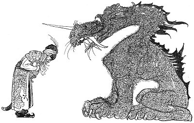
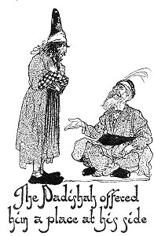
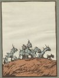
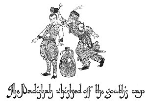
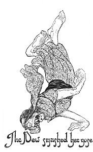

  
[Intangible Textual Heritage](../../index)  [Asia](../index) 
[Index](index)  [Previous](ftft40)  [Next](ftft42) 

------------------------------------------------------------------------

Forty-four Turkish Fairy Tales \[1913\], at Intangible Textual Heritage

------------------------------------------------------------------------

p. 316

 

|                     |
|---------------------|
|  |

HERE was once a Padishah who had the misfortune to have all his children
stolen as soon as they reached their seventh year. Grief at this
terrible affliction caused him almost to lose his reason, "Forty
children have been born to me," said he, "each seeming more beautiful
than the one which preceded it, so that I never tired of regarding them.
O that one at least had been spared to me! Better that I should have had
none than that each should have

 

p. 317

caused me so much grief." He brooded continually over the loss of his
children, and at length, unable to endure it longer, he left his palace
at night and wandered no one knew whither. When morning broke he was
already a good distance from his capital. Presently he reached a spring,
and was about to take an abdest to say the prayer namaz, when he
observed what appeared like a black cloud in the sky, moving towards
him. 

|                                                                |
|----------------------------------------------------------------|
|  |

When it came quite near he saw that it was a flight of forty birds,
which, twittering and cooing, alighted at the spring. Alarmed, the
Padishah hid himself. As they drank at the spring one of the birds said:
"Mother's-milk was never our kismet. We must perforce drink mountain
water. Neither father nor mother care for us." Then said another: "Even
if they think about us, they cannot know where we are." At these words
they flew away. The Padishah murmured to himself: "Poor things! Even
such small creatures, it seems, grieve over the absence of their
parents."

When he had taken his abdest and said his prayers the day had fully
dawned and the nightingales filled the air with their delightful songs
Having travelled all night, he could not keep his eyes open longer from
fatigue, and he fell into a slumber while his mind was still occupied
with thoughts of his lost children. In a dream he saw a dervish
approaching him. The Padishah offered him a place at his side and made
the

p. 318

newcomer the confidant of his sorrow. Now the dervish knew what had
befallen the Padishah's children, and said: "My Shah, grieve not; though
thou seest not thy children, thy children see thee. The birds that came
to the spring while thou wast praying were thy children. They were
stolen by the peris, and their abode is at a year's distance from here.
They can, if they will, fly not only here but even into thy palace, but
they fear the peris. When thou departest from here, drink like the doves
from the spring, and Allah will restore to thee thy children."

The Padishah woke up from his sleep and, reflecting a little, he
remembered the words of the dervish in his dream, and he decided to bend
his steps towards the spring. What a sight his eyes beheld there! Blood
was flowing from the spring. Alarmed, he wondered whether he were
sleeping or waking. Presently the sun appeared above the horizon and he
was convinced it was no dream. Closing his eyes and repressing his
aversion, he drank from the bloody spring as though it were pure water;
then, turning to the right, he hastened on his way.

All at once he saw in the distance what seemed like a great army drawn
up in battle array. Not knowing whether they were enemies or friends, he
hesitated about proceeding, but at length resolved to go forward and
take his chance. On approaching the army he was surprised to find it was
composed of dragons of all sizes, the smallest, however, being as large
as a camel. "Woe is me!" he groaned; "who knows but what I thought a
dream was sorcery! What shall I do now? If I go forward I shall
certainly be cut to pieces, and I cannot go back without being seen." He
prayed to Allah for deliverance from this danger which threatened him.

It happened, however, that these were only newly-born dragons, the
oldest being but a few days old. None of them had their eyes open, Thus
they were wandering about blindly, unable to find their home, though
keeping together by instinct.

[  
Click to enlarge](img/31800.jpg)

p. 319

This discovery was very reassuring for the Padishah, who gave the
dragons a wide berth and so continued his way without molestation.

|                     |
|---------------------|
|  |

IGHT came on, and as he wended his way among the mountains the sound of
a terrible howling smote his ears. It was the dragon-mother calling her
lost children. The Padishah was seized with fear as the dragon, seeing
him, exclaimed: "At last I have thee; my young ones have fared ill at
thy hands; thou shalt not escape--thou who hast slain a thousand of my
offspring." The Padishah answered tremblingly that he had indeed seen
the young dragons, but had done them no harm; not being a hunter, he had
no thought of harming anyone. "If thou speakest the truth," returned the
dragon-mother, "tell me in what direction my children have gone." The
Padishah accordingly explained where he had seen them, whereupon the old
dragon changed him into a tobacco-box, which she stuck in her girdle.
Thus she carried him with her on her search for the missing young ones,
and after a while she found them quite safe and sound.

The Dragon-mother drove her children home before her, the Padishah still
as a tobacco-box in her girdle. By and by they came across the four
walls of a fortress standing in the midst of the desert. Taking a whip
from her girdle the dragon struck the walls a mighty blow, on which they
fell down and a larger dragon came forth from the ruins. The walls now
destroyed had enclosed a fine serai, which they entered. The female
Dragon, having changed the Padishah again to his original form, took him
into one of the apartments of the palace and thus addressed him: "Child
of men, why camest thou hither? I see thou hadst no evil intention."

When the Padishah had related his story, the Dragon observed: "The
matter can easily be rectified. All thy children are in the Hyacinth
Kiosk. The place is a good distance away, and if thou goest alone thou
wilt hardly succeed in reaching it. After crossing the mountain thou
wilt come to a desert where my brother lives; his children

p. 320

are bigger than mine and know the place well. Go to him, present my
compliments, and ask him to escort thee to the Hyacinth Kiosk." The
dragon now took leave of the Padishah, who set off on his journey.

It was a long time ere he had crossed the mountain and come in sight of
the desert. After traversing the latter for some time he saw a serai
much larger than the one he had left. At the gate stood a dragon twice
as large as the other, at a thousand paces distant its eyes seemed to be
closed, but from the narrow opening between the upper and lower lids
came a ray of flame sufficient to scorch any human being that might come
within reach of it. When the Padishah saw this he thought to himself:
"My last hour is surely come." At the top of his voice he shouted to the
dragon his sister's greeting. Hearing the words the great beast opened
his eyes and as he did so, it seemed as though the whole region was
enveloped in flames. The Padishah, unable to endure the sight, ran back.
To the dragon he seemed no larger than a flea, and consequently not
worth troubling about.

|                     |
|---------------------|
|  |

HE Padishah returned to the dragon-mother and related his terrifying
experience. Said she: "I forgot to tell you that I am called the Black
Dragon, my brother, the Red Dragon. Go back and say that the Black
Dragon sends greeting. As my name is known to no one, my brother will
recognise that I have sent you. Then he will turn his back towards you,
and you can approach him without danger; but beware of getting in front
of him, or you will become a victim of the fiery glances of his eyes."

Now the Padishah set out to return to the Red Dragon, and when he had
reached the spot he cried with a loud voice: "Thy sister, the Black
Dragon, sends thee greeting! " On this the beast turned his back towards
him. Approaching the dragon, the Padishah made known his wish to go to
the Hyacinth Kiosk. The dragon took a whip from his girdle and smote the
earth with it so mightily that the mountain seemed rent in twain. In a
little while the Padishah saw approaching a rather large

p. 321

|                            |
|----------------------------|
|  |

dragon, and as he came near he felt the heat that glowed from his great
eyes. This dragon also turned his back toward the Padishah. "My son, if
thou wouldst enter the Hyacinth Kiosk," said the Red Dragon, "cry before
thou enterest, 'The Red Dragon has sent me!' On this an Arab will
appear: this is the very peri that has robbed thee of thy children. When
he asks what thou wilt, tell him that the great dragon demands
possession of the largest of the stolen children. If he refuses, ask for
the smallest. If again he refuses, tell him the Red Dragon demands
himself. Say no more, but return here in peace."

The Padishah now mounted the back of the dragon which the Red Dragon had
summoned and set off. Seeing the Hyacinth Kiosk in the distance the
Padishah shouted: "Greeting from the Red Dragon!" So mighty was the
shout that earth and sky seemed to be shaken. Immediately a swarthy Arab
with fan shaped lips appeared, grasping an enormous club in his hand.
Stepping out into the open air, he inquired what was the matter. "The
Red Dragon," said the Padishah, "demands the largest of the stolen
children." "The largest is ill," answered the peri. "Then send the

p. 322

smallest to him," rejoined the Padishah. "He has gone to fetch water,"
replied the Arab. "If that is so," continued the Padishah, "the Red
Dragon demands thyself." "I am going into the kiosk," said the Arab, and
disappeared. The Padishah returned to the Red Dragon, to whom he related
how he had fulfilled his mission.

Meanwhile the Arab came forth, in each hand a great club, wooden shoes
three yards long on his feet, and on his head a cap as high as a
minaret. Seeing him, the Red Dragon said: "So-ho! my dear Hyacinther;
thou hast the children of this Padishah; be good enough to deliver them
up." "I have a request to make," replied the Arab, "and if the Padishah
will grant it I will gladly give him his children back again. Ten years
ago I stole the son of a certain Padishah, and when he was twelve years
old he was stolen away from me by a Dew-woman named Porsuk. Every day
she sends the boy to the spring for water, gives him an ashcake to eat,
and compels him to drink a glass of human blood. If I can but regain
possession of this youth, I desire nothing more, for never in the whole
world have I seen such a handsome lad. This Porsuk has a son who loves
me, and evil has been done me because I will not adopt him in place of
the stolen boy. I am aware that the children of this Padishah are brave
and handsome, and I stole them to mitigate my sufferings. Let him but
fulfil my wish, and I will fulfil thine."

Having uttered this speech the Arab went away.

The Red Dragon reflected a little, then spoke as follows: "My son, fear
not. This Porsuk is not particularly valiant, though skilled in sorcery.
She cannot be vanquished by magic; but it is her custom on one day in
the year to work no magic, therefore on that day she may be overcome.
One month must thou wait, during which I will discover the exact day and
inform thee thereof,"

The Padishah agreeing to this, the Red Dragon dispatched his sons to
discover the precise day on which the Dew worked no magic. As soon as
they returned with the desired information it was duly imparted

p. 323

to the Padishah, with the additional fact that on that day the Dew
always slept. "When thou arrivest," the Red Dragon counselled the
Padishah, "the youth she retains will come to fetch water from the
spring. Take his cap off his head and set it on thine own: thus he will
be unable to stir from the spot, and thou canst do what thou wilt with
him."

The Red Dragon then sent for his sons, instructing them to escort the
Padishah to the Porsuk-Dew's spring, wait there until he had
accomplished his object, and then accompany both back in safety.

|                                                            |
|------------------------------------------------------------|
|  |

Arrived at the spring, all hid themselves until the youth came for
water. While he was filling his bottle the Padishah sprang forth
suddenly, whisked off the youth's cap, set it on his own head, and
instantly disappeared into his hiding-place. The youth looked around,
and seeing no one, could not think what had happened. Then the young
dragons swooped down upon him, captured him, and with the Padishah led
him a prisoner to the Red Dragon.

Striking the earth with his whip, the Red Dragon brought the Hyacinth
Arab on the scene, and as soon as he caught sight of the boy he sprang
towards him, embraced and kissed him, expressing his deep gratitude to
the friends who had restored him.

Now he in his turn clapped his

p. 324

hands and stamped his feet on the ground and immediately forty birds
flew up twittering merrily. Taking a flask from his girdle, the Arab
sprinkled them with the liquid it contained, and lo! the birds were
transformed into forty lovely maidens and handsome youths, who drew up
in line and stood at attention. " Now, my Shah," said the Arab, "behold
thy children! Take them and be happy, and [pardon](errata.htm#6) me the
suffering I have caused thee."

Had anyone begged the Padishah's costliest treasure at that moment it
would have been given him, so overwhelmed with joy was the monarch at
recovering his children. He freely pardoned the Hyacinth Arab, and would
even have rewarded him had there been anything he desired.

The Padishah now bade goodbye to the Red Dragon. At the moment of
parting the Red Dragon pulled out a hair from behind his ear and, giving
it to the Padishah, said:

"Take this, and when in trouble of any sort break it in two and I will
hasten to thy aid."

Thus the Padishah and his children set out, and in due course arrived at
the abode of the Black Dragon. She also took a hair from behind her ear
and presented it to the Padishah with the following advice: "Marry thy
children at once, and if on their wedding day thou wilt fumigate them
with this hair, they will be for ever delivered from the power of the
Porsuk-Dew."

The Padishah expressed his thanks, bade the Black Dragon a hearty good.
bye, and all proceeded on their way.

During the journey the Padishah entertained his children by relating his
adventures, and then he listened to those of his sons and daughters.
Suddenly a fearful storm arose. None of the party knew what their fate
would be, yet all waited in trembling expectancy. At length one of the
maidens exclaimed: "Dear father and Shah, I have heard the Arab say that
whenever the Porsuk-Dew passes she is accompanied by a

p. 325

storm such as this. I believe it is she who is now passing, and no
other." Collecting his courage, the Padishah drew forth the hair of the
Red Dragon and broke it in two. The Porsuk Dew at once fell down from
the sky with a crash, and at the same moment the Red Dragon came up
swinging and cracking his whip. The Dew was found to have broken her arm
s and smashed her nose, so that she was quite incapable of inflicting
further mischief.

|                                            |
|--------------------------------------------|
|  |

The Padishah was exceedingly afraid lest he should lose one of his
children again, but the Red Dragon reassured him. "Fear not, my Shah,"
said he; "take this whip." The Padishah accepted it, and as he cracked
it he felt the sensation o f being lifted into the air.

Descending to earth again, he found himself just outside the gates of
his own capital city. "Now thou art quite safe," said the Red Dragon as
he disappeared. At sight of the domes and minarets and familiar walls of
their birthplace they all cast themselves on their knees and wept for
joy. Since the Padishah had left his palace continual lamentation and
gloom had reigned supreme, and now all the pashas and beys came

p. 326

out joyfully to meet their returning master and his children. The
Sultana went down the whole line embracing and kissing her beautiful
sons and daughters, and the delighted Padishah ordered seven days and
seven nights of merrymaking in honour of the glad event.

These festivities were scarcely over when wives for the Padishah's sons
and husbands for his daughters were sought and found, and then commenced
forty days and forty nights of revelry in celebration of the grand
wedding.

Unfortunately, on the wedding day the Padishah forgot to fumigate them
all with the Black Dragon's hair, with the result that as soon as the
ceremony was over rain began to fall in a deluging torrent, and the wind
blew so fiercely that nothing could withstand it. At first the Padishah
thought it was merely a great storm, but later he remembered the
Porsuk-Dew, and cried out in his fear. Hearing the clamour, the inmates
of the serai, including the newly-wedded princes and princesses, came in
to see what was the matter. The frightened Padishah gave the Black
Dragon's hair to the Vezir and commanded him to burn it immediately. No
one understood the order, and all thought the Padishah must have lost
his wits; nevertheless his wish was obeyed and the hair burnt.
Immediately a fearful howling was heard in the garden outside, and the
Porsuk-Dew cried with a loud voice: "Thou hast burnt me, O Padishah!
Henceforth in thy garden shall no blade of grass grow." Next morning it
was seen that every tree and flower in the garden was scorched, as
though a conflagration had raged over the scene.

The Padishah, however, did not allow this loss to trouble him; he had
his children again with him, and that joy eclipsed any ordinary
misfortunes that might befall him. He explained everything to his suite,
who could hardly believe what they heard, it was all so astonishing. No
further danger was to be feared, and thus the Padishah and his family,
with their husbands and wives, lived happily together until their lives'
end.

------------------------------------------------------------------------

[Next: ''Madjun''](ftft42)
