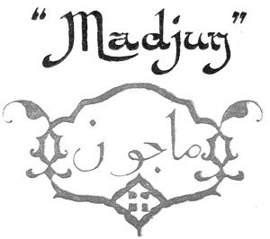
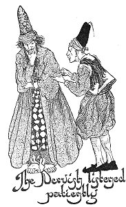

  
[Intangible Textual Heritage](../../index)  [Asia](../index) 
[Index](index)  [Previous](ftft41)  [Next](ftft43) 

------------------------------------------------------------------------

Forty-four Turkish Fairy Tales \[1913\], at Intangible Textual Heritage

------------------------------------------------------------------------

p. 327

 

|                     |
|---------------------|
|  |

HERE was once a bald-headed young man whose mother was very old. The
woman wished her son to learn a trade, but no matter where she put him
for that purpose he always ran away. One day he caught a glimpse of the
Sultan's daughter, and from that moment he could think of nothing but
the Princess. He went home and said to his mother: "Go to the Padishah
and ask him to give me his daughter." His mother was astonished and
answered: "Why, lad, thou dost not possess five paras and knowest no
trade!

|                    |
|--------------------|
|  |

Thinkest thou the Padishah would give his daughter to such a numskull?"
Nevertheless as the young man insisted, the woman saw that he could be
satisfied only by her going to the King on his behalf.

When she found herself in the presence of the Padishah she said: "O my
lord! I have a son who has tormented me every day with the request that
I should come to thee and ask thee to give him thy daughter in marriage.
I could bear his importunities no longer, wherefore am I come. Slay me
or hang me, or otherwise do unto me

p. 328

what seemeth good in thy sight." The monarch answered: "Send thy son to
me," and dismissed her.

|                                                  |
|--------------------------------------------------|
|  |

She went home and informed her son that he was summoned to the presence
of the Padishah. When the youth arrived at the palace the Padishah saw
with disapproval that he was bald, and with a view to getting rid of him
said: "I will give thee my daughter if thou canst gather together on
this spot all the birds in the world." The young man, discomfited,
departed from the serai, absorbed in gloomy reflection, and fearing lest
the Padishah might order him to be put to death he resolved to travel.
Many days after this, wandering in the wilderness, he met a dervish, to
whom he related his difficulty. The dervish listened patiently and then
said: "Go to a certain place where there is a tall cypress tree; sit
down beneath it. All the birds in the world will come and alight
thereon, and thou hast only to utter the word 'Madjun!' to cause them to
stick fast to the tree. Then collect them all and take them to the
Padishah..

Thanking the dervish for his useful advice, the young man went his way
until he arrived at the place indicated, where he sat down to rest under
the tall cypress tree. He waited until all the birds in the world had
alighted thereon, then said "Madjun!" and no bird was able to fly away.
Collecting them, he returned home and

p. 329

[  
Click to enlarge](img/32900.jpg)  
He waited until all the birds in the world had alighted  

p. 330

 

next morning carried his captives into the presence of the Padishah. The
monarch, not at all pleased that the apparently impossible task he
imposed had been accomplished, said: "Now go and get a covering of hair
on thy bald pate and I will then give thee my daughter."

The young man, very disappointed, took himself off and spent several
days in deep thought. Meanwhile the Padishah betrothed the Princess to a
son of his Vezir, and preparations for the wedding were hurried forward.
The young man, hearing of this, went on the bridal night to the serai
and hid himself on the roof, above the chamber in which the Vezir's son
and his bride were to sleep. As soon as he saw them both enter he
pronounced the word "Madjun!" and they were unable to move so much as an
eyelid.

Night passed and the day broke. As the day wore on and the newly, wedded
couple failed to appear, a slave went, and peeping through a chink in
the door of their room, endeavoured to discover if anything

p. 331

 

was the matter. The bald headed one above, seeing this, cried "Madjun!"
and the slave found himself unable to stir from the spot.

In short, as one after the other came to the door, until every one in
the palace was gathered there, the word "Madjun!" was uttered and all
became transfixed, unable to move hand or foot.

The Padishah was at a loss to know the meaning of it all, and sent for a
certain hodja, who would surely help him in this strange matter.

The young man came down from his elevated position on the roof and stole
after the Padishah's messengers. On the way they entered a butcher's
shop to buy some meat, and as they laid their hands on a carcass to
indicate what they wanted, the bald man, having overtaken them, cried
"Madjun!" and they all found themselves stuck fast to the meat.

Meanwhile the Padishah was impatiently awaiting the return of his
messengers and be. coming angry at their delay. At length, unable to
endure it longer, he himself went after them. Passing the butcher's
shop, imagine his surprise to see all his servants stuck by their hands
to a piece of meat "O merciful Allah! what is this?" cried

p. 332

the Padishah, and ran immediately to fetch the hodja. When the latter
arrived he said: "My lord, thou hast promised thy daughter to a certain
bald-headed young man, and as thou hast not fulfilled thy word, he it is
that is doing these things."

"What is to be done?" asked the King. The hodja answered: "Nothing can
be done except to give him thy daughter."

The Padishah returned to his palace and summoned the youth to his
presence. When the latter heard that the King's servants were seeking
him he hastened home and instructed his mother as follows: "If I am
asked for, say I am not at home and have not been seen for a long time.
If they ask where I may be found, answer that for so many gold-pieces
thou wilt undertake to find me."

Hardly had he said this than there came a loud knocking at the door.
When the old woman opened it she was asked whether the bald young man
was at home. She answered as her son had advised her. "But where must we
look for him?" demanded the messengers. "The Padishah requests him to
present himself, and receive the Princess in marriage." At these words
the old woman's interest appeared to increase. "I know not whither he is
gone," she answered, "but give me a thousand gold pieces and I engage to
find him." The stipulated amount was paid over. "Go, then," said the
King's servants, "bring him hither and thou shalt receive even more." A
few days later the bald-headed one appeared at the palace and was led
into the presence of the Padishah. As soon as the King saw him he
greeted him cordially. "My dear son," he exclaimed, "I have waited long
for thee. Where hast thou been all this time?"

To this the youth answered: "O Padishah! I asked thee for thy daughter,
but thou gayest her not to me; therefore have I wandered in the world."

Without further delay the Vezirs were summoned, the Princess sent for,
and the pair were betrothed with the customary ceremonies. Then the

p. 333

bald-headed young man, having accomplished his purpose, went to all
those who were under the spell and unable to move. "Be released from
Madjun! " he exclaimed; and immediately they were free and skipped about
for joy. As for the son of the Vezir, who had been married to the
Princess, he was no sooner released than he ran away and has never been
seen since. The Princess was now married to the bald youth, and they
lived happily ever after.

 

------------------------------------------------------------------------

[Next: The Forlorn Princess](ftft43)
