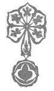

  
[Intangible Textual Heritage](../../index)  [Asia](../index) 
[Index](index)  [Previous](ftft46) 

------------------------------------------------------------------------

Forty-four Turkish Fairy Tales \[1913\], at Intangible Textual Heritage

------------------------------------------------------------------------

p. 361

 

|                    |                                                                                                                                                                                              |
|--------------------|----------------------------------------------------------------------------------------------------------------------------------------------------------------------------------------------|
| Abdest             | Religious ablution                                                                                                                                                                           |
| Aga                | Officer, chief                                                                                                                                                                               |
| Anka               | Mythical bird                                                                                                                                                                                |
| "Amin!"            | "Amen!"                                                                                                                                                                                      |
| Bey                | Nobleman                                                                                                                                                                                     |
| "Bismillah"        | "In the name of God"                                                                                                                                                                         |
| Cadi               | Judge                                                                                                                                                                                        |
| Chibouque          | Pipe with long stem                                                                                                                                                                          |
| Dady               | Nurse                                                                                                                                                                                        |
| Dervish            | Mendicant monk                                                                                                                                                                               |
| Dew                | Evil spirit                                                                                                                                                                                  |
| Djami              | Oratory                                                                                                                                                                                      |
| "Essalaam alejkum" | "Peace be upon you"                                                                                                                                                                          |
| Feredje            | Overcoat                                                                                                                                                                                     |
| Fez                | The characteristic Turkish red cap (formerly made in Fez, Morocco)                                                                                                                           |
| Han                | Inn                                                                                                                                                                                          |
| Handschar          | Large knife, or dagger, with curved blade                                                                                                                                                    |
| Helwa              | Turkish delight                                                                                                                                                                              |
| Hodja              | Teacher, letter-writer                                                                                                                                                                       |
| Houri              | Large-eyed girl figuring in Paradise                                                                                                                                                         |
|                    | p. 362                                                                                                                                                            |
| Ifrid              | Apparition                                                                                                                                                                                   |
| Imam               | Head of a religious community                                                                                                                                                                |
| In                 | Good spirit                                                                                                                                                                                  |
| "Inshallah"        | "If it please God"                                                                                                                                                                           |
| Jin                | Evil spirit                                                                                                                                                                                  |
| Kaftan             | Long outer coat of thin material                                                                                                                                                             |
| Kavedji            | Coffee-maker                                                                                                                                                                                 |
| Kiosk              | Palace or villa in a garden                                                                                                                                                                  |
| Kismet             | Fate                                                                                                                                                                                         |
| Kuliba             | Hut                                                                                                                                                                                          |
| Kunterbunt         | This may be freely rendered "Higgledy-piggledy"                                                                                                                                              |
| Lala               | Court chamberlain                                                                                                                                                                            |
| Leblebi            | Roasted peas                                                                                                                                                                                 |
| Lira               | Gold piece, value about 18s. 6d.                                                                                                                                                             |
| Lokma              | Turkish sweetmeat                                                                                                                                                                            |
| Madjun             | Spell-food                                                                                                                                                                                   |
| Mangal             | Chafing-dish                                                                                                                                                                                 |
| Namaz              | Prayer                                                                                                                                                                                       |
| Nargile            | Pipe with long tube and bowl containing scented water through which the smoke passes before entering the smoker's mouth                                                                      |
| Padishah           | Sultan                                                                                                                                                                                       |
| Peri               | Fairy                                                                                                                                                                                        |
| Piaster            | Silver piece, value about 21d.                                                                                                                                                               |
| Pilaf              | Mutton with rice                                                                                                                                                                             |
| Pir                | An old man                                                                                                                                                                                   |
| Romak              | A word used in exorcism                                                                                                                                                                      |
|                    | p. 363                                                                                                                                                            |
| "Salaam"           | "Peace"                                                                                                                                                                                      |
| Schalwar           | Trousers (for men or women)                                                                                                                                                                  |
| Selamlik           | That part of dwelling where men live                                                                                                                                                         |
| Serai              | Palace                                                                                                                                                                                       |
| Shahzada           | Crown Prince                                                                                                                                                                                 |
| Sheikh             | Chief of Dervishes, master                                                                                                                                                                   |
| Softa              | Student of religious law                                                                                                                                                                     |
| "Selámin alejkum"  | "Peace be upon you" (salutation); "Ve alejkum selám," And upon you be peace" (response)                                                                                                      |
| Tandir             | An Oriental warming apparatus, in appearance like a round table. A quilt is suspended from the top, and Turkish women sitting round the tandir on their low divans pull this over their feet |
| Tawla              | A game; backgammon board                                                                                                                                                                     |
| Tellal             | Auction agent                                                                                                                                                                                |
| Tespih             | Rosary                                                                                                                                                                                       |
| Turbe              | Tomb                                                                                                                                                                                         |
| Tscharschi         | Marketplace                                                                                                                                                                                  |
| Vali               | Governor of province                                                                                                                                                                         |
| Vezir              | Prime minister                                                                                                                                                                               |
| "Wallahi!"         | "By God!"                                                                                                                                                                                    |

p. 364

 

PRINTED AT  
THE BALLANTNE PRESS  
LONDON

 

 
