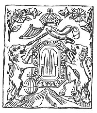
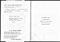

  
[Intangible Textual Heritage](../../index)  [Asia](../index) 
[Index](index)  [Next](geft01) 

------------------------------------------------------------------------

[Buy this Book at
Amazon.com](https://www.amazon.com/exec/obidos/ASIN/B002FB5J1C/internetsacredte)

------------------------------------------------------------------------

  
*Georgian Folk Tales, by Marjory Wardrop* \[1894\], at Intangible
Textual Heritage

------------------------------------------------------------------------

<table data-border="0" width="75%">
<colgroup>
<col style="width: 100%" />
</colgroup>
<tbody>
<tr class="odd">
<td data-valign="top" width="655">I quite understand, my good friend,' said I, 'the contempt you bestow upon the nursery tales with which the Hajee and I have been entertaining each other; but, believe me, he who desires to be well acquainted with a people will not reject their popular stories or local superstitions. Depend upon it, that man is too far advanced into an artificial state of society who is a stranger to the effects which tales and stories like these have upon the feelings of a nation . . .'

               <em>Sir John Malcolm's Sketches of Persia</em>, ch. xvi.
</td>
</tr>
</tbody>
</table>

 

# Georgian Folk Tales

###### TRANSLATED BY

## Marjory Wardrop

 

#### Published by David Nutt

#### in the Strand, London

#### \[1894\]

Scanned, proofed and formatted at Intangible Textual Heritage, July
2006, by John Bruno Hare. This text is in the public domain in the
United States because it was published prior to 1923.

  [  
Click to enlarge](img/title.jpg)  
Title Page  

 
[  
Click to enlarge](img/verso.jpg)  
Verso  

TO

DR. EDWARD B. TYLOR

AS A SLIGHT TOKEN OF

ADMIRATION FOR HIS GREAT TALENTS,

THESE TRANSLATIONS ARE

RESPECTFULLY DEDICATED

------------------------------------------------------------------------

[Next: Preface](geft01)
