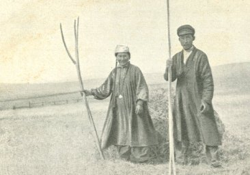

  
[Intangible Textual Heritage](../../index)  [Asia](../index) 

------------------------------------------------------------------------

[Buy this Book at
Amazon.com](https://www.amazon.com/exec/obidos/ASIN/B0029XG0XM/internetsacredte)

------------------------------------------------------------------------

<table width="75%">
<colgroup>
<col style="width: 50%" />
<col style="width: 50%" />
</colgroup>
<tbody>
<tr class="odd">
<td width="50%" data-valign="TOP"> 
Buryat Peasant couple, ca. 1900 (Public Domain Image) (Public Domain Image)</td>
<td width="50%" data-valign="CENTER"><h1 id="a-journey-in-southern-siberia" data-align="CENTER">A Journey in Southern Siberia</h1>
<h2 id="by-jeremiah-curtin" data-align="CENTER">by Jeremiah Curtin</h2>
<h4 id="section" data-align="CENTER">[1909]</h4></td>
</tr>
</tbody>
</table>

------------------------------------------------------------------------

[Contents](#contents)    [Start Reading](jss00)    [Page
Index](pageidx)    [Text \[Zipped\]](jss.txt.gz)

------------------------------------------------------------------------

|                                                                                                                           |
|---------------------------------------------------------------------------------------------------------------------------|
|  |

Jeremiah Curtin, writer, polyglot, ethnographer and folklorist,
travelled in 1900 to central Siberia to study the religion and folklore
of the Buryat people. The Buryats are one branch of the Mongols, who at
one point conquered a large swath of Asia, Europe and India. Their home
is around Lake Baikal in central Siberia. The first third of this book
is a travelogue which describes Curtin's Siberian journey; this is a
fascinating glimpse at Tsarist Siberia just before the Revolution. The
last two-thirds of the book is an extraordinary record of the mythology
of the Buryats. The lore is of great interest, resembling in its fluid,
dreamlike narrative the Native American tales. There are many elements
found elsewhere through Asia and Europe such as epic horses (and horse
sacrifices), battles with giants, a World-mountain and 'the water of
life', (see The Epic of Gilgamesh). There are also unique elements such
as heroes with oracular books embedded in their bodies.

This one of the last of Curtin's books, published after his death in
1906. Etexts of the full text of other books by Curtin at this site are
[Myths and Folk-lore of Ireland](../../neu/celt/mfli/index), [Tales of
the Fairies and of the Ghost World](../../neu/celt/tfgw/index) and
[Creation Myths of Primitive America](../../nam/ca/cma/index).

------------------------------------------------------------------------

[Title Page](jss00)  
[Prefatory Note](jss01)  
[Contents](jss02)  
[Illustrations](jss03)  
[Map of Siberia](jss04)  
[Chapter I. The Birthplace of Mongol Activity](jss05)  
[Chapter II. My Journey to the Buriats](jss06)  
[Chapter III. Collecting Myths](jss07)  
[Chapter IV. The Horse Sacrifice](jss08)  
[Chapter V. Journey to the Island of Olkhon](jss09)  
[Chapter VI. Sojourn on the ''Sacred'' Island](jss10)  
[Chapter VII. A Birthday in Siberia](jss11)  
[Chapter VIII. Customs of the Buriats](jss12)  
[Chapter IX. The Origin of Shamans](jss13)  
[Chapter X. The Gods of the Buriats](jss14)  

### Chapter XI. Myths Connected With Mongol Religion

[Gesir Bogdo. No. I](jss15)  
[Gesir Bogdo. No. II](jss16)  
[Gesir Bogdo. No. III](jss17)  
[The Iron Hero](jss18)  
[Ashir Bogdo](jss19)  

### Chapter XII. Mongol Myths and Folk-Tales

[Buruldai Bogdo, No. I](jss20)  
[Buruldai Bogdo Khan. No. II](jss21)  
[Sharu](jss22)  
[Húnkuvai and the Horse with Round Head](jss23)  
[Varhan Tulai Hubun](jss24)  
[Altin Shagoy](jss25)  
[Yerente Khan and His Son Sokto](jss26)  
[Alamaldjin and His Twin Sister Hanhai](jss27)  
[The Twin Boys, Altin Shagoy and Mungun Shagoy](jss28)  

 

[Notes](jss29)  
[Indexes](jss30)  
