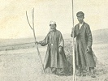

  
[Intangible Textual Heritage](../../index)  [Asia](../index) 
[Index](index)  [Previous](jss04)  [Next](jss06) 

------------------------------------------------------------------------

[Buy this Book at
Amazon.com](https://www.amazon.com/exec/obidos/ASIN/B0029XG0XM/internetsacredte)

------------------------------------------------------------------------

  
*A Journey in Southern Siberia*, by Jeremiah Curtin, \[1909\], at
Intangible Textual Heritage

------------------------------------------------------------------------

p. 1

# A JOURNEY IN SOUTHERN SIBERIA

### CHAPTER I

### THE BIRTHPLACE OF MONGOL ACTIVITY

THE Buriats whose myth-tales I have collected, and whose beliefs, modes
of worship, and customs I have studied at their source and describe in
this volume, are Mongols in the strictest sense of the word as men use
it. They inhabit three sides of Lake Baikal, as well as Olkhon its only
island. The place and the people are noteworthy.

Lake Baikal is the largest body of fresh water in the Old World, being
over four hundred miles long and from twenty-four to fifty-six miles
broad, its total area covering about thirteen thousand square miles. The
Buriats living west of that water, and those inhabiting the sacred
island of Olkhon, are the only Mongols who have preserved their own race
religion with its primitive usages, archaic beliefs, and philosophy,
hence they are a people of great interest to science.

The region about that immense body of water, Lake Baikal, is of still
greater interest in history, for from the mountain land south of the
lake, and touching it, came Temudjin, known later as Jinghis Khan, and
Tamerlane, or Timur Lenk (the Iron Limper), the two greatest personages
in the Mongol division of mankind.

From the first of these two mighty man-slayers were descended the Mongol
subduers of China and Russia. Among Jinghis Khan's many grandsons were
Kublai Khan, the subjector of China, together with Burma and other lands
east of India; Hulagu, who destroyed the Assassin Commonwealth of
Persia, stormed Bagdad, and extinguished the Abbasid Kalifat; and Batu,
who covered Russia with blood and ashes, mined Hungary, hunting its king
to an island in the Adriatic, crushed

p. 2

\[paragraph continues\] German and other
forces opposed to the Mongols at Liegnitz, and returned to the Volga
region, where he established his chief headquarters.

Descendants of Jinghis Khan ruled in Russia for two centuries and almost
five decades. In China they wielded power only sixty-eight years.

From Tamerlane, a more brilliant, if not a greater, leader than Jinghis,
descended the Mongols of India, whose history is remarkable both in the
rise and the fall of the empire which they founded.

These two Mongol conquerors had a common ancestor in Jinghis Khan's
great-great-grandfather, Tumbinai; hence both men were of the same blood
and had the same land of origin,—the region south of Lake Baikal.

That Mongol power which began its career near Baikal covered all Asia,
or most of it, and a large part of Europe, and lasted till destroyed by
Russia and England. The histories of these struggles are world-wide in
their meaning; they deserve the closest study, and in time will surely
receive it.

When the descendants of Jinghis Khan had lost China, the only great
conquest left them was Russia, and there, after a rule of two hundred
and forty-four years, power was snatched from them.

The Grand Moguls, those masters of India, the descendants of Tamerlane,
met with Great Britain, and were stripped of their empire in
consequence.

The British conquest of India and its methods mark a new era in
history,—the era of commercial invasion, the era of the "drummer" in
politics; that drummer who, in addition to the wares which he offers,
has statecraft behind him, and when the need comes he has also cold
steel and hot cannon-balls.

The Grand Mogul and his counsellors could not suspect danger from this
man. They considered him, at first, much as rich ladies in great country
houses far from cities might consider a humble and toiling pack-peddler.
But, though he might seem insignificant, this man was really a
conqueror. The Grand Mogul, Jehargir, could not see, of course, that
Hawkins and Roe would bring after them servants such as Clive, Warren

p. 3

\[paragraph continues\] Hastings, and
others, who would take from his heirs whatsoever they valued,—land,
dominion, and treasures.

Mongol rule was abolished in India by the British because it did not
accord with their methods and objects. It was destroyed by the Russians
because it was foreign, oppressive, and hateful. They simply freed their
land from aliens. The conflict in Russia was what people call patriotic.
It was carried on through sacrifices and struggles of many kinds.

There is a third Mongol history which affects greatly the actors in the
two histories just mentioned. This history had its origin at Lake
Baikal, though indirectly. When Jinghis Khan was hunting the Kwaresmian
ruler, Shah Mohammed, to his death on an island in the Caspian, a group
of Turks, or western Mongols, fled before him, and found refuge in Asia
Minor. The time for them proved favorable. They fought; they obtained
land, and prospered. They grew great by accretion, as does a snowball
rolling down a long mountain slope, till at last they won the empire
established by Constantine.

This Mongol group, four hundred and forty-four families in number,
became known as the Ottomans, and after the destruction of the Kalifat
at Bagdad they were the heirs of Mohammed, and a terror to Europe. In
time, however, they weakened, and Great Britain came to be the
defender-in-chief and mainstay of those western Mongols, and Russia
their main and chief attacker. So the spoilers of Tamerlane's
descendants in India became the active allies of the Mongols on the
Bosporus, and the enemy of that Russia who had pushed Mongol rule out of
northern Europe.

Had Jinghis Khan never lived, those Turks, or western Mongols, known
afterward as Ottomans, would never have left Asia and ruled on the
Bosporus.

The Mongols have played an immense part in the past, and they bear in
them at the present the great mystery of the future,—a mystery of deep
import to all men. The birthplace of that mystery was the mountain
region south of Lake Baikal. In view of this I visited that central land
of Siberia where the family of Jinghis had its origin.

I think it well to give here a brief outline sketch of Siberia,

p. 4

a country which covers an area of fourteen and one half million square
kilometres; that is, about one ninth of the whole continental surface of
the globe, but which to the mind of most readers is an unknown,
boundless, cold, dreadful wonderland. I shall mention a few of the chief
events in the history of the country up to the time when the Buriats
first recognized Russian supremacy.

Though the name "Sibir" appears in Russian chronicles in 1407 for the
first time, Russians knew the country east of the Ural Mountains much
earlier. Southern Siberia was visited by Russian princes in the middle
of the thirteenth century, when they were forced to do homage to the
Grand Khan at Karakorum, his first capital, not very far to the south of
Lake Baikal.

Western Siberia was known as early as the eleventh century to merchants
of Novgorod, who had dealings with the people of that region which they
called Yugria or Ugri. Those people had furs of various kinds which they
were ready to barter, and of all sources of income for Novgorod the
chief, and the richest in those days, was the fur trade. That great
territory between Novgorod and the Ural Mountains, and from the Volga to
the Frozen Ocean was one vast preserve, one immense hunting ground for
fur-bearing animals.

In the Middle Ages the wearing of furs was universal. Every one wore
them who had the wherewithal to purchase. Wealthy persons wore mantles
and coats made of the most costly skins, and at that time Great Novgorod
purveyed for all Europe—found furs for every one who would buy. This
demand impelled Novgorod to subject, and in cases to colonize, places
far north and east of its own territory.

At first fur-bearing animals abounded in all the lands under Novgorod,
but in time they decreased in more western regions, and fur hunters
searched through the forests on the Kama, Petchora, and northern Dwina,
as well as on streams running into those rivers.

Furs were obtained both in payment of tribute and in return for goods
furnished the natives. The government of Novgorod sent out its
collectors at intervals. The tribute which they took

p. 5

was paid in furs usually, if not always. Traders also went from various
points on the Volga to the Arctic, and besides furs they obtained whale
and walrus oil, walrus tusks, sea fowls, tar, and potash, but fur was
the chief and most valuable article of commerce. From Perm these men
received also silver, but this silver had been brought from beyond the
Ural Mountains, which in those days were called Kamenyet Poyas (the
Stone Girdle).

Though the country west of the mountains was great in extent, the
country east of them was enormously greater. It was also richer in furs
of a high quality, and had besides the master metals,—gold and silver.

When regions west of the mountain range had become well known to
collectors of tribute and to traders, men began to seek wealth in
regions east of it. The fame of that eastern land soon spread throughout
all northern Russia, and in 1032 an expedition from Novgorod set out for
the "Iron Gates," that is, a pass in the Ural, through which they
intended to enter Yugria.

This expedition met failure and was crushed by the natives. Only a few
of the men went back to Novgorod; most of them perished.

In 1096, sixty-four years after that first expedition, according to a
statement in the *Chronicle of Nestor*, a Novgorod merchant named
Rogóvitch sent a man first to the Petchora, where the natives paid
tribute, and afterward to Yugria, "where the people are shut in by
sky-touching mountains, in which there is a small gate with an opening.
Through this gate men look out and talk from time to time, but no one
understands them. If any person shows a knife or an axe to these people
they offer furs in exchange for it. The Yugrians were confined in this
region by Alexander of Macedon. While on his way to the sea, called 'The
Sun's Place,' Alexander discovered these people, and, seeing their
terrible uncleanness,—they did not bury their dead, they ate snakes,
flies, and every other vile thing,—he feared lest they might increase
and defile the whole earth by their practices, so he drove them to that
great north-eastern corner and fenced them in there firmly. He asked the
Lord, and high mountains closed in on the Yugrians. Still the

p. 6

mountains did not meet altogether, a gap of twelve ells remained, and
there a bronze gate was formed of such quality that fire cannot burn it,
or iron cut it."

'Under the year 1114 it is noted in the Chronicle that "old men who had
gone to Yugria saw a cloud touch the earth, and then fur-bearing animals
came out of it, and rushed away through that country in myriads. Another
cloud came down, and reindeer sprang out of it."

These tales are like those told by Pacific coast Indians. There are
tribes on the Klamath River who tell of animals coming from the sky. I
have several such myths which I took down in California. This account in
Nestor's *Chronicle* is beyond doubt a Siberian myth-tale given to some
Russian who told it at home as if he had been an eye-witness, or who was
reported as so telling it.

Toward the end of the twelfth century Yugria paid tribute to Novgorod,
though there was resistance at first, as there had been west of the
mountains, where in 1187 one hundred men were killed while collecting
tribute. In 1197 a party east of the Ural lost a still larger number.

After 1264 Yugria was counted by Novgorod as a possession of that
republic, and tribute was collected there. In 1364 an expedition from
Novgorod, made up of young people, sons of boyars, and volunteers, led
by Alexander Abakúmovitch and Stephan Lyápa, reached the Ob River, one
of the mighty rivers which embrace that vast plain called western
Siberia. There they separated into two parties: one, sailing down to the
mouth, conquered all tribes to the Frozen Ocean; the other, sailing up
the river, was equally successful.

Forty-three years later, or in 1407, Tohtamish, once khan of the Golden
Horde, the man who burned and ruined Moscow, was murdered in Sibir, a
town on the Irtish some versts below its junction with the Toból. The
name "Sibir" was used then for the first time, as the chronicler informs
us.

In 1446 a new expedition to Yugria was made, but it failed; and this
seems to have been the last expedition sent by Novgorod. Nineteen years
later Ivan Veliki (the Great) of Moscow, afterward the conqueror of
"Lord Novgorod," as the proud

p. 7

people called their city, commanded Vassili Skryaba of Ustyug to subject
Yugria. This was done, as it seemed for the moment, since Kalpak and
Tekich, princes of Yugria, were brought to Moscow, where Ivan Veliki
confirmed their titles, and appointed a tribute which they were to pay
for all Yugria. Thenceforth Ivan must have considered himself master of
the country, for in 1488, when writing to the King of Bohemia, he added
Yugorski to his other titles.

But in reality the northern part of Yugria showed no desire for
subjection to Moscow. And years later three commanders, one of whom was
Prince Kurbski, led five thousand men into northern Yugria and conquered
it, capturing forty-one towns and taking, as prisoners, more than one
thousand people, with fifty-eight princes or elders.

Fifteen years after this Vassili, son of Ivan Veliki, divided northern
Yugria. The region on the Lower Ob he called Obdoria, and that on the
river Konda, Kondia, and to his titles he added Prince Obdorski and
Kondinski. A little later the southern part became known as Sibir, which
was the name of the capital of the native khans, and in time became the
name of the entire country.

In a letter, written in 1554, to Edward VI of England, Ivan the
Terrible, as Karamzin states, entitled himself "Commander of all Sibir."

In 1558 Tsar Ivan granted Grigori Stróganoff unoccupied lands, one
hundred and forty-six versts in length, on the Kama and Chusóva rivers.
No taxes were to be paid on those lands for twenty years. Ten years
later lands extending twenty versts along the Kama from the mouth of
that river were granted to Grigori's brother, Yákov. These lands were to
be free of taxes for ten years. In return the brothers were to build
stockades and maintain troops at their own expense. On both these grants
the Stróganoffs showed great activity.

In 1563 Khan Kuchum, said by some writers to be a Nogai, who lived near
Lake Aral, and by others to be a simple Usbek, captured Sibir the
capital, and after killing the ruling khan, Ediger, and Bekbúlat his
brother, termed himself Tsar of Sibir, probably calling all the country
in that region Sibir, to signify

p. 8

that it belonged to his capital. When established firmly he subdued many
northern tribes and refused to pay tribute to Moscow.

In 1569 Ivan the Terrible sent Kuchum a message reminding him of his
duties as a vassal; and in 1571-72 Kuchum despatched two envoys, Tamas
and Aisa, to Moscow with tribute, and a letter in which he asked to
become a subject of the Tsar, and promised to pay the tribute in future.

The envoys took oath for Kuchum and his chief men, but not knowing how
to write and having no seal they were unable to sign an oath paper;
hence Ivan sent Chabúkoff, the son of a boyar, with envoys to Sibir, and
there Kuchum and his chief men took the oath to Ivan, and put their
seals to the oath papers.

Mahmet Kul, mentioned variously as son, brother, nephew, and relative of
Kuchum, was enraged that his people should bend before Russians. He
attacked those who were willing to pay tribute to Moscow, captured their
wives and children, and ended by assaulting Chabúkoff while that envoy
was returning to Moscow; but learning that troops on the Chusóva were
preparing to attack him he fled.

In 1574 the Stróganoffs, Grigori and Yákov, were granted the privilege
to build posts on the Toból and Takhcha rivers; to use guns and cannon;
to enlist men and employ them in warfare; to restrain every uprising; to
establish iron-works and fisheries; to cultivate land on the Toból and
streams flowing into it. Settlers on those lands were freed for twenty
years from taxes and services of all kinds. The Stróganoffs were to put
down robbers, thieves, and vagrants; they were to protect native tribes
and other people from Kuchum, and bring Kuchum and his subjects to true
obedience.

In Moscow there was great complaint touching robberies on the Volga, and
in 1577 Ivan Grozney (the Terrible) sent a strong force with an order to
capture Yermak, the chief ataman, with four other atamans, and send them
in irons to Moscow, that he might make an example of them by a painful
and ignominious death.

Some of the robbers, or Cossacks, as people called them, were captured
and hanged straightway, but most of them scattered

p. 9

and saved themselves; among these was Yermak Timofieff, with his
associate atamans, Ivan Koltsó, Yákov Mihailoff, Nikíta Pan, and Matvéi
Mestcheryak, and other men to the number of five thousand, or five
hundred as some historians state.

The following year these men reached the land of the Stróganoffs.
Grigori and Yákov were dead; their heirs were Simeon, a third brother,
Maksim, son of Yákov, and Nikíta, son of Grigori. There are in Russian
Chronicles two versions of what happened at this time. One is that
Yermak planned the subjection of Kuchum and the conquest of Sibir, and
induced the Stróganoffs to aid him; the other is that the Stróganoffs
planned the conquest and got Yermak to assist them in the undertaking.
Either version may be true, or it may be that the Stróganoffs and Yermak
had the same plan and agreed to co-operate. But the glory of being the
first real conqueror of Siberia is given to Yermak, and he is therefore
the popular hero of Siberia.

Kuchum had shown clearly that no success in Sibir was possible for the
Stróganoffs or others till his power was crushed thoroughly. Yermak
undertook to crush it.

Of Yermak and his origin accounts are also conflicting. One *Chronicle*
calls him Vassili, and says that he was a native of the Ural country,
who worked on a boat navigating the Kama and the Volga; that he was
pot-boiler, that is, cook, for the boat-men. Yermak was the name of a
company's pot on such boats, and instead of calling him Vassili the
boatmen nicknamed him Yermak (Pot). Yermak was ambitious, hence he grew
dissatisfied and restless, and, seeing a chance to win wealth on the
Volga by robbery, he deserted his employers, formed a company of young,
daring boatmen, put himself at the head of it, and began business. He
did what he pleased, and above all what gave profit. At last he and
Koltsó with a few of their associates grew so bold that they robbed the
Tsar's envoy; and then came the order to bring him to Moscow. In another
account Yermak is made a Cossack of the Don; and in a third, that of
Kostomareff, he is described as an ataman in the Tsar's service on the
Ural, and has no connection whatever with Don Cossacks or with robbery
on the Volga.

p. 10

Yermak's first hostile meeting with the natives of Sibir was with the
Tartar prince, Epancha, whom he defeated. In a second battle, somewhat
later, he captured Epancha's chief stronghold, which stood where the
town of Tiumen is now situated. Yermak and his forces spent the winter
of 1580—SI at this place. Early in the spring he sailed down the Tura.
Near the mouth of the river hostile princes were awaiting him. A battle
ensued, which after some days ended in the defeat of the native forces,
and Yermak captured so much booty that he was forced to abandon a large
part of it. He now entered the Toból River, and with ten hundred and
sixty men, his whole army, sailed toward the Irtish.

In spite of continual attacks by the enemy the small army reached Isker,
or Sibir, Kuchum's capital. At that place there was another engagement,
and though few of Yermak's men were killed many were wounded. October
1st a battle was fought in which the Russians simply held their own, but
on October 23d a merciless hand to hand conflict took place; Yermak lost
one hundred and seven men, but he won a decisive victory. A few days
later two tribes deserted Kuchum, and he fled with his troops to the
steppes, taking with him everything that it was possible to carry.

October 26, 1581 is memorable in the history of Siberia, for on that day
Yermak entered Sibir, the capital, as master. Four days later a chief of
the Ostyaks appeared bringing provisions and tribute.

Early in 1582 Mahmet Kul was captured and taken to Moscow. Yermak now
sent Ivan Koltsó to lay the Tsardom of all Sibir at the feet of Ivan
Grozney. Koltsó was attended by fifty Cossacks, and took with him two
thousand four hundred valuable skins, two black foxes, fifty beavers,
and a letter from Yermak to the Tsar announcing his conquest.

The Tsar received Koltsó with honor, and so great was his gratitude that
he sent Yermak a fur mantle from his own shoulders, a magnificent
goblet, and two rich suits of armor, besides much money. He also sent
one of his most valued leaders, Glúkhoff, to assist him.

Yermak now extended his authority in every direction. In

p. 11

\[paragraph continues\] September, 1583, a
messenger came from Karacha, a murza who had formerly been devoted to
Kuchum, begging Yermak for aid against Nogai Tartars. Yermak, not
thinking of treachery, sent Koltsó with forty Cossacks. Karacha
slaughtered the entire party.

In November came the first government officials to Siberia from Moscow,
Prince Bolhovski, with two associates and five hundred sharpshooters.
The following winter there was a terrible dearth of provisions. Prince
Bolhovski and many of his men died from hardship and lack of food. While
the Russians were in such straits Karacha tried to anticipate Yermak in
action, and prevent him from taking revenge for the murder of Koltsó and
his Cossacks. He invested Sibir, the capital; but the Russians made a
sally, defeated him, and drove off his warriors, who fled, leaving their
supply of provisions behind them.

During the summer of 1584 Yermak made his last expedition. He sailed up
the Irtish to subdue the various tribes and force them to pay tribute,
and to punish Karacha, if he could find him. With the tribes he
succeeded, but Karacha eluded every search, and escaped.

Near the end of July Yermak returned to his capital, but in August
sailed again up the river to rescue, as he thought, Bukhara traders,
reports having reached him that Kuchum had seized them on the Irtish.
Finding that these reports were false, he turned and sailed homeward.

One night, when it was so dark and stormy that Yermak thought it unsafe
to continue the journey, he stopped at an island near the bank of the
river. The weary Cossacks were soon sleeping soundly. The enemy, who had
followed very sharply and cautiously, stole onto the island during the
rainstorm and darkness and killed or drove into the river every man
except one; that man escaped and carried the tidings to Sibir.

Yermak was either killed by the natives or drowned. His body was borne
down the river and found, seven days later, by a Tartar fisherman, named
Yanish.

After Yermak's death Siberia was lost to Russia for a season. In Moscow
no one knew what had happened in far-off Siberia. The entire force of
men left there was one hundred and fifty, the

p. 12

remnant of Yermak's little army, and of those warriors who had come with
Bolhovski. They were under command of Glúkhoff, who, fearing to remain
in a hostile country with so small a force, decided to return west of
the Ural. He left Sibir, and, not venturing to take the road by which
Yermak had entered the country, sailed down the Irtish and Ob rivers,
crossed the Ural Mountains well toward the north, came out in the region
of Archangel, and went thence to Moscow.

Kuchum's son, Alei, entered Sibir, the capital, immediately after
Glúkhoff's departure, but was soon driven out by Seidyak, a son of that
Bekbúlat, whom Kuchum had killed when he seized the place originally.

In 1585 Tsar Fedor, son and successor of Ivan Grozney, knowing nothing
of what had happened, sent Ivan Mansúroff to succeed Prince Bolhovski.
When Mansúroff arrived in Sibir he found no Russians whatsoever. If a
few were left in the country they had associated themselves with the
natives, to escape destruction. It was impossible to return to Moscow
for the cold season had come. Mansúroff was forced to remain in Siberia
for the winter, hence with all expedition he raised a stockade and built
houses on the right bank of the Ob, just opposite the mouth of the
Irtish.

The Ostyaks made one attack, but were so frightened by the sound of the
cannon that they fled. In the spring Mansúroff set out for home, going
by the same road, through the Ural Mountains, which Glúkhoff had taken.

When Glúkhoff reached Moscow, and told his tale of defeat and disaster
Tsar Fedor sent three hundred men to Sibir under two voevodas, Vassili
Sukin and Ivan Myasnoi. Daniel Chulkóff, a secretary, was to follow. In
July of that year, 1586, Sukin founded Tiumen on the Tura, and, not
venturing to move farther on toward Sibir, he extended Moscow rule over
tribes in the region around him. He was not too far from the Ural, hence
safe. The position was good, geographically.

Early in 1587 five hundred men came from Moscow with Chulkóff, who
brought to Sukin and Myasnoi a command, from the Tsar, to found a city
on the right bank of the Irtish, near the mouth of the Toból—Tobólsk was
founded.

p. 13

Tiumen was the first Russian city built in Siberia. Tobólsk on the Toból
followed quickly, but was soon transferred to the high bank of the
Irtish. Chulkóff induced Seidyak, ruling then in Sibir, the town taken
once by Yermak, to visit him at Tobólsk. Uzaz Makmen, Sultan of the
Kaisak Horde, came also, and Karacha, who had slaughtered Koltsó and his
Cossacks. Chulkóff seized all three of these men and sent them to
Moscow. Then he attacked and captured Sibir, the capital. Its
inhabitants fled, and the place was never reoccupied by any one.

In their advance toward the East the Russians did not meet with very
serious resistance till near the Amoor River, generally the native
tribes submitted to the Cossacks without a struggle and the Russian
government gradually built forts which later on became towns.

In 1590, for the first time, colonists were sent to Siberia. Tobólsk was
made the chief city and administrative center. New towns appeared, among
others Pelym, which Prince Peter Gortchakoff founded. This place is
notable as the first in Siberia to which exiles were sentenced. Many of
the people of Uglitch, a place north of Moscow, were sent thither by
Tsar Fedor because of the death in their town of his half-brother, the
young son of Ivan the Terrible. Strangest exile of all was a church bell
from Uglitch, sent to Tobólsk in 1591. The alarm had been sounded on
that bell when the Tsar's son was killed. In Tobólsk it was hung in the
tower of the church on the Market place, to strike the hours.

In this year Beriozoff was founded by Trahanistoff, a voevoda, and
Surgut, on the river Ob by the Princes Lvoff and Volkonski.

From 1593 to 1598 there was immense activity in Siberia. Tara, Obdorsk,
and many other towns were founded, and commerce began to flourish.

In 1598 Prince Masalski and Ivan Voyekoff set out with one thousand men
to punish Kuchum for his pernicious activity, and for killing Koltsó.
They met and crushed him. Kuchum lost his army and his family: five
sons, eight wives, and eight daughters of his were sent to Moscow. The
old man himself, though deaf and blind, did not yield to the Russians;
he fled to the Nogai Tartars, who somewhat later killed him.

p. 14

And now Russia established itself firmly in Siberia.

The first exiles of distinction to be sent into the country were sent to
Pelym in 1599. They were Ivan and Vassili Románoff, who for acting
against Boris Grodenof, now Tsar, were exiled from Russia. Their brother
Fedor escaped exile by assuming the habit of a monk and the name
Philaret, while his wife took the veil and the name Martha. From this
monk and this nun sprang the founder of the Romanoff dynasty, Michael
Romanoff.

The city of Tomsk was founded in 1604 by Gavrilo Pisemski and Vassili
Tyrtoff. This city is now, in 1900, the educational center of
northwestern Siberia. It has one of the largest
[Universities](errata.htm#0) in the country, twenty-three Russian
churches, two synagogues, and a large Catholic church. It is a
wide-awake flourishing city in spite of a climate so cold that during
winter the thermometer is about forty degrees below zero (Fahrenheit)
for many days at a time, and the river Tom, on which the city is
situated, is frozen quite half the year.

In 1620 it first became known to the world that in the far north, on the
Lena River, lived a people who called themselves Yakuts. This
information was given to officials in Tobólsk by the Mangazei Cossacks.
In 1631 Martynoff sailed into the Lena by the Vilyno and discovered the
Yakuts on whom he imposed tribute. The so-called Yakutsk Territory
occupies the basin of the Lena River. Its climate is very severe, so
severe in fact that agriculture is impossible, but the country is so
rich in coal, iron, silver, and gold that within the past two centuries
many and many thousands of convicts have been sent there to work in the
mines, and because of this it has become known to the whole world.

In 1621 an event occurred of great importance for the future historians
of Russia: Cyprian came as the first archbishop to Siberia. He was a
scholar, and a man of remarkable foresight. His prescience has been of
immense value to Russia. His earliest work was to find the few survivors
of Yermak's forces and write down from their lips what they knew of that
hero's expeditions and conquests. That information formed the basis of
Siberian chronicles.

In 1622 the Russians first became acquainted with the Buriats.

p. 15

\[paragraph continues\] Yákov Hripunoff
learned of their visiting the river Kan to get tribute, and he sent
Kozloff, a Cossack, as an envoy to invite them to become Russian
subjects. The result of this mission is unknown. We know, however, that
in 1627 two expeditions were sent out, one under Bugór to explore the
Lena River, the other under Perfilyeff, to force the Buriats to pay
tribute.

Bugór reached the upper waters of the Lena, but Perfilyeff was
unsuccessful; the Buriats would not surrender their independence.

In 1628 Piotr Beketoff, with a party of Cossacks, was sent against the
Buriats on the Angara, but returned after reaching the mouth of the Oka
River.

In 1632 Beketoff ascended the Angara and then the Ilim, crossed to the
Lena, sailed down that river, and built a fort which he called Yakutsk.
Later this fort was removed to the present Yakutsk, seventy versts
higher up the river, and in 1638 Yakutsk was made the administrative
center of northeastern Siberia. That same year Verhoyansk in the far
North was founded, and in 1640 were discovered the rivers Indigirka and
Alazli, both of which flow into the Frozen Ocean.

About this time an envoy, Vassili Starkoff, was sent to the Altyn Khan
at Lake Ubsa. Among that khan's presents to Michael Romanoff was the
first tea taken to Russia, two hundred packages, each weighing one pound
and a quarter. Starkoff refused to take the tea, declaring that it was
useless, and was difficult to carry, but the khan insisted and the
envoy, not wishing to displease him, yielded. Tea taken thus to Moscow
against the wishes of the envoy soon became a national drink among the
Russians and has ever remained so.

Under the lead of Kurbat Ivanoff, a Cossack, the Russians appeared, in
1643, on the western shore of Lake Baikal, and also on Olkhon Island. In
1646 the Buriats besieged Verhoyensk, a place founded in 1641 by Martin
Vassilieff. Ivanoff, the officer commanding there, was reinforced by
Bedaroff and together they defeated the Buriats and ravaged their
villages. Soon after this Ivan Pohalioff, sent to collect tribute from
the Buriats on the Irkūt, crossed Lake Baikal near its southern border,
and then through the friendship of a petty prince, Turukai, reached

p. 16

\[paragraph continues\] Urga, the capital
of Setsen Khan. As a result of this visit Setsen Khan, the year
following, sent an embassy to Moscow.

In 1648 Bargúzin was founded near the eastern shore of Lake Baikal as a
place to receive tribute from the Buriats. That same year an expedition
was sent north under Dejneff, Ankudinoff, and Aleksaieff. Seven boats,
each containing ten men, sailed eastward from the Kolyma, a river
flowing into the Arctic Ocean. Four of the vessels disappeared during
the voyage, and were never seen afterward. With those remaining the
explorers doubled Shelag Point, which they named Svyatoi Nos (Holy
Nose).

The vessel of Ankudinoff was wrecked there and he with his men were
taken on to the other boats. After that they doubled Chukotchi, or Cape
Chukchi, in which Dejneff describes beyond doubt the easternmost point
of all Asia. In his report to the Yakutsk voevoda he explains how, in an
encounter with the Chuchis, Aleksaiyeff was wounded and they put to sea
at once. A frightful storm separated the vessels and they never met
again. Dejneff was carried by the wind to the south of the Anadyr River.
Thus he was the first man to show that there was a passage between the
Arctic Ocean and the Pacific. To him in reality belongs the honor of
discovering the straits which now bear the name of Bering, for they were
seen by him eighty years earlier (in 1648) than by Bering. Cast upon the
shore, near the mouth of the river Oliutora, Dejneff and his companions
made their way to the Anadyr River. There they built a shelter for the
winter, and soon after were rescued by traders.

Aleksaiyeff and Ankudinoff perished in Kamchatka. Though Dejneff's name
is found in documents till 1654 his fate is unknown. He undoubtedly died
during some expedition.

In 1650 there were several conflicts between Russians and Buriats, and
only after much effort did the Russians assert their supremacy. During
1650 Yerofei Habaroff set out from Yakutsk with one hundred men, hunting
for sable. He ascended the Olekma and the Tungar and reached the Amoor
by the Ur and the Zeya. In two years he explored the whole river, and
was the first man to launch a flotilla there. That year, 1650, the
Buriats on the Oka withdrew up the Angara, and Nefedyeff, an official,

p. 17

was sent with his men to bring them back to the place they had deserted.

In 1652 Pohakoff established the post of Irkutsk on Irkut River near its
junction with the Angara. In 1661 it was removed to the right bank of
the Angara, the present site of the city of Irkutsk, and twenty-one
years later it was made an administrative center.

The same year that the Irkutsk post was established Ivan Robroff was
sent from the Lena in search of a northern continent, but this
expedition disappeared and no word ever came from it. In 1653 Fort
Balazansk was established in the Buriat country and sixty Russian
families were settled there. Two years later the Buriats were preparing
to withdraw to the East of Lake Baikal, but, listening to the counsel of
their wise men, they resolved to remain in their home country and submit
to Russian rule. There were uprisings, however, and it was not till near
the end of the seventeenth century that the Buriats, completely subdued,
became peaceful Russian subjects.

Seventy-five years after Yermak crossed the Urals into the almost
unknown land of Yugra, Russia had swept across Asia; her boundaries
touched the frozen ocean in the north, and China in the south; and in
1697 Kamchatka was added to her domains.

------------------------------------------------------------------------

[Next: Chapter II. My Journey to the Buriats](jss06)
