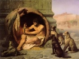

  
[Intangible Textual Heritage](../../index)  [Asia](../index) 
[Index](index)  [Previous](lsbh19)  [Next](lsbh21) 

------------------------------------------------------------------------

  
*The Laughable Stories of Bar-Hebraeus*, by Bar-Hebraeus, tr. E.A.W.
Budge, \[1897\], at Intangible Textual Heritage

------------------------------------------------------------------------

p. 129

### The Fifteenth Chapter

### LAUGHABLE STORIES OF ACTORS AND COMEDIANS.

CCCCLXXXVII. To a certain comedian it was said, "When a cock riseth up
in the early morning hours, why doth he hold one foot in the air?" He
replied, "If he should lift up both feet together he would fall down."

CCCCLXXXVIII. Another comedian said, "If it be only those that are weary
and heavy-laden who are to enter Paradise, as our Lord said [1](#fn_102), there is nothing that who will go in
before the harp, for in this world he endureth much trial and
tribulation. His throat is squeezed, his ear is twisted, his belly is
smitten, and when he is old he is thrown into the fire."

CCCCLXXXIX. Another actor said, "When I was young and was learning the
actor's art, my master used to say to me, 'Take heed and learn well how
thou mayest become used to do the exact opposite of the words which are
spoken to thee, that is to say, if people say unto thee, 'Go, thou must
come,' and when they say unto thee, 'Come, thou must go.' And in the
morning he himself used to say, 'Good evening,' and in the evening,
'Good morning.' And it came to pass one day that having been into the
king's presence and made him laugh, the king commanded them to write him
an order on the Treasury

p. 130

to give him a thousand pieces of silver. Now when he had taken the paper
he came out, to me and gave it to me, saying, 'Collect \[the money\] for
me.' And I went straightway and soaked the paper in water, and when I
had brought it to him it was torn into shreds; and the guards would not
let him go into the king's presence again in order that he might give
him another order. Then, being greatly wroth, he said to me, 'Go then
utterly to perdition, for thou hast no longer any need of me.'"

CCCCXC\. Another actor used to say, "With one small experiment I can
vanquish the believer who saith that everything, both of good and of
evil, cometh from God, and that man hath no power to do anything of
himself." And when it was said to him, "How is this?" he said, I will
lift up my hand over a man's neck, and I will ask him, 'Am I able to
smite thy neck, or not?' If he saith, 'Yes,' behold he hath repudiated
what he confesseth; and if he saith 'No,' I will smite him and shew him
that I have the power to do so."

CCCCXCI\. Unto another actor who was lame it was said, "What is the
cause \[of thy lameness\]?" He replied, "I wish to go forth into the
country to-morrow, but I shall not get far if a thorn run into my foot."

CCCCXCII\. Another actor said, "I and my brother were twins, and we both
came forth from the womb at one time. He hath become a merchant whilst I
am a wandering beggar. How then can the opinions of the astronomers be
held to be true? This proof alone is quite sufficient to shew their
falsehood."

CCCCXCIII\. Another actor was eating his supper with his friend, whose
wife waited upon them, when straightway there fell in front of them a
pebble from

p. 131

the roof, and then another and another. And looking up he said to his
handmaiden, "Go up to the roof and see if the sun hath set;" and having
gone up and tarried for a season, she came down and said, "Yes." His
friend then said to him, "Didst thou not know that the sun had set and
that darkness reigned?" And he answered, saying, "Yes, how could I help
knowing it? But unless I had made the girl go up with some such excuse
as this to those who wanted her, they would never have ceased calling
her and making signs to her to go up. Dost thou understand?" He said to
him, "Yes, I understand."

CCCCXCIV\. Whilst another comic actor was in the company of a judge, a
certain woman came in with her face covered, and her eyes, which were
very beautiful, alone were visible; and she began to weep and to make
railing accusations against her adversary. And the actor said to the
judge, "Believe \[me\], this woman is an evil-speaking person, but her
eyes proclaim her to be suffering oppression." And having spoken further
and at great length she uncovered her face, and behold she had on her
face a most hideous nose \[as flat\] as a sixpence; and when he had eyed
her closely the actor said to the judge, "Nay, my lord, although her
eyes shew that she is an injured woman, yet her nose testifieth that she
is a liar and an abominable person, and she is not worthy that any man
should shew pity upon her."

CCCCXCV\. Another actor whilst eating with his children at table
\[observed\] that they seized their meat before he could do so, and ate
it, and he said to them, "Take heed, now, for the Law commandeth \[you,
"saying\], 'Honour thy father and thy mother,' now, as

p. 132

far as I am concerned, ye may curse me a thousand times; but do not then
take a morsel of meat before I have done so."

CCCCXCVI\. Another actor was asked, "What do comic actors resemble?" He
replied, "A man whose left hand is filled with filth, and \[who hath\]
his right hand \[stretched out for\] [1](#fn_103) alms, and \[who saith\] 'yes,' and 'no?'
If ye do not [2](#fn_104) say to him 'Take,' he
causeth pollution [3](#fn_105)."

CCCXCVII\. Another actor having taken money on loan from a certain man
denied \[that he had done so\], and having been brought before a judge,
the judge said to the owner of the money, "Hast thou any witnesses?" And
the lender said, "No." The judge said to the actor, "Swear now to me
that thou hast not received the money," and the actor replied, "If thou
wilt allow it, prithee let my brother swear for me, for I know certainly
that he hath not taken anything."

CCCCXC VIII. Unto another actor it was said, "Dost thou wish that a
*dînâr* might be given to thee now?" And he said, "Yes, only stop them
from giving me twenty stripes with sticks." The people said to him,
"Why?" He said to them, "Because I know that the children of men of this
age never give for nothing."

CCCCXCIX\. Another actor was going about in Sebastia (*i.e.*, Sîwâs) in
the winter season dressed in a new flaxen garment, and a certain man
said to him, "Give me this tunic of thine and thou wilt still have thy
cloak, and thy Christ commanded thee to give both thy tunic

p. 133

and thy cloak to whosoever asked thee for them [1](#fn_106)." And he replied, "Let the mind of
Christ be far from me on this matter! For this commandment was \[not\]
given by Him to the people of Sebastia in the winter season, although it
may have been given to the people of Palestine in the summer season."

D. Another actor was quarrelling with a shopkeeper called Zakrôn, who
said to him, "Art thou not ashamed of me? Thy mother was like a sister
to me at the time when thou wert a child among us." And being much
offended the actor went to his mother and said to her, "My mother,
knowest thou Zakrôn the shop-keeper?" And she said "Dost thou mean
Zakrôn the son of Isaac?" And the actor said, "Now I believe that the
man did not lie in what he said, I did imagine that thou couldst never
have known him, but behold, thou hast known his father also."

DI\. Mimus alius interrogatus, "Quis tibi foramen istud perfossit, quod
in ano geris?" respondit, "Idem qui matri tuae duo foramina, alterum in
parte anteriore, alterum a tergo."

DII\. Another actor went into his house and found a man with his wife
and the door wide open; and he said to the man, "What a senseless dolt
thou art to imagine that this woman doth not know the difference between
good and evil; art thou in reality thus wanting in sense?"

DIII\. Another actor saw his wife halfway up a ladder, and swore that he
would never again have any more to do with her, whether she came down or
whether she went up. And when the woman heard this she threw herself
down from the ladder on the ground,

p. 134

and said, "Behold, I did not come down, and I did not go up, but I fell
down." Her husband said to her, "Believe me, if only the people of the
city were acquainted with thee they would certainly hire thee to teach
them cunning ways of making their decisions."

DIV\. When another actor was drunk his wife said to him, "I wish to God
that He would make the drinking of wine abominable in thy sight." And he
said to her, "And I also wish that he would make sweet-meats, and cakes,
and dainty foods abominable in thy sight, for behold thou hast ruined my
house by the buying of flour, and dripping, and honey."

DV\. Mimus alius quidam deformem quamdam viduam uxorem duxerat
interrogatus, "Qualis sit ista femina," regessit, "Vaginae latitudine
aream Arani [1](#fn_107) refert, frigiditate
autem Montem Libanum."

DVI\. Another actor was asked if it were possible for a child to be born
to a man seventy years old, and he replied, "Yes, if he hath a neighbour
handy aged thirty."

DVII\. The wife of another actor being with child looked at her
husband's ugly face and said, "Woe is me if the child which I carry in
my womb resembleth thee." And he said, "Nay, but woe be to thee if he
doth not resemble me, for thou shalt no longer eat my bread, and I will
send thee away to him whom the child shall resemble."

DVIII\. Another actor saw a Jew who had become a Christian and who was
not leading a very good life, and he said to him, "O thou who didst
provoke Moses to wrath, and who dost not please Christ, go now to
Muhammed. Perhaps, however, thou wilt die on thy first coming to him,
and before thou hast time to

p. 135

provoke him to wrath, for I know that if thou wert converted to him for
long thou wouldst anger him."

DIX\. When the neighbour of another actor wanted from him a spoon, he
said, "I only wish that we had something which we could eat in our
fingers."

DX\. Whilst another actor was eating fish and milk it was said to him,
"Art thou not afraid to put milk and fish into thy stomach together?"
And he replied, "How can the fish be sensitive to the milk seeing that
he is dead already?"

DXI\. Another actor was quarrelling with his wife whom he wished to put
away from him, and she said to him, "Remember the very long time wherein
we have lived together." And he said to her, "Believe me, thou hast
never committed any \[greater\] folly than this, for thou hast tarried
too long with me, and behold I am sated with thee, and I hate thee."

DXII\. Once when it was winter another actor said to his wife, "Make me
a key, for I greatly desire it." His wife said to him, "Whatever stores
have we which need \[locking up with\] a key?" And he replied, "The
coldness of the air which will freeze them, and behold the place will be
ready for the time when we prepare flesh and vinegar [1](#fn_108), and salt, and wood."

DXIII\. As another actor was going into a place where there were some
drunken men they struck him, and when it was said to him, "Why dost thou
not curse them?" he said, "They are drunken men and would not understand
curses, and therefore I am not going to waste my abuse upon them in
vain."

DXIV\. Another actor went into his house and found

p. 136

a sieve laid upon his couch, and he went and hung himself up on the peg
in the wall. His wife said to him, "What is this? Art thou possessed of
a devil?" And he said to her, "Nay, but when I saw the sieve in my
place, I went to its place."

DXV\. A certain woman asked her neighbour, saying, "Why should a man
have power to buy a handmaiden and to lie with her and to do whatsoever
he pleaseth with her, while a woman hath no power to do any such things
freely and openly?" And she said to her, "Because the kings, and the
judges, and the lawgivers are all men; and they have therefore acted the
parts of advocates of their own causes and have oppressed the women."

DXVI\. Another actor went to a certain merchant and begged him to lend
him a hundred silver *zûzê*, and he said to him, "What wilt thou deposit
with me as surety?" And the actor said, "I have no pledge \[to leave\],
but I will write thee an acknowledgment, so that at the time of payment
if I do not produce witnesses \[to swear\] that I have paid thee I will
swear \[it myself\] without either reason or speech."

DXVII\. Another actor said to his servant, "When thou goest on any
business [1](#fn_109) and returnest, if it be
ended satisfactorily say 'Wheat,' and if not say 'Barley. And one day
when he had gone and returned, the actor asked him, "Wheat or Barley?"
and he replied, "Something quite different." The actor said, "What
meanest thou?" And the servant said, "Not only did they not perform the
business on which I went, but they cursed me and beat me."

p. 137

DXVIII\. Another actor heard a man saying to his companion, "When thou
art travelling by night and wouldst that the dogs should not molest
thee, shout in their faces the Psalm wherein occur the words, '\[And
save\] my only one from the mouth of the dogs [1](#fn_110).' And he said to him, "Nay, but let him
also take a stick in his hand, for all dogs do not understand the
Psalms, although there may be among them some who read them."

DXIX\. A judge commanded them to shave off the beard of an actor, and
when the barber wanted to do so, he said to him, "Fill thy mouth with
air." The actor said to him, "O fool, did the judge command thee to
shave my beard or to teach me how to blow a whistle?"

DXX\. Mimus alius interrogatus quot eduxisset liberos, regessit, "Deos
obtestor uxorem meam saepius peperisse quam cum illâ concubuerim."

DXXI\. Unto another actor who had been bitten by a dog it was said, "If
thou wishest to know whether he was mad or not, give him bread made of
fine wheaten flour; if he eateth it then he is mad." The actor said, "If
I were to do this there is not a dog in the world but would bite me in
order to be tried in this same way."

DXXII\. Certain men told lies about another actor concerning some
offences \[which had been committed\], and the judge took him and gave
him fifty stripes with a stick, but some time afterwards, when the judge
discovered that the men had accused him falsely, he said to the actor,
"I punished thee by mistake." The

p. 138

actor said, "Nay, but keep an account of my stripes by thee, so that
when I in .very deed do commit some offence, thou mayest reckon them as
my punishment and not inflict chastisement upon me afresh."

DXXIII\. Unto another actor it was said, "What sayest thou to some cakes
fried in butter and honey?" The actor said, "What am I able to say? But
indeed this I know of a certainty. If Moses the prophet had gone into
Pharaoh's presence with cakes fried in butter and honey, the king would
have believed his words straightway; but since he went in with a rod,
Pharaoh is not to be blamed overmuch because he did not believe, for he
was a king and was angry."

DXXIV\. Another actor who hated the egg plant, having been invited by a
certain nobleman, found that all his meats were made therewith; and he
said to the servant, "Give me some water that I may drink, that is, if
there be no egg plant in it."

DXXV\. Another actor was invited to a feast by a certain nobleman who
began to eat the yelks of hard-boiled eggs and to set the white of the
eggs before the actor to eat. And the actor said, "May God have mercy on
the sphere wherein all exactitude is found," that is to say wherein the
yelk and the white are bound closely together.

DXXVI\. Another actor went to the house of a certain rich man who was
sick, and enquired concerning his illness, and the sick man said to him,
"Boils have broken out upon me in a loathsome place." The actor said, "I
do not see any in thy face," meaning "thy face is a loathsome place."

DXXVII\. Another actor, who was sitting at meat with a certain miserly
nobleman, let fall some of his

p. 139

food on to his garments, and the nobleman said to the servants, "Wash
the meat off his garments for him." The actor said, "Thy meat doth not
need to be washed off," that is to say, "there is no grease in it."

DXXVIII\. Another actor had a wife whose face was very ugly, and one
rainy and gloomy day she said to him, "How can one use such a day as
this advantageously?" He said to her, "In divorce and separation."

DXXIX\. Unto another actor it was said, "Is wheat flour very dear in the
market to-day?" And he replied, "I never asked, for I only buy baked
bread."

DXXX\. When another actor saw a man who had sore eyes, he said, "With
what dost thou treat the disease in thine eyes?" And he replied, "With
the singing of Psalms and with the prayers of my mother who is a nun."
The actor made answer, "These are very excellent things indeed, but a
little antimony is needed with them."

DXXXI\. Another actor said, "For six kinds of men it is not good to
drink wine: for him who when singing is a fool; for him who reclineth at
meat on his right side; for him who eateth green herbs overmuch; for him
who drinketh of the first cup; for him who rejoiceth in suppers; and for
him who is in the habit of defiling his garment."

DXXXI\. Another actor was sick, and when his master, who was a very
foolish man, went out he asked him, "What wouldst thou that I should do
for thee?" he replied, "I very much want thee not to come into my
presence again."

------------------------------------------------------------------------

### Footnotes

[129:1](lsbh20.htm#fr_102) St. Matthew xi. 28.

[132:1](lsbh20.htm#fr_103) Supply some word
like \#\#\# or \#\#\#.

[132:2](lsbh20.htm#fr_104) Read \#\#\#.

[132:3](lsbh20.htm#fr_105) *I.e.*, "If you will
not give me something I will throw dirt at you."

[133:1](lsbh20.htm#fr_106) St. Matthew v. 40.

[134:1](lsbh20.htm#fr_107) = *I.e.*, Ornan or
Araunah. See 2 Samuel xxiv. 16; 1 Chronicles xxi. 18.

[135:1](lsbh20.htm#fr_108) For \#\#\# read
\#\#\#.

[136:1](lsbh20.htm#fr_109) *I.e.*, Arab.
\#\#\#.

[137:1](lsbh20.htm#fr_110) Psalm xxii. 20.

------------------------------------------------------------------------

[Next: The Sixteenth Chapter: Stories of Clowns and Simpletons](lsbh21)

