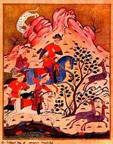

  
[Intangible Textual Heritage](../../index)  [Asia](../index) 
[Myths/Legends](../../neu/index) 

------------------------------------------------------------------------

[Buy this Book at
Amazon.com](https://www.amazon.com/exec/obidos/ASIN/0947593438/internetsacredte)

------------------------------------------------------------------------

<table width="75%">
<colgroup>
<col style="width: 50%" />
<col style="width: 50%" />
</colgroup>
<tbody>
<tr class="odd">
<td width="50%" data-valign="TOP"></td>
<td width="50%" data-valign="CENTER"><h1 id="the-man-in-the-panthers-skin" data-align="CENTER">The Man in the Panther's Skin</h1>
<h2 id="by-shotha-rusthaveli" data-align="CENTER">by Shot'ha Rust'haveli</h2>
<h3 id="translated-by-marjory-scott-wardrop" data-align="CENTER">translated by Marjory Scott Wardrop</h3>
<h4 id="section" data-align="CENTER">[1912]</h4></td>
</tr>
</tbody>
</table>

------------------------------------------------------------------------

[Contents](#contents)    [Start Reading](mps00)

------------------------------------------------------------------------

|                                                                                                                           |
|---------------------------------------------------------------------------------------------------------------------------|
|  |

Georgia is a central Asian region which is situated in the mountains
between the Black and Caspian seas. This, the 'Man in the Panther Skin'
(also known as 'the Knight in the Panther Skin') is a 12th century
medieval epic poem. It is considered one of the masterpieces of Georgian
literature, and has been called the Georgian national epic. The author,
Prince Shota Rustaveli, was a noble in the court of Queen Tamar, and
served as her treasurer. He was also a painter who created frescoes in
the Georgian monastery of the Holy Cross in Jerusalem. We do not know
specific birth and death dates for Rustaveli. The poem was first printed
in 1712 in Tblisi. This translation is, thankfully, into clearly written
prose, unlike some of the awful 19th century attempts to versify
translated poetry. Wardrop's translation, which she modestly called an
attempt, makes enjoyable reading.

The poem, strangely enough, is not set in Georgia, but in fictionalized
versions of Arabia, Persia, India and fairy-tale lands set in the
environs of the Indian Ocean. (However the characters are at one point
described as speaking fluent Georgian!) There are two chief male
protagonists, Avt'handil and Tariel. Tariel, the eponymous 'Knight in
the Panther's Skin' is made heir to all India, but tragically falls in
love with his adoptive sister, Nestan. Driven mad by this love, he ends
up killing the man she is to marry and fleeing India. Nestan is also
spirited away to parts unknown. The search for Nestan, described as
radiant as the sun, so beautiful that everyone she meets falls in love
with her, is the central thread of the story. Avt'handil, the suitor of
the Queen of Arabia T'hinat'hin, sees Tariel wandering disconsolate one
day and goes in quest of this mysterious knight. Eventually they meet up
and after a long quest end up finding Nestan. Nestan and Tariel marry,
and Avt'handil marries T'hinat'hin. I have appended a short [synopis of
the story](synopsis) to this etext, based on my reading notes.

The narrative and characterizations are remarkable for a work of this
period. Rustaveli had great psychological insight, providing backstory
and motivations for his cast. The women characters are well written and
memorable (particularly the merchant P'hatman). Rustaveli's female
characters are not just props as in some of the medieval romances.
Emotional relationships between characters of the same sex (both male
and female), like the Biblical David and Jonathan, are portrayed as
tender and sensual, shedding light on how our conventional sex roles are
modern cultural constructs.

For technical reasons, I had to omit most of the footnotes from the body
of the text. However, I did type in some of these footnotes by hand
where they clear up obscure passages. Since a facsimile of this
particular translation is in print and the footnotes are mostly of
interest to scholars, this should not present a problem.

John Bruno Hare, June 1st, 2006.

------------------------------------------------------------------------

 [Title Page](mps00)  
[Preface](mps01)  
[Contents](mps02)  
[Introductory Quatrains](mps03)  
[I. Story of Rostevan, King of the Arabians](mps04)  
[II. How The King of the Arabians Saw the Knight Clad in the Panther's
Skin](mps05)  
[III. Avt’handil's Letter to His Vassals](mps06)  
[IV. Avt’handil Sets Forth in Quest of Tariel](mps07)  
[V. The Telling of His Tale by Tariel When He First Told It to
Avt’handil](mps08)  
[VI. Tariel Tells the Tale of His Falling in Love When He First Fell in
Love](mps09)  
[VII. First Letter Written by Nestan-Daredjan to Her Lover](mps10)  
[VIII. First Letter Written by Tariel to His Beloved](mps11)  
[IX. Tariel Writes a Letter and Sends a Man to the Khatavians](mps12)  
[X. The Letter Written by the King of the Khatavians in Answer to
Tariel](mps13)  
[XI. Letter of Tariel to the King of the Indians When He Triumphed Over
the Khatavians](mps14)  
[XII. Letter of Nestan-Daredjan Written to Her Beloved](mps15)  
[VIII. Tariel's Letter in Answer to His Beloved](mps16)  
[XIV. Tariel Hears Tidings of the Loss of Nestan-Daredjan](mps17)  
[XV. The Story of Nuradin P’hridon When Tariel Met Him on the
Seashore](mps18)  
[XVI. Tariel's Aid to P’hridon, and Their Victory Over Their
Foes](mps19)  
[XVII. P’hridon Tells Tariel Tidings of Nestan-Daredjan](mps20)  
[XVIII. The Story of Avt’handil's Return to Arabia After He Had Found
and Parted From Tariel](mps21)  
[XIX. Avt’handil's Request to King Rostevan, and the Vizier's Discourse
and Entreaty](mps22)  
[XX. Avt’handil's Discourse With Shermadin When He Stole Away](mps23)  
[XXI. The Testament of Avt’handil to King Rostevan When He Stole
Away](mps24)  
[XXII. Avt’handil's Prayer in the Mosque, and His Flight](mps25)  
[XXIII. King Rostevan Hears of Avt’handil's Secret Flight](mps26)  
[XXIV. Avt’handil's Second Departure and Meeting with Tariel](mps27)  
[XXV. Here is the Going of Tariel and Avt’handil to the Cave, and Their
Seeing of Asmat’h](mps28)  
[XXVI. Of the Going of Avt’handil to P’hridon's When He Met Him at
Mulghazanzar](mps29)  
[XXVII. Of Avt’handil's Going to P’hridon's When He Parted From
Tariel](mps30)  
[XXVIII. Avt’handil's Departure From P’hridon to Seek
Nestan-Daredjan](mps31)  
[XXIX. The Story of Avt’handil's Arrival in Gulansharo](mps32)  
[XXX. Avt’handil's Arrival at P’hatman's; Her Reception of Him and Her
Joy](mps33)  
[XXXI. P’hatman Becomes Enamoured of Avt’handil; Writes Him a Letter and
Sends it](mps34)  
[XXXII. The Letter of Love Written by P’hatman to Avt’handil](mps35)  
[XXXIII. Avt’handil's Letter in Answer to P’hatman's](mps36)  
[XXXIV. Here is the Slaying of the Chachnagir and His Two Guards by
Avt’handil](mps37)  
[XXXV. P’hatman Tells Avt’handil the Story of Nestan-Daredjan](mps38)  
[XXXVI. The Story of the Capture of Nestan-Daredjan by the Kadjis, Told
by P’hatman to Avt’handil](mps39)  
[XXXVII. Letter Written by P’hatman to Nestan-Daredjan](mps40)  
[XXXVIII. The Letter Written by Nestan-Daredjan to P’hatman](mps41)  
[XXXIX. The Letter Written by Nestan-Daredjan to Her Beloved](mps42)  
[XL. Avt’handil's Letter to P’hridon](mps43)  
[XLI. Avt’handil's Departure From Gulansharo, and His Meeting with
Tariel](mps44)  
[XLII. Tariel and Avt’handil Go to P’hridon](mps45)  
[XLIII. The Council of P’hridon, Avt’handil and Tariel as to the Assault
on the Castle of Kadjet’hi](mps46)  
[XLIV. The Going of Tariel to the King of the Seas and to
P’hridon's](mps47)  
[XLV. The Wedding of Tariel and Nestan by P’hridon](mps48)  
[XLVI. Tariel Goes Again to the Cave and Sees the Treasure](mps49)  
[XLVII. Here is the Marriage of Avt’handil and T’hinat’hin by the King
of the Arabs](mps50)  

### Appendices

[Contents](mps51)  
[Appendix I. Translation By Professor Marr Of The Introductory
Quatrains](mps52)  
[Appendix II. Bibliographical Note](mps53)  
[Appendix III. Groups of References](mps54)  

### Synopsis

[Synopsis of The Knight in the Panther's Skin, by John B.
Hare](synopsis)  
