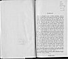

  
[Intangible Textual Heritage](../../index)  [Asia](../index) 
[Myths/Legends](../../neu/index)  [Index](index)  [Next](mps01) 

------------------------------------------------------------------------

[Buy this Book at
Amazon.com](https://www.amazon.com/exec/obidos/ASIN/0947593438/internetsacredte)

------------------------------------------------------------------------

*ORIENTAL TRANSLATION FUND*

NEW SERIES

VOL. XXI.

#### THE

# MAN IN THE PANTHER'S SKIN

##### A ROMANTIC EPIC

###### BY

## SHOT’HA RUST’HAVELI

### A CLOSE RENDERING FROM THE GEORGIAN

###### ATTEMPTED BY

### MARJORY SCOTT WARDROP

#### LONDON

#### PUBLISHED BY THE ROYAL ASIATIC SOCIETY

#### 22, ALBEMARLE STREET, W.

#### \[1912\]

NOTICE OF ATTRIBUTION  
Scanned at sacred-texs.com, May-June 2006. Proofed and formatted by John
Bruno Hare. This text is in the public domain in the United States
because it was published prior to January 1st, 1923. These files may be
used for any non-commercial purpose, provided this notice of attribution
is included intact in all copies.

[  
Click to enlarge](img/title.jpg)  
Title Page  

[  
Click to enlarge](img/verso.jpg)  
Verso  

------------------------------------------------------------------------

[Next: Preface](mps01)
