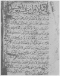
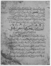

  
[Intangible Textual Heritage](../../index)  [Asia](../index) 
[Index](index)  [Previous](odpr00)  [Next](odpr02) 

------------------------------------------------------------------------

[Buy this Book at
Amazon.com](https://www.amazon.com/exec/obidos/ASIN/040450518X/internetsacredte)

------------------------------------------------------------------------

*Origins of the Druze People and Religion*, by Philip K. Hitti,
\[1924\], at Intangible Textual Heritage

------------------------------------------------------------------------

[  
Click to enlarge](img/pl01.jpg)  
PLATE I.  

 

Photostatic reproduction of the first page of Bahā’-al-Dīn's
*al-Juz’al-Awwal*, one of the most valuable Druze sacred books by the
father of Druze theology. This manuscript copy is in the Robert Garrett
collection deposited in the library of Princeton University.

[  
Click to enlarge](img/pl02.jpg)  
PLATE II.  

Photostatic reproduction of the first page of Ḥamzah's *al-Naqḍ
al-Khafi*, the most important production of the founder of the Druze
religion. This manuscript copy is in the Robert Garrett collection
deposited in the library of Princeton University.

------------------------------------------------------------------------

[Next: Foreword](odpr02)
