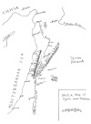

  
[Intangible Textual Heritage](../../index)  [Asia](../index) 
[Index](index)  [Previous](odpr18) 

------------------------------------------------------------------------

[Buy this Book at
Amazon.com](https://www.amazon.com/exec/obidos/ASIN/040450518X/internetsacredte)

------------------------------------------------------------------------

*Origins of the Druze People and Religion*, by Philip K. Hitti,
\[1924\], at Intangible Textual Heritage

------------------------------------------------------------------------

p. 81

### SKETCH MAP OF SYRIA AND PALESTINE (ca. 1924)

[  
Click to enlarge](img/map.jpg)  
Sketch Map of Syria and Palestine (ca. 1924)  

 

 

 
