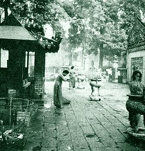

  
[Intangible Textual Heritage](../../index)  [Asia](../index) 

------------------------------------------------------------------------

<table width="75%">
<colgroup>
<col style="width: 50%" />
<col style="width: 50%" />
</colgroup>
<tbody>
<tr class="odd">
<td width="50%" data-valign="TOP"></td>
<td width="50%" data-valign="CENTER"><h1 id="the-religions-of-south-vietnam-in-faith-and-fact" data-align="CENTER">The Religions of South Vietnam in Faith and Fact</h1>
<h4 id="us-department-of-the-navy-bureau-of-naval-personnel-chaplains-division" data-align="CENTER">US Department of the Navy, Bureau of Naval Personnel, Chaplains Division</h4>
<h5 id="navpers-15991" data-align="CENTER">NAVPERS 15991</h5>
<h4 id="section" data-align="CENTER">[1967]</h4></td>
</tr>
</tbody>
</table>

------------------------------------------------------------------------

[Contents](#contents)    [Start Reading](rsv00)

Vietnam, because of historical and geographical factors, has an
extrordinary number of different religious influences, including
Animism, Buddhism, Hinduism, Confucianism, Christianity and several
indigenous belief systems such as Cao Dai. This guidebook, published by
the US military, is a reference about this subject, compiled on the cusp
of the Vietnam war. It includes quite a bit of cultural and background
information about Vietnam, statistics about numbers of adherents, as
well as a guide to cultural sensitivity which may still be of use. This
is a valuable resource about this fascinating topic. It also implicitly
tells quite a story about the US military's attempt to win Vietnamese
'hearts and minds'.

------------------------------------------------------------------------

 [Title Page and Front Matter](rsv00)  
[Contents](rsv01)  
[Letter of transmittal](rsv02)  
[Introduction](rsv03)  
[I. Animism](rsv04)  
[II. Vietnamese Taoism](rsv05)  
[III. Confucianism in Vietnam](rsv06)  
[IV. Hinduism in Vietnam](rsv07)  
[V. Buddhism in Vietnam](rsv08)  
[VI. Islam](rsv09)  
[VII. Roman Catholicism in South Vietnam](rsv10)  
[VIII. Protestantism in South Vietnam](rsv11)  
[IX. Cao Dai](rsv12)  
[X. Phat Giao Hoa Hao](rsv13)  

### XI. Religion in Everyday Life

[A. Scenes Of Vietnamese Life](rsv14)  
[B. Religious Practices and Activities](rsv15)  
[C. Religious Discipline and Concepts Affecting Behavior](rsv16)  

### D. Examples of Religion in Everyday Life

[A Religiously Influenced Culture](rsv17)  
[Vietnamese Village--Homes](rsv18)  
[Vietnamese Village Dinh, Market, School](rsv19)  
[Women](rsv20)  
[Marriage](rsv21)  
[Choosing Life's Partner](rsv22)  
[Consulting the Astrologers](rsv23)  
[Effects of Stars on Choosing Marriage Partners](rsv24)  
[The Vietnamese and Children](rsv25)  
[Rearing Vietnamese Children](rsv26)  
[Legend of Quan-Am](rsv27)  
[Fragrant Incense of Aloes Wood](rsv28)  
[Joss Sticks](rsv29)  
[Use of Votive Paper as an Act of Worship in Vietnamese
Temples](rsv30)  
[The Lotus](rsv31)  
[The Meaning and Importance of TET](rsv32)  
[The Dragon in Vietnam](rsv33)  
[Veneration of Vietnamese Benefactors](rsv34)  
[Ancestor Worship](rsv35)  
[Ancestor Worship--Worship of Nham-Dien](rsv36)  
[Vietnamese Self-Sacrifice Customs](rsv37)  

 

[Selected Bibliography](rsv38)  
[Appendix A. Foreign Voluntary Agencies Operating in Vietnam with
Resident Representative](rsv39)  
[Appendix B. Guidelines for Understanding](rsv40)  
