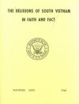
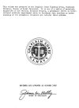

  
[Intangible Textual Heritage](../../index)  [Asia](../index) 
[Index](index)  [Next](rsv01) 

------------------------------------------------------------------------

*The Religions of South Vietnam in Faith and Fact*, US Navy, Bureau of
Naval Personnel, Chaplains Division \[1967\], at Intangible Textual
Heritage

------------------------------------------------------------------------

[  
Click to enlarge](img/cover.jpg)  
Front Cover  

# THE RELIGIONS OF SOUTH VIETNAM IN FAITH AND FACT

#### US NAVY, BUREAU OF NAVAL PERSONNEL, CHAPLAINS DIVISION

#### NAVPERS 15991 1967

Scanned at Intangible Textual Heritage, October, 2006. Proofed and
formatted by John Bruno Hare. This text is in the public domain in the
United States because it is a US Government publication. These files may
be used for any non-commercial purpose, provided this notice of
attribution is left intact in all copies.

[  
Click to enlarge](img/verso.jpg)  
Verso  

This volume was prepared by the Chaplain Corps Planning Group, Chaplains
Division, Bureau of Naval Personnel. It is one of a series of materials
supportive of the Personal Response Project, a systematic effort in
intercultural attitude improvement which in Southeast Asia involves an
understanding of the indigenous religions and cultural value systems.

REVIEWED AND APPROVED 25 OCTOBER 1968

signed, James W. Kelly

CHIEF OF CHAPLAINS

p. i

THE RELIGIONS OF SOUTH VIETNAM  
IN FAITH AND FACT

[  
Click to enlarge](img/_00100.jpg)  
MAIN GATE OF MARSHAL LE-VAN-DUYET'S TEMPLE, SAIGON, VIETNAM  

------------------------------------------------------------------------

[Next: Contents](rsv01)
