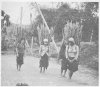
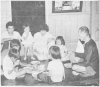
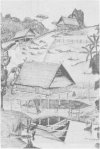
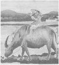
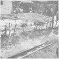
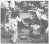
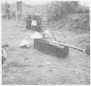
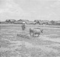
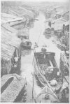
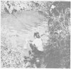

  
[Intangible Textual Heritage](../../index)  [Asia](../index) 
[Index](index)  [Previous](rsv13)  [Next](rsv15) 

------------------------------------------------------------------------

*The Religions of South Vietnam in Faith and Fact*, US Navy, Bureau of
Naval Personnel, Chaplains Division \[1967\], at Intangible Textual
Heritage

------------------------------------------------------------------------

p. 59

### XI. RELIGION IN EVERYDAY LIFE

#### A. SCENES OF VIETNAMESE LIFE

[  
Click to enlarge](img/05900.jpg)  
A tribesman of the hills and mountains of South Vietnam.  

For many Vietnamese, the village encompasses their lives. They are born,
grow up, marry, have children, grow old, if fortunate, and die, often
without ever having left their village environment. And some 80% of the
Vietnamese are villagers.

Since religious beliefs affect every phase of Vietnamese life, and
because these are quite different from Judeo-Christian beliefs, the
resulting value systems determine patterns of thinking, habits, customs,
and taboos quite different from those found in America. Because
religious beliefs so richly color and tint almost every Vietnamese
action or thought, it is imperative that Americans understand these if
we are to live and help others to live through shared understanding and
partnership.

The use of religious concepts in everyday life is more evident among the
Vietnamese than among Americans. Americans tend to compartmentalize
religion into a limited part of the week-in many cases to less than one
hour per week. Most of the Vietnamese religious beliefs affecting daily
life are so complex that they do not easily lend themselves to precise
statements, definitions, beliefs, or creeds which can readily be
understood by Americans.

[  
Click to enlarge](img/05901.jpg)  
Tribespeople often store grain in small houses to protect it from fire
or rats  

p. 60

<table data-border="0">
<colgroup>
<col style="width: 50%" />
<col style="width: 50%" />
</colgroup>
<tbody>
<tr class="odd">
<td data-valign="top" width="305">

<a href="img/06000.jpg"> 
Click to enlarge</a> 
Tribeswomen share the labor 

</td>
<td data-valign="top" width="305">

<a href="img/06001.jpg"> 
Click to enlarge</a> 
The Vietnamese wooden bed also serves as the family table at meal time 

</td>
</tr>
<tr class="even">
<td data-valign="top" width="305">

<a href="img/06002.jpg"> 
Click to enlarge</a> 
A Montagnard Village 

</td>
<td data-valign="top" width="305">

<a href="img/06003.jpg"> 
Click to enlarge</a> 
Water buffalo are an important part of the Vietnamese economy 

</td>
</tr>
</tbody>
</table>

 

p. 61

 

<table data-border="0">
<colgroup>
<col style="width: 33%" />
<col style="width: 33%" />
<col style="width: 33%" />
</colgroup>
<tbody>
<tr class="odd">
<td data-valign="top" width="218">

<a href="img/06100.jpg"> 
Click to enlarge</a> 
The commercial drying of joss sticks 

</td>
<td data-valign="top" width="218">

<a href="img/06101.jpg"> 
Click to enlarge</a> 
Mobile ''Hot Shoppes'' are everyday sights in Vietnamese towns and cities 

</td>
<td data-valign="top" width="218">

<a href="img/06102.jpg"> 
Click to enlarge</a> 
The coffin of a Vietnamese peasant brought to the burial site by two men using a bamboo pole 

</td>
</tr>
</tbody>
</table>

 

p. 62

 

<table data-border="0">
<colgroup>
<col style="width: 33%" />
<col style="width: 33%" />
<col style="width: 33%" />
</colgroup>
<tbody>
<tr class="odd">
<td data-valign="top" width="218">

<a href="img/06200.jpg"> 
Click to enlarge</a> 
Tilling the fields for the planting of rice 

</td>
<td data-valign="top" width="218">

<a href="img/06201.jpg"> 
Click to enlarge</a> 
Scene along a canal in Saigon 

</td>
<td data-valign="top" width="218">

<a href="img/06202.jpg"> 
Click to enlarge</a> 
Vietnamese women washing their family's clothing 

</td>
</tr>
</tbody>
</table>

 

------------------------------------------------------------------------

[Next: B. Religious Practices and Activities](rsv15)
