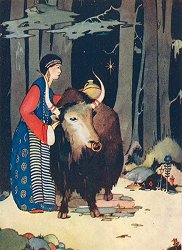

  
[Intangible Textual Heritage](../../index)  [Asia](../index) 

------------------------------------------------------------------------

[Buy this Book at
Amazon.com](https://www.amazon.com/exec/obidos/ASIN/B0025VKZPM/internetsacredte)

------------------------------------------------------------------------

<table width="75%">
<colgroup>
<col style="width: 50%" />
<col style="width: 50%" />
</colgroup>
<tbody>
<tr class="odd">
<td width="50%" data-valign="TOP"></td>
<td width="50%" data-valign="CENTER"><h1 id="tibetan-folk-tales" data-align="CENTER">Tibetan Folk Tales</h1>
<h2 id="by-a.l.-shelton" data-align="CENTER">by A.L. Shelton</h2>
<h4 id="not-renewed" data-align="CENTER">[1925, not renewed]</h4></td>
</tr>
</tbody>
</table>

------------------------------------------------------------------------

[Contents](#contents)    [Start Reading](tft00)    [Page
Index](pageidx)    [Text \[Zipped\]](tft.txt.gz)

|                                                                                                                           |
|---------------------------------------------------------------------------------------------------------------------------|
|  |

------------------------------------------------------------------------

[Title Page](tft00)  
[Preface](tft01)  
[Contents](tft02)  
[Illustrations](tft03)  
[One: The Wise Bat](tft04)  
[Two: The Tiger and the Frog](tft05)  
[Three: The Cony Who Got into Bad Company](tft06)  
[Four: The Story of the Donkey and the Rock (A Black Tent
Story)](tft07)  
[Five: Story of the Foolish Head-Man](tft08)  
[Six: How the Fox Fell a Victim to His Own Deceit](tft09)  
[Seven: The Ingratitude of Man](tft10)  
[Eight: Covetousness](tft11)  
[Nine: The Wise Carpenter](tft12)  
[Ten: The Story of Drashup and the Goddesses](tft13)  
[Eleven: How the Louse Got the Black Streak Down His Back](tft14)  
[Twelve: The Man and the Ghost](tft15)  
[Thirteen: The Wicked Stepmother](tft16)  
[Fourteen: The Story of the Two Devils](tft17)  
[Fifteen: The Wise Woman](tft18)  
[Sixteen: The Three Friends](tft19)  
[Seventeen: The Rabbit and Bumblebee Bet](tft20)  
[Eighteen: How the Rabbit Killed the Lion](tft21)  
[Nineteen: How the King Lost His Great Jewel](tft22)  
[Twenty: The Story of the Three Hunters](tft23)  
[Twenty-One: The Hunter and the Unicorn](tft24)  
[Twenty-Two: The Decision of the Official as to Who Owned the One
Hundred Ounces of Silver](tft25)  
[Twenty-Three: Story of the Prince's Friend](tft26)  
[Twenty-Four: How the Raven Saved the Hunter](tft27)  
[Twenty-Five: The Two Thieves. (A Black Tent Story)](tft28)  
[Twenty-Six: The Golden Squash. (A Black Tent Story)](tft29)  
[Twenty-Seven: The Story of the Bald-Headed Man](tft30)  
[Twenty-Eight: The Man with Five Friends with Different Colored Eyes (A
Black Tent Story)](tft31)  
[Twenty-Nine: The Story of the Violinist](tft32)  
[Thirty: How the Sacred Duck Got His Yellow Breast](tft33)  
[Thirty-One: The Two Little Cats](tft34)  
[Thirty-Two: Story of a Juggler's Tricks](tft35)  
[Thirty-Three: How the Wolf, the Fox and the Rabbit Committed a
Crime](tft36)  
[Thirty-Four: The Pewter Vase](tft37)  
[Thirty-Five: A Rabbit Story](tft38)  
[Thirty-Six: The Story of a Juggler](tft39)  
[Thirty-Seven: The Story of a Turquoise](tft40)  
[Thirty-Eight: A Wise Idiot](tft41)  
[Thirty-Nine: The Man and the Monkeys](tft42)  
[Forty: The Story of the Tree of Life](tft43)  
[Forty-One: The Story of the Man with the Goitre](tft44)  
[Forty-Two: The Story of the Beggar](tft45)  
[Forty-Three: The Wily Poor Man](tft46)  
[Forty-Four: The Quarrel of the Five Friends](tft47)  
[Forty-Five: The Frugal Woman](tft48)  
[Forty-Six: The Story of Yugpacan, the Brahman. From Jaschke](tft49)  
[Forty-Seven: The Story of Da Jang. From Amundsen](tft50)  
[Forty-Eight: Like unto Solomon. From Jaschke](tft51)  
[Forty-Nine: Tibetan Song](tft52)  
[Tibetan Music](tft53)  
