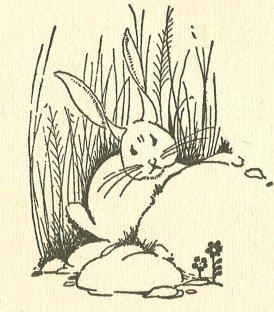

  
[Intangible Textual Heritage](../../index)  [Asia](../index) 
[Index](index)  [Next](tft01) 

------------------------------------------------------------------------

[Buy this Book at
Amazon.com](https://www.amazon.com/exec/obidos/ASIN/B0025VKZPM/internetsacredte)

------------------------------------------------------------------------

  
*Tibetan Folk Tales*, by A.L. Shelton, \[1925\], at Intangible Textual
Heritage

------------------------------------------------------------------------

p. iii

# TIBETAN FOLK TALES

###### TRANSLATED BY

## A. L. SHELTON, M.D.

###### (*Shelton of Tibet*)

##### EDITED WITH

##### AN INTRODUCTION BY

### FLORA BEAL SHELTON

###### ILLUSTRATED BY

### MILDRED BRYANT

 

#### ST. LOUIS, MISSOURI

#### UNITED CHRISTIAN MISSIONARY SOCIETY

#### \[1925\]

Scanned, proofed and formatted at Intangible Textual Heritage, July
2005, by John Bruno Hare. This text is in the public domain in the
United States because it was not renewed in a timely fashion at the US
Copyright Office as required by law at the time.

  [  
Click to enlarge](img/front.jpg)  
THE SEVEN SONS WHEN PLAYING IN THE FOREST FOUND A BEAUTIFUL GIRL, WHO
WAS HERDING A YAK.     *Story of the Two Devils*.  

  [  
Click to enlarge](img/cover.jpg)  
Front Cover and Spine  

  [  
Click to enlarge](img/title.jpg)  
Title Page  

p. iv

 
[  
Click to enlarge](img/verso.jpg)  
Verso  

p. v

<table data-border="0" width="28%">
<colgroup>
<col style="width: 100%" />
</colgroup>
<tbody>
<tr class="odd">
<td data-valign="top" width="233">
DEDICATED TO MY TWO LITTLE GIRLS

DORRIS AND DOROTHY

WHO HAVE MADE SUNSHINE IN THE LAND WHERE THESE TALES WERE GLEANED
</td>
</tr>
</tbody>
</table>

------------------------------------------------------------------------

[Next: Preface](tft01)
