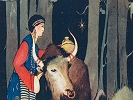

  
[Intangible Textual Heritage](../../index)  [Asia](../index) 
[Index](index)  [Previous](tft12)  [Next](tft14) 

------------------------------------------------------------------------

[Buy this Book at
Amazon.com](https://www.amazon.com/exec/obidos/ASIN/B0025VKZPM/internetsacredte)

------------------------------------------------------------------------

  
*Tibetan Folk Tales*, by A.L. Shelton, \[1925\], at Intangible Textual
Heritage

------------------------------------------------------------------------

p. 50

#### TEN

## The Story of Drashup and the Goddesses

In birth and death there is no fear, and in fear
there is no doubt.  
                               *Tibetan Proverb*.

ONCE, long ago, in this land of mystery, where men lived and loved and
wondered and died, lived a man named Drashup, who was all alone in the
world. All his kin were dead. He had no wife, no children, and he was
very, very poor. One day he wandered away upon the mountain and lay down
and went to sleep, grieving over his troubles.

Just at this time, in a small village far below at the foot of the
mountain, a little girl was born. In the tree under which the man was
lying asleep dwelt a goddess. All around him in the wood dwelt a number
of goddesses, and it was their duty to cast lots and foretell this new
little lady's future: who her husband would be, when she was to be
married, if she would live to be old, and the day of her death. The
goddess who lived in the tree under which Drashup was sleeping invited
all the others to come to her tree, as she had a guest asleep near her
dwelling. So they came and began to forecast the lady's future:--She
would

p. 51

 

  [  
Click to enlarge](img/05100.jpg)  
ONE DAY HE WANDERED AWAY UPON THE MOUNTAIN AND LAY DOWN AND WENT TO
SLEEP, GRIEVING OVER HIS TROUBLES.  

 

p. 52 p. 53

be only middle-aged when she would die from eating the shoulder of a
sheep and the man asleep under the tree was to be her husband.

The man was not very sound asleep and overheard all these predictions,
which made him very angry, and he said, "Such talk! It is all
foolishness. I'm a middle-aged man now and the very idea that I'm to be
the husband of a baby just born."

But nevertheless he started out to hunt this child. He traveled and
traveled up and down the country, and finally found in the village at
the foot of the mountain, a little girl who had been born on that very
day, and he knew that it was she about whom they had been speaking. So
he slipped quietly up by the side of the house, picked up a small ax
used to chop firewood, slipped around where the girl was and struck her.
Believing he had killed her he ran away into a far country; but she
recovered and grew to womanhood.

By and by the girl's parents died and she was left an orphan with
nothing at all, so she left her home and went traveling. By chance she
went to the city where Drashup had taken up his residence. They met one
day and instantly fell in love. As he was talking to her one time, he
saw a big scar on her head and asked her how it came to be there.

"My parents told me that one time a man named Drashup took an ax and
tried to kill me, in the village where I was born," she told him.

p. 54

When Drashup heard this, he knew there was no use to try to get away
from the words of the future foretold by the goddesses of the mountain,
but he didn't tell her how she was to die, though he remembered that,
also.

They were married and lived happily, though he was so much older than
she. But he was always very careful to take the shoulder of the mutton
for himself and see that she never got any of it. She, however, wondered
why he always wanted the shoulder for himself, and one day when he was
absent from home on business she killed a sheep and said, "As Drashup
isn't here I'll eat the shoulder myself." After eating it she remarked,
"It was awfully good, no wonder he always wanted it himself." Then
suddenly she became violently ill and Drashup found her dead when he
came home, and knew for sure that never could any one get away from the
decision of the goddesses.

------------------------------------------------------------------------

[Next: Eleven: How the Louse Got the Black Streak Down His Back](tft14)
