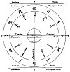

  
[Intangible Textual Heritage](../../index)  [Sky Lore](../index) 
[Index](index)  [Previous](aia03)  [Next](aia05) 

------------------------------------------------------------------------

p. 13

# INTRODUCTION TO ASTROLOGY.

### CHAPTER I.

THERE are in the heavens several bodies which appear to shed their light
directly on this Earth; and also some others which, having no light of
themselves, serve to reflect that of the Sun, and thereby become visible
to our organs of sight. The former are termed *Fixed Stars*, because
they appear to retain the same situation, or to be fixed in the same
place; but the latter, being observed to wander, are termed Planets. The
number and distance of the former are so extensive, that I shall take no
further notice of them here, than to observe, that they are not much
used in that portion of Astrology which is denominated *Horary*, and
that those persons who desire to make use of them in nativities, will
find their right ascensions and declinations given with great accuracy
in the Nautical Almanack for each year. In the Appendix to this work, I
shall give rules, to ascertain their latitude and longitude by,
trigonometry, for the benefit of such persons as may be curious to make
experiments as to their influence; though I do not, in general, pay much
attention to them when judging a nativity.

*Of the Planets*.

These are ♅ Herschel, ♄ Saturn, ♃ Jupiter, ♂ Mars.

p. 14

\[paragraph continues\] ☉ Sol, the Sun, [1](#fn_3) ♀ Venus, ☿ Mercury, and ☽ Luna, Moon. These
characters have been always in use, and may, (with the exception of ♅)
be traced to the remotest antiquity, and their origin found among the
hieroglyphics of Egypt. But as the object of this work is practical
utility, no more need be said on the subject.

*The Signs of the Zodiac*.

They are twelve, each containing 30 degrees, thus making 360 degrees,
into which every great circle is divided. The first six are,

*Northern Signs*.

♈ Aries, ♉ Taurus, ♊ Gemini, ♋ Cancer, ♌ Leo, ♍ Virgo.

*Southern Signs*.

♎ Libra, ♏ Scorpio, ♐ Sagittary, ♑ Capricorn, ♒ Aquarius, ♓ Pisces.

The first sign, ♈, commences the zodiac, its beginning being that spot
in the heavens where the Sun is when crossing the equator in spring; and
the latter sign, ♓, finishes the circle of the zodiac, the latter end of
it being that spot in the heavens where the Sun is when he has gone his
round, and is again about to enter ♈.

By referring to the annexed diagram, the student will perceive, that
when the Sun enters ♈ (about the 21st of March) he proceeds northward,
and *increases in declination* until he reaches the tropic of ♋ Cancer
(about the 21st of June), when he speedily begins to return to the
south; and when he reaches ♎, he again crosses the equator (about the
23d of September), where, having no declination, he causes equal

p. 15

day and night all over the world. He then *declines away to the south*;
shortening our days in the northern hemisphere, until he reaches the
southern tropic ♑, Capricorn; at length he returns towards the equator,
and crosses it by entering the sign ♈ (about the 21st of March), where
again he has no declination, and gives equal days and nights.

[  
Click to enlarge](img/01500.jpg)  
Diagram of the Sun's Motion in the Zodiac  

EXPLANATION.--The space between the two outer circles may be considered
as the line of the Sun's motion; and than

p. 16

the sign opposite the name of each month will shew where the Sun is
about the 21st of each month. The globe in the centre may be taken for
the Earth, the northern parts of which receive the greater portion of
the Sun's light in summer, and the southern parts in winter.

These signs are divided into,

|                       |                  |
|-----------------------|------------------|
| *Northern Signs*      | ♈, ♉, ♊, ♋, ♌, ♍ |
| *Southern Signs*      | ♎, ♏, ♐, ♑, ♒, ♓ |
| *Tropical Signs*      | ♋, and ♑         |
| *Equinoctial Signs*   | ♈, and ♎         |
| *Double-bodied Signs* | ♊, ♍, ♐, ♓       |

They are again divided into

|            |             |
|------------|-------------|
| *Moveable* | ♈, ♋, ♎, ♑  |
| *Common*   | ♊, ♍, ♐, ♓  |
| *Fixed*    | ♉, ♌, vi, ♒ |

Also into

|          |          |
|----------|----------|
| *Fiery*  | ♈, ♌, ♐. |
| *Earthy* | ♉, ♍, ♑. |
| *Airy*   | ♊, ♎, ♒. |
| *Watery* | ♋, ♏, ♓. |

The student must become well acquainted with the above particulars; but
especially so with the northern and southern signs, the former being
*opposite* to the latter. By attending to this, he will readily come to
understand the figure of the heavens, and the relative situations of the
planets.

N.B. The moveable, common, and fixed signs are always in *square* aspect
to each other, three signs apart; and the fiery, earthy, airy, and
watery signs are always in *trine* aspect to each other, four signs
apart.

### THE DRAGON'S HEAD AND TAIL

The Moon's north node is known by the character ☊,

p. 17

termed the Dragon's Head; and her south node by this ☋, termed the
Dragon's Tail. The former of these in horary questions denotes good, and
is considered of the character of ♃. and increases the good qualities of
a benefic, with which it may be found; and diminishes the evil of a
malefic planet. The latter is of the nature of ♄, and does the reverse.
In nativities these characters have no avail, and are not to be
considered, except with regard to the Moon, who is found to produce good
or evil when she reaches them by direction. [1](#fn_4)

### THE PART OF FORTUNE.

This is that spot in the heavens which is equally distant from the
degree ascending that the Moon is from the Sun. It is found by the
following rule:--

*To find the* (⊕) *Part of Fortune in a Nativity*.

Add 90° to the right ascension of the meridian, and it will give the
oblique ascension of the ascendant. From the oblique ascension of the
ascendant subtract the oblique ascension of the Sun (having first added
360° to the former, if necessary); to the remainder add the right
ascension of the Moon: the sum will be the right ascension of ⊕.

The ⊕ is always *under* the horizon *before* the full Moon, and *above*
the horizon *after* the full Moon. Having found its right ascension,
take it from that of the meridian above or below the earth, according as
it may be situated; or, take that of the meridian from it, and the sum
or difference will shew the distance of ⊕ from the cusp of the 10th or
4th house.

p. 18

|              |                                |            |          |           |          |
|--------------|--------------------------------|------------|----------|-----------|----------|
| *Example*:-- | A. R. of midheaven             | 221        | °        | 5         | '        |
|              | Add thereto                    | <u>90</u>  | <u> </u> | <u>0</u>  | <u> </u> |
|              | Oblique asc. of the ascendant  | 311        |          | 5         |          |
|              | Subtract oblique asc. of ⊕     | <u>17</u>  | <u> </u> | <u>34</u> | <u> </u> |
|              |                                | 293        |          | 31        |          |
|              | Add right ascension of the ☽   | <u>345</u> | <u> </u> | <u>34</u> | <u> </u> |
|              |                                | 639        |          | 5         |          |
|              | Take away                      | <u>360</u> | <u> </u> | <u>0</u>  | <u> </u> |
|              | It leaves right ascension of ⊕ | 279        |          | 5         |          |

Then, as the birth took place after full Moon, and the ⊕ will be above
the Earth, find the difference of right ascension between it and the
meridian above the Earth.

|       |                                   |            |          |          |          |
|-------|-----------------------------------|------------|----------|----------|----------|
| Thus: | Right ascension of ⊕              | 279        | °        | 5        | '        |
|       | Right ascension of the midheaven  | <u>221</u> | <u> </u> | <u>5</u> | <u> </u> |
|       | Distance of ⊕ from the 10th house | <u>58</u>  | <u> </u> | <u>0</u> | <u> </u> |

If the ⊕ be in the same hemisphere as the ☽; that is, if both be above
or below the Earth, it will have the semi-arc of the ☽; but if
otherwise, it will have the opposite semi-arc; which may be found by
taking the ☽'s from 180°. In this nativity (which is that of the Duke of
Wellington) the semi-arc of the Moon is 90° 57', which taken from 180°
leaves the semi-arc of ⊕ 89° 3', two-thirds of which are 59° 22'; and it
appears that ⊕ is just 1° 22' outside the cusp of the 12th house. [1](#fn_5)

The ⊕ has no influence on the *health* or *life* of the native;

p. 19

but it influences the pecuniary affairs very powerfully, and also, in
some degree, the profession or employment. [1](#fn_6)

*To find the Place of* ⊕ *an the Figure of a Horary Question*.

In horary astrology ⊕ is merely a symbol, and has much to do with all
questions regarding property, loss or gain, &c. In this case it is found
by a more simple rule, as follows:

Add together the longitude of the ascendant and longitude of the ☽, from
which subtract the longitude of the ☉: the remainder will be the
longitude of ⊕.

Example:--Where was the ⊕ at 3h. 20m. P.M. 28th of December, 1644? [2](#fn_7)

|                                      |           |           |           |
|--------------------------------------|-----------|-----------|-----------|
|                                      | Signs     | deg.      | min.      |
| The Ascendant was ♋ 11° 33, or       | 3         | 11        | 33        |
| The ☽ was in ♉, 16° 49', or          | <u>1</u>  | <u>16</u> | <u>49</u> |
|                                      | 4         | 28        | 22        |
| For subtraction add                  | <u>12</u> | <u>0</u>  | <u>0</u>  |
|                                      | 16        | 28        | 22        |
| The ⊕ in ♑, 17° 54, or               | <u>9</u>  | <u>17</u> | <u>54</u> |
| Place of in the figure or ♏ 10° 28'. | 72        | 10        | 8         |

------------------------------------------------------------------------

### Footnotes

[14:1](aia04.htm#fr_3) The Sun and Moon are
considered as planets in all astrological matters.

[17:1](aia04.htm#fr_4) These nodes are the points
in the ecliptic where the Moon crosses from north into south latitude,
or the reverse, which occurs twice each month.

[18:1](aia04.htm#fr_5) This is found by taking
its distance from the 10th 5E° 0' from \#\#\# of its semi-arc 59° 22 .

[19:1](aia04.htm#fr_6) In proof of this, it is
evident that in the Duke's nativity ☽ came to ☌ of ⊕ in November 1834,
when he was appointed to the ministry. Thus ⊕ is 58° from the meridian,
and ☽ 124° 29'; the difference is 66° 29'; which arc of direction, added
to the right ascension of ☉ at his birth 39° 21', gives 105° 50', the
right asc. of ♋ 14° 34'. The ☉ arrived at this point at 1 P.M. 6th July
1769, or 65 days 13 hours after birth, which, the Placidian measure of a
year for a day, gives 65 years 61 months, the Duke's age when the event
occurred.--N.B. The ascendant came to ☌ of ☉ at the same time, which, by
referring to our author's rules for the effects of directions, will be
seen to cause such eminent preferment. The semi-arc of ☉ is 68° 13', ☉
dist from 4th house 1° 44'; the difference is 66° 29', the arc of
direction.

[19:2](aia04.htm#fr_7) See the figure--Question.
"A ship at sea, if lost?"

------------------------------------------------------------------------

[Next: Chapter II.](aia05)
