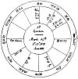

  
[Intangible Textual Heritage](../../index)  [Sky Lore](../index) 
[Index](index)  [Previous](aia24)  [Next](aia26) 

------------------------------------------------------------------------

p. 83

# THE RESOLUTION OF ALL MANNER OF QUESTIONS AND DEMANDS.

### CHAPTER XXII.

### QUESTIONS CONCERNING THE FIRST HOUSE. IF THE QUERENT BE LIKELY TO LIVE LONG--YEA OR NOT?

*Signs of Health and long Life*.

CONSIDER whether the sign ascending, the lord thereof, and ☽, be free
from affliction; viz. combustion or ☌, ☐ or of ☍ the lords of the 8th,
12th, 6th, or 4th houses; whether they be direct, strong in dignities,
swift in motion, angular, especially in the 1st, or 10th houses; or if
in the 11th or 9th, and in good aspect with ♃, or ♀, or ☉, in the terms
of ♃ or ♀: these are arguments of health and long life; and the
contrary, viz. the asc. ☽, or lord of the 1st, in bad houses, and
afflicted, shew mischief at hand.

If the lord of the ascendant be under the Sun's beams, or going to
combustion, which is worse than when he is leaving ☉; or ☽ cadent and
unfortunate, by being afflicted by those planets having rule in the 8th,
or 6th; or ♄, ♂ or ☋ in the ascendant or 7th house peregrine, or in
their detriments or retrograde, judge that the querent will not be long
lived, but is near some danger or misfortune, according to the quality
of the significators, and of the houses those planets are lord of, which
afflict the ☽, &c.

p. 84

*The Time when any of those Accidents shall happen*.

If the lord of the ascendant be going to ☌, &c. of ☉, of lords of the
8th, or 4th, see how many degrees he is distant, and in what sign either
of them are; and for each degree allow one week in a moveable sign, one
month in a common sign, and one year in a fixed sign; this is only for
example; for the measure of time must be limited according to the other
significators concurring in judgment herein.

*Secondly*.--Consider also how many degrees ☽ is from any infortune, or
the lords of the 6th or 8th, according to the signs and houses in which
they are found, and their nature and quality.

*Thirdly*.--If there be an infortune in the ascendant, see how many
degrees the cusp of the 1st house wants of the place of the evil planet;
or, if he be in the 7th house, how far it is from the cusp of that
house, and compute the time of death, sickness, or misfortune, by the
degrees, as they may be in fixed, common, or moveable signs.

If the lord of the ascendant be most afflicted by the lord of the 6th,
and in the 6th, or come to combustion in the 6th, the querent will have
very many and tedious sicknesses, which will scarce leave him till his
death. This will be more certain if the lords of the ascendant, 8th
house, and ☽, be all placed in the 6th.

If the ☽, lord of the ascendant, or sign ascending, be most afflicted by
the lord of the 8th, or by a planet situated in the 8th, judge that the
sickness which now afflicts him, or shortly will, will end fatally, and
that death is approaching. But if the ☽ and other significators are
chiefly afflicted by the lords of other houses, judge the misfortune
from the nature of the house or houses of which the afflicting planets
are lords; and the first origin thereof from some person or

p. 85

thing belonging to that house, wherein you find the afflicting planet
posited. Judge thereby a misfortune, but not death.

If there be any fixed star, of much power, near the ☽, lord of the
ascendant or the degree ascending, or with the planet which afflicts any
of these, you may judge evil thereby, according to the nature of that
star; for which, see the chapter on Fixed Stars.

*Caution*.

Avoid rash judgments; especially of death. This should never be judged
by one single testimony, however strong. And though the lord of the
ascendant be going to combustion in the house of death, observe whether
the ☽, ♃, or ♀ (or if well aspected and strong), throw any good aspect
to the lord of the ascendant, before he come to perfect ☌ with ☉; for
then either medicine or natural strength will contradict that malignant
influence, or take off part of that misfortune. When two or more of the
rules aforesaid occur, you may be more bold; yet concerning the absolute
time of death, I have found it best to be wary. Though you may safely
judge that the querent will not be long-lived, or else subject to many
calamities; and this I know by many verified examples. This knowledge
will be useful to those who will use their reason to avoid those
casualties their nature or inclinations would run them into. [1](#fn_57)

p. 86

*To what Part is it best the Querent should direct his Affairs or where
may he live most happily*?

The 12 houses are divided into the four quarters of heaven, east, west,
north and south. From the cusp of the 1st, where the ☉ and planets rise,
to the cusp of the 10th, is the south-east quarter. The 1st, is due
east; the 12th, is about two points south of east; the middle of the
11th, is south east; the cusp of the 11th, is about two points east of
south; and the 10th, is due south. In like manner, from the 10th to the
7th house is the south-west quarter; and from the 7th to the 4th is the
north-west quarter; and, lastly, from the 4th to the ascendant is the
north-east quarter. In that quarter wherein you find ♃, ♀, ☽, or ⊕, or
most of them, direct the querent to proceed in that direction,
especially if ⊕ and ☽ be free from combustion and be strong. If ♃ or ♀
be lords of the 8th, 12th, or 6th houses, you must avoid them; and avoid
that quarter wherein the evil planets are, unless they be essentially
strong, and lords of the 1st, 2d, 10th, or 11th houses, when they may
prove friendly. [1](#fn_58)

If the querent desire to live where he may most enjoy *health*, look to
the quarter of the lord of the ascendant, or ☽; and whichever is
strongest, or casts the best aspect to the degree ascending, to that
quarter repair for health. It an increase of *wealth* be considered, see
where the lord of the 2d, the ⊕, and its dispositor, or any two of them,
be, and thither repair for that end. Of this I shall speak in other
judgments.

*What Part of* LIFE *is like to be best*?

See in what angle or quarter of heaven the fortunate and

p. 87

promising planets are; for in this way of judging we usually give to
every house five years, more or less, as the significators promise life
or death. Begin with the 12th, then the 11th, then the 10th, &c., and so
round to the ascendant. If ♃ or ♀ be in the 11th or 10th, judge the
querent to have lived happily from the 5th to the 15th year of age: if
they be in the 8th or 7th, he will or hath lived contented from fifteen
to thirty; if 21, &c. be in the 6th, 5th, or 4th, house, say that after
his middle age, from 30 to 45, he may do well; but if the benefits be in
the last quarter, his greatest happiness will be in his last days, or
after 45. If you find the significators very strong, you may add a year
to each house. Lastly, the aspects the ☽ and lord of the ascendant are
separated from show what and what manner of accidents have preceded the
question; their next application what may be next expected. If you
consider the house or houses the planets they separated from are lords
of, it acquaints you with the matter, nature, person, and quality of the
things already happened--evil if the aspects were evil, and good if they
were good. Also if you note the quality of the next aspect by
application, and the well or ill-being and position of the planets
applied to, it spews the character of the next succeeding accidents and
events, their nature, proportion, &c., and the time when they will
happen.

p. 88

[  
Click to enlarge](img/fig02.jpg)  
Fig. 2  

*An* ASTROLOGICAL JUDGMENT *concerning these Demands by the Querent*.

1\. If he were likely to live long, yea or not?

2\. To what part of the world he were best direct his course?

3\. What part of life was likely to be most fortunate?

4\. He desired I would relate some of the general accidents which had
happened to him already?

5\. What accidents in future he might expect?

6\. The time when?

p. 89

The stature of the querent is shewn by ♌, the sign ascending; a fixed
star of the 1st magnitude, of the nature of ♂ and ♃, called *Cor* ♌, the
lion's heart, is near the cusp of the 1st house, in ♌ 24° 34'; [1](#fn_59) both the cusp of the 1st house and the
degree wherein ☉ lord of the ascendant is, are the terms of ♃; the ☽ is
in △ aspect to both ♃ and ♀, and they in the 10th house; so that the
form and stature of the querent were decent. He was of middle stature,
strongly compacted, neither fat nor fleshy, but comely and graceful, a
fair visage, reddish hair, clear skin, some cuts on his right cheek (he
was a soldier), and certainly the presence of the fixed star in the
ascendant, which represents the face, occasioned those hurts or
scars. [2](#fn_60)

As the sign ascending, and its lord, were in the *fiery* triplicity, and
by nature hot and dry, so was this gentleman's temper and condition,
being exceedingly valiant, choleric, high-minded, and of great spirit:
for ☉ is in his exaltation; yet ☽ being in △ to the two fortunes, he was
sober, modest, and excellently educated, thereby having great command of
his passion; but as ☽ was in ☍ to ☿, he had his times of anger and
folly, whereby he pinch prejudiced his affairs. [3](#fn_61)

1st QUERY.--*If live long, &c*.?

The ascendant not vitiated by the lords of the 6th or 8th; the lord of
the ascendant in his exaltation no way impedited, pretty quick in
motion, in the 9th house, and in terms of ♃;

p. 90

\[paragraph continues\] ☽ separating from △ of ♀ applying to △ of ♃, he
strong in the midheaven, and the malice of ♂ restrained by the △ of ♃; ☉
above the earth, the fortunes angular and more potent than the
infortunes; I concluded that, according to natural causes, he might live
many years; that nature was strong, and he subject to few diseases. This
has hitherto proved true; he being yet alive this present March, 1646.

2d QUERY.--*To what part of the world he were best direct his course*?

☉ lord of the ascendant near the cusp of the 9th, (and the sign thereof
moveable), the house of long journeys; I intimated that he was resolving
suddenly upon a *journey* south-east: south, because the quarter of
heaven wherein the lord of the ascendant is, is south; east, because the
*sign* where ☉ is, is east, (*this he confessed*); and as ☉ was but 2°
10' distant from the cusp of the 9th, he went away within two months.

I judged those countries subject to ♈ might be propitious. Had his
resolution been to stay in England, it might have been good for him, for
England is subject to ♈: I would have advised him to steer towards Kent,
Essex, Sussex or Suffolk; for they lie south-east from London. But if
sometimes you find a city, town or kingdom, subject to the *sign* which
promises good, stands not in the direction the sign or quarter of heaven
points out as above, observe this rule--that if enforced to live in that
country, city, &c., then direct your actions or employment *to those
parts* of that country, &c., which lie east, west, &c., as in the figure
is directed.

As the ☽ applied strongly to the △ of ♃, and he and ♀ were in ♉, which
rules *Ireland*, I advised him that *Ireland* would agree with his
constitution, and that he might get *honour* there, as the planet to
whom ☽ applies is in the house of *honour*. And the querent did go into
Ireland, and there performed good service, and obtained a notable
victory against the rebels.

p. 91

3d QUERY.--*What part of his* LIFE *would be best*?

Considering the two fortunes were placed in the 10th, and ☊ and ☉ in the
9th, I judged his younger years would be the most pleasant; and ♂ being
in the 8th, which comes to about the 24th, 25th, or 26th years of his
age, I judged about that time many crosses, and that his afflictions
first began. And seeing no fortunate planet either in the 7th, 6th, 5th,
4th, or 3d houses, I said the remainder of his life, for many years,
would be little comfortable, and full of labour and trouble. Yet I
judged those calamities should not suddenly come upon him, because ☽
applied to △ of ♃, and wanted almost 3° of coming to a perfect aspect.
Therefore I conceived by means of some person in authority represented
by ♃, he should be supported or assisted in his affairs for almost three
years after the question. Had ♃ been essentially dignified, I should
have judged him a more durable fortune.

4th QUERY.--*What general* ACCIDENTS *had happened already*?

Although it is not usual to be so inquisitive, yet, seeing the figure so
radical, I considered from what planets ☉, lord of the ascendant, had
last separated. The ☉ had lately been in ☌ ♂, then ☐ ♄, then ✶ ♃. Now as
♂ is lord of the 4th house, signifying lands, &c., and was now in the
8th, which signifies the *substance of women*, I judged he had been
molested of late concerning some lands, or the jointure or portion of
his wife, or a woman; wherein I was confirmed the more, as ☽ applies to
☍ ♂ in the 8th house; she being in the querent's house of property,
which sheaved that the quarrel or strife should be concerning money or
things signified by that house. (*All this was very true*.)

As ☉ had lately been in ☐ ♄, significator of the querent's wife, I told
him that his wife and he had been at great variance; and because her
significator ♄ did dispose of his ⊕, I judged

p. 92

that she had no mind that he should have any of her estate or manage it,
but kept it to her own use. For ♄ is retrograde in a fiery sign, and the
sign of the 7th fixed, all which shews her to be a woman not willing to
be curbed or to submit. (*This was confessed*.)

Lastly, as ☉ was lately in ✶ to ♃ and ♃ in the 10th, I told him that
some great lawyer or courtier [1](#fn_62) had
endeavoured to reconcile the differences between them; and ☉ and ♄ did
now apply to △ aspect, there seemed, at present, a willingness in both
parties to be reconciled. Nor did I see any obstruction in the matter,
except ☿, who is in ☐ aspect to ♄, did impedite it. I judged ☿, in
general, to signify some lawyer, attorney, or writings; but, as he was
lord of the querent's 2d, it might be because the querent would not
consent to allow her such a sum of money as might be asked; or that, his
purse being weak, he had not wherewithal to solicit his cause; or ☿
being lord of the 11th, some pretended friend would advise the contrary,
or some of her lawyers; or, as the 11th is the 5th from the 7th, a
*child* of the querent's wife might be the occasion of continuing the
breach. (*I believe every particular herein proved true; however, this
was the way to find the thing which disturbed their unity*.)

Observe, that as ♀, lady of the 10th, doth dispose of lord of the 8th,
viz. the wife's fortune, so she had entrusted her estate to a great
nobleman.

5th QUERY.--*What* ACCIDENTS*, in future, he might expect*?

In this query, I first considered ☉, lord of the ascendant, no ways
unfortunate or in ill aspect with any planet; but, on the contrary,
excellently fortified: I judged he had the wide world to ramble in, (for
a planet strong, and in no aspect with others, shews a man at liberty to
do what he will); and, for many years he might (*quoad capax*) live in a
prosperous condition,

p. 93

and traverse much ground, or see many countries. For ♈, the sign which ☉
is in, is moveable and on the cusp of the 9th, the house of long
journeys; which denoted many changes and variety of action in sundry
parts.

2dly: I observed ☽ in his house of substance, applying to ♃ in the 10th,
and ♃ lord of the 5th and 8th; the former the house of children; the
latter that of the wife's substance. Hence I gathered, that the querent
was desirous to treat with some nobleman (♃ being in the 10th) about the
education of his children; and that there might be a salary payable out
of the wife's jointure. (*Such a thing he did settle before he left
England*.)

3dly: I found ☽ in ♍ *peregrine*.

4thly: ☿ lord of his 2d, signifying his estate in ♓, his *detriment*;
yet, in his own terms, afflicted by ♂, and having lately had the ☍ of ☽.
Hence I judged that he had been in of great want of money a little
before the question was asked. And if we note the distance between the ☍
of ☽ and ☿, we find 6° 21', shewing that he had been in want of money
about six months and somewhat more, previously to asking the question.
(*This was confessed*.)

5thly: Seeing ☽ was applying to △ of ♃, and then, before she got out of
the sign ♍, did occur the of ☍ of ♂, I acquainted the querent that,
after some years of pleasure, he would be in great danger of losing his
life, goods, lands, and fortune. His *life*, because ♂ is in the 8th:
his *estate*, because ☽ is in the 2d; and his *lands* or *inheritance*,
because ♂ is lord of the 4th and situated in the 8th house; for the 4th
house denotes *lands*, &c.

6th QUERY.--*The time when*?

In this query, I considered the application of ☽ to △ ♃; which wanting
about 3 degrees, I judged that he might live pleasantly for about three
years to come

p. 94

2dly: Seeing that ☉ lord of the ascendant, during his motion through ♈,
did not meet any malevolent aspect, and had got 26 degrees to run
through the sign, I gave this nature of judgment: I told him that for
about 26 months, or until over two years to come, I judged he should
live in a free condition, in those parts in which he intended his
journey, &c.

Lastly: I considered how many degrees ☽ wanted of the ☍ of ☽.

|                |           |           |
|----------------|-----------|-----------|
| Longitude of ♂ | 28°       | 40        |
| Longitude of ☽ | <u>21</u> | <u>18</u> |
| Difference     | 7         | 22        |

This difference, if in proportion unto time, and neither give years,
because the *significators* are in common signs and not in fixed; nor
months, because the signs signify somewhat more; but proportion a *mean*
between both: the time limited in this way will amount to about three
years and three quarters ere the ☍ of ♂ to ☽ should take effect. But as
this query was general, I might have allowed for every degree one
year. [1](#fn_63) After, or about which time, he
was in several actions, both dangerous to his person and fortune; and
since that time till the present, he has had his intervals of good and
ill, but is now under the frown of fortune, &c.

As the ☉ at the time of the question was strong, he did overcome all
manner of difficulties for many years, and has, in our unlucky
differences, had honourable employment on his Majesty's part. But as
☽ [2](#fn_64) is in ☍ to ♂, so it was not
without the general outcry and exclamations of the people; nor was it
his fortune, though in great command, ever to do his Majesty any notable
piece of service. And he is now for

p. 95

ever, by just sentence of the Parliament, deprived of the happiness of
ending his days in England; which might, in some measure, have been
foreseen by the ☍ of ☽ to ♂, he being lord of the 4th, the end of all
things. [1](#fn_65)

N.B. All young beginners should at first write down their judgments on
each figure at full length, and afterwards contract their opinions into
a narrow compass; by this means they will soon acquire experience. It is
well to enter every figure in a book for farther reference, and to
remark and register such things as have occurred according to their
predictions or otherwise; by which they will be able to correct their
future judgments.

------------------------------------------------------------------------

### Footnotes

[85:1](aia25.htm#fr_57) The student will
perceive, by this observation of the author, how false is the assertion,
that astrology teaches or upholds fatality. On the contrary, it
expressly teaches that the worst influence may be overcome by the use of
reason, which, of course, implies by the assistance also of God's
blessing, which both reason and revelation inform us we should pray for
when we perceive any impending evil.--ZADKIEL.

[86:1](aia25.htm#fr_58) I should not myself
choose the directions of the infortunes in any case.--ZADKIEL.

[89:1](aia25.htm#fr_59) This star has now
advanced to about 27° 30' of the sign Leo.

[89:2](aia25.htm#fr_60) I differ from the author
on this point, and believe that the lord of the ascendant being in ♈,
which rules the head, shewed them; it being a *masculine* sign, caused
them to be on the right side; and, being *above the earth*, they were in
front of the head, or in the face. The ☉ being afflicted by the ☌ of ♂,
caused them to be scars or wounds: if he had been alone, they would have
been merely *moles*.--ZADKIEL.

[89:3](aia25.htm#fr_61) The ☉ in ☌ with ♂ would
render him very fiery, and at the same time very brave and fortunate, as
a soldier.

[92:1](aia25.htm#fr_62) it was the *Lord
Coventry*.

[94:1](aia25.htm#fr_63) I should certainly
always do so.--ZAD.

[94:2](aia25.htm#fr_64) In all questions ☽
signifies the people, where they are at all concerned.

[95:1](aia25.htm#fr_65) I should say also, by ♄
being in the 4th house and retrograde, for such a position ever denotes
a final catastrophe.

------------------------------------------------------------------------

[Next: Chapter XXIII. If One Shall Find the Party at Home he Would Speak
with?](aia26)
