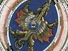

  
[Intangible Textual Heritage](../../index)  [Sky Lore](../index) 
[Index](index)  [Previous](argr00)  [Next](argr02) 

------------------------------------------------------------------------

[Buy this Book at
Amazon.com](https://www.amazon.com/exec/obidos/ASIN/B0027P88F0/internetsacredte)

------------------------------------------------------------------------

  
*Astrology and Religion Among the Greeks and Romans*, by Franz Cumont,
\[1912\], at Intangible Textual Heritage

------------------------------------------------------------------------

p. v

# PREFACE

It is the purpose of these lectures delivered under the auspices of the
American Committee for Lectures on the History of Religions, to sum up
the results of researches carried on by me for many years in the field
of ancient astrology and astral religion. For some facts set forth here
in a summary fashion, I can refer the reader interested in the details
to a number of special articles published in various periodicals; the
proof of other assertions will be given in a larger work that I hope at
some future date to publish on this same general theme.

My sincere thanks are due to Mr. J. B. Baker of Oxford who has carried
out the task of translating these lectures in so satisfactory a manner;
and I am also largely indebted to my friend, Mr. J. G. C. Anderson of
Christ Church, who was kind enough to undertake the revision of the
manuscript. I also owe some valuable corrections to Prof. Morris
Jastrow, Jr., of the University of Pennsylvania, who, as Secretary of
the American Committee, may be said to have called this book into
existence, and to whom I take pleasure in dedicating the volume, as a
mark of recognition of his own researches in the cognate field of
Babylonian-Assyrian astrology.

FRANZ CUMONT

Brussels,  
January, 1912

------------------------------------------------------------------------

[Next: Announcement](argr02)
