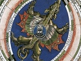

  
[Intangible Textual Heritage](../../index)  [Sky Lore](../index) 
[Index](index)  [Previous](argr04)  [Next](argr06) 

------------------------------------------------------------------------

[Buy this Book at
Amazon.com](https://www.amazon.com/exec/obidos/ASIN/B0027P88F0/internetsacredte)

------------------------------------------------------------------------

  
*Astrology and Religion Among the Greeks and Romans*, by Franz Cumont,
\[1912\], at Intangible Textual Heritage

------------------------------------------------------------------------

p. xx

MAURITIO JASTROW  
BABYLONIORUM  
ASTROLOGIAE  
INTERPRETI SAGACISSIMO

------------------------------------------------------------------------

[Next: Lecture I. The Chaldeans](argr06)
