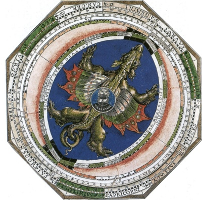

  
[Intangible Textual Heritage](../../index)  [Sky Lore](../index) 

------------------------------------------------------------------------

[Buy this Book at
Amazon.com](https://www.amazon.com/exec/obidos/ASIN/B0027P88F0/internetsacredte)

------------------------------------------------------------------------

<table width="75%">
<colgroup>
<col style="width: 50%" />
<col style="width: 50%" />
</colgroup>
<tbody>
<tr class="odd">
<td width="50%" data-valign="TOP"></td>
<td width="50%" data-valign="CENTER"><h1 id="astrology-and-religion-among-the-greeks-and-romans" data-align="CENTER">Astrology and Religion Among the Greeks and Romans</h1>
<h2 id="franz-cumont" data-align="CENTER">Franz Cumont</h2>
<h4 id="section" data-align="CENTER">[1912]</h4></td>
</tr>
</tbody>
</table>

------------------------------------------------------------------------

[Contents](#contents)    [Start Reading](argr00)    [Page
Index](pageidx)    [Text \[Zipped\]](argr.txt.gz)

------------------------------------------------------------------------

|                                                                                                                           |
|---------------------------------------------------------------------------------------------------------------------------|
|  |

This is a study of star-worship by Franz Cumont. At the turn of the 20th
century, Cumont collected all available astrological and astronomical
texts from antiquity. This book summarizes his knowledge and theories on
this subject. Cumont shows that astronomical knowledge was developed
over time in the ancient Near East, eventually allowing prediction of
phenomena such as the location of the planets, the phases of the moon,
and eclipses. This knowledge was used as the basis of a religious system
which was integrated into Greek and Roman Paganism. This involved
worship of the planets and stars and a belief that after death (if
virtuous) we ascend to the heavens. Other aspects of ancient
star-worship that are still with us are our seven-day week and the
transference of the winter Solstice into the celebration of the birth of
Christ.

------------------------------------------------------------------------

 [Title Page](argr00)  
[Preface](argr01)  
[Announcement](argr02)  
[Introduction](argr03)  
[Contents](argr04)  
[Dedication](argr05)  
[Lecture I. The Chaldeans](argr06)  
[Lecture II. Babylon and Greece](argr07)  
[Lecture III. The Dissemination in the West](argr08)  
[Lecture IV. Theology](argr09)  
[Lecture V. Astral Mysticism--Ethics and Cult](argr10)  
[Lecture VI. Eschatology](argr11)  
