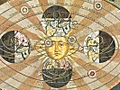

  
[Intangible Textual Heritage](../../index)  [Sky Lore](../index) 
[Index](index)  [Next](cwiu01) 

------------------------------------------------------------------------

[Buy this Book at
Amazon.com](https://www.amazon.com/exec/obidos/ASIN/0801803470/internetsacredte)

------------------------------------------------------------------------

  
*From the Closed World to the Infinite Universe*, by Alexander Koyré,
\[1957\], at Intangible Textual Heritage

------------------------------------------------------------------------

# From the Closed World to the Infinite Universe

## ALEXANDRE KOYRÉ, Ph. D., Litt. D.

##### *École Practique des Hautes Études, Sorbonne, Paris*

#### Baltimore, Md.: The Johns Hopkins Press

#### \[1957\]

Scanned, proofed and formatted at Intangible Textual Heritage, January
2008, by John Bruno Hare. This text is in the public domain in the
United States because it was not renewed in a timely fashion at the US
Copyright Office as required by law at the time.

### The Hideyo Noguchi Lectureship

<table data-border="0" width="75%">
<colgroup>
<col style="width: 100%" />
</colgroup>
<tbody>
<tr class="odd">
<td data-valign="top" width="655">
In 1929 the late Dr. Emanuel Libman of New York gave $10,000 to The Johns Hopkins University for the establishment of a lectureship in the History of Medicine. In accordance with Dr. Libman's wishes it was named The Hideyo Noguchi Lectureship to pay tribute to the memory of the distinguished Japanese scientist.

The present volume owes its origin to the eleventh lecture on this foundation which was delivered on December 15, 1953, at The Johns Hopkins Institute of the History of Medicine by Professor Alexandre Koyré.
</td>
</tr>
</tbody>
</table>

 

------------------------------------------------------------------------

[Next: Preface](cwiu01)
