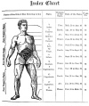

  
[Intangible Textual Heritage](../../index)  [Astrology](../index) 
[Index](index)  [Previous](hba00)  [Next](hba02) 

------------------------------------------------------------------------

[Buy this Book at
Amazon.com](https://www.amazon.com/exec/obidos/ASIN/0766187152/internetsacredte)

------------------------------------------------------------------------

  
*The Hindu Book of Astrology*, by Bhakti Seva, \[1902\], at Intangible
Textual Heritage

------------------------------------------------------------------------

 

 
[  
Click to enlarge](img/chart.jpg)  
Chart  

 

<table data-border="1">
<colgroup>
<col style="width: 12%" />
<col style="width: 12%" />
<col style="width: 12%" />
<col style="width: 12%" />
<col style="width: 12%" />
<col style="width: 12%" />
<col style="width: 12%" />
<col style="width: 12%" />
</colgroup>
<tbody>
<tr class="odd">
<td data-valign="top">
 
</td>
<td colspan="2" data-valign="top">
Parts of the 
Grand Man 
Relating to the
</td>
<td colspan="2" data-valign="top">
Signs
</td>
<td data-valign="top">
Domain 
of the 
Signs.
</td>
<td data-valign="top">
Date of the Signs.
</td>
<td data-valign="top">
Page No.
</td>
</tr>
<tr class="even">
<td rowspan="4">
Four 
Positive 
Signs
</td>
<td rowspan="12" data-valign="top">
 
</td>
<td data-valign="top">
Head
</td>
<td rowspan="12" data-valign="top">
 
</td>
<td data-valign="top">
♈ 
Aries.
</td>
<td data-valign="top">
Fire.
</td>
<td data-valign="top">
Mch. 21 to Apr. 19.
</td>
<td data-valign="top">
<a href="hba07.htm#page_35">35</a>
</td>
</tr>
<tr class="odd">
<td data-valign="top">
Neck
</td>
<td data-valign="top">
♉ 
Taurus.
</td>
<td data-valign="top">
Earth.
</td>
<td data-valign="top">
Apr. 19 to May 20.
</td>
<td data-valign="top">
<a href="hba08.htm#page_42">42</a>
</td>
</tr>
<tr class="even">
<td data-valign="top">
Chest
</td>
<td data-valign="top">
♊ 
Gemini.
</td>
<td data-valign="top">
Air.
</td>
<td data-valign="top">
May 20 to June 21.
</td>
<td data-valign="top">
<a href="hba09.htm#page_49">49</a>
</td>
</tr>
<tr class="odd">
<td data-valign="top">
Heart
</td>
<td data-valign="top">
♋ 
Cancer.
</td>
<td data-valign="top">
Water.
</td>
<td data-valign="top">
June 21 to July 22.
</td>
<td data-valign="top">
<a href="hba10.htm#page_55">55</a>
</td>
</tr>
<tr class="even">
<td rowspan="4">
Four 
Middle 
Signs
</td>
<td data-valign="top">
Stomach
</td>
<td data-valign="top">
♌ 
Leo.
</td>
<td data-valign="top">
Fire.
</td>
<td data-valign="top">
July 22 to Aug. 22.
</td>
<td data-valign="top">
<a href="hba11.htm#page_62">62</a>
</td>
</tr>
<tr class="odd">
<td data-valign="top">
Upper Intestines
</td>
<td data-valign="top">
♍ 
Virgo.
</td>
<td data-valign="top">
Earth.
</td>
<td data-valign="top">
Aug. 22 to Sept. 23.
</td>
<td data-valign="top">
<a href="hba12.htm#page_69">69</a>
</td>
</tr>
<tr class="even">
<td data-valign="top">
Lower Intestines
</td>
<td data-valign="top">
♎ 
Libra.
</td>
<td data-valign="top">
Air.
</td>
<td data-valign="top">
Sept. 23 to Oct. 23.
</td>
<td data-valign="top">
<a href="hba12.htm#page_70">70</a>
</td>
</tr>
<tr class="odd">
<td data-valign="top">
Genitals
</td>
<td data-valign="top">
♏ 
Scorpio.
</td>
<td data-valign="top">
Water.
</td>
<td data-valign="top">
Oct. 23 to Nov. 22.
</td>
<td data-valign="top">
<a href="hba14.htm#page_83">83</a>
</td>
</tr>
<tr class="even">
<td rowspan="4">
Four 
Negative 
Signs
</td>
<td data-valign="top">
Upper Leg
</td>
<td data-valign="top">
♐ 
Sagittarius.
</td>
<td data-valign="top">
Fire.
</td>
<td data-valign="top">
Nov. 23 to Dec. 21.
</td>
<td data-valign="top">
<a href="hba15.htm#page_90">90</a>
</td>
</tr>
<tr class="odd">
<td data-valign="top">
Knees
</td>
<td data-valign="top">
♑ 
Capricorn.
</td>
<td data-valign="top">
Earth.
</td>
<td data-valign="top">
Dec. 21 to Jan. 20.
</td>
<td data-valign="top">
<a href="hba04.htm#page_14">14</a>
</td>
</tr>
<tr class="even">
<td data-valign="top">
Calf
</td>
<td data-valign="top">
♒ 
Aquarius.
</td>
<td data-valign="top">
Air.
</td>
<td data-valign="top">
Jan. 20 to Feb. 19.
</td>
<td data-valign="top">
<a href="hba05.htm#page_21">21</a>
</td>
</tr>
<tr class="odd">
<td data-valign="top">
Feet
</td>
<td data-valign="top">
♓ 
Pisces.
</td>
<td data-valign="top">
Water.
</td>
<td data-valign="top">
Feb. 19 to Mch. 21.
</td>
<td data-valign="top">
<a href="hba13.htm#page_78">78</a>
</td>
</tr>
</tbody>
</table>

------------------------------------------------------------------------

[Next: Contents](hba02)
