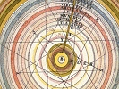

  
[Intangible Textual Heritage](../../index)  [Astrology](../index) 
[Index](index)  [Previous](hba11)  [Next](hba13) 

------------------------------------------------------------------------

[Buy this Book at
Amazon.com](https://www.amazon.com/exec/obidos/ASIN/0766187152/internetsacredte)

------------------------------------------------------------------------

  
*The Hindu Book of Astrology*, by Bhakti Seva, \[1902\], at Intangible
Textual Heritage

------------------------------------------------------------------------

p. 69

### Virgo

### ♍

*All persons born from August* 21 *to September* 22*, inclusive, were
born under the sign of Virgo*.

Virgo is the sign of the Virgin, and is the middle sign of the Earth
Triplicity, and the people of this sign are usually cool, calm and
confident—great and grand qualities, which can bring one to the highest
success and happiness. In India, the Yogic Astrologers tell the Virgo
people their faults and bad tendencies so that they may correct them and
thus reach the high position in life which is theirs by birth under this
excellent sign. You can and must excel in everything you undertake; to
think of failure is very, very foolish and weakening. Always have hope
and courage, and you will draw and attract to yourself wonderful power
and force. Fight with strong will and grim determination every obstacle
that crosses your path, whether it be sickness, adversity or poverty.
You can win every time. You are fully adapted to a business or a
professional career, and will be a

p. 70

marked success in whatever calling you select, provided you will kill
entirely all low, vulgar and selfish tendencies. Your sign represents
the hidden fire of the earth, which means you are an all-powerful,
forceful being. Learn at once that order and method in your habits are
absolutely essential to your happiness, success and well-being. "Order
is heaven's first law." Think and observe much, and order your life so
that you will do everything in an orderly, methodical and systematic
way. Strive strenuously to fully develop all the good that is in you;
give much attention to your higher nature; improve yourself morally,
spiritually and intellectually. The only force in this universe is the
force of Good—the force of God. A beautiful and happy life can only be
attained by aspiring for good—the highest. The study of philosophy,
occult science and metaphysics will open your mind to a wealth of
happiness you little dream of. Always be generous, kind and loyal. Many
excellent scholars and musicians are found in this sign, and we always
urge Virgo persons of either sex to study much, read much and give a
great deal of time to hearing music. Music is very inspiring and helpful
to you, and if you have any inclination to play or sing, don't hesitate
in cultivating your taste in this direction.

p. 71

The pronounced faults of the Virgo people are: A too strong desire to
rule and dominate over people, seeing the faults of others and not
seeing their own weak points; false pride and false ambition; meddling
with other people's business and affairs and not attending strictly to
their own business; taking drugs and medicines for imaginary diseases
and ailments; conceit, vanity and egotism; falsehood, misrepresentation,
exaggeration and making extravagant statements about matters and things,
especially with regard to their achievements; running in debt for the
sake of keeping up appearances. All of these bad qualities are likely to
appear in the lower, uneducated and uncultivated persons of this sign,
and if you have any or all of these tendencies I advise you to root them
out of your being once and for all time, as they will be the millstones
around your neck, which will keep you from rising to a superior
position. I do not know of a higher or grander character than the highly
developed Virgo person; or of a meaner and lower being when this sign
lives on the low plane —in ignorance and darkness. So you see it is of
the utmost importance for you to cultivate your higher nature, which is
always true and grand. With respect to health the Virgo people are
naturally healthy persons, and do not need drugs or

p. 72

medicines. Outdoor exercise, lots of air and sunshine will keep you
well, strong and vigorous.

In love you will be successful when you learn to not be too critical or
exacting. If not married, you will do well to select a life partner who
is cheerful and does not look on the dark side of life. If you are
married, you can make your home a very happy one by not expecting too
much from your wife or husband. Your weak point is seeing faults in
others and often a married. Virgo person carries his criticism into his
or her married life and sees too many faults in the chosen wife or
husband.

Spend much time with nature—in the green fields and woods. Love animals
and surround yourself with flowers and domestic pets. If you will be
temperate in your eating and don't drug and dose yourself with medicines
you can live many years and retain youthful spirits and vigor up to the
time you pass on to the other world. The elixir of life is yours if you
will only realize that everything in this world is all right and running
in perfect order, directed and guided by the Wise One who rules all. You
may think you could run this universe better than it is run, but don't
attempt it unless you wish to make yourself miserable

p. 73

and destroy your great natural powers and forces. Give yourself a
frequent careful examination, looking out for your own bad faults or
tendencies, and don't waste any of your time and energy in picking out
the flaws in others. In this world the Law is that we find exactly what
we look for; if we look for bad, bad will come to us; if we think
weakness, failure, poverty and that sort of thing we will certainly get
our full share of weakness, failure, poverty, etc. As a man thinks so
will he be. Poverty is very galling to Virgo people, and they can never
amass money until they live on a high plane; that is to say, as long as
they brood, whine, grumble, complain and murmur over their lot just so
long they will remain poor and miserable. But, on the other hand, let
the Virgo person wake up and cast out all fear and doubt—be up and doing
with a cheerful spirit and a high motive, then will he or she have
success beyond their fondest hopes. You have everything to live for and
can have prosperity and happiness by doing as I suggest.

This sign is governed by Mercury, and the gems are pink jasper and
hyacinth. The astral colors are gold and black, speckled with blue dots.
The diseases which you are most likely to suffer from are stomach
troubles and nervousness. Your best

p. 74

companions are those born in Libra—Sagittarius and in your own sign
Virgo.

People born in this sign are usually of middle stature and well formed,
with noble faces.

May the peace and blessing of the Blessed One, and all the Devas
(angels) and all the Yogis of the Universe be ever with you, dear sister
or brother of Virgo.—*Bhakti Seva*.

#### CUSPS.

If your first breath was drawn when one sign was taking the place of
another, you will partake of the characteristics of both signs. Hence
you belong to the Cusp. The residence in a sign constitutes six days;
any time less endows one with some of the qualities of the preceding
sign.

##### THE CUSP OF LEO—VIRGO.

*August* 22 *to* 28.

Persons born on any of these six days make excellent and intelligent
citizens. They partake of the strong combination of Fire and Earth. The
Earth needs the Sun, and these natives apparently

p. 75

understand that need. Both the men and women are fond of everything that
grows. They are also tremendous workers, and when educated are logical
thinkers. They have a natural ability of taking the good things of the
earth to themselves and enjoying them. They make excellent physicians
and teachers, and their ability to convince is remarkably pronounced.

The heat of Leo is modified by the coolness and solidity of the Earth,
so that there is not so much temptation to take offense as prevails if
the two signs were taken separately. They are true children of nature
and like to spend most of their time out of doors, wearing as few
garments as possible; but when it is necessary to live within four walls
they demand the best quality of wearing apparel combined with the latest
style.

------------------------------------------------------------------------

[Next: Libra](hba13)
