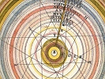

  
[Intangible Textual Heritage](../../index)  [Astrology](../index) 
[Index](index)  [Previous](hba16) 

------------------------------------------------------------------------

[Buy this Book at
Amazon.com](https://www.amazon.com/exec/obidos/ASIN/0766187152/internetsacredte)

------------------------------------------------------------------------

  
*The Hindu Book of Astrology*, by Bhakti Seva, \[1902\], at Intangible
Textual Heritage

------------------------------------------------------------------------

p. i

The following advertisements followed the text in the original book.
They are transcribed for completeness. These pages are numbered with
small roman numerals in the original.

# THE MAGAZINE OF MYSTERIES IS THE PHENOMENAL SUCCESS OF THE TWENTIETH CENTURY

**Read the following Testimonials, and then send your subscription for
this Wonderful, Inspiring and Helpful Magazine**

John Carlton Barnaby, Gig Harbor, Pierce Co., Wash., in sending his
subscription for one year, says:

I think The Magazine of Mysteries is the
best periodical I have ever read, and I have read a good many. It is
food for the soul.

Miss E. Willie Lightfoot, Brisbane, Ark., in sending her subscription
for one year, says:

This Magazine may be improved by becoming weekly, semi-weekly, then
daily, as the Mystic Membership grows larger, the circulation greater,
while the contributors get purer, brighter and deeper in thought. May
the South get into this circle, too.

George Brand, Anaconda, Montana, in sending his subscription for one
year, says:

I am very well pleased with your Magazine. I have been looking for
something of the kind for some time, and it is my everyday handbook and
guide.

Mrs. Wm. H. Stilwell, 1804 West Monroe St., Phoenix, A. Ty., in sending
her subscription for one year, says: My trial subscription of three
months has been very satisfactory, and I find much of interest and that
which is helpful in your journal.

Katherine Pearce, 78 Walnut St., Newark, N. J., in sending her
subscription for one year, says:

I cannot well advise any change in your Magazine. The only copy I have
seen pleases me very much. I have been helped and comforted by the many
beautiful thoughts printed therein, and hope and believe the future
numbers will prove equally inspiring.

Anna A. Goodwin, 19 1–2 Swan St., Green Island, N. Y., in sending her
subscription for one year, says:

About two months ago I was lonesome one Saturday night and entered a
large book-store to see if I could find something interesting to read.
While waiting for the clerk, I picked up a copy of your Mystic Magazine,
came home and read and re-read the contents, receiving so much
consolation from it I waited the April issue with impatience, which came
and has been studied through with untold good. It is the very best paper
I have ever read.

Miss E. Southergill, Farmington, Conn., in sending her subscription for
one year, says:

I find your Magazine soul-inspiring and helpful.

p. ii

##### MAGAZINE OF MYSTERIES’ TESTIMONIALS—(Continued)

F. C. Kingman, 444 Mass. Ave., Boston, Mass., in sending her
subscription for one year, says:

I enjoy reading the Magazine very much, and feel much better for reading
it, and I will do what I can in my humble way to help it along.

Mrs. M. J. Smithey, 1446 Columbia Ave., Indianapolis, Ind., in sending
her subscription for one year, says:

Your Magazine cannot be improved; it is splendid.

Margaret Aird, 47 12th St., Buffalo, N. Y., in sending her subscription
for one year, says:

This is the first of your magazines that I have seen or read, and have
enjoyed the reading very much. It is altogether a book that helps to
lift one's mind off the petty things of this life to a higher and nobler
life above. But as for the improvement of the Magazine I can't say
anything until I get better acquainted with it.

Mary F. Johnson, 28 W. 13th St., Wilmington, Del., in sending her
subscription for one year, says:

After reading very carefully the booklets you sent me, and the request
of me becoming a subscriber to this valuable grand Magazine, I am more
than glad so to do. I am more than pleased with it. I never in all my
life saw anything near like it. It not only entrances, but holds you
with rapport and delight, and I cannot express fully the pleasure and
happiness it affords me.

Lewis H. Karn, Port Orange, Fla., in sending his subscription for one
year, says:

The sample copy of The Magazine of
Mysteries came to hand, and I am very much pleased with it. I
enclose you $1.00 for one year's subscription.

Ellsworth E. Worden, Portland, Ore., in sending in his subscription for
one year, says:

I have bought several copies of your Magazine. I think it is a wonderful
Magazine, just what I have been wanting to find in the line of reading.
Hold it up to its high standard and you will do a world of good. I send
you one dollar for a year's subscription.

Maynard Oxley, Extension, B. C., Can., in sending in his subscription
for one year, says:

I received the sample copy of the Magazine and was very much interested
in it. It is the best I have ever seen. Madame Theodore Rodriguez, Port
au Prince, Haiti, in sending in her subscription for one year, says:

Having been privileged (through the goodness of Dr. Tabourin Holly) to
read your valuable Magazine, I feel much interested in same. Actuated by
none other but a fervent desire toward the love of God and divine
knowledge, I take the liberty of enclosing subscription price.

Thos. A. Clarke, 2723 Bryant Ave., San Francisco, Cal., in sending in
his subscription for one year, says:

p. iii

##### MAGAZINE OF MYSTERIES’ TESTIMONIALS—(Continued)

I am so happy I have found such a comforting and helping paper as your
Magazine of Mysteries. It has done so
much for me and I am sure it will do the same for others. I saw it in
one of the stores one day, and something kept urging me for a week to go
and buy it. Now, since I have got work, I am able to be one of your
subscribers, and to continue so. I will try and interest all my friends
in buying your paper also, for it is a blessing to all who will read and
re-read it as I do. I even sleep with it under my pillow, and send a
little prayer to God for others and myself to lead us onward with His
Holy Spirit, and keep us from sin.

John Howell, 518 Grand Ave., Los Angeles. Cal., in sending in his
subscription for one year, says:

Inclosed please find an order for one dollar, in return for which please
send me your splendid Magazine beginning with the May number. I
purchased a copy of your March number at the bookstall here, thinking
that it was a fortune-telling affair, and to say I was pleasurably
surprised when I began to peruse its pages is a mild way of expressing
my delight at having made the acquaintance of the best publication in
existence, bar the Bible. Candidly, sir, I believe that the chance
purchase of your Magazine marks the great epoch and turning-point in my
life, for although I have belonged to a church all my life, and have
been confirmed, your Magazine was the first light that has come to me. I
read your March and April numbers through, not missing a word, and
although I would like to do so, I cannot find words to express to you
how much good I have derived from the soul-inspiring words they contain.

Isaac M. Myers, Ligonier, Ind., in sending his subscription for one
year, says:

Your welcome Magazine of Mysteries and
the postal card at hand, which I received March 13th. I am a strong
advocate of what the Magazine teaches. I feel that it is the paper that
will help to keep our courage and faith strong in the power of the
Divine Jehovah, Father, and the Son Jesus and the Holy Spirit. I am
thankful to the subscriber of your paper that suggested my name to you.
I believe that the paper should be in every person's hands, that is
trying to do right and live up to the first commandment, to love God,
the Father, and his neighbor as himself. If you wish, send my
delineation of my life. I will feel very grateful to you.

Mrs. Mary A. Smith, 131 Meadow St., Pittsburgh, Pa., in sending in her
subscription for one year, says:

I have been reading your excellent paper for some time and I cannot
speak too highly of it. I get more knowledge and comfort from the
reading of it than any other paper or publication of the kind that I
have ever read. I look upon it as a friend and adviser. Heretofore, I
have got the paper at the news depot, but I have trouble sometimes to
get them; therefore, I am going to subscribe for it by the year.

p. iv

##### MAGAZINE OF MYSTERIES’ TESTIMONIALS—(Continued)

Mrs. F. Lindquist, 400 Roscoe St., Chicago, Ill., in sending her
subscription for one year, says:

Let me thank you for The Magazine of
Mysteries. It is beautiful, sweet and true. I have read and read
it over and over again and never get tired of reading, and you can be
sure that I shall try my best to get you customers for it. I find every
word so inspiring and elevating, and I wish you success with all my
heart.

Morris Rodman, 1837 Third Ave., N. Y., in sending in his subscription
for one year, says:

I have fortunately happened to come across your highly valuable
Magazine, and have read it for the last few months, and derived so much
pleasure by reading that I actually do not know how I could get along
without it. I can gladly call it my instructive companion for my life,
and would not part with it for the best thing in the world. I have long
been searching for something of that character, and found it at last,
which is the knowledge I so long craved for.

Lydia A. Irons, Milan, Spokane Co., Wash., in sending in her
subscription for one year, says:

I can find no words strong enough to express my keen appreciation of all
the articles by Mr. J. M. Peebles and C. Fannie Allyn on Spiritualism,
and the articles by Hindu writers are particularly helpful to me. Such
belief brings with it comfort and peace of mind and would change all
this world's sadness to joy. If all issues are equal to this one it
surely is valuable.

J. M. Righter, Cambria, Wyoming, in sending in his subscription for one
year, says:

I received your Magazine. I was much pleased with it. I never have had
any publication of such a cheerful nature. At this time I am sorely in
need of encouragement, and trust it may reform my whole life.

Rev. M. M. Marshall, Montesano, Wash., in sending his subscription for
one year, says:

I am pleased with The Magazine of
Mysteries. You certainly deserve not only encouragement but the
heartfelt gratitude of all who read it. Whenever I find opportunity to
call the attention of any who would be likely to appreciate it, to its
merits. I shall do so.

**The Magazine of Mysteries stands unique as the only magazine of its
kind. You will respect and enjoy this charming magazine, as it teaches
Love, Freedom, Tolerance, Charity, Golden Rule,
Prosperity and Health. Single copies 10 cents. Subscription price
only one dollar a year. Address**

##### THE MAGAZINE OF MYSTERIES 22 North William St., New York City

p. v

 

In a spiritual, dignified way, the Mystic Adepts in The Magazine of
Mysteries unfold Psychic or Spiritual Powers, giving to all Vibrations
of Health, Wealth and Happiness

You are interested in Progress, Prosperity, Health and Happiness, and
you should read this wonderful paper. It is the Soulful Magazine of the
New Century. Single copies 10 cents. Subscription price only One Dollar
a Year

*Address*

##### THE MAGAZINE OF MYSTERIES 22 North William St., New York City

p. vi

 

THE MAGAZINE OF MYSTERIES will give absolutely free to each person
sending $1.00 for one year's subscription to the Magazine, a lengthy
Graphological Delineation, prepared by a Mystic Adept Graphologer. This
delineation will reveal to you your natural capabilities, and will guide
you to health, wealth and happiness.

These delineations are of great value to anyone who desires to know the
mystic rules for having long life, perfect health, abundance of wealth
and happiness, as they are prepared by one of the greatest mystic adepts
in the world.

Be sure and write your letter in ink, and have it contain at least ten
lines, and write just as if you were writing to a dear friend, free from
all care and in a natural state.

Graphology is a science and an art, which deals with handwriting as an
index to character, exposing instantly to a Mystic Adept Graphologer a
person's mental and physical peculiarities, as well as their natural
abilities, by their penmanship.

This science is based on years of study and research, and there are very
few well qualified graphologers in this country. The Mystic Adept
Graphologer connected with The Magazine of
Mysteries is undoubtedly one of the greatest and most scientific
graphologers the world has ever known.

Remember, you get this Magazine one whole year for $1.00, and we send
you free your delineation.

Write your letter in ink and send $1.00 for a year's subscription to

##### THE MAGAZINE OF MYSTERIES 22 North William St., New York City

p. vii

 

The Magazine of Mysteries Will give,
absolutely free, to each person sending one dollar for one year's
subscription to the magazine, a lengthy Astrological Delineation,
prepared by a Mystic Adept Astrologer. Be
sure to send the month and date of your birth with your subscription.

These Delineations are of great value to any one who desires to know the
Mystic Rules for having Perfect Health, Wealth and Happiness, as they
are prepared by one of the greatest Mystic Adepts in the world.

With this wonderful Delineation and the magazine you can learn how to
have all the Unseen Forces and Occult Powers help you. There is not a
greater blessing than perfect health, prosperity, long life and general
success. These Mystic Astrological Delineations show you how to get
wonderful Psychic Power. They show you what to do, when to do and how to
do to command all of the great planetary, solar, magnetic and psychic
forces of the universe.

With your Astrological Delineation, as given by this Mystic Adept in
astrological and occult science, YOU CAN AVOID
DISEASE, FAILURE AND MISFORTUNE.

Astrology is an exact science, and a Delineation prepared by a true
Astrological Adept, who is honest, sincere, learned and conscientious,
will be of great value to you.

Remember, you get this magazine one whole year for one dollar, and we
send you free your Delineation.

Send date and place of birth, giving year and hour if possible, and one
dollar to

##### THE MAGAZINE OF MYSTERIES 22 North William St., New York City

 

 

 

 

 
