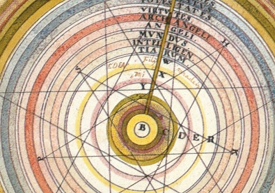

  
[Intangible Textual Heritage](../../index)  [Astrology](../index) 

------------------------------------------------------------------------

[Buy this Book at
Amazon.com](https://www.amazon.com/exec/obidos/ASIN/0766187152/internetsacredte)

------------------------------------------------------------------------

<table width="75%">
<colgroup>
<col style="width: 50%" />
<col style="width: 50%" />
</colgroup>
<tbody>
<tr class="odd">
<td width="50%" data-valign="TOP"></td>
<td width="50%" data-valign="CENTER"><h1 id="the-hindu-book-of-astrology" data-align="CENTER">The Hindu Book of Astrology</h1>
<h2 id="by-bhakti-seva" data-align="CENTER">by Bhakti Seva</h2>
<h4 id="section" data-align="CENTER">[1902]</h4></td>
</tr>
</tbody>
</table>

------------------------------------------------------------------------

[Contents](#contents)    [Start Reading](hba00)    [Page
Index](pageidx)    [Text \[Zipped\]](hba.txt.gz)

------------------------------------------------------------------------

|                                                                                                                           |
|---------------------------------------------------------------------------------------------------------------------------|
|  |

If this was really a vintage Hindu Astrology book, it would be a real
find. I have yet to locate one, and there has been a steady drip of
requests for Hindu Astrology since the inception of the site, which I
would be more than happy to satisfy. Rather this is a short book similar
to the Yogi Publication Society books, published by William Atkinson
under a series of pseudonyms. Note: this is the only book by anyone
named 'Bhakti Seva' in the WorldCat catalog, and there is no additional
information on him (or her, given the subtle feminist hints in the
text).

At the cusp of the 20th century, some occult publishers were more than
willing to bend the truth in the interest of satisfying a popular demand
for information on the 'Mysterious East.' It was not illegal to
impersonate a Swami through the mails. The publisher in this case took a
dash of New Thought, an amount of mystic flim-flam, and used it to
season a mail-order pamphlet on the new 'simplified' Astrology,
repackaged as 'Hindu Astrology.' And, judging by the small-print
testimonials in the back of the book, he found a willing audience.

He makes a hash of Hinduism in the process; such as his very Western
statement that "We Are All Masters of Our Own Fate." (p. 12). Most
Hindus believe that our burden of Karma, which is accumulated over many
rebirths, plays a much larger role than our individual self-will. At the
very end of the book he says (p. 104) "We are continually going forward,
onward and upward. Nothing stands still! There is no backward movement!"
This is a modern Westernized view of progress, counter to the
traditional Hindu view of cyclical time, with each age in the cycle
being *less* advanced than the previous.

Please don't be deceived. Hindu Astrology is a difficult art and divides
the heavens into dozens of 'Asterisms,' not just twelve. Hindu
astrologers are, even today, consulted at important life passages,
particularly marriage, and their horoscopes and the interpretation
thereof take great skill and knowledge to create. Rather this is
documentation that not just William Atkinson was up to the Swami game,
and serves as an illustration of the state of occult publishing in
1902.--J. B. Hare, March 25th, 2009.

------------------------------------------------------------------------

 [Title Page](hba00)  
[Chart](hba01)  
[Contents](hba02)  
[Introduction](hba03)  
[Capricorn](hba04)  
[Aquarius](hba05)  
[Pisces](hba06)  
[Aries](hba07)  
[Taurus](hba08)  
[Gemini](hba09)  
[Cancer](hba10)  
[Leo](hba11)  
[Virgo](hba12)  
[Libra](hba13)  
[Scorpio](hba14)  
[Sagittarius](hba15)  
[The Hindu Yogis’ Rules For Attaining Health, Wealth And
Happiness](hba16)  
[Advertisements](hba17)  
