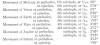
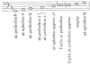
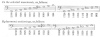
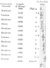

  
[Intangible Textual Heritage](../../index)  [Sky Lore](../index) 
[Index](index)  [Previous](how05)  [Next](how07) 

------------------------------------------------------------------------

[Buy this Book at
Amazon.com](https://www.amazon.com/exec/obidos/ASIN/0762420189/internetsacredte)

------------------------------------------------------------------------

*Harmonies of the World*, by Johannes Kepler, tr. Charles Glenn Wallis
\[1939\], at Intangible Textual Heritage

------------------------------------------------------------------------

### 5. IN THE RATIOS OF THE PLANETARY MOVEMENTS WHICH ARE APPARENT AS IT WERE TO SPECTATORS AT THE SUN, HAVE BEEN EXPRESSED THE PITCHES OF THE SYSTEM, OR NOTES OF THE MUSICAL SCALE, AND THE MODES OF SONG \[GENERA CANTUS\], THE MAJOR AND THE MINOR [3](#fn_6)

Therefore by now I have proved by means of numbers gotten on one side
from astronomy and on the other side from harmonics that, taken in every
which way, harmonic ratios hold between these twelve termini or
movements of the six planets revolving around the sun or that they
approximate such ratios within an imperceptible part of least concord.
But just as in Book III in the first chapter, we first built up the
single harmonic consonances separately, and then

p. 1035

we joined together all the consonances—as many as there were—in one
common system or musical scale, or, rather, in one octave of them which
embraces the rest in power, and by means of them we separated the others
into their degrees or pitches \[*loca*\] and we did this in such a way
that there would be a scale; so now also, after the discovery of the
consonances \[*harmoniis*\] which God Himself has embodied in the world,
we must consequently see whether those single consonances stand so
separate that they have no kinship with the rest, or whether all are in
concord with one another. Notwithstanding it is easy to conclude,
without any further inquiry, that those consonances were fitted together
by the highest prudence in such fashion that they move one another about
within one frame, so to speak, and do not jolt one another out of it;
since indeed we see that in such a manifold comparison of the same terms
there is no place where consonances do not occur. For unless in one
scale all the consonances were fitted to all, it could easily have come
about (and it has come about wherever necessity thus urges it) that many
dissonances should exist. For example, if someone had set up a major
sixth between the first and the second term, and likewise a major third
between the second and the third term, without taking the first into
account, then he would admit a dissonance and the discordant interval 12
: 25 [between](errata.htm#4) the first and third.

But come now, let us see whether that which we have already inferred by
reasoning is really found in this way. \[291\] But let me premise some
cautions, that we may be the less impeded in our progress. First, for
the present, we must conceal those augments or diminutions which are
less than a semitone; for we shall see later on what causes they have.
Second, by continuous doubling or contrary halving of the movements, we
shall bring everything within the range of one octave, on account of the
sameness of consonance in all the octaves.

Accordingly the numbers wherein all the pitches or clefs \[*loca seu
claves*\] of the octave system are expressed have been set out in a
table in Book III, Chapter 7 [1](#fn_7),

p. 1036

*i.e.*, understand these numbers of the length of two strings. As a
consequence, the speeds of the movements will be in the inverse ratios.

Now let the planetary movements be compared in terms of parts
continuously halved. Therefore

[  
Click to enlarge](img/103600.jpg)

Now the aphelial movement of Saturn at its slowest—*i.e.*, the slowest
movement—marks *G*, the lowest pitch in the system with the number
1´46″. Therefore the aphelial movement of the Earth will mark the same
pitch, but five octaves higher, because its number is 1´47″, and who
wants to quarrel about one second in the aphelial movement of Saturn?
But let us take it into account, nevertheless; the difference will not
be greater than 106 : 107, which is less than a comma. If you add 27″,
one quarter of this 1´47″, the sum will be 2´14″, although the
perihelial movement of Saturn has 2´15″; similarly the aphelial movement
of Jupiter, but one octave higher. Accordingly, these two movements mark
the note *b*, or else are very slightly higher. Take 36″, one third of
1´47″, and add it to the whole; you will get as a sum 2´23″ for the note
*c*; and here's the perihelion of Mars of the same magnitude but four
octaves higher. To this same 1´47″ add also 54″, half of it, and the sum
will be 2´41″ for the note *d*; and here the perihelion of Jupiter is at
hand, but one octave higher, for it occupies the nearest number, *viz*.,
2´45″. If you add two thirds, *viz*., 1´11″, the sum will be 2´58″; and
here's the aphelion of Venus at 2´58″. Accordingly, it will mark the
pitch or the note *e*, but five octaves higher. And the perihelial
movement of Mercury, which is 3´0″, does not exceed it by much but is
seven octaves higher. Finally, divide the double of 1´47″, *viz*.,
3´34″, into nine parts and subtract one part of 24″ from the whole;
3´10″ will be left for the note *f*, which the 3´17″ of the aphelial
movement of Mars marks approximately but three octaves higher; and this
number is slightly greater than the just number and approaches the note
*f* sharp. For if one sixteenth of 3´34″, *viz*., 13½″, is subtracted
from 3´34″, then 3´20½″ is left, to which 3´17″ is very near. And indeed
in music *f* sharp is often employed in place of *f*, as we can see
everywhere.

Accordingly all the notes of the major scale \[*cantus duri*\] (except
the note *a* which was not marked by harmonic division, in Book III,
Chapter 2) are marked by all the extreme movements of the planets,
except the perihelial movements of Venus and the Earth \[292\] and the
aphelial movement of Mercury, whose number, 2´34″, approaches the note
*c* sharp. For subtract from the 2´41″ of *d* one sixteenth or 10″, and
2´30″ remains for the note *c* sharp. Thus only the perihelial movement
of Venus and the Earth are missing from this scale, as you may see in
the table.

p. 1037

[  
Click to enlarge](img/103700.jpg)

On the other hand, if the beginning of the scale is made at 2´15″, the
aphelial movement of Saturn, and we must express the note *G* in those
degrees: then for the note *A* is 2´32″, which closely approaches the
aphelial movement of Mercury; for the note *b* flat, 2´42″, which is
approximately the perihelial movement of Jupiter, by the equipollence of
octaves; for the note *c*, 3´0″, approximately the perihelial movement
of Mercury and Venus; for the note *d*, 3´23″ and the aphelial movement
of Mars is not much graver, *viz*., 3´17″, so that here the number is
about as much less than its note as previously the same number was
greater than its note; for the note *e* flat, 3´36″, which the aphelial
movement of the Earth approximates; for the note *e*, 3´50″, and the
perihelial movement of the Earth is 3´49″; but the aphelial movement of
Jupiter again occupies *g*. In this way, all the notes except *f* are
expressed within one octave of the minor scale by most of the aphelial
and perihelial movements of the planets, especially by those which were
previously omitted, as you see in the table.

[  
Click to enlarge](img/103701.jpg)

Previously, however, *f* sharp was marked and *a* omitted; now *a* is
marked, *f* sharp is omitted; for the harmonic division in Chapter 2
also omitted the note *f*.

Accordingly, the musical scale or system of one octave with all its
pitches, by means of which natural song [1](#fn_8) is transposed in music, has been expressed
in the heavens by a twofold way and in two as it were modes of song.
There is this sole difference: in our harmonic sectionings both ways
start together from one and the same terminus *G*; but here, in the
planetary movements, that which was previously *b* now becomes *G* in
the minor mode.

p. 1038

[  
Click to enlarge](img/103800.jpg)

For as in music 2160 : 1800, or 6 : 5, so in that system which the
heavens express, 1728 : 1440, namely, also 6 : 5; and so for most of the
remaining, 2160 : 1800, 1620, 1440, 1350, 1080 as 1728 : 1440, 1296,
1152, 1080, 864.

Accordingly you won't wonder any more that a very excellent order of
sounds or pitches in a musical system or scale has been set up by men,
since you see that they are doing nothing else in this business except
to play the apes of God the Creator and to act out, as it were, a
certain drama of the ordination of the celestial movements.

But there still remains another way whereby we may understand the
twofold musical scale in the heavens, where one and the same system but
a twofold tuning \[*tensio*\] is embraced, one at the aphelial movement
of Venus, the other at the perihelial, because the variety of movements
of this planet is of the least magnitude, as being such as is
comprehended within the magnitude of the diesis, the least concord. And
the aphelial tuning \[*tensio*\], as above, has been given to the
aphelial movements of Saturn, the Earth, Venus, and (relatively
speaking) Jupiter, in *G*, *e*, *b*, but to the perihelial movements of
Mars and (relatively speaking) Saturn and, as is apparent at first
glance, to those of Mercury, in *c*, *e*, and *b*. On the other hand,
the perihelial tuning supplies a pitch even for the aphelial movements
of Mars, Mercury, and (relatively speaking) Jupiter, but to the
perihelial movements of Jupiter, Venus, and (relatively speaking)
Saturn, and to a certain extent to that of the Earth and indubitably to
that of Mercury too. For let us suppose that now not the aphelial
movement of Venus but the 3´3″ of the perihelial gets the pitch of *e*;
it is approached very closely by the 3´0″ of the perihelial movement of
Mercury, through a double octave, at the end of Chapter 4. But if 18″ or
one tenth of this perihelial movement of Venus is subtracted, 2´45″
remains, the perihelion of Jupiter, which occupies the pitch of *d*; and
if one fifteenth or 12″ is added, the sum will be 3´15″, approximately
the perihelion of Mars which occupies the pitch of *f*; and thus in *b*,
the perihelial movement of Saturn and the aphelial movement of Jupiter
have approximately the same tuning. But one eighth, or 23″, if
multiplied by 5, gives 1´55″, which is the perihelial movement of the
Earth; and, although it does not square with the foregoing in the same
scale, as it does not give the interval 5 : 8 below *e* nor 24 : 25
above *G*, nevertheless if now the perihelial movement of Venus and so
too the aphelial movement of Mercury, outside of the order, occupy the
pitch *e*-flat instead of *e*, then there the perihelial movement of the
Earth will occupy the pitch of *G*, and the aphelial movement of Mercury
is in concord, because 1´1″, or one third of 3´3″, if multiplied by 5,
gives 5´5″, half of which, or

p. 1039

\[paragraph continues\] 2´32″,
approximates the aphelion of Mercury, which in this extraordinary
adjustment will occupy the pitch of *c*. Therefore, all these movements
are of the same tuning with respect to one another; but the perihelial
movement of Venus together with the three (or five) prior movements,
*viz*., in the same harmonic mode, divides the scale differently from
the aphelial movement of the same in its tuning, *viz*., in the major
mode \[*denere duro*\]. Moreover, the perihelial movement of Venus,
together with the two posterior movements, divides the same scale
differently, *viz*., not into concords but merely into a different order
of concords, namely one which belongs to the minor mode \[*generis
mollis*\].

But it is sufficient to have laid before the eyes in this chapter what
is the case casually, but it will be disclosed in Chapter 9 by the most
lucid demonstrations why each and every one of these things was made in
this fashion and what the causes were not merely of harmony but even of
the very least discord.

------------------------------------------------------------------------

### Footnotes

[1034:3](how06.htm#fr_6) See note to Intervals
Compared with Harmonic Ratios, p. 1026.

[1035:1](how06.htm#fr_7) The table is as follows:

[  
Click to enlarge](img/103500.jpg)

[1037:1](how06.htm#fr_8) Natural song: music in
the basic major or minor system without accidentals. E. C., Jr.

------------------------------------------------------------------------

[Next: 6. In The Extreme Planetary Movements the Musical Modes or Tones
Have Somehow Been Expressed](how07)
