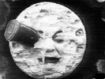

  
[Intangible Textual Heritage](../../index)  [Sky Lore](../index) 
[Index](index)  [Next](ml01) 

------------------------------------------------------------------------

[Buy this Book on
Kindle](https://www.amazon.com/exec/obidos/ASIN/B002L16MO4/internetsacredte)

------------------------------------------------------------------------

  
*Moon Lore*, by Timothy Harley, \[1885\], at Intangible Textual Heritage

------------------------------------------------------------------------

  [![VOYAGING TO THE
MOON.&lt;br&gt; &lt;i&gt;From Domingo Gonsales&lt;/i&gt; \[A.D.
1638\].&lt;br&gt; &lt;i&gt;See page&lt;/i&gt; 46](tn/front.jpg)  
Click to enlarge](img/front.jpg)  
VOYAGING TO THE MOON.  
*From Domingo Gonsales* \[A.D. 1638\].  
*See page* 46  

# Moon Lore

##### BY THE

## REV. TIMOTHY HARLEY, F.R.A.S.

\_\_\_\_\_\_\_\_\_\_\_\_\_\_\_\_\_\_\_\_\_\_\_\_

"And when the clear moon, with its soothing influences, rises full in my
view,--from the wall-like rocks, out of the damp underwood, the silvery
forms of past ages hover up to me, and soften the austere pleasure of
contemplation."

Goethe's "Faust." Hayward's Translation, London, 1855, p. 100.

\_\_\_\_\_\_\_\_\_\_\_\_\_\_\_\_\_\_\_\_\_\_\_\_

#### London; Swan Sonnenschein, Le Bas & Lowry

#### \[1885\]

###### Scanned, proofed and formatted at Intangible Textual Heritage, November 2003, by J. B. Hare. This text is in the public domain in the US because it was published prior to 1923.

------------------------------------------------------------------------

[Next: Quotations](ml01)

