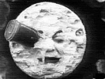

  
[Intangible Textual Heritage](../../index)  [Sky Lore](../index) 
[Index](index)  [Previous](ml04)  [Next](ml06) 

------------------------------------------------------------------------

[Buy this Book on
Kindle](https://www.amazon.com/exec/obidos/ASIN/B002L16MO4/internetsacredte)

------------------------------------------------------------------------

  
*Moon Lore*, by Timothy Harley, \[1885\], at Intangible Textual Heritage

------------------------------------------------------------------------

p. 1

# MOON LORE

## MOON SPOTS.

### I. INTRODUCTION.

WITH the invention of the telescope came an epoch in human history. To
Hans Lippershey, a Dutch optician, is accorded the honour of having
constructed the first astronomical telescope, which he made so early as
the 2nd of October, 1608. Galileo, hearing of this new wonder, set to
work, and produced and improved instrument, which he carried in triumph
to Venice, where it occasioned the intensest delight. Sir David Brewster
tells us that "the interest which the exhibition of the telescope
excited at Venice did not soon subside: Sirturi describes it as
amounting to frenzy. When he himself had succeeded in making one of
these instruments, he ascended the tower of St. Mark, where he might use
it without molestation. He was recognised, however, by a crowd in the
street, and such was the eagerness of their curiosity, that they took
possession of the wondrous tube, and detained the impatient philosopher
for several hours

p. 2

till they had successively witnessed its effects." [1](ml21.htm#fn_3) it was in May, 1609, that Galileo
turned his telescope on the moon. "The first observations of Galileo,"
says Flammarion, "did not make less noise than the discovery of America;
many saw in them another discovery of a new world much more interesting
than America, as it was beyond the earth. It is one of the most curious
episodes of history, that of the prodigious excitement which was caused
by the unveiling of the world of the moon." [2](ml21.htm#fn_4) Nor are we astonished at their
astonishment when they beheld mountains which have since been found to
be from 15,000 to 26,000 feet in height--highlands of the moon
indeed--far higher in proportion to the moon's diameter than any
elevations on the earth; when they saw the surface of the satellite
scooped out into deep valleys, or spread over with vast walled plains
from 130 to 140 miles across. No wonder that the followers of Aristotle
resented the explosion of their preconceived beliefs; for their master
had taught that the moon was perfectly spherical and smooth, and that
the spots were merely reflections of our own mountains. Other ancient
philosophers had said that these patches were shadows of opaque bodies
floating between the sun and the moon. But to the credit of Democritus
be it remembered that he propounded the opinion that the spots were
diversities or inequalities upon the lunar surface; and thus anticipated
by twenty centuries the disclosures of the telescope. The invention of
this invaluable appliance we have regarded

p. 3

as marking a great modern epoch; and what is usually written on the moon
is mainly a summary of results obtained through telescopic observation,
aided by other apparatus, and conducted by learned men. We now purpose
to go back to the ages when there were neither reflectors nor refractors
in existence; and to travel beyond the bounds of ascertained fact into
the regions of fiction, where abide the shades of superstition and the
dreamy forms of myth. Having promised a contribution to light
literature, we shall give to fancy a free rein, and levy taxes upon
poets and story-tellers, wits and humorists wherever they may be of
service. Much will have to be said, in the first place, of the man in
the moon, whom we must view as he has been manifested in the mask of
mirth, and also in the mirror of mythology. Then we shall present the
woman in the moon, who is less known than the immortal man. Next a hare
will be started; afterwards a frog, and other objects; and when we reach
the end of our excursion, if we mistake not, it will be confessed that
the moon has created more merriment, more marvel, and more mystery, than
all of the other orbs taken together.

But before we forget the fair moon in the society of its famous man, let
us soothe our spirits in sweet oblivion of discussions and
dissertations, while we survey its argentine glories with poetic
rapture. Like Shelley, we are all in love with

"That orbèd maiden, with white fire laden,  
Whom mortals call the moon." (*The Cloud*.)

p. 4

\[paragraph continues\] Our little loves,
who take the lowest seats in the domestic synagogue, if they cannot have
the moon by crying for it, will rush out, when they ought to be in bed,
and chant,

"Boys and girls come out to play,  
The moon doth shine as bright as day."

The young ladies of the family, without a tincture of affectation, will
languish as they gaze on the lovely Luna. Not, as a grumpy, grisly old
bear of a bachelor once said, "Because there's a man in it!" No; the
precious pets are fond of moonlight rather because they are the
daughters of Eve. They are in sympathy with all that is bright and
beautiful in the heavens above, and in the earth beneath; and it has
even been suspected that the only reason why they ever assume that
invisible round-about called crinoline is that, like the moon, they may
move in a circle. Our greatest men, likewise, are susceptible to Luna's
blandishments. In proof of this we may produce a story told by Mark
Lemon, at one time the able editor of Punch. By the way, an
irrepressible propensity to play upon words has reminded some one that
punch is always improved by the essence of lemon. But this we leave to
the bibulous, and go on with the story. Lord Brougham, speaking of the
salary attached to a new judgeship, said it was all moonshine. Lord
Lyndhurst, in his dry and waggish way, remarked, "May be so, my Lord
Harry; but I have a strong notion that, moonshine though it be,

p. 5

you would like to see the *first quarter* of it." [3](ml21.htm#fn_5) That Hibernian was a discriminating
admirer of the moon who said that the sun was a coward, because he
always went away as soon as it began to grow dark, and never came back
till it was light again; while the blessed moon stayed with us through
the forsaken night. And now, feeling refreshed with these exhilarating
meditations, we, for awhile, leave this lovable orb to those
astronomical stars who have studied the heavens from their earliest
history; and hasten to make ourselves acquainted with the proper study
of mankind, the ludicrous and legendary lunar man.

------------------------------------------------------------------------

[Next: II. The Man in the Moon](ml06)

