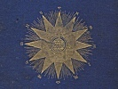

  
[Intangible Textual Heritage](../../index)  [Star Lore](../index) 
[Index](index)  [Previous](sb03)  [Next](sb05) 

------------------------------------------------------------------------

[Buy this Book at
Amazon.com](https://www.amazon.com/exec/obidos/ASIN/1417908904/internetsacredte)

------------------------------------------------------------------------

  
*Solar Biology*, by Hiram E. Butler, \[1887\], at Intangible Textual
Heritage

------------------------------------------------------------------------

p. xxv

# SOLAR BIOLOGY.

p. xxvi

  [  
Click to enlarge](img/diag01.jpg)  
DIAGRAM No. 1.  
THE SEVEN VITAL, OR CREATIVE PRINCIPLES.  

p. xxvii

DIAGRAM No. 1.  
THE SEVEN VITAL, OR CREATIVE PRINCIPLES.

This Diagram is a formula expressing the
creative energies of the Word, or Logos, the Greek of which is given in
the centre of the star. The double triangle expresses the dual relation
of the creative forces,—as male and female,—the ancient term of
expression being *theos-sophy*. Their triune expression is, first,
Spirit; second, Body; third, Soul. The seven points of the star are
expressive of the seven primate creative principles, as named on the
respective points; and when man conquers or subjugates these principles
to the higher will within himself, he then attains the ultimates which
stand expressed against the seven points. These seven creative
principles are found to have their solar expression in the seven planets
made use of in this system, and the different planetary signs are placed
against their appropriate point, or principle, in juxtaposition to the
sign of the zodiac in which they find their most natural or perfect
expression. These seven points are called the seven vital principles.
The body of man, being an epitome of the solar man, or nature, cannot
exist without having these seven principles in working order, while he
can live without the five serving principles provided he be served by
others. The serpent encompassing the triangles is expressive of the
circle of eternity, also of the psychic or sex principles of nature,
which is active in the work of creation or generation.

p. xxviii

  [  
Click to enlarge](img/diag02.jpg)  
DIAGRAM No. 2.  
THE SUN'S ZODIAC.  

p. xxix

DIAGRAM No. 2.  
THE SUN'S ZODIAC.

The above is a diagram of the divisions
of the solar fluid as designated by the twelve signs of the zodiac,
through which the earth passes during the twelve months of the year in
its circuit around the sun.

p. xxx

  [  
Click to enlarge](img/diag03.jpg)  
DIAGRAM No. 3.  
THE SOLAR MAN.  

p. xxxi

DIAGRAM No. 3.  
THE SOLAR MAN.

The signs around this figure point to the
different functions of the body to which they belong, and show the
relatedness of the signs represented in [Diagram No. 2](#img_diag02) to
their respective function of the human system.

p. xxxii

  [  
Click to enlarge](img/diag04.jpg)  
DIAGRAM No. 4.  
THE SOLAR SYSTEM.  

p. xxxiii

DIAGRAM No. 4.  
THE SOLAR SYSTEM.

This shows the sun and its family of
worlds in their relative relations to each other in their circuit around
their common centre and through the twelve signs of the zodiac. For
further particulars, see page [40](sb07.htm#page_40).

p. xxxiv

  [  
Click to enlarge](img/diag05.jpg)  
DIAGRAM No. 5.  
THE EARTH'S ZODIAC.  

p. xxxv

DIAGRAM No. 5.  
THE EARTH'S ZODIAC.

The above presents a sectional view of
the solar system, and illustrates the earth's zodiac, with the twelve
signs through which the moon passes every 27 days, 7 hours, 43 minutes,
5 seconds. The full functions of man's physical nature find expression
in the earth's zodiac on a reduced scale from that of the sun's zodiac,
though in reversed positions, and having relation to polarity instead of
quality.

p. xxxvi

  [  
Click to enlarge](img/diag06.jpg)  
DIAGRAM No. 6.  
THE SOLAR WOMAN.  

p. xxxvii

DIAGRAM No. 6.  
THE SOLAR WOMAN.

The above diagram gives a combined
expression of the relation which the signs of the zodiac sustain to the
different portions of the body, and also of the natural position and
relation of the seven planets to the seven vital functions of the
system. The form of woman is selected, as being the mother principle and
mould of all things.

p. xxxviii

  [  
Click to enlarge](img/diag07.jpg)  
DIAGRAM No. 7.  
THE FUTURE TEMPLE AS SEEN BY JOHN.  

p. xxxix

DIAGRAM No. 7.  
THE FUTURE TEMPLE AS SEEN BY JOHN.

The picture of the Temple and arrangement
of the controlling influence of the heavens in the earth, as seen by
John (see Revelations xxi.). The above gives the twelve gates of the
Temple in their respective trinities, with the name of the corresponding
tribe and sign to which they belong; also the twelve foundations, with
the names of the twelve apostles of Jesus. The letters N., S., E., W.,
are North, South, East, West. The circle is squared by the perfect law
of God in its triune relation: first, or outer circle, the physical
body; second, the soul; third, and innermost, the spiritual. This being
squared by the perfect law, is a perfecting of the effort made by
Solomon to carry out the injunction given to Moses: "See that thou make
all things after the pattern shown thee in the mount. . . . The pattern
of the heavens."

------------------------------------------------------------------------

[Next: Introduction](sb05)
