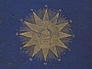

  
[Intangible Textual Heritage](../../index)  [Star Lore](../index) 
[Index](index)  [Previous](sb14)  [Next](sb16) 

------------------------------------------------------------------------

[Buy this Book at
Amazon.com](https://www.amazon.com/exec/obidos/ASIN/1417908904/internetsacredte)

------------------------------------------------------------------------

  
*Solar Biology*, by Hiram E. Butler, \[1887\], at Intangible Textual
Heritage

------------------------------------------------------------------------

p. 132

### CHAPTER X.

#### THE TWELVE [POLARITIES](errata.htm#6) OF LEO.

♌ (*Leo*), *with the Moon in* ♈ (*Aries*).

This nature is produced by a firm will on
the part of the parents, and gives the child a great determination and
powerful will to execute the innate nature expressed in the sign Leo.

Such persons will be apt to go to too great extremes in everything. If
they believe a thing is right or wrong, they are as immovable as it is
possible to be; kind and non-combative, but persistent; and if they
engage in study, philosophy, or business, they will carry it to the
uttermost extreme.

If religious, their zeal is unbounded. If inclined to mental philosophy,
there will be great liability to insanity. Frequently insane on
religious .and scientific subjects combined.

Parents ought, while such children are young and under their control, to
force them to hear to reason, and to subject their will to it, showing
them the folly of their extreme tenacity. Such persons ought to have a
good education, and be qualified for some profession, for it is wholly
impractical for them to work at physical labor. They always incline to
be at the head of whatever sphere of use they occupy, yet are not bossy,
but desire to be recognized as head because of their superior ability.
Such persons have an innate feeling

p. 133

that they occupy some peculiar sphere of use in the world, and
frequently do, as controllers in the realm of love and intellect.

This polarity gives liability to difficulties of the brain and general
debility.

♌ (*Leo*), *with the Moon in* ♉ (*Taurus*).

This is the result of a strong love nature on the part of the parents,
and produces in the child a passion for the study of nature in all its
departments, and especially so for human nature, mental and physical.
Have much anxiety concerning success in life; have good business
intuitions, but greatly prefer the realm of mental philosophy.

When other things are favorable, the medical profession would be, by all
means, the best choice for them, because it places in their hands
knowledge which facilitates their research in all directions in which
their nature tends. They love a hygienic life in general.

This gives strong vitativeness; consequently not much liability to any
disease, except from exhaustion.

♌ (*Leo*), *with the Moon in* ♊ (*Gemini*).

This is the result of a peculiarly studious condition in the minds of
the parents, and imparts to the child strong educational tendencies and
abilities; gives order, art, and mechanics, in a general way; but this
is controlled in its minutiæ by planetary conditions. There is danger of
the child being too active, and overdoing his powers, physically,
mentally, or sexually.

Such persons are controlled by rules of life, and love

p. 134

to work under law, but require that the law shall be absolute and
undeviating. Parents should be careful, and establish in the young
child's mind proper rules of restraint and guidance, and the idea of
usefulness in all they do.

This polarity increases the liability to consumption, and a rheumatic or
palsied condition of the hands and arms.

♌ (*Leo*), *with the Moon in* ♋ (*Cancer*).

This arises from a strong paternal care and love for the family, and for
home and its relations; and endows the child with a great love in this
direction, turning all their active thoughtfulness towards the care of
the family and the home. It gives great sympathy and sensitiveness to
the thoughts of those they love, but a liability to extremes; at one
time buoyant and happy, and the next moment sad and depressed. Are too
easily wounded, even by a look or a thoughtless word. Have much
practical business energy, but are liable to all the extremes of Leo's
nature. Such children should be very carefully educated, and qualified
for business life.

In the case of ladies, a family life would be decidedly their choice, as
they would love to care for children.

This polarity gives a greater liability to mistakes in marriage than
most others.

It creates a tendency to diseases of the chest, of the circulatory,
digestive, and also of the nervous system.

It gives a clear, logical, and scientific tendency to the mind, with
qualifications for a literary life.

p. 135

♌ (*Leo*), *with the Moon in* ♌ (*Leo*).

This nature comes from a happy, contented, harmonious condition of the
parents’ mind, and gives to the child a very independent, clear-minded,
and intuitive nature, not affected by the likes and dislikes of others.
Are capable of standing alone, going their own way, and prosecuting
their own aims, and thereby make good attainments in life. This polarity
counteracts the weaknesses and liabilities to extremes belonging to the
innate nature of Leo, and gives a feeling of independence of others, as
they draw their inspirations from the central source of life; and being
polarized in their own life quality, they do not reciprocate with the
other portions of the body as freely as is Leo's custom when otherwise
polarized, but revolve within their own sphere of usefulness, in
whatever direction it may take; being greatly shut up within themselves,
they are less liable to the diseases common to Leo.

Being polarized in their own sign, they will find most harmonious
conjunction with a mate born in the same function, but otherwise
polarized.

♌ (*Leo*), *with the Moon in* ♍ (*Virgo*).

This nature arises from conditions of great harmony in the parents, with
a love for the presence and surroundings of pure nature, and endows the
child with a strong love of purity of conditions and harmony of
surroundings that are not always easy of attainment, and on that account
they have a tendency to criticise, together with a restless, anxious,
dissatisfied feeling, sometimes

p. 136

amounting to impetuosity. They are disposed to make fine points in
thought, and are subject to eccentricities and idiosyncrasies.

Leo is very critical in philosophical and metaphysical reasonings, and
with the Virgo polarity relating them to external things, they are made
more critical in relation to words and other externalities than any of
the other polarities.

They are liable to sexual weakness, and inclined to act out their
impulses without restraint. It is hard for such persons to realize that
they ought to restrain their natural inclinations in any direction.

This polarity gives good musical abilities, art tendencies, also
adaptation to literature and the medical, profession, as they have
inclinations towards a hygienic life. They are liable to weak digestion
and weakness. in the region of the diaphragm.

♌ (*Leo*), *with the Moon in* ♎ (*Libra*).

This condition is usually produced by a strong religious sentiment on
the part of the parents, and gives the child fine and accurate
intuitions and facilitates rapid decisions. Gives some adaptability to
literary and educational pursuits. It frequently gives power of
spiritual vision, also mental and physical vigor; and if these persons
live perfectly chaste lives, they will be natural prophets. They could
soon be developed so as. to foretell every event, even pestilences,
cyclones, and violent storms; on the other hand, it gives activity of
the sexual function, and if they are indulgent in that direction, it
will destroy all their fine spiritual powers,

p. 137

and weaken them mentally and physically, as all the spontaneity of their
hearty action would flow out in that direction.

This polarity gives some liability to weakness of the spine.

♌ (*Leo*), *with the Moon in* ♏ (*Scorpio*).

This nature results from the father being absorbed in the externalities
of business or social life (although the fatherly mind is sometimes
derived from the mother).

This polarity endows the person with a positive nature, counteracting
the sympathetic tendencies of Leo, and turning the active heart energies
into a love of show and external appearances. It gives pride,
self-esteem, egotism, and arrogance, and their course in life will
depend mainly upon planetary conditions; but as opposites are attracted
in marriage, the above-named tendencies may be softened down by interior
inheritance from the mother.

♌ (*Leo*), *with the Moon in* ♐ (*Sagittarius*).

This nature is the result of a very active and expressive mental
condition on the part of the parents, and makes a very restless, active,
positive mind in the child, who will be apt to want an unknown
something, and be constantly dissatisfied with surroundings. Would be
practical and mechanical in business. It gives an inclination for
religion, and some desire for the ministry. Intensifies all the
activities of Leo's nature, and opens all the doors leading to extremes.
Endows the

p. 138

mind with a tendency to law, order, and rule, and an intolerance of any
deviation from the law of right in their own minds. Are inclined to do
as they are done by, in all directions, but are very apt to go to law in
trifling cases; to be too intolerant with their children; too exacting
with those under their care, in every respect; and in whatever direction
their mind turns, are apt to go to great extremes.

Parents should restrain the activity of such children, and teach them to
have a time to work, a time to rest, a time to play—a time for
everything. This polarity gives great activity in the sexual system, and
parents cannot use too much care in preventing bad habits in these
children. None, especially of this polarity, should, be allowed to sleep
late in the morning, for then is the time bad habits of unnatural sex
activity are usually formed. Such children should be trained to most
vigorous and decisive habits in the care of their own persons; such as
bounding out of bed on awaking in the morning, cold sponge baths,
followed by brisk rubbing, and out-door exercise in the morning.

This polarity increases the liability to physical exhaustion, weakness
of chest, longs, etc.

♌ (*Leo*), *with the Moon in* ♑ (*Capricorn*).

This arises from a condition of great mental activity and animation in
relation to business pursuits on the part of the parents, and inclines
the child to be bright and active in business, well adapted for trade,
with tendency to spread out largely. It counteracts much of the
sympathetic nature of Leo, and makes the person

p. 139

liable to judge others by themselves, and be rather hard and exacting.
Gives considerable love for money and moneyed influence, and stimulates
selfishness; but the love and sympathetic nature of Leo so restrains
this that it scarcely appears. They are great lovers of music. Their
sense of cleanliness and uncleanliness, of harmonious sounds and
actions, is so acute that they are apt to be (ladies especially) almost
morbid in this respect; they often restrain even their breathing and
other normal actions of the body, through their extra fastidiousness,
which brings on lack of circulation, and consequent disease.

♌ (*Leo*), *with the Moon in* ♒ (*Aquarius*).

This comes from a strong love of society, and a disposition to conform
to the public mind, on the part of the parents, and gives a ruling
desire to be among and deal with the many; qualifies the mind to
*please* the people readily and form acquaintances easily, and
contributes to the love of travel. It often destroys discrimination
between friends and strangers, and tends to make one an adventurer.
Planetary conditions may largely change this. But careful education in
the customs of society and rules of business will be necessary to guard
against these tendencies. With proper planetary influences it gives
adaptation to public life in such directions as thereby indicated. Such
persons would incline to, a career of travel and would not be satisfied
to settle down outside of city life.

This polarity gives some tendency to nerve and rheumatic difficulties,
with probable affection of the lungs.

p. 140

♌ (*Leo*), *with the Moon in* ♓ (*Pisces*).

This nature comes from a mechanical tendency of mind and a restless
impetuosity on the part of the parents, and the offspring are apt to be
cross as babies, restless and uneasy as children.

It gives inclination to study and research, but, unless harmonized by
planetary conditions, are too restless to be confined to it. Is apt to
produce dissatisfaction with the family relations. Gives a tendency to
be on the feet and to travel, and a desire for knowledge; and, in
abnormal conditions, makes people meddlesome and impertinent; and
sometimes, in old ladies, inclines to mischief-making.

As mechanics, they will be diligent, accurate, and practical. If
planetary conditions favor study and research, will be apt to make great
attainments in such directions.

------------------------------------------------------------------------

[Next: Chapter XI. The Twelve Polarities of Virgo](sb16)
