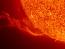

  
[Intangible Textual Heritage](../../index)  [Sky Lore](../index) 
[Index](index)  [Previous](slaa07)  [Next](slaa09) 

------------------------------------------------------------------------

[Buy this Book at
Amazon.com](https://www.amazon.com/exec/obidos/ASIN/1585090441/internetsacredte)

------------------------------------------------------------------------

[Buy this Book on
Kindle](https://www.amazon.com/exec/obidos/ASIN/B002L16OXS/internetsacredte)

------------------------------------------------------------------------

  
*Sun Lore of All Ages*, by William Tyler Olcott, \[1914\], at Intangible
Textual Heritage

------------------------------------------------------------------------

p. 138 p. 139

p. 140 p. 141

### Chapter VI

#### Sun Worship

THE pre-eminence of the Sun, as the fountain-head of life and man's
well-being, must have rendered it at a date almost contemporaneous with
the birth of the race, the chief object of man's worship.

"It was," says Karnes, [1](#fn_43) "of all the
different objects of idolatry the most excusable, for upon the sun
depend health, vigour, and cheerfulness, and during its retirement all
is dark and disconsolate." Hence, as we shall see, the chief masculine
deity of every nation which was the chief object of their idolatrous
worship, is in every case to be identified with the sun.

The Abbé Banier wrote in like vein: [2](#fn_44)
"Nothing was more capable of seducing men than the Heavenly Bodies, and
the sun especially. His beauty, the bright splendour of his beams, the
rapidity of his course, *exultavit ut Gigus ad currendam viam*,

p. 142

his regularity in enlightening the whole earth by turns, and in
diffusing Light and Fertility all around, essential characters of the
Divinity who is Himself the light and source of everything that exists,
all these were but too capable of impressing the gross minds of men with
a belief that there was no other God but the sun, and that this splendid
luminary was the throne of the Divinity. God had fixed his habitation in
the heavens, and they saw nothing that bore more marks of Divinity than
the sun." In the words of Diodorus Siculus: "Men in earlier times struck
with the beauty of the Universe, with the splendour and regularity which
everywhere were in evidence, made no doubt that there was some Divinity
who therein presided, and they adored the sun as expressing the likeness
of the Deity."

The worship of the sun was inevitable, and its deification was the
source of all idolatry in every part of the world. It was sunrise that
inspired the first prayers uttered by man, calling him to acts of
devotion, bidding him raise an altar and kindle sacrificial flames.

Before the Sun's all-glorious shrine the first men knelt and raised
their voices in praise and supplication, fully confirmed in the belief
that their prayers were heard and answered.

Nothing proves so much the antiquity of solar

p. 143

idolatry as the care Moses took to prohibit it. "Take care," said he to
the Israelites, "lest when you lift up your eyes to Heaven and see the
sun, the moon, and all the stars, you be seduced and drawn away to pay
worship and adoration to the creatures which the Lord your God has made
for the service of all the nations under Heaven." Then we have the
mention of Josiah taking away the horses that the king of Judah had
given to the sun, and burning the chariot of the sun with fire. These
references agree perfectly with the recognition in Palmyra of the Lord
Sun, Baal Shemesh, and with the identification of the Assyrian Bel, and
the Tyrian Baal with the sun.

Again, we have good evidence of the antiquity of Sun worship in the fact
that the earliest authentic date that has been handed down to us was
inscribed on the foundation stone of the temple of the Sun-God at
Sippara in Babylon by Naram-Sin, son of Sargon. There has also been
recovered an ancient tablet, an inscribed memorial of the reign of one
of the early kings of Babylon, on which is sculptured a representation
of the worship of the Sun-God by the king and his attendants. In the
sculpture, the Sun-God appears seated on a throne beneath an open canopy
shrine. He has a long beard and streaming hair, like most conceptions of
the Sun-God, and in his hand he holds a ring, the

p. 144

emblem of time, and a short stick too small for a sceptre, which some
archæologists think represents the fire-stick which was so closely
associated with the Sun-God. On a small table-altar, which stands before
him, is a large disk ornamented with four star-like limbs, and four sets
of wave-like rays, while above the group is the inscription: "The Disk
of the Sun-God, and the rays (of his) eyes."

The scene clearly indicates the fact that the priests of Sippara were
worshippers of the solar disk, and solar rays, and their creed seems to
bear a close resemblance to that in vogue in the 18th Egyptian dynasty.
The inscriptions on this memorial tablet are a valuable record of the
religious life and ceremonial of the Babylonian temples.

he Babylonians, whose deity Shamash, the Sun-God, was worshipped at
Sippara and Larsa, believed that in the firmament there were two
doors—one in the east, and the other in the west. These were used by the
Sun-God in his daily journey across the sky. He entered through the
eastern door, and made his exit through the western portal. One
tradition records that he rode in a chariot on his daily course drawn by
two spirited horses.

In the representations of the Sun-God on the ancient cylinder seals,
however, he is generally

p. 145

depicted journeying on foot. Each evening when the Sun-God disappeared
in the west, he feasted and rested from his exertions in the abode of
the gods, the underworld.

The authorities do not agree as to the place where the worship of the
Sun was introduced, but perhaps those who claim Chaldea as the
birthplace of Sun worship have the best of the argument, as it is well
known that the Chaldeans were the first who observed the motion of the
heavenly bodies, and astrology flourished in this reign in the earliest
times. The principal deities worshipped by the Chaldeans were arranged
in triads of greater and less dignity, nearly all the members of these
being personifications of the heavens or the heavenly bodies.

The first triad comprised Ana, the heavens, or the hidden Sun, Father of
Gods, Lord of Darkness, Lord of Spirits. Next in order came Bil, also a
Sun-God, the Ruler, the Lord, the source of kingly power. His name has
the same significance as Baal, and he personifies the same aspect of
nature, the Sun ruling in the heavens.

The gods of the Canaanite nations, Moloch, Baal, Chemosh, Baalzebub, and
Thammuz, were all personifications of the sun or the sun's rays,
considered under one aspect or another. These cruel gods, to whom human
sacrifices were offered, represented the strong fierce summer sun.

p. 146

Solar worship was the predominant feature of the religion of the
Phœnicians, and the source of their mythology. Baal and Ashtoreth, their
chief divinities, were unquestionably the Sun and Moon, and a great
festival in honour of the Sun-God, called "the awakening of Herakles,"
was held annually at Tyre, in February and March, representing the
returning power of the Sun in spring. The Phœnician Sun-God, Melkarth,
belonged to the line of Bel or Baal, and was the tutelary divinity of
the powerful city of Tyre. Melkarth personified the Sun of spring,
gradually growing more and more powerful as it mounts to the skies;
hence the Phœnicians regarded him as a god of the harvests, and of the
table, the god who brings joy in his train. Quails were offered as
sacrifices at his altars, and as it was supposed that he presided over
dreams, the sick and infirm were sent to sleep in his temples that they
might receive in their dreams some premonition of their approaching
recovery. The white poplar was particularly dedicated to his service.
His votaries celebrated his worship with fanatical rites, invoking him
with loud cries, and cutting themselves with knives. Strangely enough,
in the North American Indian worship of the sun, a similar custom of
self-mutilation is undergone in the sun-dance ceremonial.

The hardy Tyrian navigators soon spread this

p. 147

solar worship from island to island even as far as Gades, where a flame
burned continually in his temples. His name signifies, according to
some, "the King of the City" or "the powerful King."

The Phœnicians also adored the Supreme Being under the name of
Bel-Samen, and it is a remarkable fact that the Irish peasants have a
custom, when wishing a person good luck, to say, "the blessing of Bel,
and the blessing of Sam-hain be with you," that is, of the Sun and Moon.

The Israelites found the worship of Baal already prevailing in the
interior of Palestine, and the adjacent countries on the east, when they
came out of Egypt.

We know little of the ritualistic worship of Baal save that high places
and groves were especially devoted to his honour, and regarded as
sacred. He had a numerous priesthood, and a passage in Jeremiah reveals
that human beings were sacrificed to his worship.

The ancient Persians were Sun worshippers, and Mithras, their Supreme
Deity, represented the orb of day. Among these people, however, Fire
worship soon became the predominating religion, which flourished under
the guiding hand of Zoroaster.

The early inhabitants of Armenia likewise worshipped the Sun, and on
festival occasions

p. 148

they were wont to sacrifice a horse to the object of their worship.

One of the most interesting evidences of ancient Sun worship has been
brought to light in Syria, during the last few years, by German
excavators who have been engaged in exposing the wonderful and imposing
ruins at Baalbeck. Chief among these in importance is the Great Temple
of the Sun, dedicated to Jupiter, and identified with Baal and the Sun.
With him were associated both Venus and Mercury, under whose triple
protection the ancient city of Heliopolis was placed. Unfortunately, the
Great Temple has been almost entirely destroyed. All that remains are
six columns of the peristyle, capped with Corinthian capitals, and
joined by an elaborately decorated and massive entablature. An
inscription on the great portico states that the temple was erected to
the Great Gods of Heliopolis by Antonius.

In Egypt we find Sun worship exalted to the highest degree, and the Sun
may well be regarded as the central object of the Egyptian religion.
Diodorus says: "The first generation of men in Egypt, contemplating the
beauty of the superior world, and admiring with astonishment the frame
and order of the universe, imagined that there were two chief gods,
eternal and primary, the Sun and Moon, the first of whom they called
'Osiris,' the

p. 149

other 'Isis.' They held that these gods governed the whole world
cherishing and increasing all things."

The Egyptian priests taught that all their great deities were once men,
but that after they died their souls migrated into some one or other of
the heavenly bodies. As Osiris was declared to be the Sun, it is evident
that, according to this system, the soul of the man was thought to have
been translated into the solar orb, so that "when" says Faber, [1](#fn_45) "the pagans worshipped the sun as their
principal divinity they did not worship him simply and absolutely as the
mere chief of the heavenly luminaries, but they adored in conjunction
with him and perpetually distinguished by his name the patriarch Noah,
whose soul after death they feigned to have migrated into that orb, and
to have become the intellectual regent of it. The person worshipped in
the sun was not simply Noah but Noah viewed as a transmigratory
reappearance of Adam. The setting and rising of the sun really meant the
entrance into and the quitting of the Ark, or his death and
resurrection."

The setting of the sun in the west at night, and its rising again in the
east the following morning, presented a mystery to which the Egyptians
attached great importance. To them the disappearance

p. 150

of the sun signified the end of a contest, the Sun-God vanquished by the
demons of the darkness, descended to the realm of death. "In the *Book
of the Dead*" says Tylor, [1](#fn_46) "it is
written that the departed souls descend with the Sun-God through the
western gate and travel with him among the fields and rivers of the
underworld."

The war that the Sun waged with his enemies did not, however, end with
his disappearance in the west at eve of day. All through the hours of
darkness the battle went on in the underworld, until, finally, the sun
gained the upper hand, and emerged victorious in the east, all glorious
and triumphant to gladden the hearts of men, and proclaim the
immortality of his soul; for, to the Egyptians, the soul as wholly
identified with the Sun-God, and partook of all the vicissitudes that
befell him. It died with him at nightfall, fought with him against the
powers of darkness in the underworld, and renewed its life with him in
the glories of the dawn.

The Egyptians, in the deification of the sun, considered the luminary in
its different aspects, separating the light from the heat of the sun,
and the orb from the rays. Egyptian Sun worship was therefore
polytheistic, and several distinct deities were worshipped as Sun-Gods.
Thus,

p. 151

there were Sun-Gods representing the physical orb, the intellectual Sun,
the sun considered as the source of heat, and the source of light, the
power of the sun, the sun in the firmament, and the Sun in his
resting-place.

It is quite impossible in a work of this nature to adequately treat the
subject of Egyptian Sun worship. Volumes have been written on
[the](errata.htm#0) subject and space forbids more than a brief account
of the worship of the more important of the Egyptian solar deities.

The worship of the Sun-Gods Ra and Osiris was the most ancient religion
mentioned on the oldest monuments of Egypt. "They are those," says
Tiele, [1](#fn_47) "which in after times
prevailed most generally and may be said to have formed the foundation
of the national religion."

Undoubtedly the most important of the Egyptian Sun-Gods was Ra, and
there appear to have been few gods in Egypt who were not at one time or
another identified with him. As far back as Egyptian history reaches
this Sun-God appears, as where in the pictures on the mummy cases, Ra,
the Sun, is seen travelling in his boat through the upper and lower
regions of the Universe, and his worship appears to have been universal
throughout Egypt.

p. 152

Ra personified the physical sun, the glorious mid-day sun ruling the
firmament, and symbolised to the ancient Egyptians the majesty and power
of kings. He was worshipped as an omnipotent and all-powerful god under
the names Ra and Amen-Ra. [1](#fn_48)

Wilkinson [2](#fn_49) tells us that the name of
this deity was pronounced Rä, and with the definite article Pi prefixed
it was the same as Phrah, or, as we erroneously call it, Pharaoh of the
Scriptures. The Hebrew word Phrah is no other than the Memphitic name of
the sun.

The hawk and globe emblems of the sun are placed over the banners or the
figures of the Egyptian kings in the sculptures to denote this title.
This adoption of the name of the sun as a regal title was probably owing
to the idea that, as the Sun was the chief of the heavenly bodies, he
was a fit emblem of the king who was the ruler over all the earth. In
many of the kingly titles the phonetic nomen commenced with the name of
Ra, as the Rameses, and others, and the expression "living forever like
the sun, the splendid Phrê," are common on all the obelisks and
dedicatory inscriptions.

p. 153

The Sun-God Ra was usually represented as a man with a hawk's head,
surmounted by a globe or disk of the sun, from which an asp issued. His
figure, and that of the disk were generally painted in red colour,
appropriately suggesting the heat of the mid-day sun. He is sometimes
accompanied by a scarabæus or sacred beetle, which was an emblem of the
sun throughout Egypt.

Pa-ra, the city of the Sun, or, as the Greeks called it, Heliopolis, was
the small but celebrated city of Lower Egypt where Ra was especially
worshipped. It lies a little east of the Nile and is not far from the
spot where Memphis was built. Its usual name among the Egyptians was An
or On. Plutarch has this reference to the Sun worship at Heliopolis:
"Those who minister to the god of Heliopolis never carry any wine into
the temple, looking upon it as indecent to drink it during the day when
under the immediate inspection of their Lord and King."

The priesthood of the Sun were noted for their learning. They excelled
in their knowledge of astronomy and all branches of science.

The rat was sacred to Ra, and his votaries were forbidden to eat the
rodent.

The best loved of all the Egyptian Sun-Gods, and the first object of
their idolatry was Osiris (the one who sees clear), personifying the
setting

p. 154

sun. The mysterious and daily disappearance of the orb of day exercised
over the Egyptians a phenomenal power. The sun then appeared to them, as
Keary beautifully describes it in his *Dawn of History* "to veil his
glory and sheathe his dazzling beams in a lovely many-coloured radiance
which soothed and gladdened the weary eyes and hearts of men, and
enabled them to gaze fearlessly and lovingly on the dreaded orb from
which during the day they had been obliged to turn their eyes."

Osiris was distinctly a god of the life eternal. The Egyptians believed
that when he sank from sight behind the western hills the souls of the
departed were in his retinue, and that, in his nightly sojourn in the
underworld, he held high court and judged the dead. Thus, in the
inscriptions on the Egyptian temples, we see Osiris in his character as
Judge figured in the sacred blue, holding in one hand a sceptre, and in
the other the emblem of life, his head surmounted with the double crown
of Upper and Lower Egypt.

"In the judgment scenes," says Keary, [1](#fn_50) "he appears seated on a throne at the end
of a solemn hall of trial, to which the soul has been arraigned, and in
the centre of which stands the fateful balance, where in the presence of
the evil accusing spirit and of the friendly funeral gods and genii

p. 155

who stand around, the heart of man is weighed against a symbol of Divine
Truth."

The Sun-God Osiris was therefore to the Egyptians a deity of the living,
and a god of the dead, a link connecting the earthly life with the life
eternal, the upper and the under worlds, and consequently was
personified as two distinct characters. One, as we have seen, depicts
him as Judge of the Dead. In his capacity as an earth dweller, Osiris
was worshipped under the form of a bull, the Apis, who by successive
incarnations never abandoned his home land, and the sight of those who
worshipped him through successive ages.

The Egyptians regarded the bull as the living representation of the
deity, and believed that the soul of the god tenanted the body of the
animal, thence deeming the bull the very same as Osiris himself.

The seat of Osiris worship in Egypt was at Thinis (Teni) in Upper Egypt,
on the west bank of the Nile between Thebes and Memphis. Osiris is
frequently alluded to as "Lord of Abydos," a city in the immediate
vicinity of Thinis, and at this place there have been discovered many
temples dedicated to his worship.

That Osiris was a Sun-God is clearly indicated by a number of
expressions used regarding him taken from the inscriptions. In the hymns
his

p. 156

accession to the throne of his father is compared to the rising of the
sun, and it is even said of him in so many words: "He glitters on the
horizon, he sends out rays of light from his double feather, inundates
the world with it as the sun from out the highest heaven." Like the sun
he is called in the sacred songs, "Lord of the length of time." One of
his usual appellations is, "Mysterious soul of the Lord of the Disk," or
simply "Soul of the Sun."

The Egyptians often called Osiris "Unefer," that is, the good being,
representing the beneficent power of the sun that triumphs always over
the powers of darkness. In conclusion, the story of the death of Osiris
agrees closely with the solar sunset phenomenon, and renders the
personification of Osiris as the setting sun a true one.

The most venerable of all the Egyptian Sun-Gods, if not the most
popular, was Atum or Amum, personifying the sun after it had set, and
was hid from view.

There are two derivations of the name Amum, one meaning, "that which
brings to light," the other simply expressing the invitation or greeting
of welcome, "Come." In deifying Amum the Egyptians worshipped the
unrevealed and unseen Creator of all things, the source of all things,
the Ruler of Eternity, whence everything came, and to which all things
would return.

p. 157

On the inscriptions, the figure of Amum was coloured blue, the sacred
colour of the source of life; the figure was that of a man with either a
human head, or a man's head concealed by the head and horns of a ram.
The word "ram" meaning concealment in the Egyptian language.

In the Sun-God Horus we see the dawn personified, and the triumphant
conqueror of the shades of darkness and the demons of the underworld
emerges in the glorious light of victory each morning. He was figured as
the eldest son of Osiris, a strong vigorous youth, who avenged his
father by waging a successful war against the monster who had swallowed
him up.

Horus is depicted in the inscriptions as sailing forth from the
underworld up the eastern sky at dawn, piercing the great python, born
of night, as he advances.

"The ultimate victory of life over death, of truth and goodness over
falsehood and wrong," says Keary, [1](#fn_51)
"were the moral lessons which this parable of the sun's rising read to
the ancient Egyptians."

The resemblance of lions to the sun is borne out by the fact that the
Egyptians placed the figures of lions under the throne of Horus. This
deity was sometimes regarded as the God of Silence,

p. 158

and represented as a child with his finger held up to his lips.

In addition to the previously mentioned personifications of the Sun,
Egyptian Sun worship included a worship of the actual disk of the Sun.
This form of worship was in vogue in the reign of Amenophis III., its
first appearance on the monuments being in the 11th year of that
monarch's reign.

The worship of the solar disk, or Aten, became the sole object of
adoration in the reign of Amenhôtop IV. This monarch, in fact, forbade
the worship of any god save this, the "great living disk of the sun,"
and caused the names of all other gods to be erased from the monuments,
and their images to be destroyed.

In the hymns, this deity is referred to as he who created "the far
heavens and men, beasts and birds; he strengtheneth the eyes with his
beams, and when he showeth himself all flowers live and grow, the
meadows flourish at his up-going, and are drunken at his feet, all
cattle skip on their feet, and the birds that are in the marsh flutter
for joy. It is he who bringeth the years, createth the months, maketh
the days, calculateth the hours of time by whom men reckon."

In his zeal to make the god of the disk preeminent, King Amenhôtop IV
changed his name

p. 159

to one which signified "gleam of the sun's disk." The death of this
monarch resulted in a great reaction, the old gods being restored to
their original favour.

Although the solar personifications alluded to would appear to include
all the Sun deities worshipped by the Egyptians, there were several
minor Sun-Gods that had a place in their religion, chief among these
being the god Ptah, personifying the life-giving power of the sun. This
god was worshipped with great magnificence at Memphis.

The Sun-God Mandoo personified the power of the sun's rays at mid-day in
summer. He was regarded as a god of vengeance and destruction, and a
leader in time of war.

The rays of the sun were personified in the gods Gom, Moni, and Kons,
who are always referred to as the sons of the Sun-God. The sun's rays,
personified in the deity Sekhet or Pasht, had a feminine significance.
This goddess was figured with the head of a lioness, and it is said she
was at once feared and loved. Her name Pasht means the lioness, and was
perhaps suggested by the fierceness of the sun's rays, answering to the
lioness's ferocious strength, or the angry light in her eyes. Another
name for this goddess was "the Lady of the Cave," and her worship,
though common throughout Egypt, had its seat at Bubastis.

p. 160

Tiele considers that Set, the enemy and brother of Osiris, was also a
Sun-God, as he is sometimes called "the Great Lord of Heaven," and "the
Spy." He personified the fierce and terrible desolation wrought by the
sun's power.

------------------------------------------------------------------------

### Footnotes

[141:1](slaa08.htm#fr_43) *History of Man*, Hon.
Henry Home of Kames.

[141:2](slaa08.htm#fr_44) *The Mythology and
Fables of the Ancients*, Abbé Banier.

[149:1](slaa08.htm#fr_45) *The Origin of Pagan
Idolatry*, George Stanley Faber.

[150:1](slaa08.htm#fr_46) *Primitive Culture*,
Edward B. Tylor.

[151:1](slaa08.htm#fr_47) *History of the
Egyptian Religion*, Dr. C. P. Tiele.

[152:1](slaa08.htm#fr_48) It is a singular fact
that the great Polynesian name for the Sun-God is also Ra.

[152:2](slaa08.htm#fr_49) *Manners and Customs
of the Ancient Egyptians*, Sir J. Gardner Wilkinson.

[154:1](slaa08.htm#fr_50) *Dawn of History*, C.
F. Keary.

[157:1](slaa08.htm#fr_51) *Dawn of History*, C.
F. Keary.

------------------------------------------------------------------------

[Next: Chapter VII. Sun Worship (*Continued*)](slaa09)

