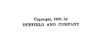

  
[Intangible Textual Heritage](../../index)  [Atlantis](../index) 
[Index](index)  [Next](ida01) 

------------------------------------------------------------------------

[Buy this Book at
Amazon.com](https://www.amazon.com/exec/obidos/ASIN/B0022NGNEU/internetsacredte)

------------------------------------------------------------------------

  
*Atlantida (L'Atlantide)*, by Pierre Benoit, \[1920\], at Intangible
Textual Heritage

------------------------------------------------------------------------

# ATLANTIDA

## (*L’Atlantide*)

###### BY

### PIERRE BENOIT

###### TRANSLATED BY

##### MARY C. TONGUE AND MARY ROSS

#### NEW YORK

#### DUFFIELD AND COMPANY

#### \[1920\]

Scanned, proofed and formatted by John Bruno Hare at Intangible Textual
Heritage, November 2007. This text is in the public domain in the US
because it was published prior to 1923.

 
[  
Click to enlarge](img/cover.jpg)  
Cover  

  [  
Click to enlarge](img/title.jpg)  
Title Page  

 
[  
Click to enlarge](img/verso.jpg)  
Verso  

  [  
Click to enlarge](img/map.jpg)  
Sketch Map of locations in Atlantida, (c) 2007 J.B. Hare  

------------------------------------------------------------------------

[Next: Contents](ida01)
