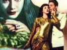

  
[Intangible Textual Heritage](../../index)  [Atlantis](../index) 
[Index](index)  [Previous](ida03)  [Next](ida05) 

------------------------------------------------------------------------

[Buy this Book at
Amazon.com](https://www.amazon.com/exec/obidos/ASIN/B0022NGNEU/internetsacredte)

------------------------------------------------------------------------

  
*Atlantida (L'Atlantide)*, by Pierre Benoit, \[1920\], at Intangible
Textual Heritage

------------------------------------------------------------------------

p. 26

### CHAPTER II

#### CAPTAIN DE SAINT-AVIT

A few days sufficed to convince us that
Chatelain's fears as to our official relations with the new chief were
vain. Often I have thought that by the severity he showed at our first
encounter Saint-Avit wished to create a formal barrier, to show us that
he knew how to keep his head high in spite of the weight of his heavy
past. Certain it is that the day after his arrival, he showed himself in
a very different light, even complimenting the Sergeant on the upkeep of
the post and the instruction of the men. To me he was charming.

"We are of the same class, aren't we?" he said to me. "I don't have to
ask you to dispense with formalities, it is your right."

Vain marks of confidence, alas! False witnesses to a freedom of spirit,
one in face of the other. What more accessible in appearance than the
immense Sahara, open to all those who are willing to be engulfed by it?
Yet what is more secret? After six months of companionship, of communion

p. 27

of life such as only a Post in the South offers, I ask myself if the
most extraordinary of my adventures is not to be leaving to-morrow,
toward unsounded solitudes, with a man whose real thoughts are as
unknown to me as these same solitudes, for which he has succeeded in
making me long.

The first surprise which was given me by this singular companion was
occasioned by the baggage that followed him.

On his inopportune arrival, alone, from Wargla, he had trusted to the
Mehari he rode only what can be carried without harm by such a delicate
beast,—his arms, sabre and revolver, a heavy carbine, and a very reduced
pack. The rest did not arrive till fifteen days later, with the convoy
which supplied the post.

Three cases of respectable dimensions were carried one after another to
the Captain's room, and the grimaces of the porters said enough as to
their weight.

I discreetly left Saint-Avit to his unpacking and began opening the mail
which the convoy had sent me.

He returned to the office a little later and glanced at the several
reviews which I had just received. "So," he said. "You take these."

He skimmed through, as he spoke, the last number of the *Zeitschrift der
Gesellschaft fur Erdkunde* in Berlin.

p. 28

"Yes," I answered. "These gentlemen are kind enough to interest
themselves in my works on the geology of the Wadi Mia and the high
Igharghar."

"That may be useful to me," he murmured, continuing to turn over the
leaves.

"It's at your service."

"Thanks. I am afraid I have nothing to offer you in exchange, except
Pliny, perhaps. And still—you know what he said of Igharghar, according
to King Juba. However, come help me put my traps in place and you will
see if anything appeals to you."

I accepted without further urging.

We commenced by unearthing various meteorological and astronomical
instruments—the thermometers of Baudin, Salleron, Fastre, an aneroid, a
Fortin barometer, chronometers, a sextant, an astronomical spyglass, a
compass glass. . . . In short, what Duveyrier calls the material that is
simplest and easiest to transport on a camel.

As Saint-Avit handed them to me I arranged them on the only table in the
room.

"Now," he announced to me, "there is nothing more but books. I will pass
them to you. Pile them up in a corner until I can have a book-shelf
made."

For two hours altogether I helped him to heap up a real library. And
what a library! Such as never before a post in the South had seen. All
the texts consecrated, under whatever titles, by antiquity to the
regions of the Sahara were reunited between

p. 29

the four rough-cast walls of that little room of the bordj. Herodotus
and Pliny, naturally, and likewise Strabo and Ptolemy, Pomponius Mela,
and Ammien Marcellin. But besides these names which reassured my
ignorance a little, I perceived those of Corippus, of Paul Orose, of
Eratosthenes, of Photius, of Diodorus of Sicily, of Solon, of Dion
Cassius, of Isidor of Seville, of Martin de Tyre, of Ethicus, of
Athenée, the *Scriptores Historiae Augustae*, the *Itinerarium Antonini
Augusti*, the *Geographi Latini Minores* of Riese, the *Geographi Graeci
Minores* of Karl Muller. . . . Since I have had the occasion to
familiarize myself with Agatarchides of Cos and Artemidorus of Ephesus,
but I admit that in this instance the presence of their dissertations in
the saddle bags of a captain of cavalry caused me some amazement.

I mention further the *Descrittione dell’ Africa* by Leon l’African, the
*Arabian Histories* of Ibn-Khaldoun, of Al-Iagoub, of El-Bekri, of
Ibn-Batoutah, of Mahommed El-Tounsi. . . . In the midst of this Babel, I
remember the names of only two volumes of contemporary French scholars.
There were also the laborious theses of Berlioux [1](#fn_2) and of Schirmer. [2](#fn_3)

p. 30

While I proceeded to make piles of as similar dimensions as possible I
kept saying to myself:

"To think that I have been believing all this time that in his mission
with Morhange, Saint-Avit was particularly concerned in scientific
observations. Either my memory deceives me strangely or he is riding a
horse of another color. What is sure is that there is nothing for me in
the midst of all this chaos."

He must have read on my face the signs of too apparently expressed
surprise, for he said in a tone in which I divined a tinge of defiance:

"The choice of these books surprises you a bit?"

"I can't say it surprises me," I replied, "since I don't know the nature
of the work for which you have collected them. In any case I dare say,
without fear of being contradicted, that never before has officer of the
Arabian Office possessed a library in which the humanities were so well
represented."

subjHe smiled evasively, and that day we pursued the ect no further.
Among Saint-Avit's books I had noticed a volu-

minous notebook secured by a strong lock. Several times I surprised him
in the act of making notations in it. When for any reason he was called
out of the room he placed this album carefully in a small cabinet of
white wood, provided by the munificence of the Administration. When he
was not writing

p. 31

and the office did not require his presence, he had the mehari which he
had brought with him saddled, and a few minutes later, from the terrace
of the fortifications, I could see the double silhouette disappearing
with great strides behind a hummock of red earth on the horizon.

Each time these trips lasted longer. From each he returned in a kind of
exaltation which made me watch him with daily increasing disquietude
during meal hours, the only time we passed quite alone together.

"Well," I said to myself one day when his remarks had been more lacking
in sequence than usual, "it's no fun being aboard a submarine when the
captain takes opium. What drug can this fellow be taking, anyway?"

Next day I looked hurriedly through my comrade's drawers. This
inspection, which I believed to be my duty, reassured me momentarily.
"All very good," I thought, "provided he does not carry with him his
capsules and his Pravaz syringe."

pig I was still in that stage where I could suppose that André's
imagination needed artificial stimulants. Meticulous observation
undeceived me. There was nothing suspicious in this respect. Moreover,
he rarely drank and almost never smoked.

And nevertheless, there was no means of denying the increase of his
disquieting feverishness. He returned from his expeditions each time
with his eyes

p. 32

more brilliant. He was paler, more animated, more irritable.

One evening he left the post about six o'clock, at the end of the
greatest heat of the day. We waited for him all night. My anxiety was
all the stronger because quite recently caravans had brought tidings of
bands of robbers in the neighborhood of the post.

At dawn he had not returned. He did not come before midday. His camel
collapsed under him, rather than knelt.

He realized that he must excuse himself, but he waited till we were
alone at lunch.

"I am so sorry to have caused you any anxiety. But the dunes were so
beautiful under the moon! I let myself be carried farther and farther. .
. ."

"I have no reproaches to make, dear fellow, you are free, and the chief
here. Only allow me to recall to you certain warnings concerning the
Chaamba brigands, and the misfortunes that might arise from a Commandant
of a post absenting himself too long."

He smiled.

"I don't dislike such evidence of a good memory," he said simply.

He was in excellent, too excellent spirits.

"Don't blame me. I set out for a short ride as usual. Then, the moon
rose. And then, I recognized the country. It is just where, twenty years
ago next November, Flatters followed the way to

p. 33

his destiny in an exaltation which the certainty of not returning made
keener and more intense."

"Strange state of mind for a chief of an expedition," I murmured.

"Say nothing against Flatters. No man ever loved the desert as he did .
. . even to dying of it."

"Palat and Douls, among many others, have loved it as much," I answered.
"But they were alone when they exposed themselves to it. Responsible
only for their own lives, they were free. Flatters, on the other hand,
was responsible for sixty lives. And you cannot deny that he allowed his
whole party to be massacred."

The words were hardly out of my lips before I regretted them. I thought
of Chatelain's story, of the officers' club at Sfax, where they avoided
like the plague any kind of conversation which might lead their thoughts
toward a certain Morhange-Saint-Avit mission.

Happily I observed that my companion was not listening. His brilliant
eyes were far away.

"What was your first garrison?" he asked suddenly.

"Auxonne."

He gave an unnatural laugh.

"Auxonne. Province of the Cote d’Or. District of Dijon. Six thousand
inhabitants. P. L. M. Railway. Drill school and review. The Colonel's
wife receives Thursdays, and the Major's on Saturdays.

p. 34

\[paragraph continues\] Leaves every
Sunday,—the first of the month to Paris, the three others to Dijon. That
explains your judgment of Flatters.

"For my part, my dear fellow, my first garrison was at Boghar. I arrived
there one morning in October, a second lieutenant, aged twenty, of the
First African [Battalion](errata.htm#1), the white chevron on my black
sleeve. . . . Sun stripe, as the *bagnards* say in speaking of their
grades. Boghar! Two days before, from the bridge of the steamer, I had
begun to see the shores of Africa. I pity all those who, when they see
those pale cliffs for the first time, do not feel a great leap at their
hearts, at the thought that this land prolongs itself thousands and
thousands of leagues. . . . I was little more than a child, I had plenty
of money. I was ahead of schedule. I could have stopped three or four
days at Algiers to amuse myself. Instead I took the train that same
evening for Berroughia.

"There, scarcely a hundred kilometers from Algiers, the railway stopped.
Going in a straight line you wont find another until you get to the
Cape. The diligence travels at night on account of the heat. When we
came to the hills I got out and walked beside the carriage, straining
for the sensation, in this new atmosphere, of the kiss of the outlying
desert.

"About midnight, at the Camp of the Zouaves, a humble post on the road
embankment, overlooking

p. 35

a dry valley whence rose the feverish perfume of oleander, we changed
horses. They had there a troop of convicts and impressed laborers, under
escort of riflemen and convoys to the quarries in the South. In part,
rogues in uniform, from the jails of Algiers and Douara,—without arms,
of course; the others civilians,—such civilians! this year's recruits,
the young bullies of the Chapelle and the Goutte-d’Or.

"They left before we did. Then the diligence caught up with them. From a
distance I saw in a pool of moonlight on the yellow road the black
irregular mass of the convoy. Then I heard a weary dirge; the wretches
were singing. One, in a sad and [guttural](errata.htm#2) voice, gave the
couplet, which trailed dismally through the depths of the blue ravines:

"'*Maintenant qu’elle est grande,  
  Elle fait le trottoir,  
  Avec ceux de la bande  
         A Richard-Lenoir*.'

"And the others took up in chorus the horrible refrain:

"'*A la Bastille, a la Bastille,  
  On aime bien, on aime bien  
         Nini Peau d’Chien;  
  Elle est si belle et si gentille  
           A la Bastille*'

p. 36

"I saw them all in contrast to myself when the diligence passed them.
They were terrible. Under the hideous searchlight their eyes shone with
a sombre fire in their pale and shaven faces. The burning dust strangled
their raucous voices in their throats. A frightful sadness took
possession of me.

"When the diligence had left this fearful nightmare behind, I regained
my self-control.

"'Further, much further South,' I exclaimed to myself, 'to the places
untouched by this miserable bilgewater of civilization.'

"When I am weary, when I have a moment of anguish and longing to turn
back on the road that I have chosen, I think of the prisoners of
Berroughia, and then I am glad to continue on my way.

"But what a reward, when I am in one of those places where the poor
animals never think of fleeing because they have never seen man, where
the desert stretches out around me so widely that the old world could
crumble, and never a single ripple on the dune, a single cloud in the
white sky come to warn me.

"'It is true,' I murmured. 'I, too, once, in the middle of the desert,
at Tidi-Kelt, I felt that way.' "

Up to that time I had let him enjoy his exaltations without
interruption. I understood too late the error that I had made in
pronouncing that unfortunate sentence.

His mocking nervous laughter began anew.

"Ah! indeed, at Tidi-Kelt? I beg you, old man,

p. 37

in your own interest, if you don't want to make an ass of yourself,
avoid that species of reminiscence. Honestly, you make me think of
Fromentin, or that poor Maupassant, who talked of the desert because he
had been to Djelfa, two days’ journey from the street of Bab-Azound and
the Government buildings, four days from the Avenue de l’Opera;—and who,
because he saw a poor devil of a camel dying near Bou-Saada, believed
himself in the heart of the desert, on the old route of the caravans. .
. . Tidi-Kelt, the desert!"

"It seems to me, however, that In-Saleh—" I said, a little vexed.

"In-Saleh? Tidi-Kelt! But, my poor friend, the last time that I passed
that way there were as many old newspapers and empty sardine boxes as if
it had been Sunday in the Wood of Vincennes."

Such a determined, such an evident desire to annoy me made me forget my
reserve.

"Evidently," I replied resentfully, "I have never been to—"

I stopped myself, but it was already too late. He looked at me, squarely
in the face.

"To where?" he said with good humor. I did not answer.

"To where?" he repeated.

And, as I remained strangled in my muteness: "To Wadi Tarhit, do you
mean?"

It was on the east bank of Wadi Tarhit, a hundred

p. 38

and twenty kilometers from Timissao, at 25.5 degrees north latitude,
according to the official report, that Captain Morhange was buried.

"André," I cried stupidly, "I swear to you—"

"What do you swear to me?"

"That I never meant—"

"To speak of Wadi Tarhit? Why? Why should you not speak to me of Wadi
Tarhit?"

In answer to my supplicating silence, he merely shrugged his shoulders.

"Idiot," was all he said.

And he left me before I could think of even one word to say.

So much humility on my part had, however, not disarmed him. I had the
proof of it the next day, and the way he showed his humor was even
marked by an exhibition of wretchedly poor taste.

I was just out of bed when he came into my room.

"Can you tell me what is the meaning of this?" he demanded.

He had in his hand one of the official registers. In his nervous crises
he always began sorting them over, in the hope of finding some pretext
for making himself militarily insupportable.

This time chance had favored him.

He opened the register. I blushed violently at seeing the poor proof of
a photograph that I knew well.

"What is that?" he repeated disdainfully.

p. 39

Too often I had surprised him in the act of regarding, none too kindly,
the portrait of Mlle. de C. which hung in my room not to be convinced at
that moment that he was trying to pick a quarrel with me.

I controlled myself, however, and placed the poor little print in the
drawer.

But my calmness did not pacify him. "Henceforth," he said, "take care, I
beg you, not to mix mementoes of your gallantry with the official
papers."

He added, with a smile that spoke insult:

"It isn't necessary to furnish objects of excitation to Gourrut."

"André," I said, and I was white, "I demand—"

He stood up to the full height of his stature.

"Well what is it? A gallantry, nothing more. I have authorized you to
speak of Wadi Halfa, to haven't I?? Then I have the right, I should
think—"

"André!"

Now he was looking maliciously at the wall, at the little portrait the
replica of which I had just subjected to this painful scene.

"There, there, I say, you aren't angry, are you? But between ourselves
you will admit, will you not, that she is a little thin?"

And before I could find time to answer him, he

p. 40

had removed himself, humming the shameful refrain of the previous night:

"*A la Bastille, a la Bastille,  
 On aime bien, on aime bien,  
     Nini, Peau de Chien*."

For three days neither of us spoke to the other. My exasperation was too
deep for words. Was I, then, to be held responsible for his avatars! Was
it my fault if, between two phrases, one seemed always some allusion—

"The situation is intolerable," I said to myself. "It cannot last
longer."

It was to cease very soon.

One week after the scene of the photograph the courier arrived. I had
scarcely glanced at the index of the Zeitschrift, the German review of
which I have already spoken, when I started with uncontrollable
amazement. I had just read: "*Reise and Entdeckungen zwei franzosischer
offiziere, Rittmeisters Morhange and Oberleutnants de Saint-Avit, in
westlichen Sahara*."

At the same time I heard my comrade's voice. "Anything interesting in
this number?"

"No," I answered carelessly.

"Let's see."

I obeyed; what else was there to do?

It seemed to me that he grew paler as he ran

p. 41

over the index. However, his tone was altogether natural when he said:

"You will let me borrow it, of course?"

And he went out, casting me one defiant glance.

 

The day passed slowly. I did not see him again until evening. He was
gay, very gay, and his gaiety hurt me.

When we had finished dinner, we went out and leaned on the balustrade of
the terrace. From there out swept the desert, which the darkness was
already encroaching upon from the east.

André broke the silence.

"By the way, I have returned your review to you. You were right, it is
not interesting."

His expression was one of supreme amusement. "What is it, what is the
matter with you, anyway?"

"Nothing," I answered, my throat aching. "Nothing? Shall I tell you what
is the matter with you?"

II looked at him with an expression of supplication.

"Idiot," he found it necessary to repeat once more.

Night fell quickly. Only the southern slope of Wadi Mia was still
yellow. Among the boulders a little jackal was running about, yapping
sharply.

"The *dib* is making a fuss about nothing, bad business," said
Saint-Avit.

p. 42

He continued pitilessly:

"Then you aren't willing to say anything?"

I made a great effort, to produce the following pitiful phrase:

"What an exhausting day. What a night, heavy, heavy—You don't feel like
yourself, you don't know any more—"

"Yes," said the voice of Saint-Avit, as from a distance, "A heavy, heavy
night: as heavy, do you know, as when I killed Captain Morhange."

------------------------------------------------------------------------

### Footnotes

[29:1](ida04.htm#fr_2) Doctrina Ptolemaei ab
injuria recentiorum vindicata, sive Nilus Superior et Niger verus,
hodiernus Eghiren, ab antiquis explorati. Paris, 8vo, 1874, with two
maps. (Note by M. Leroux.)

[29:2](ida04.htm#fr_3) De nomine et genere
popularum qui berberi vulgo dicuntur. Paris, 8vo, 1892. (Note by M.
Leroux.)

------------------------------------------------------------------------

[Next: Chapter III. The Morhange-Saint-Avit Mission](ida05)
