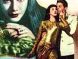

  
[Intangible Textual Heritage](../../index)  [Atlantis](../index) 
[Index](index)  [Previous](ida12)  [Next](ida14) 

------------------------------------------------------------------------

[Buy this Book at
Amazon.com](https://www.amazon.com/exec/obidos/ASIN/B0022NGNEU/internetsacredte)

------------------------------------------------------------------------

  
*Atlantida (L'Atlantide)*, by Pierre Benoit, \[1920\], at Intangible
Textual Heritage

------------------------------------------------------------------------

p. 161

### CHAPTER XI

#### ANTINEA

My guide and I passed along another long
corridor. My excitement increased. I was impatient for one thing only,
to come face to face with that woman, to tell her . . . So far as
anything else was concerned, I already was done for.

I was mistaken in hoping that the adventure would take an heroic turn at
once. In real life, these contrasts never are definitely marked out. I
should have remembered from many past incidents that the burlesque was
regularly mixed with the tragic in my life.

We reached a little transparent door. My guide stood aside to let me
pass.

I found myself in the most luxurious of dressing-rooms. A ground glass
ceiling diffused a gay rosy light over the marble floor. The first thing
I noticed was a clock, fastened to the wall. In place of the figures for
the hours, were the signs of the Zodiac. The small hand had not yet
reached the sign of Capricorn.

p. 162

Only three o'clock!

The day seemed to have lasted a century already. . And only a little
more than half of it was gone.

Another idea came to me, and a convulsive laugh bent me double.

"Antinea wants me to be at my best when I meet her."

A mirror of orichalch formed one whole side of the room. Glancing into
it, I realized that in all decency there was nothing exaggerated in the
demand.

My untrimmed beard, the frightful layer of dirt which lay about my eyes
and furrowed my cheeks, my clothing, spotted by all the clay of the
Sahara and torn by all the thorns of Ahaggar—all this made me appear a
pitiable enough suitor.

I lost no time in undressing and plunging into the porphry bath in the
center of the room. A delicious drowsiness came over me in that perfumed
water. A thousand little jars, spread on a costly carved wood
dressing-table, danced before my eyes. They were of all sizes and
colors, carved in a very transparent kind of jade. The warm humidity of
the atmosphere hastened my relaxation.

I still had strength to think, "The devil take Atlantis and the vault
and Le Mesge."

Then I fell asleep in the bath.

When I opened my eyes again, the little hand of

p. 163

the clock had almost reached the sign of Taurus. Before me, his black
hands braced on the edge of the bath, stood a huge negro, bare-faced and
bare-armed, his forehead bound with an immense orange turban.

He looked at me and showed his white teeth in a silent laugh.

"Who is this fellow?"

The negro laughed harder. Without saying a word, he lifted me like a
feather out of the perfumed water, now of a color on which I shall not
dwell.

In no time at all, I was stretched out on an inclined marble table.

The negro began to massage me vigorously.

"More gently there, fellow!"

My masseur did not reply, but laughed and rubbed still harder.

"Where do you come from? Kanem? Torkou? You laugh too much for a Targa."

Unbroken silence. The negro was as speechless as he was hilarious.

"After all, I am making a fool of myself," I said, giving up the case.
"Such as he is, he is more agreeable than Le Mesge with his nightmarish
erudition. But, on my word, what a recruit he would be for Hamman on the
rue des Mathurins!"

"Cigarette, sidi?"

Without awaiting my reply, he placed a cigarette

p. 164

between my lips and lighted it, and resumed his task of polishing every
inch of me.

"He doesn't talk much, but he is obliging," I thought.

And I sent a puff of smoke into his face.

This pleasantry seemed to delight him immensely. He showed his pleasure
by giving me great slaps.

When he had dressed me down sufficiently, he took a little jar from the
dressing-table and began to rub me with a rose-colored ointment.
Weariness seemed to fly away from my rejuvenated muscles.

A stroke on a copper gong. My masseur disappeared. A stunted old negress
entered, dressed in the most tawdry tinsel. She was talkative as a
magpie, but at first I did not understand a word in the interminable
string she unwound, while she took first my hands, then my feet, and
polished the nails with determined grimaces.

Another stroke on the gong. The old woman gave place to another negro,
grave, this time, and dressed all in white with a knitted skull cap on
his oblong head. It was the barber, and a remarkably dexterous one. He
quickly trimmed my hair, and, on my word, it was well done. Then,
without asking me what style I preferred, he shaved me clean.

I looked with pleasure at my face, once more visible.

"Antinea must like the American type," I thought.

p. 165

\[paragraph continues\] "What an affront
to the memory of her worthy grandfather, Neptune!"

The gay negro entered and placed a package on the divan. The barber
disappeared. I was somewhat astonished to observe that the package,
which my new valet opened carefully, contained a suit of white flannels
exactly like those French officers wear in Algeria in summer.

The wide trousers seemed made to my measure. The tunic fitted without a
wrinkle, and my astonishment was unbounded at observing that it even had
two gilt *galons*, the insignia of my rank, braided on the cuffs. For
shoes, there were slippers of red Morocco leather, with gold ornaments.
The underwear, all of silk, seemed to have come straight from the rue de
la Paix.

"Dinner was excellent," I murmured, looking at myself in the mirror with
satisfaction. "The apartment is perfectly arranged. Yes, but . . ."

I could not repress a shudder when I suddenly recalled that room of red
marble.

The clock struck half past four.

Someone rapped gently on the door. The tall white Targa, who had brought
me, appeared in the doorway.

He stepped forward, touched me on the arm and signed for me to follow.

Again I followed him.

We passed through interminable corridors. I was

p. 166

disturbed, but the warm water had given me a certain feeling of
detachment. And above all, more than I wished to admit, I had a growing
sense of lively curiosity. If, at that moment, someone had offered to
lead me back to the route across the white plain near Shikh-Salah, would
I have accepted? Hardly.

I tried to feel ashamed of my curiosity. I thought of Maillefeu.

"He, too, followed this corridor. And now he is down there, in the red
marble hall."

I had no time to linger over this reminiscence. I was suddenly bowled
over, thrown to the ground, as if by a sort of meteor. The corridor was
dark; I could see nothing. I heard only a mocking growl.

The white Targa had flattened himself back against the wall.

"Good," I mumbled, picking myself up, "the deviltries are beginning."

We continued on our way. A glow different from that of the rose night
lights soon began to light up the corridor.

We reached a high bronze door, in which a strange lacy design had been
cut in filigree. A clear gong sounded, and the double doors opened part
way. The Targa remained in the corridor, closing the doors after me.

I took a few steps forward mechanically, then paused, rooted to the
spot, and rubbed my eyes.

p. 167

I was dazzled by the sight of the sky.

Several hours of shaded light had unaccustomed me to daylight. It poured
in through one whole side of the huge room.

The room was in the lower part of this mountain, which was more
honeycombed with corridors and passages than an Egyptian pyramid. It was
on a level with the garden which I had seen in the morning from the
balcony, and seemed to be a continuation of it; the carpet extended out
under the great palm trees and the birds flew about the forest of
pillars in the room.

By contrast, the half of the room untouched by direct light from the
oasis seemed dark. The sun, setting behind the mountain, painted the
garden paths with rose and flamed with red upon the traditional flamingo
which stood with one foot raised at the edge of the sapphire lake.

Suddenly I was bowled over a second time.

I felt a warm, silky touch, a burning breath on my neck. Again the
mocking growl which had so disturbed me in the corridor.

With a wrench, I pulled myself free and sent a chance blow at my
assailant. The cry, this time of pain and rage, broke out again.

It was echoed by a long peal of laughter. Furious, I turned to look for
the insolent onlooker, thinking to speak my mind. And then my glance
stood still.

p. 168

Antinea was before me.

 

In the dimmest part of the room, under a kind of arch lit by the mauve
rays from a dozen incense-lamps, four women lay on a heap of
many-colored cushions and rare white Persian rugs.

I recognized the first three as Tuareg women, of a splendid regular
beauty, dressed in magnificent robes of white silk embroidered in gold.
The fourth, very dark skinned, almost negroid, seemed younger. A tunic
of red silk enhanced the dusk of her face, her arms and her bare feet.
The four were grouped about a sort of throne of white rugs, covered with
a gigantic lion's skin, on which, half raised on one elbow, lay Antinea.

Antinea! Whenever I saw her after that, I wondered if I had really
looked at her before, so much more beautiful did I find her. More
beautiful? Inadequate word. Inadequate language! But is it really the
fault of the language or of those who abuse the word?

One could not stand before her without recalling the woman for whom
Ephractoeus overcame Atlas, of her for whom Sapor usurped the scepter of
Ozymandias, for whom Mamylos subjugated Susa and Tentyris, for whom
Antony fled. . . .

*O tremblant coeur humain, si jamais tu vibras  
C’est dans l’étreinte altière et chaude de ses bras*.

p. 169

An Egyptian *klaft* fell over her abundant blue-black curls. Its two
points of heavy, gold-embroidered cloth extended to her slim hips. The
golden serpent, emerald-eyed, was clasped about her little round,
determined forehead, darting its double tongue of rubies over her head.

She wore a tunic of black chiffon shot with gold, very light, very full,
slightly gathered in by a white muslin scarf embroidered with iris in
black pearls.

That was Antinea's costume. But what was she beneath all this? A slim
young girl, with long green eyes and the slender profile of a hawk. A
more intense Adonis. A child queen of Sheba, but with a look, a smile,
such as no Oriental ever had. A miracle of irony and freedom.

I did not see her body. Indeed I should not have thought of looking at
it, had I had the strength. And that, perhaps, was the most
extraordinary thing about that first impression. In that unforgettable
moment nothing would have seemed to me more horribly sacrilegious than
to think of the fifty victims in the red marble hall, of the fifty young
men who had held that slender body in their arms.

She was still laughing at me.

"King Hiram," she called.

I turned and saw my enemy.

On the capital of one of the columns, twenty feet above the floor, a
splendid leopard was crouched.

p. 170

\[paragraph continues\] He still looked
surly from the blow I had dealt him.

"King Hiram," Antinea repeated. "Come here."

The beast relaxed like a spring released. He fawned at his mistress's
feet. I saw his red tongue licking her bare little ankles.

"Ask the gentleman's pardon," she said.

The leopard looked at me spitefully. The yellow

skin of his muzzle puckered about his black moustache.

"Fftt," he grumbled like a great cat.

"Go," Antinea ordered imperiously.

The beast crawled reluctantly toward me. He laid his head humbly between
his paws and waited. I stroked his beautiful spotted forehead.

"You must not be vexed," said Antinea. "He is always that way with
strangers."

"Then he must often be in bad humor," I said simply.

Those were my first words. They brought a smile to Antinea's lips.

She gave me a long, quiet look.

"Aguida," she said to one of the Targa women, "you will give twenty-five
pounds in gold to Cegheir-ben-Cheikh."

"You are a lieutenant?" she asked, after a pause.

"Yes."

"Where do you come from?"

"From France."

p. 171

"I might have guessed that," she said ironically,

"but from what part of France?"

"From what we call the Lot-et-Garonne."

"From what town?"

"From Duras."

She reflected a moment.

"Duras! There is a little river there, the Dropt, and a fine old
château."

"You know Duras?" I murmured, amazed. "You go there from Bordeaux by a
little branch railway," she went on. "It is a shut-in road, with
vine-covered hills crowned by the feudal ruins. The villages have
beautiful names: Monségur, Sauve-terre-de-Guyenne, la Tresne, Créon, . .
. Créon, as in Antigone."

"You have been there?"

She looked at me.

"Don't speak so coldly," she said. "Sooner or later we will be intimate,
and you may as well lay aside formality now."

This threatening promise suddenly filled me with great happiness. I
thought of Le Mesge's words: "Don't talk until you have seen her. When
you have seen her, you will renounce everything for her."

"Have I been in Duras?" she went on with a burst of laughter. "You are
joking. Imagine Neptune's granddaughter in the first-class compartment
of a local train!"

p. 172

She pointed to an enormous white rock which towered above the palm trees
of the garden.

"That is my horizon," she said gravely.

She picked up one of several books which lay scattered about her on the
lion's skin.

"The time table of the *Chemin de Fer de l’Ouest*," she said. "Admirable
reading for one who never budges! Here it is half-past five in the
afternoon. A train, a local, arrived three minutes ago at Surgères in
the Charente-Inférieure. It will start on in six minutes. In two hours
it will reach La Rochelle. How strange it seems to think of such things
here. So far away! So much commotion there! Here, nothing changes."

"You speak French well," I said.

She gave a little nervous laugh.

"I have to. And German, too, and Italian, and English and Spanish. My
way of living has made me a great polyglot. But I prefer French, even to
Tuareg and Arabian. It seems as if I had always known it. And I am not
saying that to please you."

There was a pause. I thought of her grandmother, of whom Plutarch said:
"There were few races with which she needed an interpreter. Cleopatra
spoke their own language to the Ethiopians, to the Troglodytes, the
Hebrews, the Arabs, the Medes and the Persians."

"Do not stand rooted in the middle of the room.

p. 173

\[paragraph continues\] You worry me. Come
sit here, beside me. Move over, King Hiram."

The leopard obeyed with good temper.

Beside her was an onyx bowl. She took from it a perfectly plain ring of
orichalch and slipped it on my left ring-finger. I saw that she wore one
like it.

"Tanit-Zerga, give Monsieur de Saint-Avit a rose sherbet."

The dark girl in red silk obeyed.

"My private secretary," said Antinea, introducing her. "Mademoiselle
Tanit-Zerga, of Gâo, on the Niger. Her family is almost as ancient as
mine."

As she spoke, she looked at me. Her green eyes seemed to be appraising
me.

"And your comrade, the Captain?" she asked in a dreamy tone. "I have not
yet seen him. What is he like? Does he resemble you?"

For the first time since I had entered, I thought of Morhange. I did not
answer.

Antinea smiled.

She stretched herself out full length on the lion skin. Her bare right
knee slipped out from under her tunic.

"It is time to go find him," she said languidly. "You will soon receive
my orders. Tanit-Zerga, show him the way. First take him to his room. He
cannot have seen it."

I rose and lifted her hand to my lips. She struck

p. 174

me with it so sharply as to make my lips bleed, as if to brand me as her
possession.

 

I was in the dark corridor again. The young girl in the red silk tunic
walked ahead of me.

"Here is your room," she said. "If you wish, I will take you to the
dining-room. The others are about to meet there for dinner."

She spoke an adorable lisping French.

"No, Tanit-Zerga, I would rather stay here this evening. I am not
hungry. I am tired."

"You remember my name?" she said.

She seemed proud of it. I felt that in her I had an ally in case of
need.

"I remember your name, Tanit-Zerga, because it is beautiful." [1](#fn_12)

Then I added:

"Now, leave me, little one. I want to be alone."

It seemed as if she would never go. I was touched, but at the same time
vexed. I felt a great need of withdrawing into myself.

"My room is above yours," she said. "There is a copper gong on the table
here. You have only to strike if you want anything. A white Targa will
answer."

For a second, these instructions amused me. I was in a hotel in the
midst of the Sahara. I had only to ring for service.

p. 175

I looked about my room. My room! For how long?

It was fairly large. Cushions, a couch, an alcove cut into the rock, all
lighted by a great window covered by a matting shade.

I went to the window and raised the shade. The light of the setting sun
entered.

I leaned my elbows on the rocky sill. Inexpressible emotion filled my
heart. The window faced south. It was about two hundred feet above the
ground. The black, polished volcanic wall yawned dizzily below me.

In front of me, perhaps a mile and a half away, was another wall, the
first enclosure mentioned in the Critias. And beyond it in the distance,
I saw the limitless red desert.

------------------------------------------------------------------------

### Footnotes

[174:1](ida13.htm#fr_12) In Berber, Tanit means
a spring; zerga is the feminine of the adjective azreg, blue. (Note by
M. Leroux.)

------------------------------------------------------------------------

[Next: Chapter XII. Morhange Disappears](ida14)
