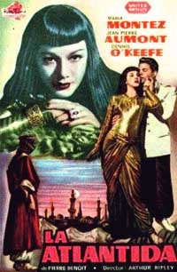

  
[Intangible Textual Heritage](../../index)  [Atlantis](../index) 

------------------------------------------------------------------------

[Buy this Book at
Amazon.com](https://www.amazon.com/exec/obidos/ASIN/B0022NGNEU/internetsacredte)

------------------------------------------------------------------------

<table width="75%">
<colgroup>
<col style="width: 50%" />
<col style="width: 50%" />
</colgroup>
<tbody>
<tr class="odd">
<td width="50%" data-valign="TOP"> 
Poster from the French 1948 production of Atlantida (Fair Use)</td>
<td width="50%" data-valign="CENTER"><h1 id="atlantida" data-align="CENTER">Atlantida</h1>
<h3 id="lantlantide" data-align="CENTER">(<em>L'Antlantide</em>)</h3>
<h2 id="by-pierre-benoit" data-align="CENTER">by Pierre Benoit</h2>
<h5 id="tr.-by-mary-c.-tongue-and-mary-ross" data-align="CENTER">Tr. by Mary C. Tongue and Mary Ross</h5>
<h4 id="section" data-align="CENTER">[1920]</h4></td>
</tr>
</tbody>
</table>

------------------------------------------------------------------------

[Contents](#contents)    [Start Reading](ida00)    [Page
Index](pageidx)    [Text \[Zipped\]](ida.txt.gz)

|                                                                                                                           |
|---------------------------------------------------------------------------------------------------------------------------|
|  |

------------------------------------------------------------------------

This French novel of 'Atlantis in the Sahara' made a huge splash when it
was published. The exotic Saharan setting, the stories of desert
survival, the overpowering allure of the last Queen of Atlantis, make a
memorable, if a bit pulpy, read. Over a dozen films have been made of
this plot, to the point where it is almost a subgenre of the
lost-civilization adventure film in itself. The author was sued (and
lost) at one point because the plot is fairly close to that of Haggard's
She. However, it is thought Benoit had no exposure to Haggard prior
writing L'Antlantide, so this appears to be a case of literary
convergent evolution. This online text was scanned and proofed from
scratch, from a 1920 edition of this translation of the book. Therefore
it may differ slightly from the Project Gutenberg version, which was
sourced from a 1964 Ace paperback edition. That edition has 192 pages
and some obvious differences, e.g., a dedication in the Ace which does
not appear in the 1920 printing. NOTE: [Unicode](../../unicode) is used
to display Greek in this text. I've also made [a sketch
map](img/map.jpg) of the route in the book through the Sahara.

------------------------------------------------------------------------

 [Title Page](ida00)  
[Contents](ida01)  
[Preface](ida02)  
[Chapter I. A Southern Assignment](ida03)  
[Chapter II. Captain de Saint-Avit](ida04)  
[Chapter III. The Morhange-Saint-Avit Mission](ida05)  
[Chapter IV. Towards Latitude 25](ida06)  
[Chapter V. The Inscription](ida07)  
[Chapter VI. The Disaster of the Lettuce](ida08)  
[Chapter VII. The Country of Fear](ida09)  
[Chapter VIII. Awakening At Ahaggar](ida10)  
[Chapter IX. Atlantis](ida11)  
[Chapter X. The Red Marble Hall](ida12)  
[Chapter XI. Antinea](ida13)  
[Chapter XII. Morhange Disappears](ida14)  
[Chapter XIII. The Hetman of Jitomir's Story](ida15)  
[Chapter XIV. Hours of Waiting](ida16)  
[Chapter XV. The Lament of Tanit-Zerga](ida17)  
[Chapter XVI. The Silver Hammer](ida18)  
[Chapter XVII. The Maidens of the Rocks](ida19)  
[Chapter XVIII. The Fire-Flies](ida20)  
[Chapter XIX. The Tanezruft](ida21)  
[Chapter XX. The Circle Is Complete](ida22)  
