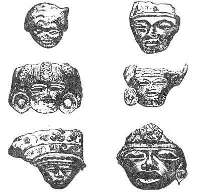
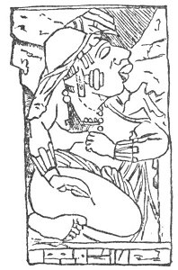
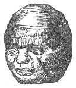

  
[Intangible Textual Heritage](../../index)  [Atlantis](../index) 
[Index](index)  [Previous](ataw303)  [Next](ataw305) 

------------------------------------------------------------------------

[Buy this Book at
Amazon.com](https://www.amazon.com/exec/obidos/ASIN/B0020ML528/internetsacredte)

------------------------------------------------------------------------

  
*Atlantis, the Antediluvian World*, by Ignatius Donnelly, \[1882\], at
Intangible Textual Heritage

------------------------------------------------------------------------

p. 171

## CHAPTER IV.

### CORROBORATING CIRCUMSTANCES.

1\. LENORMANT insists that the human race issued from Ups Merou, and
adds that some Greek traditions point to "this locality--particularly
the expression μέροπες ἄνθωποι, which can only mean 'the men sprung from
Merou.'" ("Manual," p.21.)

Theopompus tells us that the people who inhabited Atlantis were the
*Meropes*, the people of *Merou*.

2\. Whence comes the word *Atlantic*? The dictionaries tell us that the
ocean is named after the mountains of *Atlas*; but whence did the
*Atlas* mountains get their name?

"The words Atlas and Atlantic have no satisfactory etymology in any
language known to Europe. They are not Greek, and cannot be referred to
any known language of the Old World. But in the Nahuatl language we find
immediately the radical *a*, *atl*, which signifies water, war, and the
top of the head. (Molina, "Vocab. en lengua Mexicana y Castellana.")
From this comes a series of words, such as atlan--on the border of or
amid the water--from which we 'have the adjective *Atlantic*. We have
also *atlaça*, to combat, or be in agony; it means likewise to hurl or
dart from the water, and in the preterit makes *Atlaz*. A city named
*Atlan* existed when the continent was discovered by Columbus, at the
entrance of the Gulf of Uraba, in Darien. With a good harbor, it is now
reduced to an unimportant pueblo named *Acla*." (Baldwin's "Ancient
America," p. 179.)

Plato tells us that Atlantis and the Atlantic Ocean were named after
Atlas, the eldest son of Poseidon, the founder of the kingdom.

3\. Upon that part of the African continent nearest to the site

p. 172

of Atlantis we find a chain of mountains, known from the most ancient
times as the Atlas Mountains. Whence this name Atlas, if it be not from
the name of the great king of Atlantis? And if this be not its origin,
how comes it that we find it in the most north-western corner of Africa?
And how does it happen that in the time of Herodotus there dwelt near
this mountain-chain a people called the *Atlantes*, probably a remnant
of a colony from Solon's island? How comes it that the people of the
Barbary States were known to the Greeks, Romans, and Carthaginians as
the "Atlantes," this name being especially applied to the inhabitants of
Fezzan and Bilma? Where did they get the name from? There is no
etymology for it east of the Atlantic Ocean. (Lenormants "Anc. Hist. of
the East," p. 253.)

Look at it! An "Atlas" mountain on the shore of Africa; an "Atlan" town
on the shore of America; the "Atlantes" living along the north and west
coast of Africa; an Aztec people from Aztlan, in Central America; an
ocean rolling between the two worlds called the "Atlantic;" a
mythological deity called "Atlas" holding the world on his shoulders;
and an immemorial tradition of an island of Atlantis. Can all these
things be the result of accident?

4\. Plato says that there was a "passage west from Atlantis to the rest
of the islands, as well as from these islands to the whole opposite
continent that surrounds that real sea." He calls it a real sea, as
contradistinguished from the Mediterranean, which, as he says, is not a
real sea (or ocean) but a landlocked body of water, like a harbor.

Now, Plato might have created Atlantis out of his imagination; but how
could he have invented the islands beyond (the West India Islands), and
the whole continent (America) enclosing that real sea? If we look at the
map, we see that the continent of America does "surround" the ocean in a
great half-circle. Could Plato have guessed all this? If there had been
no Atlantis, and no series of voyages from it that revealed

p. 173

the half-circle of the continent from Newfoundland to Cape St. Roche,
how could Plato have guessed it? And how could he have known that the
Mediterranean was only a harbor compared with the magnitude of the great
ocean surrounding Atlantis? Long sea-voyages were necessary to establish
that fact, and the Greeks, who kept close to the shores in their short
journeys, did not make such voyages.

5\. How can we, without Atlantis, explain the presence of the Basques in
Europe, who have no lingual affinities with any other race on the
continent of Europe, but whose language *is similar to the languages of
America*?

Plato tells us that the dominion of Gadeirus, one of the kings of
Atlantis, extended "toward the pillars of Heracles (Hercules) as far as
the country which is still called the region of Gades in that part of
the world." Gades is the Cadiz of today, and the dominion of Gadeirus
embraced the land of the Iberians or Basques, their chief city taking
its name from a king of Atlantis, and they themselves being Atlanteans.

Dr. Farrar, referring to the Basque language, says:

"What is certain about it is, that its structure is polysynthetic, like
the languages of America. Like them, it forms its compounds by the
elimination of certain radicals in the simple words; so that *ilhun*,
the twilight, is contracted from *hill*, dead, and *egun*, day; and
*belhaur*, the knee, from *belhar*, front, and *oin*, leg. . . . The
fact is indisputable, and is eminently noteworthy, that while the
affinities of the Basque roots have never been conclusively elucidated,
there has never been any doubt that this isolated language, preserving
its identity in a western corner of Europe, between two mighty kingdoms,
resembles, in its grammatical structure, the aboriginal languages of the
vast opposite continent (America), and those alone." ("Families of
Speech," p. 132.)

If there was an Atlantis, forming, with its connecting ridges, a
continuous bridge of land from America to Africa, we can understand how
the Basques could have passed from one continent to another; but if the
wide Atlantic rolled at all times unbroken

p. 174

between the two continents, it is difficult to conceive of such an
emigration by an uncivilized people.

6\. Without Atlantis, how can we explain the fact that the early
Egyptians were depicted by themselves as red men on their own monuments?
And, on the other hand, how can we account for the representations of
negroes on the monuments of Central America?

Dêsirè Charnay, now engaged in exploring those monuments, has published
in the *North American Review* for December, 1880, photographs of a
number of idols exhumed at San Juan de Teotihuacan, from which I select
the following strikingly negroid faces:

 

   
NEGRO IDOLS FOUND IN MEXICO.

 

p. 175

Dr. Le Plongeon says:

"Besides the sculptures of long-bearded men seen by the explorer at
Chichen Itza, there were tall figures of people with small heads, thick
lips, and curly short hair or wool, regarded as negroes. 'We always see
them as standard or parasol bearers, but never engaged in actual
warfare.'" ("Maya Archæology," p. 62.)

The following cut is from the court of the Palace of Palenque, 

<table data-align="LEFT">
<colgroup>
<col style="width: 100%" />
</colgroup>
<tbody>
<tr class="odd">
<td data-valign="CENTER"> 
NEGROID FIGURE, PALENQUE.</td>
</tr>
</tbody>
</table>

figured by Stephens. The face is strongly Ethiopian.

The figure below represents a gigantic granite head, found near the
volcano of Tuxtla, in the Mexican State of Vera Cruz, at Caxapa. The
features are unmistakably negroid.

As the negroes have never been a sea-going race, the presence of these
faces among the antiquities of Central America proves one of two things,
either the existence of a land connection between America and Africa via
Atlantis, as revealed by the deep-sea soundings of the *Challenger*, or
commercial relations between America and Africa through the ships of the
Atlanteans 

<table data-align="RIGHT">
<colgroup>
<col style="width: 100%" />
</colgroup>
<tbody>
<tr class="odd">
<td data-valign="CENTER"> 
NEGRO HEAD, VERA CRUZ</td>
</tr>
</tbody>
</table>

or some other civilized race, whereby the negroes were brought to
America as slaves at a very remote epoch.

And we find some corroboration of the latter theory in that singular
book of the Quiches, the "Popol Vuh," in which, after describing the
creation of the first men "*in the region of the rising sun*"
(Bancroft's "Native Races," vol. v., p. 548),

p. 176

and enumerating their first generations, we are told, "All seem to have
spoken one language, and to have lived in great peace, *black men and
white together*. Here they awaited the rising of the sun, and prayed to
the Heart of Heaven." (Bancroft's "Native Races," p. 547.) How did the
red men of Central America know anything about "black men and white
men?" The conclusion seems inevitable that these legends of a primitive,
peaceful, and happy land, an Aztlan in the East, inhabited by black and
white men, to which all the civilized nations of America traced their
origin, could only refer to Atlantis--that bridge of land where the
white, dark, and red races met. The "Popol Vuh" proceeds to tell how
this first home of the race became over-populous, and how the people
under Balam-Quitze migrated; how their language became "confounded," in
other words, broken up into dialects, in consequence of separation; and
how some of the people "*went to the East*, and many came hither to
Guatemala." (*Ibid*., p. 547.)

M. A. de Quatrefages ("Human Species," p. 200) says, "Black populations
have been found in America in very small numbers only, as isolated
tribes in the midst of very different populations. Such are the
Charruas, of Brazil, the Black Carribees of Saint Vincent, in the Gulf
of Mexico; the Jamassi of Florida, and the dark-complexioned
Californians. . . . Such, again, is the tribe that Balboa saw some
representatives of in his passage of the Isthmus of Darien in 1513; . .
. they were true negroes."

7\. How comes it that all the civilizations of the Old World radiate
from the shores of the Mediterranean? The Mediterranean is a *cul de
sac*, with Atlantis opposite its mouth. Every civilization on its shores
possesses traditions that point to Atlantis. We hear of no civilization
coining *to* the Mediterranean from Asia, Africa, or Europe--from north,
south, or west; but north, south, east, and west we find civilization
radiating from the Mediterranean to other lands. We see the Aryans
descending upon Hindostan from the direction of the Mediterranean;

p. 177

and we find the Chinese borrowing inventions from Hindostan, and
claiming descent from a region not far from the Mediterranean.

The Mediterranean has been the centre of the modern world, because it
lay in the path of the extension of an older civilization, whose ships
colonized its shores, as they did also the shores .of America. Plato
says, "the nations are gathered around the shores of the Mediterranean
like frogs around a marsh."

Dr. McCausland says:

The obvious conclusion from these facts is, that at some time previous
to these migrations a people speaking a language of a superior and
complicated structure broke up their society, and, under some strong
impulse, poured out in different directions, and gradually established
themselves in all the lands now inhabited by the Caucasian race. Their
territories extend from the Atlantic to the Ganges, and from Iceland to
Ceylon, and are bordered on the north and east by the Asiatic Mongols,
and on the south by the negro tribes of Central Africa. They present all
the appearances of a later race, expanding itself between and into the
territories of two pre-existing neighboring races, and forcibly
appropriating the room required for its increasing population."
(McCausland's "Adam and the Adamites," p. 280.)

Modern civilization is Atlantean. Without the thousands of years of
development which were had in Atlantis modern civilization could not
have existed. The inventive faculty of the present age is taking up the
great delegated work of creation where Atlantis left it thousands of
years ago.

8\. How are we to explain the existence of the Semitic race in Europe
without Atlantis? It is an intrusive race; a race colonized on
sea-coasts. Where are its Old World affinities?

9\. Why is it that the origin of wheat, barley, oats, maize, and
rye--the essential plants of civilization--is totally lost in the mists
of a vast antiquity? We have in the Greek mythology legends of the
introduction of most of these by Atlantean kings or gods into Europe;
but no European nation

p. 178

claims to have discovered or developed them, and it has been impossible
to trace them to their wild originals. Out of the whole *flora* of the
world mankind in the last seven thousand years has not developed a
single food-plant to compare in importance to the human family with
these. If a wise and scientific nation should propose nowadays to add to
this list, it would have to form great botanical gardens, and, by
systematic and long-continued experiments, develop useful plants from
the humble productions of the field and forest. Was this done in the
past on the island of Atlantis?

10\. Why is it that we find in Ptolemy's "Geography of Asia Minor," in a
list of cities in Armenia Major in A.D. 140, the names of five cities
which have their counterparts in the names of localities in Central
America?

|                  |                              |
|------------------|------------------------------|
| Armenian Cities. | Central American Localities. |
| Chol.            | Chol-ula                     |
| Colua.           | Colua-can.                   |
| Zuivana.         | Zuivan.                      |
| Cholima.         | Colima.                      |
| Zalissa.         | Xalisco.                     |

 

(Short's "North Americans of Antiquity," p. 497.)

11\. How comes it that the sandals upon the feet of the statue of
Chacmol, discovered at Chichen Itza, are "exact representations of those
found on the feet of the Guanches, the early inhabitants of the Canary
Islands, whose mummies are occasionally discovered in the eaves of
Teneriffe?" Dr. Merritt deems the axe or chisel heads dug up at
Chiriqui, Central America, "almost identical in form as well as material
with specimens found in Suffolk County, England." (Bancroft's Native
Races," vol. iv., p. 20.) The rock-carvings of Chiriqui are pronounced
by Mr. Seemann to have a striking resemblance to the ancient incised
characters found on the rocks of Northumberland, England. (*Ibid*.)

"Some stones have recently been discovered in Hierro and Las Palmas
(Canary Islands), bearing sculptured symbols similar

p. 179

to those found on the shores of Lake Superior; and this has led M.
Bertholet, the historiographer of the Canary Islands, to conclude that
the first inhabitants of the Canaries and those of the great West were
one in race." (Benjamin, "The Atlantic Islands," p. 130.)

12\. How comes it that that very high authority, Professor Retzius
("Smithsonian Report," 1859, p. 266), declares, "With regard to the
primitive dolichocephalæ of America I entertain a hypothesis still more
bold, namely, that they are nearly related to the Guanches in the Canary
Islands, and to the Atlantic populations of Africa, the Moors, Tuaricks,
Copts, etc., which Latham comprises under the name of
Egyptian-Atlantidæ. We find one and the same form of skull in the Canary
Islands, in front of the African coast, and in the Carib Islands, on the
opposite coast, which faces Africa. The color of the skin on both sides
of the Atlantic is represented in these populations as being of a
reddish-brown."

13\. The Barbarians who are alluded to by Homer and Thucydides were a
race of ancient navigators and pirates called *Cares*, or *Carians*, who
occupied the isles of Greece before the Pelasgi, and antedated the
Phœnicians in the control of the sea. The Abbé Brasseur de Bourbourg
claims that these Carians were identical with the *Caribs* of the West
Indies, the *Caras* of Honduras, and the *Gurani* of South America.
(Landa's "Relacion," pp. 52-65.)

14\. When we consider it closely, one of the most extraordinary customs
ever known to mankind is that to which I have already alluded in a
preceding chapter, to wit, the embalming of the body of the dead man,
with a purpose that the body itself may live again in a future state. To
arrive at this practice several things must coexist:

a\. The people must be highly religious, and possessed of an organized
and influential priesthood, to perpetuate so troublesome a custom from
age to age.

b\. They must believe implicitly in the immortality

p. 180

of the soul; and this implies a belief in rewards and punishments after
death; in a heaven and a hell.

c\. They must believe in the immortality of the body, and its
resurrection from the grave on some day of judgment in the distant
future.

d\. But a belief in the immortality of the soul and the resurrection of
the body is not enough, for all Christian nations hold to these beliefs;
they must supplement these with a determination that the body shall not
perish; that the very flesh and blood in which the man died shall rise
with him on the last day, and not a merely spiritual body.

Now all these four things must coexist before a people proceed to embalm
their dead for religious purposes. The probability that all these four
things should coexist by accident in several widely separated races is
slight indeed. The doctrine of chances is all against it. There is here
no common necessity driving men to the same expedient, with which so
many resemblances have been explained; the practice is a religious
ceremony, growing out of religious beliefs by no means common or
universal, to wit, that the man who is dead shall live again, and live
again in the very body in which he died. Not even all the Jews believed
in these things.

If, then, it should appear that among the races which we claim were
descended from Atlantis this practice of embalming the dead is found,
and nowhere else, we have certainly furnished evidence which can only be
explained by admitting the existence of Atlantis, and of some great
religious race dwelling on Atlantis, who believed in the immortality of
soul and body, and who embalmed their dead. We find, as I have shown:

First. That the Guanches of the Canary Islands, supposed to be a remnant
of the Atlantean population, preserved their dead as mummies.

Second. That the Egyptians, the oldest colony of Atlantis, embalmed
their dead in such vast multitudes that they are

p. 181

now exported by the ton to England, and ground up into manures to grow
English turnips.

Third. That the Assyrians, the Ethiopians, the Persians, the Greeks, and
even the Romans embalmed their dead.

Fourth. On the American continents we find that the Peruvians, the
Central Americans, the Mexicans, and some of the Indian tribes, followed
the same practice.

Is it possible to account for this singular custom, reaching through a
belt of nations, and completely around the habitable world, without
Atlantis?

15\. All the traditions of the Mediterranean races look to the ocean as
the source of men and gods. Homer sings of

"Ocean, the origin of gods and Mother Tethys."

Orpheus says, "The fair river of Ocean was the first to marry, and he
espoused his sister Tethys, who was his mothers daughter." (Plato's
"Dialogues," *Cratylus*, p. 402.) The ancients always alluded to the
ocean as a river encircling the earth, as in the map of Cosmos (see page
95 *ante*); probably a reminiscence of the great canal described by
Plato which surrounded the plain of Atlantis. Homer (Iliad, book xviii.)
describes Tethys, "the mother goddess," coming to Achilles "from the
deep abysses of the main:"

"The circling Nereids with their mistress weep,  
And all the sea-green sisters of the deep."

Plato surrounds the great statue of Poseidon in Atlantis with the images
of one hundred Nereids.

16\. in the Deluge legends of the Hindoos (as given on page 87 *ante*),
we have seen Manu saving a small fish, which subsequently grew to a
great size, and warned him of the coming of the Flood. In this legend
all the indications point to an ocean as the scene of the catastrophe.
It says: "At the close of the last *calpa* there was a general
destruction, caused by the sleep of Brahma, whence his creatures, in
different worlds, *were* 

p. 182

drowned in a vast ocean. . . . A holy king, named Satyavrata, then
reigned, a servant of *the spirit which moved on the waves*"
(Poseidon?), "and so devout that water was his only sustenance. . . . In
seven days the three worlds" (remember Poseidon's trident) "shall be
*plunged in an ocean of death*." . . . "'Thou shalt enter the spacious
ark, and continue in it secure from the Flood *on one immense ocean*.' .
. . *The sea overwhelmed its shores*, deluged the whole earth, augmented
by showers from immense clouds." ("Asiatic Researches," vol. i., p.
230.)

All this reminds us of "the fountains of the great deep and the
flood-gates of heaven," and seems to repeat precisely the story of Plato
as to the sinking of Atlantis in the ocean.

17\. While I do not attach much weight to verbal similarities in the
languages of the two continents, nevertheless there are some that are
very remarkable. We have seen the Pan and Maia of the Greeks reappearing
in the Pan and Maya of the Mayas of Central America. The god of the
Welsh triads, "Hu the mighty," is found in the Hu-nap-bu, the hero-god
of the Quiches; in Hu-napu, a hero-god; and in Hu-hu-nap-hu, in Hu-ncam,
in Hu-nbatz, semi-divine heroes of the Quiches. The Phœnician deity *El*
"was subdivided into a number of hypostases called the *Baalim*,
secondary divinities, emanating from the substance of the deity" ("Anc.
Hist. East," vol. ii., p. 219); and this word *Baalim* we find appearing
in the mythology of the Central Americans, applied to the semi-divine
progenitors of the human race, *Balam-Quitze*, *Balam-Agab*, and
*Iqui-Balam*.

------------------------------------------------------------------------

[Next: Chapter V: The Question of Complexion.](ataw305)
