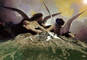
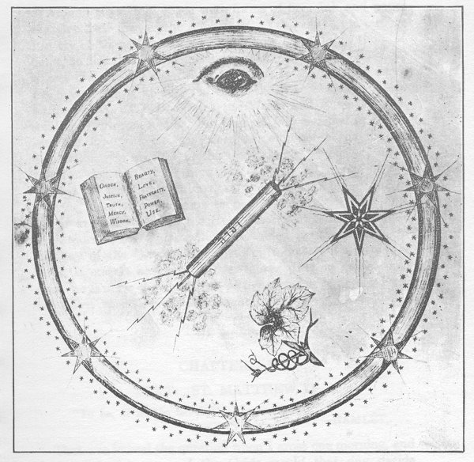

  
[Intangible Textual Heritage](../../index)  [Atlantis](../index) 
[Index](index)  [Previous](dtp44)  [Next](dtp46) 

------------------------------------------------------------------------

[Buy this Book at
Amazon.com](https://www.amazon.com/exec/obidos/ASIN/B00213KFQ8/internetsacredte)

------------------------------------------------------------------------

  
*A Dweller on Two Planets*, by by Phylos the Thibetan (Frederick S.
Oliver), \[1894\], at Intangible Textual Heritage

------------------------------------------------------------------------

# CHAPTER X

### AFTER THE YEARS, RETURN

Sparing details, what was the appearance of Phyris after the flight of
the years? When I left she was a bright, beautiful maiden, in the
budding days of womanhood, having the divine, spiritual glory which
characterizes the higher race of the perfect Human grade. How looked she
now? Different only in the maturity of rounded womanhood, the prime
which in Venus withers not with age, because there the animal is
subdued, and there are no excesses, indulgences, nor any of that
feverish grasping after unattainable things which

p. 377

the "children of a larger growth" who dwell in the human-animal plane of
Earth to-day. Phyris, the dark-haired, starry-eyed girl who was yet more
than a girl, was a woman divinely fair, was again before me. Again I
beheld the sweetly natural, dignified mien that reminded me of the first
time I ever saw Mol Lang, that air of quiet, but marvelous power.
Enhanced by this appearance, as is a gem by its setting, her sweet, pure
selfhood shone forth, that sweet spirit which in Phyris was divine, yet
had lost none of the human characteristics which have rendered Jesus so
dear to mankind. The spirit was there, the perfect human, also, but the
animal, the nature of Man on Earth, was reduced to its place of
servitude. When I met the fair, beautiful woman I was abashed. At that
moment the tide of the years overflowed my soul and awed me. Sometimes I
had known of Phyris when the Hesperian astral controlled me. But far
oftener of later years, the years of duty, this astral did not come, and
then I knew Phyris only as an ideal, and with the attributes of that
ideal I tried to endue Elizabeth, and the failure was agony to me.

Wonderingly, wholly delighted, I looked on Phyris now, nor deemed it
lack of propriety that she should kiss me and 'whisper, "Home again,"
her eyes lighted with the peaceful joy reflected from my gaze.

No passion was in me, no prompting to be sentimental--no, that was gone
with Earth's feverish dream.

How familiar all things appeared when at last I was come home. For six
Hesperian months [1](#fn_35) I did nothing but
wander in my psychic form in this Elysium, this stellar garden of the
Hesperides. In the other time most of my visit was spent in the company
of Sohma or Mol Lang. But now Sohma was otherwise engaged. Mol Lang,
too, was occupied in the work that attracted him, that of guiding,
teaching and helping mankind, en masse, as well as individually; that
portion of our race yet on Earth. Unconscious of his agency, or of how,
with others equally great, Mol Lang was influencing the affairs of men,
these men on Earth went on with their doings, fondly

p. 378

thinking that themselves were doing all. How little humanity on Earth
knows that it is thus guided. Yet our Father gives it to His occult
children to lead their lesser brethren, just as He gave it to Jesus, one
of the Sons of Light, higher than any other, who was an incarnation of
the Christ. Perhaps human acts were not, are not, guided individually,
as a rule, although exceptions exist. But just as shot, running in
grooves, is checked by the leaden pellets before and behind, so the acts
of one man depend on the acts of others; these on others still, until
finally it appears that the mass is influenced in the whole, and every
individual in the mass has his or her acts unconsciously controlled by
what are termed circumstances, fates, adverse or propitious, inexorable,
the grooves in which they run. That is to say, humanity is ordered in
its action by what may be named the Universal Karma. So long as men
grope in the dark, ignorant of occult laws, so long must they produce
this inexorable karma. It is fate, self-made, running from life to life,
incarnation after incarnation, unavoidable, for it is horn of the
infraction of the laws of the Creator. Even Mol Lang, before he passed
and triumphed at the Crisis, to which I was soon to come, and which he
experienced a century ago, was controlled by the great, Universal Karma.
But in passing that ordeal he passed from finite life to everlasting,
and became a law unto himself. And then, free of karma, he returned to
minister to those bound by circumstances. Mol, Lang was become more than
man. He had taken of the Tree of Knowledge, also of the Tree of
Life. [1](#fn_36) Such as he utilize the
elementals, those non-human, non-embodied powers of the air. They find
in mankind the tendency to sin, and use it, so that the erring ones
mount the ladder on rungs, each of which is a conquered fault. The great
religious movements, wars, and the fields of commerce, all furnish
experiences for mankind. Do some seem cruel, evil? Yet each is a part of
the scheme of the Creator, each is a tool in the hands of His ministers,
and all teach that except a man, as part of the Eternal Whole, works for
that Whole, subduing the

p. 379

selfish animal in himself, he can in no wise come to the Father.

"Except by My Path," says the Savior.

If Sohma and Mol Lang could no longer be with me as companions, who then
could? Phyris. She became my tutor, my guide, and led me farther on
towards the point where soon I must take the Key and enter alone on the
dread struggle, with only my faith in God to sustain me.

One day Mol Lang said, "Phylos, come with me."

I went to his special apartments. There he said:

"Hitherto thou hast but an astral body, but now thou needest a physical
body as a base of action, for now must thou learn of thine own self.
Sleep, that I may gather material atoms about thine astral."

I immediately slept, as I lay on the couch where he had bidden me
recline. When I awoke be was regarding me, and, for a moment forgetful,
I sat up.

"Arise," said Mol Lang. I obeyed, and found myself clothed in flesh.
Thus I became a Hesperite. I was now of the same apparent age as Phyris,
and was thereby seemingly dispossessed of some twenty-five years. Before
any lengthy period there came to shine in me somewhat of the
Spirit-nature, and as the same ego shone in Phyris, so therefore we grew
into similitude of each other. Because of this indwelling Spirit, Nature
was become an open book, and occult wisdom addressed me from all sides.
Soon I could leave the body at will. Other steps succeeded, and I grew
with marvelous rapidity to know many of the minor things reserved by our
Father for His aspiring children.

With me now was abiding a Voice, [1](#fn_37) and
as it demanded of me, I answered and knew. It said:

"What is heredity?"

And I answered from my spirit, knowing this thing:

"Heredity is the sum of experience which the souls of men carry from one
life through devachan into reincarnation. It is in nowise transmitted
from parent to child, but its leading trait is attracted by the like
trait in the parents. The lesser

p. 380

traits are educed by cultivation, or else lie dormant, according to
environment."

Again the Voice said:

"It is not well; thou who hast reaped, must now saw. I am the Eternal
Spirit in thee; obey me. Thou art now able to stand in my presence; able
to see; able to hear; able to speak; conqueror of desire, attainer of
self-knowledge. Thou hast seen thy soul in its bloom, heard the voice of
Peace. Go thou and read my writing in the Hall of Learning, which is My
Works. Read.

"To stand--is to have confidence. To hear--is to have opened the door of
thy soul. To see is to have attained perception of My Works. To
speak--is to have gotten the power of helping others. To have conquered
desire-is to have acquired control of self. To have self-knowledge-is to
have come unto Me, whence thou art able impartially to view the personal
man that was thyself. To have seen thy soul in its bloom-is to have had
a momentary glimpse of that transfiguration which shall eventually make
thee more than Man.

"Stand aside in the coming battle, and though thou fightest, be not thou
the warrior. Look for Me, and let Me fight in thee. Obey My orders for
battle. Obey Me as if I were thyself. My orders thy desires--for I am
thyself, yet infinitely more than thee. Look for Me, lest in the fever
of battle thou pass Me. I will not know thee if thou knowest not Me. If
thy cry come to Me, lo! I will fight in thee and will fill the void in
thee. Then shalt thou be unwearied. Without Me thou shalt fall; with Me
thou canst not fall, for I am the Spirit.

"Listen now to the song of life in thy heart. Say not, 'It is not
there.' Listen deeper. This song is in every breast; it may be obscure,
yet it is there. Not the most wretched outcast but it is in him, for all
are children of the Father, which is I. Listen to My Song, for while
thou art yet but man, I shall not speak continually, and thy strength
must sometimes be in memory of Me. Inquire now of the Earth-matter; of
the

p. 381

air, of the water, the wind; and seek the treasurers of the snow. My
Peace I give unto thee."

At last I saw; I heard; and, my friend who readeth this, I speak. My
words go to the multiplication by types, and then by myriad copies
through the world, to be known by those that "seeing, see and
comprehend." And with each copy shall go my love and greater, mine eye
shall note each hungered seeker for the truth, and, be it in the palace,
or cottage, there, too, will I be, not figuratively, but my Spirit.

I had gone into a lonely mountain spot to hear this Voice, and now as I
walked, a Being not Man joined me. Its presence was one of light and
glory and goodness. With it came Mol Lang, saying:

"This is one of the Beings of Good. Behold, Phylos, our Father's House
hath many Mansions, and in these are Beings created by Him, and endowed
with volition like as Man, yet they are not human, never were, nor ever
will be. Man shall be perfect when the Spirit of the Father entereth
him. Then shall he know all things, and be perfect. What is perfection?
Absolute harmony with His Infinite Creation. So there may be perfect
men; also perfect Beings which are not Men, as this one with us. This is
a Good Being. But there is an opposite in the Things of the Creation.
There are perfect Evil Beings, which likewise are not, never were, nor
ever will be human. What are these? They are in perfect harmony with the
laws of their existence, but those laws and their conditions are
absolutely opposed to ours, and to good. Hence such are inimical to our
life and so, evil. Yet this sort seek us not, nor we them. In the scheme
of Creation evil and good are evenly balanced. What disturbs, harmony
with us, therefore, disturbs them by disadjustment of balance. Hence
they seek not our harm. But Satan, know ye him? He was an Angel of
Light, fallen, and come to so much the greater fall in that his height
was so lofty. [1](#fn_38) He is a rebel, and out
of harmony.

"Life, Phylos, is limited, for it is but the action in the Mansion of
Human environment. But existence is not limited.

p. 382

Hence this Good Being with us is not Life, but of Existence. See, It
goes. This is Its symbol, and the name of Its Mansion △. And when thy
trials are thickest, draw about thee on the ground that figure and stand
in it; go not out, but call on the Father. He will send His △ Beings to
aid thee. Peace go with thee."

Mol Lang disappeared, and I was alone.

Men dread most those insidious diseases, which attack not openly, but
the weakest and most unguarded point. So, in the last, final Trial of
the Crisis, I should be likewise insidiously attacked by the Satanic
hosts. Earth has tried me during many lives; now was to come a trial
greater than Earth. The attacks of mere human error differ from that of
the well-organized, intelligent assault of those to whom evil has become
natural, to Lucifer and his fellow-rebels.

Of what nature is this Trial of the Crisis? [1](#fn_39) It is the deciding whether in the long
series of incarnate lives the soul has improved its opportunities for
good; if it, in the main, followed the Path which Jesus pointed. If so,
it has or will have strength to cope with the best efforts of the
Satanic foe. If not, it must fall and die the second death. [2](#fn_40) His incarnate life made the soul forgiving
of all wrongs, forgetful of selfish interests, helpful to those having
less light, more gloom, misery and sin to encounter, a self-contained
nature? Has it become like the Man of Sorrows, full of faith, hope and
charity? Then it hath beard the Voice, and will not fail. But if the
soul is not like that, then, although it have the prophetic sight, and
knoweth all things, though it have faith to removing mountains, yet
shall it be only the more like Satan, and the worse its fate.

"Go into the Holy Place." [3](#fn_41)

And I, knowing obedience, went into a room built of stone, apart from
the house. Then was I in the Presence where I had been as Zailm when
Priest Mainin was blasted: It was the Presence of the living Christ. It
was Man, yet more, for it

   
SYMBOLIC PICTURE IN THE "HOLY PLACE"

 

 

p. 383

was the Spirit; as much more than Man as the sun is more than a
glow-worm. Then a wondrous Voice said:

"Be not afraid; it is I."

Around that Holy Place were forms of fire. Ink and paper can give little
idea of the semblance. Yet look at the picture and try, with my aid, to
see. The bolt blazed as a thing of flame, so also the Great Star and all
the lesser ones. The Leaf was as life, and the cross the open Way, to
the House thereof, while the Ring, I knew, symbolized the Eternal One,
endless, beginningless. The Book was the Word, and it blazed with
scintillant, crimson flame. But over all, a Personified Presence, was
the Eye, the Eternal, sleepless, omnipotent omniscient Supervisor. So
stood I in the presence of the Father, made manifest for me. As I
remained, I knew all things of His Works, for the Spirit entered in. But
not to abide, for as yet the Trial was not come to pass.

For weeks I stayed in the Holy Place, and came not out to eat or drink,
for I was wholly sustained by the Spirit. At the day of the Great Peace
this Spirit must enter in and I be in It and It be in me forever more.
But no guide could exist, no law for the Trial, except my strength of
ages. Even the Spirit would be veiled in that ordeal.

------------------------------------------------------------------------

### Footnotes

[377:1](dtp45.htm#fr_35) About 112 terrestrial
days. The solar you of Venus is 224.7 earthly days.

[378:1](dtp45.htm#fr_36) Revelations xxii; 14.

[379:1](dtp45.htm#fr_37) St. John xvi; 13.

[381:1](dtp45.htm#fr_38) St. Lake xii; 48.

[382:1](dtp45.htm#fr_39) St. Luke: xx. 35-36.

[382:2](dtp45.htm#fr_40) Rev.: xx. 15.

[382:3](dtp45.htm#fr_41) St. Luke: iv, 2.

------------------------------------------------------------------------

[Next: Chapter XI: Text: St. Matthew IV](dtp46)
