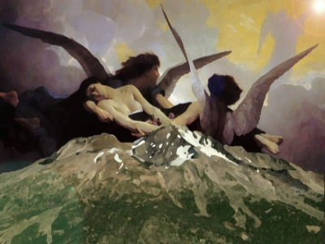

  
[Intangible Textual Heritage](../../index)  [Atlantis](../index) 

------------------------------------------------------------------------

[Buy this Book at
Amazon.com](https://www.amazon.com/exec/obidos/ASIN/B00213KFQ8/internetsacredte)

------------------------------------------------------------------------

<table width="75%">
<colgroup>
<col style="width: 50%" />
<col style="width: 50%" />
</colgroup>
<tbody>
<tr class="odd">
<td width="50%" data-valign="TOP"> 
A Dweller on Two Planets. Image (c) Copyright J.B. Hare, 2009, All Rights Reserved.</td>
<td width="50%" data-valign="CENTER"><h1 id="a-dweller-on-two-planets" data-align="CENTER">A Dweller on Two Planets</h1>
<h2 id="by-phylos-the-thibetan" data-align="CENTER">by Phylos the Thibetan</h2>
<h3 id="frederick-s.-oliver" data-align="CENTER">[Frederick S. Oliver]</h3>
<h4 id="section" data-align="CENTER">[1894]</h4></td>
</tr>
</tbody>
</table>

------------------------------------------------------------------------

[Contents](#contents)    [Start Reading](dtp00)    [Page
Index](pageidx)    [Text \[Zipped\]](dtp.txt.gz)

------------------------------------------------------------------------

|                                                                                                                           |
|---------------------------------------------------------------------------------------------------------------------------|
|  |

A Dweller on Two Planets is one of the most important texts of the 19th
Century Atlantis canon. The book was 'channeled' by Frederick S. Oliver.
Oliver was born in Washington D.C. in 1866 and came to Yreka,
California, with his parents when he was two years old. Yreka is just
north of Mount Shasta, a huge dormant volcanic peak in Northern
California.

Oliver started to write this book at the age of eighteen, in 1883-4,
while surveying the boundaries of his family's mining claim. He found
himself writing uncontrollably in his notebook. He ran home in terror,
where he sat down and let his hand write. These automatic writing spells
continued for several years; he would write a few pages at a time. He
completed writing this book in 1886, and died at the age of 33 in 1899.

A Dweller on Two Planets was finally published in 1905, by his mother
Mary Elizabeth Manley-Oliver. There are two editions which are
substantially the same, except for a different set of typographical
errors and hyphens (although curiously the page numbering in both is
identical). The first edition, published in 1905, was reprinted in 1974
by Rudolf Steiner Books; the second, published in 1920 by the Poseid
Publishing Company, Los Angeles, CA, was reprinted in 1964 by Health
Research. The 1920 version was used as the basis for this etext, as it
was printed more legibly.

A Dweller on Two Planets would be a *tour de force* for a teenager from
rural California in the post-Gold Rush period. Although as a literary
work it is weak in many ways, the details of the narrative reveal a
well-read and highly intelligent, if inexperienced, author. The plot and
pacing is irregular; the characterizations are poorly conceived, and
there are far too many melodramatic turns and plot elements left
dangling. However, since this is a novel of ideas, these shortcoming
should not detract from the enjoyment of the book.

The real brilliance of this book is as a work of speculative fiction,
particularly in the depiction of the high technology of Atlantis, and
the afterlife. The book goes into great detail about antigravity, mass
transit, the employment of 'dark-side' energy (which today would be
called 'zero point energy'), and devices such as voice-operated
typewriters. The cigar-shaped, highly maneuverable Atlantean flying
machines, or *vailx*, have an eerie resemblance to 20th Century UFO
reports. The personalized heavens, almost like virtual realities, are
unforgettable and very compelling.

This book is openly acknowledged as source material for many new age
belief systems, including the once-popular "[I
AM](../../eso/index.htm#iam)" movement (whose founder, Guy Ballard,
[plagiarized](../../eso/um/index) extensively from this book), the
Lemurian Fellowship, and Elizabeth Claire Prophet. According to Shirley
MacLaine, A Dweller on Two Planets jumped out of a bookshelf into her
hands in a New Age bookstore in Hong Kong (and obviously had an big
influence on her subsequently). This book is the source of the idea that
there is a hidden sanctuary of ascended Lemurian masters under Mount
Shasta. This book was also probably the first to propose the concept of
of 'America as the modern Atlantis', which was later adopted by writers
such as Manly P. Hall.

The Lemurian Fellowship published a sequel in 1940 titled *An Earth
Dweller's Return*. This rehashed the plot of the original, and had some
radically different maps, which I've included on the [maps page](dtp04).

Introduction © 2002, John B. Hare

------------------------------------------------------------------------

 [Title Page](dtp00)  
[Index](dtp01)  
[Glossary](dtp02)  
[Amanuensis' Preface](dtp03)  
[Maps](dtp04)  

### Book the First

[Chapter I: Atlantis, Queen of the Waves](dtp05)  
[Chapter II: Caiphul](dtp06)  
[Chapter III: Faith Is Knowledge Also, And It Giveth To Removing
Mountains](dtp07)  
[Chapter IV: Axte Incal, Axtuce Mun](dtp08)  
[Chapter V: Life In Caiphul](dtp09)  
[Chapter VI: No Good Thing Can Ever Perish](dtp10)  
[Chapter VII: Contain Thyself](dtp11)  
[Chapter VIII: A Grave Prophecy](dtp12)  
[Chapter IX: Curing Crime](dtp13)  
[Chapter X: Realization](dtp14)  
[Chapter XI: The Recital](dtp15)  
[Chapter XII: The Unexpected Happens](dtp16)  
[Chapter XIII: The Language of the Soul](dtp17)  
[Chapter XIV: The Adoption of Zailm](dtp18)  
[Chapter XV: A Maternal Desertion](dtp19)  
[Chapter XVI: The Voyage to Suern](dtp20)  
[Chapter XVII: Rai Ni Incal--Ashes To Ashes](dtp21)  
[Chapter XVIII: Le Grand Voyage](dtp22)  
[Chapter XIX: A Well-Met Problem](dtp23)  
[Chapter XX: Duplicity](dtp24)  
[Chapter XXI: The Mistake of a Life](dtp25)  
[Chapter XXII: Zailm Proposes](dtp26)  
[Chapter XXIII: A Witness Before The Criminal](dtp27)  
[Chapter XXIV: Devachan](dtp28)  

### Seven Shasta Scenes; Interlude

[I](dtp29)  
[II](dtp30)  
[III](dtp31)  
[IV](dtp32)  
[V](dtp33)  
[VI](dtp34)  
[VII](dtp35)  

### Book Second

[Chapter I](dtp36)  
[Chapter II: A Soul In Peril](dtp37)  
[Chapter III: Take Therefore No Thought For the Morrow](dtp38)  
[Chapter IV: Paying Life's Rewards](dtp39)  
[Chapter V: Human Life On Venus](dtp40)  
[Chapter VI: An Indirect Answer](dtp41)  
[Chapter VII: The Desert Is Before Thy Feet](dtp42)  
[Chapter VIII: Old Teachers Taught Of God](dtp43)  
[Chapter IX: They Who Heed Have Peace](dtp44)  
[Chapter X: After the Years, Return](dtp45)  
[Chapter XI: Text: St. Matthew IV](dtp46)  

### Book the Third

[Chapter I: Ye Shall Reap As Ye Have Sown. The Perception](dtp47)  
[Chapter II: Job xxxviii:7](dtp48)  
[Chapter III: Fair forms and hoary seers of ages put, an in one mighty
sepulcher](dtp49)  
[Chapter IV: The Fall Of Atlantis](dtp50)  
[Chapter V: Man's Inhumanity To Man](dtp51)  
[Chapter VI: Why Atlantis Perished](dtp52)  
[Chapter VII: The Transfiguration](dtp53)  
[Note By The Author](dtp54)  
