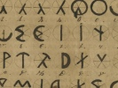

  
[Intangible Textual Heritage](../../index)  [Atlantis](../index) 
[Index](index)  [Previous](olb18)  [Next](olb20) 

------------------------------------------------------------------------

  
*The Oera Linda Book*, by Wiliam R. Sandbach, \[1876\], at Intangible
Textual Heritage

------------------------------------------------------------------------

### These are the Rules Concerning Bastards.

1\. If any man sets fire to another's house, he is no Frisian, he is a
bastard. If he is caught in the act, he must be thrown into the fire;
and wherever he may flee, he shall never be secure from the avenging
justice.

2\. No true Frisian shall speak ill of the faults of his neighbours. If
any man injures himself, but does no harm to others, he must be his own
judge; but if he becomes so bad that he is dangerous to others, they
must bring it before the count. But if instead of going to the count a
man accuses another behind his back, he must be put on the pillory in
the market-place, and then sent out of the country, but not to the tin
mines, because even there a backbiter is to be feared.

3\. If any man should prove a traitor and show to our enemies the paths
leading to our places of refuge, or creep into them by night, he must be
the offspring of Finda; he must be burnt. The sailors must take his
mother and all his relations to a desolate island, and there scatter his
ashes, in order that no poisonous herbs may spring from them. The
maidens must curse his name in all the states, in order that no child
may be called by his name, and that his ancestors may repudiate him.

  [  
Click to enlarge](img/pl01.jpg)  
Plate 1: Page 45 of the manuscript of the book of Adela's Followers  

p. 64 p. 65

War had come to an end, but famine came in its place. There were three
men who each stole a sack of corn from different owners, but they were
all caught. The first owner brought his thief to the judge, and the
maidens said everywhere that he had done right. The second owner took
the corn away from his thief and let him go in peace. The maidens said
he has done well. The third owner went to the thief's house, and when he
saw what misery was there, he went and brought a waggon-load of
necessaries to relieve their distress. Frya's maidens came around him
and wrote his deed in the eternal book, and wiped out all his sins. This
was reported to the Eeremoeder, and she had it made known over the whole
country.

------------------------------------------------------------------------

[Next: What is written hereunder is inscribed on the Walls of
Waraburgt](olb20)
