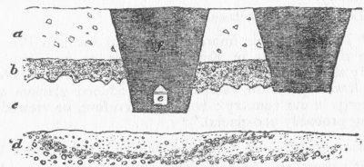
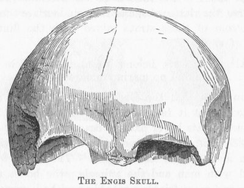
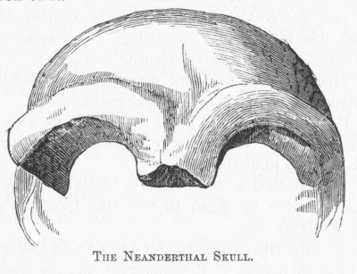
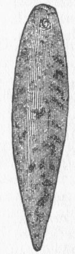

[Intangible Textual Heritage](../../index)  [Atlantis](../index) 
[Index](index)  [Previous](rag15)  [Next](rag17) 

------------------------------------------------------------------------

### CHAPTER II.

##### DID MAN EXIST BEFORE THE DRIFT?

FIRST, let us ask ourselves this question, Did man exist before the
Drift?

If he did, he must have survived it; and he could hardly have passed
through it without some remembrance of such a terrible event surviving
in the traditions of the race.

If he did not exist before the Drift, of course, no myths descriptive of
it could have come down to us.

This preliminary question must, then, be settled by testimony.

Let us call our witnesses

"The palæolithic hunter of the mid and late Pleistocene river-deposits
in Europe belongs, as we have already shown, to a fauna which arrived in
Britain before the lowering of the temperature produced glaciers and
icebergs in our country; he may, therefore, be viewed as being probably
pre-glacial."\[1\]

Man had spread widely over the earth before the Drift; therefore, he had
lived long on the earth. His remains have been found in Scotland,
England, Ireland, France, Spain, Italy, Greece; in Africa, in Palestine,
in India, and in the United States.\[2\]

"Man was living in the valley of the lower Thames before the Arctic
mammalia had taken full possession of

\[1. Dawkins's "Early Man in Britain," p. 169.

2\. Ibid., pp. 165, 166.\]

{p. 122 }

the valley of the Thames, and before the big-nosed rhinoceros had become
extinct."\[1\]

Mr. Tidderman\[2\] writes that, among a number of bones obtained during
the exploration of the Victoria Cave, near Settle, Yorkshire, there is
one which Mr. Busk has identified as *human*. Mr. Busk says:

"The bone is, I have no doubt, human; a portion of an unusually clumsy
fibula, and in that respect not unlike the same bone in the Mentone
skeleton."

The deposit from which the bone was obtained is overlaid "by a bed of
stiff glacial clay, containing ice-scratched bowlders." "Here then,"
says Geikie, "is direct proof that men lived in England prior to the
last inter-glacial period."\[3\]

The evidences are numerous, as I have shown, that when these deposits
came upon the earth the face of the land was above the sea, and occupied
by plants and animals.

SECTION AT ST. ACHEUL.

The accompanying cut, taken from Sir John Lubbock's "Prehistoric Times,"
page 364, represents the strata at St. Acheul, near Amiens, France.

\[1. Dawkins's "Early Man in Britain," p. 137.

2\. "Nature," November 6, 1873.

3\. "The Great Ice Age," p. 475.\]

{p. 123}

The upper stratum (*a*) represents a brick earth, four to five feet in
thickness, and containing a few angular flints. The next (*b*) is a thin
layer of angular gravel, one to two feet in thickness. The next (*c*) is
a bed of sandy marl, five to six feet in thickness. The lowest deposit
(*d*) *immediately overlies the chalk*; it is a bed of partially rounded
gravel, and, in this, *human implements of flint have been found*. The
spot was used in the early Christian period as a cemetery; *f*
represents one of the graves, made fifteen hundred years ago; *e*
represents one of the ancient coffins, of which only the nails and
clamps are left, every particle of the wood having perished.

And, says Sir John Lubbock:

"It is especially at the *lower part*" of these lowest deposits "that
the flint implements occur."

The bones of the mammoth, the wild bull, the deer, the horse, the
rhinoceros, and the reindeer are found near the bottom of these strata
mixed with the flint implements of men.

"All the fossils belong to animals which live on land; . . . we find no
marine remains."\[2\]

Remember that the Drift is unfossiliferous and unstratified; that it
fell *en masse*, and that these remains are found in its lower part, or
*caught between it and the rocks below it*, and you can form a vivid
picture of the sudden and terrible catastrophe. The trees were imbedded
with man and the animals; the bones of men, smaller and more friable,
probably perished, ground up in the tempest, while only their flint
implements and the great bones of the larger animals, hard as stones,
remain to tell the dreadful story. And yet some human bones

\[1. "Prehistoric Times," p. 366.

2\. Ibid., pp. 366, 367.\]

{p. 124}

have been found; a lower jaw-bone was discovered in a pit at
Moulinguignon, and a skull and other bones were found in the valley of
the Seine by M. Bertrand.\[1\]

And these discoveries have not been limited to river-gravels. In the
Shrub Hill gravel-bed in England, "*in the lowest part of it*, numerous
flint implements of the palæolithic type have been discovered."\[2\]

We have, besides these sub-drift remains, the skulls of men who probably
lived before the great cataclysm,--men who may have looked upon the very
comet that smote the world. They represent two widely different races.
One is "the Engis skull," so called from the cave of Engis, near Liége,
where it was found by Dr. Schmerling. "It is a fair average human skull,
which might," says Huxley, "have belonged to a philosopher, or might
have contained the thoughtless brains of a savage."\[3\] It represents a

THE ENGIS SKULL.

civilized, if not a cultivated, race of men. It may represent a victim,
a prisoner, held for a cannibalistic feast or a trader from a more
civilized region.

\[1. "Prehistoric Times," p. 360.

2\. Ibid., p. 351.

3\. "Man's Place in Nature," p. 156.\]

{p. 125}

In another cave, in the Neanderthal, near Hochdale, between Düsseldorf
and Elberfeld, a skull was found which is the most ape-like of all known
human crania. The mail to whom it belonged must have been a barbarian
brute of the rudest possible type. Here is a representation of it.

THE NEANDERTHAL SKULL.

I beg the reader to remember these skulls when he comes to read, a
little further on, the legend told by an American Indian tribe of
California, describing the marriage between the daughter of the gods and
a son of the grizzly bears, from which union, we are told, came the
Indian tribes. These skulls represent creatures as far apart, I was
about to say, as gods and bears. The "Engis skull," with its full
frontal brain-pan, its fine lines, and its splendidly arched dome, tells
us of ages of cultivation and development in some favored center of the
race; while the horrible and beast-like proportions of "the Neanderthal
skull" speak, with no less certainty, of undeveloped, brutal, savage
man, only a little above the gorilla in capacity;--a prowler, a robber,
a murderer, a cave-dweller, a cannibal, a Cain.

{p. 126}

We shall see, as we go on in the legends of the races on both sides of
the Atlantic, that they all looked to some central land, east of America
and west of Europe, some island of the ocean, where dwelt a godlike
race, and where alone, it would seem, the human race was preserved to
repeople the earth, while these brutal representatives of the race, the
Neanderthal people, were crushed out.

And this is not mere theorizing. It is conceded, as the result of most
extensive scientific research:

1\. That the great southern mammalia perished in Europe when the Drift
came upon the earth.

2\. It is conceded that these two skulls are associated with the bones
of these locally extinct animals, mingled together in the same deposits.

3\. The conclusion is, therefore, logically irresistible, that these
skulls belonged to men who lived during or before the Drift Age.

Many authorities support this proposition that man--palæolithic man, man
of the mammoth and the mastodon--existed in the caves of Europe before
the Drift.

"After having occupied the English caves for untold ages, palæolithic
man disappeared for ever, and with him vanished many animals now either
locally or wholly extinct."\[1\]

Above the remains of man in these caves comes a deposit of stalagmite,
twelve feet in thickness, indicating a vast period of time during which
it was being formed, and during this time *man was absent*.\[2\]

Above this stalagmite comes another deposit of cave-earth:

"The deposits immediately *overlying* the stalagmite and cave-earth
contain an almost

totally different assemblage

\[1. "The Great Ice Age," p. 411.

2\. Ibid., p. 411.\]

{p. 127}

of animal remains, along with relics of the neolithic, bronze, iron, and
historic periods.

"There is no passage, but, on the contrary, a *sharp and abrupt break*
between these later deposits and the underlying palæolithic
accumulations."\[1\]

Here we have the proof that man inhabited these caves for ages before
the Drift; that he perished with the great mammals and disappeared; and
that the twelve feet of stalagmite were formed while no men and few
animals dwelt in Europe. But some fragment of the human race had escaped
elsewhere, in some other region; there it multiplied and replenished the
earth, and gradually extended and spread again over Europe, and
reappeared in the cave-deposits above the stalagmite. And, in like
manner, the animals gradually came in from the regions on which the
Drift had not fallen.

But the revelations of the last few years prove, not only that man lived
during the Drift age, and that he dwelt on the earth when the Drift
fell, but that he can be traced backward for ages before the Drift; and
that he was contemporary with species of great animals that had run
their course, and ceased to exist centuries, perhaps thousands of years,
before the Drift.

I quote a high authority:

"Most of the human relics of any sort have been found in the more recent
layers of the Drift. They have been discovered, however, not only in the
older Drift, but also, though very rarely, *in the underlying Tertiary*.
For instance, in the Upper Pliocene at St. Prest, near Chartres, were
found stone implements and cuttings on bone, in connection with relics
of a long-extinct elephant (*Elephas meridionalis*) *that is wholly
lacking in the Drift*. During the past two years the evidences of human
existence in the Tertiary period, i. e., previous to the age of mammoths

\[1. "The Great Ice Age," p. 411.\]

{p. 128}

of the Diluvial period, have multiplied, and by their multiplication
give cumulative confirmation to each other. Even in the lower strata of
the Miocene (the middle Tertiary) important discoveries of stone knives
and bone-cuttings have been made, as at Thenay, department of
Marne-et-Loire, and Billy, department of Allier, France. Professor J. D.
Whitney, the eminent State geologist of California, reports similar
discoveries there also. So, then, we may believe that before the last
great upheaval of the Alps and Pyrenees, and while the yet luxuriant
vegetation of the then (i. e., in the Tertiary period) paradisaic
climate yet adorned Central Europe, man inhabited this region."\[1\]

We turn to the American Continent and we find additional proofs of man's
pre-glacial existence. The "American Naturalist," 1873, says:

"The discoveries that are constantly being made in this country are
proving that man existed on this continent as far back in geological
time as on the European Continent; and it even seems that America,
really the Old World, geologically, will soon prove to be the birthplace
of the earliest race of man. One of the late and important discoveries
is that by Mr. E. L. Berthoud, which is given in full, with a map, in
the 'Proceedings of the Philadelphia Academy of Sciences for 1872,' p.
46. Mr. Berthoud there reports the discovery of ancient fire-places,
rude stone monuments, and implements of stone in great number and
variety, in several places along Crow Creek, in Colorado, and also on
several other rivers in the vicinity. These fire-places indicate several
ancient sites of an unknown race differing entirely from the
mound-builders and the present Indians, while the shells and other
fossils found with the remains make it quite certain that the deposit in
which the ancient sites are found *is as old as the Pliocene, and
perhaps as the Miocene*. As the fossil shells found with the relies of
man are of estuary forms, and as the sites of the ancient towns are on
extended

\[1. "Popular Science Monthly," April, 1875, p. 682.\]

{p. 129}

points of land, and at the base of the ridges or bluffs, Mr. Berthoud
thinks the evidence is strongly in favor of the locations having been
near some ancient fresh-water lake, whose vestiges the present
topography of the region favors."

I quote the following from the "Scientific American" (1880):

"The finding of numerous relies of a buried race on an ancient horizon,
*from twenty to thirty feet below the present level of country in
Missouri and Kansas*, has been noted. The St. Louis 'Republican' gives
particulars of another find of an unmistakable character made last
spring (1880) in Franklin County, Missouri, by Dr. R. W. Booth, who was
engaged in iron-mining about three miles from Dry Branch, a station on
the St. Louis and Santa Fé Railroad. At a depth of *eighteen feet below
the surface* the miners uncovered a human skull, with portions of the
ribs, vertebral column, and collar-bone. With them were found two flint
arrow-heads of the most primitive type, imperfect in shape and barbed.
*A few pieces of charcoal were also found* at the same time and place.
Dr. Booth was fully aware of the importance of the discovery, and tried
to preserve everything found, but upon touching the skull it crumbled to
dust, and some of the other bones broke into small pieces and partly
crumbled away; but enough was preserved to fully establish the fact that
they are human bones.

"Some fifteen or twenty days subsequent to the first finding, at a depth
of *twenty-four feet below the surface*, other bones were found--a
thigh-bone and a portion of the vertebra, and several pieces of *charred
wood, the bones apparently belonging to the first-found skeleton*. In
both cases the bones rested on a fibrous stratum, suspected at the time
to be a fragment of coarse matting. This lay upon a floor of soft *but
solid iron-ore*, which retained the imprint of the fibers. . . .

"The indications are that the filled cavity had originally been a sort
of cave, and that the supposed matting was more probably a layer of
twigs, rushes, or weeds, which the inhabitants of the cave had used as a
bed, as the fiber

{p. 130}

marks cross each other irregularly. The ore-bed in which the remains
were found, and part of which seems to have formed after the period of
human occupation of the cave, lies in the second (or saccharoidal)
sandstone of the Lower Silurian."

Note the facts: The remains of this man are found separated--part are
eighteen feet below the surface, part twenty-four feet--that is, they
are *six feet apart*. How can we account for this condition of things,
except by supposing that the poor savage had rushed for safety to his
shallow rock-shelter, and had there been caught by the world-tempest,
and *torn to pieces* and deposited in fragments with the *débris* that
filled his rude home?

In California we encounter a still more surprising state of things.

The celebrated Calaveras skull was found in a shaft *one hundred and
fifty feet deep*, under five beds of lava and volcanic tufa, and four
beds of auriferous gravel.

The accompanying cut represents a plummet found in digging a well in the
San Joaquin Valley, California, *thirty feet below the surface*.

PLUMMET FROM SAN JOAQUIN VALLEY, CAL.

Dr. Foster says:

"In examining this beautiful relic, one is led almost instinctively to
believe that it was used as a plummet, for the purpose of determining
the perpendicular to the horizon \[for building purposes?\]; . . . when
we consider its symmetry of form, the contrast of colors brought out by
the process of grinding and polishing, and the delicate drilling of the
hole through a material (syenite) so liable to fracture, we are free to
say it affords an exhibition of the lapidary's skill superior to
anything yet furnished by the Stone age of either continent."\[1\]

\[1. "The Prehistoric Races of the United States," p. 55.\]

{p. 131}

In Louisiana, layers of pottery, *six inches thick*, with remnants of
matting and baskets, were found *twelve feet below the surface*, and
underneath what Dr. Foster believes to be strata of the Drift.\[1\]

I might fill pages with similar testimony; but I think I have given
enough to satisfy the reader that man *did* exist before the Drift.

I shall discuss the subject still further when I come to consider, in a
subsequent chapter, the question whether pre-glacial man was or was not
civilized.

\[1. "The Prehistoric Races of the United States," p. 56.\]

{p. 132}

------------------------------------------------------------------------

[Next: Chapter III. Legends Of The Coming Of The Comet](rag17)
