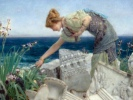

  
[Intangible Textual Heritage](../../index)  [Atlantis](../index) 
[Index](index)  [Previous](smoa04)  [Next](smoa06) 

------------------------------------------------------------------------

  
*Selestor's Men of Atlantis*, by Clara Iza von Ravn, \[1937\], at
Intangible Textual Heritage

------------------------------------------------------------------------

p. 30

### CHAPTER III

*The origin of wheat. Marriage customs. Laws regarding children born.
Cremation of the dead. Some industries. Music*.

Thou asketh of the origin of "wheat," the golden corn that rustled at
the breath of eve and drank the waters of the Southern Moon, and
glistened as the coin which all do crave?

It sprang to being from a wayside spray that God created for the birds
which sang in that lost land, now sunk but shall arise again with all
its drowned wealth of upbuilded fanes and walls and palaces which Ocean
hides and laves, and yet rebuilds with shapes in pearl, and shell and
life that drinketh deep of ocean life and knows not sun-shape.

Upon that isle ’twas nurtured, grown by process learned from nature's
secrets by the wise of that sunk land when black as midnight's scroll
were, mostly, eyes and hair of men who peopled earth.

They digged and planted, garnered too, and made the fleecy stuff for
food that men today call by such name as then they had not spake, yet
still the body nourished was the same.

Great ships sailed, dragged to the water's edge by bulk of grains,
propelled by oars that sped them onward to a land more blessed, for none
save they, my fathers of the ancient line, did grow for centuries that
food, that grain which was once a seed.

A liquid yellow as the light of morn was once distilled from out its
heart, and drunk alone by sages, kings. Not the fiery fluid which today
ye know, but an elixir mixed with well-riped wine which

p. 31

then produced a power of thought and vigor of the brain that gave
discernment to the dullest mind.

The raving were made peaceful; the fever-smitten were thus healed; they
called it "breath of gods." The liquid, priceless, hidden was in one
vast temple when the watery wall rose up engulfing all that land. Nor
yet the secret was to Egypt borne, for they who drank, as they who had
distilled, were not of that small band which sought fair Egypt's shore.

\_\_\_\_\_\_\_\_

The marriage laws, ye question? Priesthood reigned, save for a space at
least, and laws for marriages were made to fit the priest's own will;
nor king did understand that "counsel" meant the tightening of a bond
cast in the name of gods that he did claim as his protectors.

Nay, no voice had they—the wedded—to speak of choice or hate; for at
their birth the priest, the leech, the monarch, mayhap counsel held. "We
wed these scions of the house of Ram (or Ses)," whichever god the
parents claimed. And at the time when "woman" on the brow was writ, and
manhood spake in nature's mark and law, the priests assembled and the
monarch held a grand assembly, all the state partook of that one union
holding revel high and showering gifts.

"The gods are binding fast two hearts," they spake, "’tis well." But
should a wife be smitten ere a birth proclaimed her lord a father, he
who wed must pray to Ses for years ye number ten ere he another bride
could claim; and she must have been blessed at birth as bride of one who
passed. "Widows" wedded only with the priesthood. All pertaining to the
marriage state was wrought with words so solemn naught but death could
change.

p. 32

Instructors for the youth could claim both wife and slave; a second wife
who bore no sons nor daughters (this the leech forbade) and, thus barren
found a grave—a saddened lot when motherhood in that young age held all
of joy.

An infant born was closely watched by leech, and if, perchance, the moon
had risen round six times and it showed weakness of the brain its life
went out to gods who bore the soul, they well believed, to heaven for
infants' souls. If at its birth the shape lacked aught of symmetry, or
strength to wail was lacking, it left no memory of its birth or name
upon the parents' minds, who all resigned did speak: "The gods receive."

Aye, named. Named ere the light was shown to those dim eyes that looked
from body on the things of earth; for leech's skill foretold a daughter
or a son—much longed for; but the matter of the sex could He alone
present who giveth all! No wisdom learns the method. Thus God's mark is
set on all. He maketh as His will dictateth nor shall man so shape his
ways but they shall fit the mood of that great great God-mind. Ye shall
read the law!

At death a father portioned off his household goods, the gods had
yielded him throughout the years, to every child like portion; and so
sacred was the gift, he gave the mother to the eldest's care. Tenderness
surrounded her till death and honors heaped on monument proclaimed her
name and station, deeds for good or ill, for nothing was withheld.

Nay, Earth received not to her arms the husk of them who passed, but
fires were builded high of fragrant wood and subtle breath of spice
condensed in fragments of fine stone; and on the pyre was cast, in robes
of white, the form once loved but tendered to the gods when soul had
fled.

p. 33

A monument was raised and feasting took the place of fasting, for the
gods were said to Celebrate the soul's return unto the Arms that cast it
forth. All was well. None feared the end if so it were peaceful. Death
did hold enticement unto him who well had wrought his life's
appointment.

\_\_\_\_\_\_\_\_

The priesthood gained its power from sons of men who formed the
counsel—nobles. Sent afar to learn the ways of men of other lands, they
wondrous knowledge gained and knowledge meaneth power! Each noble of the
counsel gave but twain—the elder sons.

For though believing in the gods, a subtle voice contended to the people
that the brother priests might plot great power to wield; thus from each
household twain at most were given. "To warfare was he born," was
written on the tablets when the third son of a household saw the light,
and thus his destiny was fixed by fate, by priesthood and through
teachings, and those youths were taught the use of spear, of bow and of
the missile thrower which the men of later age did cultivate.

Aye, death it dealt to many, scattering fire as well as missiles at the
foe; a fire they could not quench; and in the air it circled drawing
breath from body; fire so dense with smoke and pungent smell the smitten
died ere word could pass his lips. Yet one afar, so wise they named him
Calus Heldi (man of mind) did give relief to those—his warrior friends,
inventing such a barrier for the mouth, the face, as checked the ravage
of the fire until its discontinuation was result.

He wove of "wire" so cunningly designed it held within its coils that
gripped the ears two tiny flasks

p. 34

of purest glass which held a drop of strong distilled vapour from a
shrub; and this strong vapour met the deadly fumes and checked their
virulence. ’Twas simple, seemingly, so simple they who battled scoffed
when first he spake "behold, I save from death our valiant men of
battle."

Yea, warriors came from lands afar unto Atlantis. Great galleys beat at
times upon the sand; great boats which stole at night from out the dark
and hungry foe, barbarian, crept to cot or palace walls, beat back by
guards or left to slaughter innocence and age or manly priest who spake
of gods to ears deaf to the Higher.

Atlantis knew the grace of music; builded instruments to catch the notes
of Nature; of that subtle music of the spheres which gross ears attuned
to jarring sounds of Earth may never hear, but builded so completely
were those harps of metal frame and silken cords, bound down the finest
crystal which quivered at a stroke of the magnetic ether so that a tone
from out the "silence" came and smote the ear of listener till his soul
was all attuned to higher music, drunk by those around the throne of
God, ye speak.

Thus every palace held the instrument, and men played not upon it, nor
beat they music from the keys of ivory then, but left the task to
sighing winds, to streams so vagrant in the atmosphere that one would
smile at thought of unseen hands of breeze which gave out music
ravishing the soul, yet so it was.

Great instruments there were in fountains set, where marble rose
pillar’d, high, embossed with pictured scenes of marriage fête, birds
that sang sweet songs, or animal that prowled with grace of shape which
mocked, again I speak, the artists wondrous skill.

p. 35

For, life imbued, the smallest creeping thing is fraught with beauty in
comparison with modeled clay or stroke of brush by man. Those courts
held vases of the beaten stuff [\*](#fn_5) ye
coin, and barter, not "for good of soul," and crystal basins held the
bloom of rose, or pungent dust that cast sweet breath around, and tiny
trees sprang up, as Nature there had placed, in basket rooted in rich
soil.

And everywhere cringed slave to master, blind to beauty, set alone on
making life a joy to them who held in bonds of law man-made!

The instrument which made the fountain's tone a murmur of sweet sound
asketh thou? Enshaped like fan that cooleth heated brow, and spun of
cords of metal made by smith who worked from dawn till midnight on one
strand, spun fine as infant's hair, yet toughened by a method lost to
art, even then complex and fortunes representing.

Slaves and gems, aye crowns, would have been bartered for the secret.
Yet the secret was Baun El's alone, nor king nor noble sought to wrest
from him what he had won through strong approval of the gods, they
spake, and dared not wrest from him lest plague of blindness smite their
eyes, or numbness seize the hands, which sought to grasp the secret of
the God-sent knowledge.

Thus he worked in peace and builded for the king, for nobles, fans for
water-music sweet.

In every strand was wove a gem of worth which meant a slave or kingdom,
and as the fountain rose and fell the song rang soft or loud, and when a
storm swept o’er the ocean it did drink the unrest of the atmosphere and
made a swelling cloud of music that would smite the soul of listener.

Unto their knees fell slaves, so smiting was that

p. 36

cloud of sound and even nobles wept, the inner sense so torn by strong
emotion, as the soul rebelled and strove to burst the bonds that held to
form. Ah! music is the language of the heights! Yet not the beaten
melody ye hear, but soft, or silent to the clay ear deaf to higher
notes.

Aye, skilled were they—the sons of old Atlantis in all arts. They
builded volumes from the store of mind, gleaned where strange peoples
dwell on other spheres; some, creatures of a form ye ne’er have known,
and others like to men of Earth with beauty rare, and heart attuned to
all the great and soul-learned knowledge from the first.

Their language but a motion of the lips, yet brain cast out its thoughts
so plain to those about that inner sense was touched and tuned to
harmony of thought and sound. To sense spake melody in sigh of winds
that swept the plains on planets, verdure blessed, and banks of bloom
cast out their fragrant speech to souls attuned to language of the
beings deemed inanimate, yet holding life in every fiber, these.

Aye, life in color, too, and shape and language which the toiling soul
did learn and gathered knowledge where it only wonder held before. Vast
knowledge from a source man dared proclaim but made for toy to beautify
the state each soul may dare to keep!

They wrote in volumes what the star-men read—from birds a melody of
thought which turned unto the Higher-songs of birds. Aye, voicing
thought as man may voice his thoughts in accents harsh or low.

Each presence cast a color to the eye. A friend shed softest hues, a foe
a glare of light that warned and checked complacency.

They wrote that ether yielded force for labor. Streams of ether carried
shape to other realm—the

p. 37

shape akin to substance, yet the clay shape lay in state when soul did
journey.

They of Atlantis read by subtle thought cast out and seldom read amiss;
and we of Egypt caught a glimmer here, a memory there, of what our sires
did know; yet not all the knowledge which men of that sunk land did
glean, for war and pillage cursed my land till fled the higher science.

Ah! I wander from Atlantis to that land whose glory passed, as passeth
fleeting cloud, where naught save alien force exists today to typify the
power that ruled the world!

Atlantis? Aye, Atlantis was our theme; broad isle that held the shrubs
of Africa and, later from the land ye name as "Asia"—land of balm and
subtle spice.

Atlantis held the sons of self-taught sages; sages taught to read by
introspection all which met the eye, and from the silent voice that
filleth "space" they caught the meaning of the planet laws—of people on
the ether planes—of growth made sure by scientific rule and keenest
insight born of observation of each small detail and taught the secret
unto others.

------------------------------------------------------------------------

### Footnotes

[35:\*](smoa05.htm#fr_5) Gold.

------------------------------------------------------------------------

[Next: Chapter IV. Institutions for the training of youth. Music. Arts.
Industries. Some customs. Food.](smoa06)
