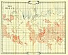
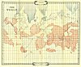

  
[Intangible Textual Heritage](../../index)  [Atlantis](../index) 
[Index](index)  [Previous](tll00)  [Next](tll02) 

------------------------------------------------------------------------

 

# Theosophical Maps of Lemuria

[  
Click to enlarge](img/l01.jpg)  
Map 1: Lemuria at its Greatest Extent  

[  
Click to enlarge](img/l02.jpg)  
Map 2: Lemuria at a Later Period  

 

------------------------------------------------------------------------

[Next: Evidence supplied by Geology and by the relative distribution of
living and extinct Animals and Plants.](tll02)
