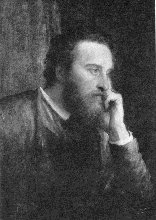

[Intangible Textual Heritage](../../index)  [Atlantis](../index) 

------------------------------------------------------------------------

# Vril, The Power of the Coming Race

## by Sir Edward Bulwer-Lytton

### \[1871\]

Legendary for his turgid prose ("it was a dark and stormy night...")
Bulwer-Lytton's pioneering science fiction novel "Vril" was taken *very*
seriously by 19th Century Atlantis fans (for instance,
[Scott-Elliot](../index.htm#soa)). Vril is a mysterious energy which is
used by Lytton's subterranian race (refugees from the Deluge) to power
their advanced civilization; it was later treated as a reality by
occultists. The plot of this book was recycled for numerous 'B' pulp
scifi movies and assorted crank theories.

------------------------------------------------------------------------

[CHAPTER I](vrl00)  
[CHAPTER II](vrl01)  
[CHAPTER III](vrl02)  
[CHAPTER IV](vrl03)  
[CHAPTER V](vrl04)  
[CHAPTER VI](vrl05)  
[CHAPTER VII](vrl06)  
[CHAPTER VIII](vrl07)  
[CHAPTER IX](vrl08)  
[CHAPTER X](vrl09)  
[CHAPTER XI](vrl10)  
[CHAPTER XII](vrl11)  
[CHAPTER XIII](vrl12)  
[CHAPTER XIV](vrl13)  
[CHAPTER XV](vrl14)  
[CHAPTER XVI](vrl15)  
[CHAPTER XVII](vrl16)  
[CHAPTER XVIII](vrl17)  
[CHAPTER XIX](vrl18)  
[CHAPTER XX](vrl19)  
[CHAPTER XXI](vrl20)  
[CHAPTER XXII](vrl21)  
[CHAPTER XXIII](vrl22)  
[CHAPTER XXIV](vrl23)  
[CHAPTER XXV](vrl24)  
[CHAPTER XXVI](vrl25)  
[CHAPTER XXVII](vrl26)  
[CHAPTER XXVIII](vrl27)  
[CHAPTER XXIX](vrl28)  
