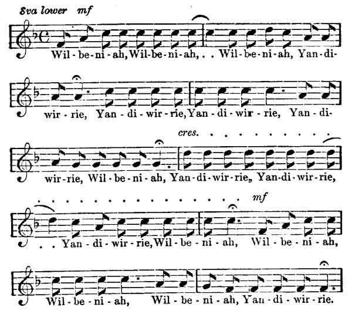
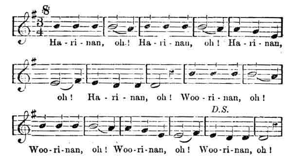
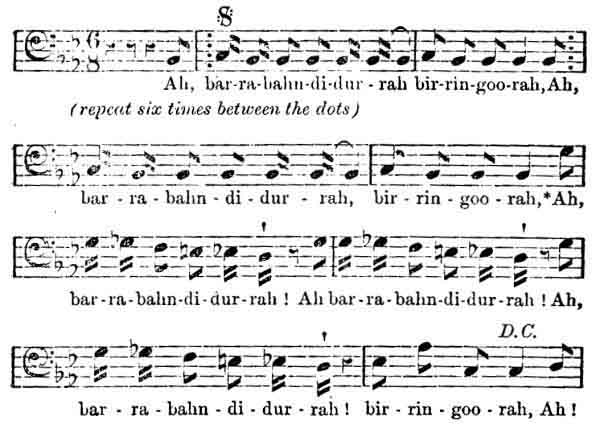
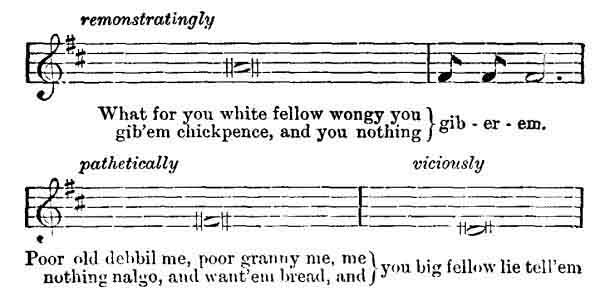

  
[Intangible Textual Heritage](../../index)  [Australia](../index) 
[Index](index)  [Previous](awa12)  [Next](awa14) 

------------------------------------------------------------------------

### Music and Poetry

In his admirable play of the Mourning Bride, far too little known to
modern readers, Congreve has the well known lines:--

"Music hath charms to soothe the savage breast,"  
"To shatter rocks and rend the solid oak."

If the dramatist overdoes it a little in the second line, he fall, short
of the literal truth in the first. The Australian savage is devouringly
fond of music, but it has sometimes the reverse of a soothing effect
upon him, for instance, when it takes the form of a war song. During

p. 32

the singing of one of these he rushes madly up and down, stamping and
jumping in an ever increasing frenzy.

And yet to the eye, when the words of one of these spirit stirring
ditties are coldly set up in type, there seems but scanty material out
of which to get up so much superheated steam.

Here is a specimen of a well-known war song.

"Yu-do dan na  
Nan-do danna! (Staccato!)  
My-eree danna  
Goor doo danna  
Boon ga-la dan-na (with a shriek)  
Gonogo dan na,  
Dow-al dan-na,  
Narra-ra danna," &c., &c.

The last lines being hissed and shrieked with energy indescribable.

All this, being interpreted, means--

"Spear his forehead,  
Spear his breast,  
Spear his liver,  
Spear his heart,  
Spear his loins,  
Spear his shoulder,  
Spear his thigh,  
Spear his ribs," &c., &c.

When we consider our very slight knowledge of their language, feelings
and passions, it is not surprising that we fail to appreciate the
niceties of their music and poetry. Nevertheless it is a fact that an
elderly and spiteful female, who possesses musical and poetic gifts, can
very readily set scores of warriors, thirsting for each others blood.

p. 33

Mr. Threlkeld, in his Australian Grammar, says:--

"There are poets among them who compose songs which are sung and danced
to by their own tribes in the first place; after which other tribes
learn the song and dance which passes from tribe to tribe throughout the
country, until from change of dialect not one of the original words
remain."

A new song is highly appreciated, and a savage who has travelled to
distant parts of the Continent, some times brings back a few of the
latest, with which, no doubt, he greatly "astonishes the natives!"
Certainly these effusions are very savage and discordant-sounding to
European ears, but of course, on the other hand, our music is insipid
and ridiculous to the aboriginal taste and estimation.

An imitation by a native of an English song never fails to produce
astonishment and shrieks of laughter. Indeed, all other matters besides
music, the black boy regards us as all extremely absurd race of mortals.
Perhaps he is right.

The only accompaniment to native songs which I have heard, is the
beating of a board or clapping of hands. Any remarkable circumstance
which occurs, is, as used to be the case with us, perpetuated in a
ballad.

Sir George Grey tells us that when Miago, the first native who ever
quitted Perth, was taken in H.M.S. Beagle in 1838, the following was
composed by a relative, and constantly sung by his mother during her
boy's absence.

"Ship bal win-jal bat tar dal gool-an-een,  
Ship bal win-jal bat-tai dal gool-an-een," &c., &c.

p. 34

Meaning,

"Whither is the lone ship wandering?  
Whither is the lone ship wandering &c., &c.

Then, on his safe return, the same poet commemorated his voyage thus:--

"Kan de maar-o, Kan de maar-a-lo  
Tsail-omar ra, tsail-o mar-ra-lo," &c., &c.

Meaning,

"Unsteadily shifts the wind oh! Unsteadily shifts the wind oh!  
The sails-oh handle oh! The sails-oh handle oh &c., &c.

It is impossible to describe the strange wild music of these swarthy
denizens of the forest; but the abundant evidence of passion and feeling
which it expresses should forbid too hasty a judgment of a people of
whom we really know so little.

But while it is difficult to describe the music so as to convey anything
like an adequate idea of its effect, especially as many of their songs
are simply deep guttural unmusical notes, it is within my power to give
to the public the "words and music" of several of their more melodious
songs. These have been supplied to me by a resident in Western
Australia, who has also appended to each a few remarks as to the
circumstances under which they were sung.

"Some time ago," he says, "one of the white colonists, held in high
esteem by one of the native tribes near Guigin, was presented by them
with what may be best described as "tribal rights" (corresponding to
citizenship) over certain lands. During the ceremony of presentation was
sung the following song, and it may be explained that "Wilbeniah" was
the name of the land,

p. 35

and "Yandiwirrie" the name by which the natives knew their friend. When
they sang the first word they pointed to the land, and when they sang
the second they pointed to the adopted tribesman, indicating by this
probably, that the land was his, and that he belonged to the land."

 

 

 

Wil-be-ni-ah, Wil-be-ni-ah, . .  
Wil-be-ni-ah, Yan-di-wir-rie,  
Yan-di-wir-rie, Yan-di-wir-rie,  
Yan-di-wir-rie, Wil-be-ni-ah,  
Yan-di-wir-rie, Yan-di-wir-rie,  
Yan-di-wir-rie, Wil-be-ni-ah,  
Wil-be-ni-ah, Wil-be-ni-ah,  
Wil-be-ni-ah, Yan-di-wir-rie.

Two natives were married, and, which is not always the case, both
parties were great favourites, and wonderful to relate very young. After
the marriage, a party of natives, male and female, belonging to their
tribe gathered round the fire in front of their hut and sang the
following measure, scores of times: "Harinan"

p. 36

was the name of the Benedict, and "Woorinan" that of his Beatrice. The
air is not unmusical, and the men's voices blended with those of the
women very effectively."

 

 

 

Ha-ri-nan, oh! Ha-ri-nan, oh! Ha-ri-nan,  
Ha-ri-nan, oh! Woo-ri-nan, oh!  
Woo-ri-nan, oh! Woo-ri-nan, oh! Woo-ri-nan, oh!

The next is a different class of song altogether, being one sung at a
corroborie, or native dance. Like all native ditties, it is repeated
almost *ad infinitum*. It may be said to be divided into two parts, the
first terminating at the asterisk, and being sung very smoothly--the
second, which is largely composed of what, in music, are called
"accidentals," is sung in a very loud excited, staccato manner, and its
effect may better be appreciated by the singer speaking the notes rather
than singing them. What the words mean I was never able to learn. No
inducement was potent enough to win from my black friends even the
faintest hint as to the meaning of the, song. They merely laughed, and
said, "nothing tell 'em." I am, therefore, unable to furnish a
translation."

p. 37

 

 

 

Ah, bar-ra-bahn-di-duhr-rah bin-rin-goo-rah, Ah. (repeat six times)  
bar-ra-bahn-di-dur-rah, bir-rin-goo-rah,\*  
Ah, bar-ra-bahn-di-dur-rah!  
Ah bar-ra-bahn-di-dur-rah!  
bar-ra-bahn-di-dur-rah!  
bir-rin-goo-rah, Ah!

The Western Australian aboriginal does not sing in his; own language
only, nor does he sing only when he is pleased. I have seen two native
women fight with their long, thick, hard wood staffs, accompanying their
thwacking with songs in which they alternately cursed and derided each
other in the choicest English and native Billingsgate. Indeed, it may be
said that whatever passion or feeling seizes them, the black fellow must
express it in song, and this leads, of course, to the improvising of
such as the following recitative which was the result of a refusal to
give a notoriously drunken, lazy native woman sixpence to enable her to
indulge her propensity by drinking. She professed to be hungry and to
want nalgo (food), but she had at that time sufficient food in the bag
slung at her back to feed her for a week, Finding her entreaties were,
unavailing, she sang the

p. 38

following to me several times--"Wongy" means "say" or "promise," and
that I had promised her something was one of her pleasant little
fictions."

 

 

 

remonstratingly  
What for you white fellow wongy you gib'em chickpence, and you nothing
gib-er-em.  
*pathetically*  
Poor old debbil me, poor granny me, nothing nalgo, and want'em bread
and  
*viciously*  
you big fellow lie tell'em.

------------------------------------------------------------------------

[Next: Religion and Mythology](awa14)
