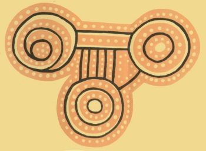

  
[Intangible Textual Heritage](../../index)  [Australia](../index) 

------------------------------------------------------------------------

<table width="75%">
<colgroup>
<col style="width: 50%" />
<col style="width: 50%" />
</colgroup>
<tbody>
<tr class="odd">
<td width="50%" data-valign="TOP"></td>
<td width="50%" data-valign="CENTER"><h1 id="the-native-tribes-of-central-australia" data-align="CENTER">The Native Tribes of Central Australia</h1>
<h2 id="by-baldwin-spencer-and-f.j.-gillen" data-align="CENTER">by Baldwin Spencer and F.J. Gillen</h2>
<h4 id="section" data-align="CENTER">[1899]</h4></td>
</tr>
</tbody>
</table>

------------------------------------------------------------------------

[Contents](#contents)    [Start Reading](ntca00)

------------------------------------------------------------------------

[Rock art gallery](arock)

------------------------------------------------------------------------

|                                                                                                                           |
|---------------------------------------------------------------------------------------------------------------------------|
|  |

This massive anthropological study of the central Australian tribes is
one of the primary sources for information on these cultures. Based on
first-hand scholarly study just prior to the twentieth century, Spencer
and Gillen describe their complex rituals and belief systems, including
initiation ceremonies, kinship, mythology and material culture. The
picture that emerges is that of a sophisticated culture living under
what most others would consider very marginal conditions.

Like its companion work, Spencer's [Native Tribes of the Northern
Territory of Australia](../ntna/index), this book stands far in front of
everything else written on the subject, and is an indispensible
reference on Australian ethnography.

------------------------------------------------------------------------

 [Title Page](ntca00)  
[Preface](ntca01)  
[List of Illustrations](ntca02)  
[Chapter I. Introduction](ntca03)  
[Chapter II. The Social Organisation of the Tribes](ntca04)  
[Chapter III. Certain Ceremonies Concerned with Marriage Together with a
Discussion Regarding the Same](ntca05)  
[Chapter IV. The Totems](ntca06)  
[Chapter V. The Churinga or Bull Roarers of the Arunta and Other
Tribes](ntca07)  
[Chapter VI. Intichiuma Ceremonies](ntca08)  
[Chapter VII. Initiation Ceremonies](ntca09)  
[Chapter VIII. Initiation Ceremonies (Continued) the Engwura
Ceremony](ntca10)  
[Chapter IX. Initiation Ceremonies (Continued) the Engwura Ceremony
(Concluded)](ntca11)  
[Chapter X: Traditions Dealing with the Origin of the Alcheringa
Ancestors of the Arunta Tribe and with Particular Customs](ntca12)  
[Chapter XI. Traditions Dealing with the Origin of the Alcheringa
Ancestors of the Arunta Tribe and with Particular Customs
(Continued)](ntca13)  
[Chapter XII. Customs Concerned with Knocking out of Teeth; Nose-Boring;
Growth of Breasts; Blood, Blood-Letting, Blood-Giving, Blood-Drinking;
Hair; Childbirth; Food Restrictions; Cannibalism](ntca14)  
[Chapter XIII. The Customs of Kurdaitcha and Illapurinja and the
Avenging Party or Atninga](ntca15)  
[Chapter XIV. Customs Relating to Burial and Mourning](ntca16)  
[Chapter XV. The Iruntarinia and Arumburinga, or Spirit
Individuals](ntca17)  
[Chapter XVI. The Making and the Powers of Medicine Men; Various Forms
of Magic](ntca18)  
[Chapter XVII. Methods of Obtaining Wives](ntca19)  
[Chapter XVIII. Myths Relating to Sun, Moon, Eclipses, Etc.](ntca20)  
[Chapter XIX. Clothing, Weapons, Implements, Decorative Art](ntca21)  
[Appendix A. The Names of the Natives](ntca22)  
[Appendix B. The Wilyaru Ceremony of the Urabunna Tribe, Together with
References to Mr. Gason's Account of the Dieri (Dieyerie)
Tribe](ntca23)  
[Appendix C](ntca24)  
[Glossary of Native Terms Used](ntca25)  
[Index](ntca26)  
