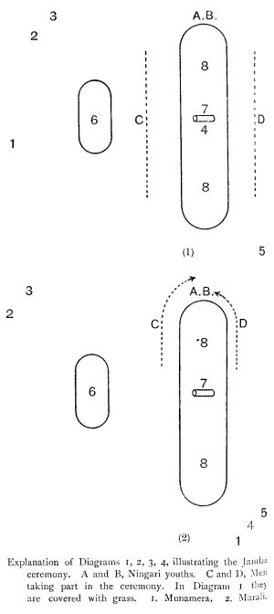
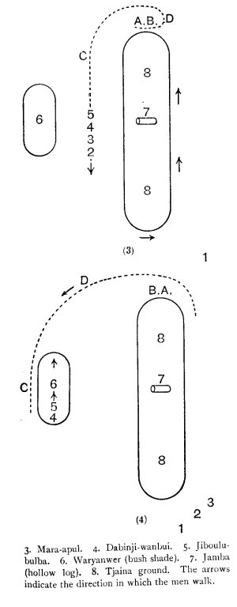
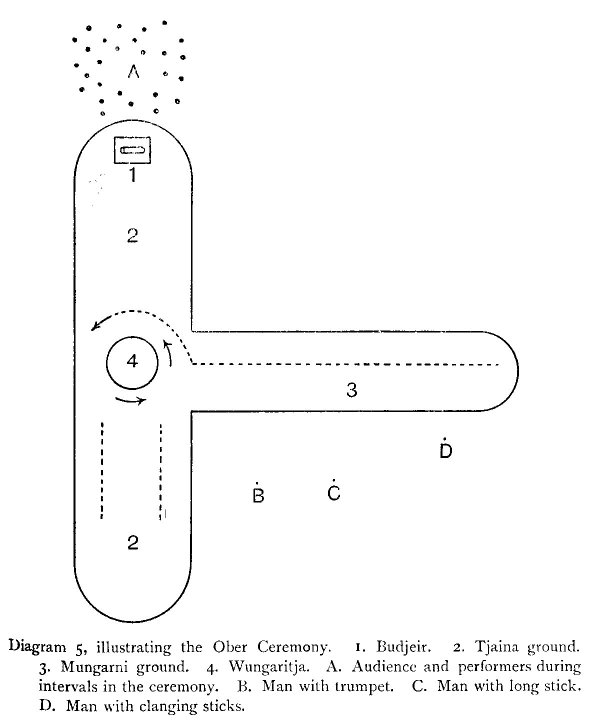

[Intangible Textual Heritage](../../index)  [Australia](../index) 
[Images](imglist)  [Index](index)  [Previous](ntna04)  [Next](ntna06) 

------------------------------------------------------------------------

# CHAPTER III

### INITIATION CEREMONIES

Division of tribes into three groups according to the nature of the
initiation ceremony. Group 1, tribes with neither circumcision nor
subincision. Group 2, tribes with circumcision only. Group 3, tribes
with circumcision and subincision.--List of the tribes.--Initiation on
Melville Island.--Yam ceremony.--Status terms of youths and girls taking
part.--Preparing the ceremonial ground.--Making a special fire to roast
the yams.--Performance of ceremonies and painting of the
performers.--Ducking the initiate in a water pool.--Pulling out of
hair.--Special decorations worn by boys and girls passing through the
ceremony and by the mother of the boy.--Port Essington tribe.--First
ceremony or Nailpur; second ceremony or Wokunjari.--Kakadu tribe.--First
ceremony or Jamba.--Showing the initiate the Jamba. Food
restrictions.--Kangaroo ceremony.--Putting belts and armlets on the
initiate.--Removing food restrictions.--Second ceremony or Ober.--Youths
sent out to distant camps to invite strangers.--Special Tjaina
ground.--Kangaroo and Snake ceremonies.--Third ceremony or
Jungoan.--Fourth ceremony or Kulori, associated with a yam.--"Singing"
different articles of food and so removing the restrictions.--Fifth
ceremony or Muraian.--Performance of ceremonies.--Sacred objects
associated with the Muraian.--Larakia tribe.--Belier ceremony.--Showing
the Bidu-bidu or bull-roarer.--Mullinyu ceremony.--Worgait
tribe.--Kundein ceremony.--Circumcision.--Baquett ceremony.--Showing the
bull-roarer.--Djauan tribe.--Mindirinni
ceremony.--Circumcision.--Showing the Kunapippi or bull-roarer.--Mungai
ceremony.--Mungarai tribe.--Kalal camp and showing sacred

{p. 89}

ceremonies and the Kunapippi or bull-roarer.--Circumcision.--Wandella
status.--Subincision.--Nadiriga status.--Smoking the nadiriga.--Nullakun
tribe.--Kokullal camp at which ceremonies are performed.--Special stick
called Jappa round which the lubras dance.--Circumcision.--Showing the
Kunapippi or bull-roarer.

So far as initiation is concerned these northern tribes be divided into
three main groups that are clearly marked off from one another by the
presence or absence of certain characteristic ceremonies. In all tribes
hitherto described by us, in Central and Northern Central Australia, the
two ceremonies of circumcision and subincision are carried out, but as
the northern coast is approached we meet with tribes which first of all
drop, if they have ever practised, the rite of subincision, and, lastly,
in the very north and on the Islands, we meet tribes that perform
neither of these ceremonies. In no case is the knocking out of a tooth
in any way connected with initiation. The three groups are as
follows:--(1) Those in which neither circumcision nor subincision is
practised. This includes a number of tribes inhabiting Bathurst and
Melville Islands, the Coburg Peninsula and the country drained by the
East, South and West Alligator Rivers and, probably, also a large extent
of country to the east of this along the coast line. Amongst these
tribes are included the following:--Melville and Bathurst Island Tribes,
Iwaidji, Kakadu, Koarnbut, Norweilemil, Punuurlu, Kumertuo, Geimbio,
Noalanji and Larakia.

\(2\) Those in which circumcision only is practised. This includes a
smaller number inhabiting, mainly, country to the south of that of the
first group of tribes, though, in the case of the Worgait, they extend
to the north-west coast. They are the Worgait, Warrai, Djauan and
Nullakun.

{p. 90}

\(3\) Those in which both circumcision and subincision are practised.
They inhabit the upland country, inland from the coastal ranges and
extend, on the one hand, right to the centre of the continent, and, on
the other hand, eastwards to the Gulf of Carpentaria.\[1\]
There is no doubt, also, but that they pass right across into Western
Australia. Amongst them are included the following:--Mungarai, Yungman,
Mudburra, Waduman, Ngainman, Bulinara, Tjingilli, Mara, Binbinga, etc.

In the following list the names of the more important tribes of the
Northern Territory are given, so far as they are known at present. They
are divided into three groups, according to the nature of their
initiation ceremonies.

\[2\]

GROUP 1.--*Neither Circumcision nor Subincision*.

 

|                              |                   |
|------------------------------|-------------------|
| 1\. Melville Island.         | 20\. Punuurlu.    |
| 2\. Bathurst Island.         | 22\. Kumertuo.    |
| 21\. Iwaidji.                | 15\. Kulunglutji. |
| 14\. Kakadu.                 | 17\. Geimbio.     |
| 18\. Koarnbut.               | 44\. Noalanji.    |
| 43\. Norweilemil (or Lemil). | 16\. Umoriu.      |
|                              | 13\. Larakia.     |
|                              | 19\. Watta.       |

 

GROUP 2.--*Circumcision only*.

|                |                        |
|----------------|------------------------|
| 3\. Worgait.   | 6\. Mulluk-Mulluk (?). |
| 5\. Wulwullam. | 7\. Brinken            |
| 23\. Djauan.   |                        |
| 26\. Nullakun. |                        |
| 4\. Warrai.    |                        |

 

\[1. We have dealt with several of these tribes in *Native Tribes of
Central Australia*, p. 212, and *Northern Tribes of Central Australia*,
p. 328.

2\. The approximate distribution of these tribes is shown in map A. The
number opposite each tribe corresponds to the number on the map. Tribes
numbered 1-41 are referred to in this volume.\]

{p. 91}

GROUP 3.--*Circumcision and Subincision*.

 

|                   |                  |
|-------------------|------------------|
| 45\. Dieri.       | 33\. Kallawa.    |
| 46\. Urabunna.    | 52\. Anula.      |
| 47\. Wonkgongaru. | 35\. Karawa.     |
| 41\. Arunta.      | 53\. Wilingura.  |
| 48\. Luritja.     | 37\. Allowiri.   |
| 40\. Unmatjera.   | 54\. Yarrowin.   |
| 39\. Kaitish.     | 32\. Gnuin.      |
| 38\. Warramunga.  | 28\. Yukul.      |
| 42\. Walpari.     | 27\. Mara.       |
| 49\. Bingongina.  | 24\. Mungarai.   |
| 34\. Tjingilli.   | 25\. Yungman.    |
| 30\. Umbaia.      | 8\. Mudburra.    |
| 31\. Nganji.      | 9\. Waduman.     |
| 36\. Worgai.      | 55\. Ngainman.   |
| 50\. Kudenji.     | 10\. Billianera. |
| 29\. Binbinga.    | 11\. Airiman.    |
| 51\. Wanji.       | 56\. Kadjerong.  |
|                   | 12\. Allura.     |

 

The natives on Melville and Bathurst Islands differ very much in regard
to their ceremonies and customs, from the typical tribes of the
mainland, and in nothing is this more clearly seen than in the
ceremonies attendant upon the admission of their young men to the status
of manhood. It is quite possible that there are certain ceremonies of a
very special nature in addition to those now described, but a very
striking feature of, at all events, some of the more important of them
is that all the members of the tribe--men, women and children--take part
in them. This is quite opposed, and stands in strong contrast, to the
customs of most mainland tribes, amongst whom women and children, except
to a very limited extent, are rigidly excluded from all active
participation in them, and, as a rule, are not even allowed to come
anywhere near the ceremonial ground. So far as I have been able to
discover there is no such thing as a churinga or bull-roarer used. The
natives assured me that they had no such thing, and when I showed the
old men one and showed them also illustrations of Arunta and other
natives using it, though apparently they were keenly

{p. 92}

interested in it and anxious to know all that I could tell them about
these tribes, they still professed complete ignorance of any such thing
amongst themselves, although certain of them knew that it was used in
the Larakia tribe on the mainland. I therefore think it very probable
that the Melville and Bathurst Island natives have no such thing as a
churinga, and in saying this I am influenced by the knowledge that, so
far as I could discover, no churinga or bull-roarer is known amongst the
group of tribes inhabiting the Coburg Peninsula and I the large area
drained by the Alligator Rivers, these tribes being the nearest
neighbours of the Melville Islanders. It is, however, very difficult to
make any definite statement in regard to matters such as this. It was
only last year, though the Larakia tribe had been known to white men for
forty years at least, that I was able to find out that, during their
initiation ceremonies, they used a churinga. Future investigations may
perhaps discover either a churinga, or something equivalent to it,
amongst the natives of Melville and Bathurst Islands.

An equally striking feature of the ceremonies is the entire absence of
any mutilation of the body. Neither circumcision nor subincision is
practised, and as the men, under normal conditions, are stark naked, the
fact is very evident. They have a most curious habit when standing still
of pressing the penis back between the legs so that the tip of the
prepuce can be seen from behind.

The initiation of young men on Melville Island is intimately associated
with what is known as a Yam ceremony. This special form of yam, which is
eaten, but does not form such an important article of food as certain
other yams, is called *Kolamma*, though it is sometimes pronounced as if
it were spelt *Kulemma*, the "k" also being often hardly sounded. It is
covered with a number of

{p. 93}

little roots which look like very strong hairs. These are called
*itjimma*, the same name being applied to the hair on the arms and legs.
Whiskers are called *dunimma*.

The central figure in the ceremony was a boy, who appeared to be not
more than fourteen or fifteen years old. He was the initiate and was
called *Watjinyerti*--a special status term applied to boys at this
particular stage. There was also an older youth who had figured as
*Watjinyerti* at the last initiation ceremony a year ago and was now
called *Mikinyerti*. In addition, there were two younger boys who will
attain the status of *Watjinyerti* at the next ceremony. They were
called *Marukumana*. A very striking feature was the fact that certain
young girls took a very definite part in the performance. One of them,
who was not more than ten or eleven years old, was called
*Mikinyertinga*. She seemed to correspond, amongst the girls, to the
*Watjinyerti* amongst the boys, and, twice at least during the
performance, was specially decorated and much in evidence. In addition
to her there were three other girls, the equivalents of the *Marukumana*
amongst the boys, who were called *Mikijeruma*, and, like the
*Marukumana* boys, were passing through the ceremony for the first time.
On this occasion the *Mikinyerti* was the mother's brother of the
*Mikinyertinga* girl, and, consequently, much older than she was, in
fact, he was really one of the younger amongst the initiated men, but in
these tribes the progress of full initiation is a lengthy one. Her
father decided that she should go through because of the fact that her
mother's brother was doing so.

On the day on which the ceremony began, the men collected together early
in the morning, about eight o'clock, and, after much singing and yelling
at the top of their voices, they went out into the bush to collect yams.
They were accompanied by the *Mikinyerti*, but

{p. 94}

not by the *Watjinyerti*, who had to go to the mangrove swamp to put mud
over himself. If he did not do this sores might break out all over him.
Four young girls and two older ones also went out with the men, while
the *Marukumana* remained in camp.

The morning was spent gathering the yams, which were then placed in two
pitchis and immersed in a waterhole about a mile away from the main
camp. When this was over the men came into the latter and decorated
themselves with pipe clay and whitened bird's down. The majority of them
had the down plastered over their chests, shoulders, and upper parts of
their arms and backs and a line of white running down the middle of the
abdomen (Fig. 29). Everyone had half of the forearm and the hand
whitened and a broad band across the face. In most cases this included
the whole forehead and as far down as the level of the moustache, but
one or two of the older men, and amongst them the leaders of the
ceremony, had only a circle round each eye and a band across the nose.
All of them had their hair whitened, and perhaps the most extraordinary
feature was the treatment of the beard. These men have very much better
beards than many, in fact most, of the northern mainland tribes. During
the first part of this yam ceremony they draw the sap of a tree known as
milk wood (*Alstonia sp.*). When a cut is made in the bark of this tree
a whitish liquid exudes which becomes sticky. The natives smear this
over their beards so that the hairs stand out stiffly in a kind of
fringe or ruff round the face. The leader, who had no moustache or hairs
on his cheeks or lower lip--he had pulled them all out--was especially
noticeable. He looked very much like a white-haired, glorified
orang-utan. A few of the men, including the leader, contented themselves
with drawing

{p. 95}

only lines of pipe clay on their bodies, arms, and legs. It was dull,
gloomy, and raining hard at intervals and the painting and singing went
on till nearly three o'clock the afternoon. When all was ready, the men,
amongst whom was the *Mikinyerti*, left the main camp, where they had
been singing and decorating themselves. They came on to the site chosen
for the ceremonial ground, brandishing their yam sticks, called
*alluguni*, and yelling

Ya bai e e! Ya bai e e!

When the women, who were some little distance away in the scrub, and
with whom were the three *Marukumana* boys and the *Watjinyerti*, heard
this yelling, some of them came up to watch what was being done, but the
boys remained in the scrub. Two of the women, one of whom was the mother
of a *Marukumana* boy and the other the father's sister of a
*Mikijeruma* girl, had their hair curiously decorated. By means of bees'
wax it was all made up into little balls, the size of a large pea, and
each of them was coated with yellow ochre, producing a most curious
effect.

The men stood for a short time, bunched together and yelling loudly,
with their yam sticks waving above their heads. Then they suddenly
stooped down, plucked up tufts of grass by the roots and threw them
about in all directions, shouting out as they did so, *Brr! Brr!* which
is a cry indicating both defiance and the fact that, in any contest, the
men making it are winning. Then they all set to work, vigorously, with
their yam sticks, and, in a very short time, they had the ground cleared
of grass and shrubs and had also piled up earth in a ring enclosing it,
the cleared space measuring about twenty feet in diameter. The four
young *Mikijeruma* girls, already referred to, ran on to the ground and
joined the men when first they, came up, watched them for a short time,

{p. 96}

and then ran back to the women. In a very short time there was quite an
encampment of roughly made bark mia-mias around the ground and no
attempt of any kind was made to secure privacy. The only thing was that
no women or children, except in the instance above-mentioned, and on one
other occasion, were allowed to cross the ring. Otherwise, everything
was done in public and the whole scene, with the decorated men and
women, wandering about the little bark huts, each with its own fire,
from which the blue smoke curled up among the forest trees and cycads,
was most picturesque. Unfortunately, it rained hard, but this made not
the slightest difference to anyone. When a particularly heavy shower
came on, they either went under their mia-mias or protected themselves
with a sheet of stringy-bark, bent double. At this time of the year the
bark can be easily stripped from the tree and is used for many purposes,
either for a house, a boat, a basket, or an umbrella. The *Mikinyerti*
was with the men, the *Watjinyerti* was in the scrub, under the charge
of his future wife's brother, and the three *Marukumana* boys had been
sent away into the bush by the old men, with instructions as to what
they were to do.

When the ground was cleared there was a short pause and then an old
man--it did not apparently matter who--rose to his feet and began to
walk round and round, knocking two sticks together (Fig. 30). While
doing this, everyone adopts the same characteristic attitude. The man
holds his left arm above his head so that his hand, in which he has a
stick, is behind the level of his head. He strikes the stick with
another in his right hand, singing as he does so. This special stick is
called *anadaunga*. Men often walk round without a stick and then they
always hold the left arm in front of the head,

{p. 97}

touching the forehead with the forearm so as to shield the eyes.

The first performer opened the ceremony by singing of the salt water,
then another began and sang about Cooper and his house, saying that
Jokuppa was tall but he was not nearly as tall as his
house.\[1\] Finally all the men were singing of rain, sea,
boats, trees, grass, and, in fact, of everything that they could think
of. Often a man would come to the end of one "song" and while thinking,
of something else to sing, he always kept up a cry of
*Ha-ha-ha-er-er-er-*, the former on a higher and the latter on a lower
note.

This "singing" everything is a very characteristic feature of the
Melville and Bathurst Islanders, as is also their custom, while
ceremonies are being performed, of bending the body forwards and at the
same time striking the buttocks with open hands and stamping furiously
on the ground. Apart, also, from these ceremonies this curious
repetition of names is frequently met with. Cooper and myself were once
travelling in a dug-out canoe with four natives, and, as we were going
along the coast, they spent most of the time naming things. One boy
would say "mangrove," another "the leaves of the mangrove," another
would say "dugong," and another "the head of the dugong," and so on, in
endless succession. It sounded just as if they were vying with one
another to see who could mention the most names, and all the time they
were laughing gaily and evidently enjoying themselves.

After the singing had gone on for about half an hour

\[1. This refers to Mr. R. J. Cooper, a noted Buffalo hunter, who is
practically King of Melville Island, where he has great influence
amongst the wild natives. He is popularly known as Joe Cooper, a name
which the natives have transformed into Jokuppa.\]

{p. 98}

the *Watjinyerti*, whose face was all painted black, was brought in from
the scrub by his guardian and taken to his father. The latter led him to
an old *yauaminni*, (mother's elder brother's son) who decorated him
with, armlets called *bannajinni*. The *yauaminni* then led him round
and round the men who were standing in the middle of the ceremonial
ground, and then his father linked the boy's right arm in his own left
and, preceded, by a younger brother of the father, the two marched round
and round, the father telling the son that they had put the armlets on
him, that he was now a *Watjinyerti*, and saying repeatedly: "They can
see you like this!" By this time all the women and children were
gathered, round the ceremonial ground and the mia-mias had been built.
The lubras sang, repeating what the men sang first and every now and
then one or other of the older women called out to the boy, telling him
to follow his father and his *yauaminni*. This went on till late in the
afternoon when all the men left the ceremonial ground, the women and
children following a short distance behind. It was pouring in torrents
and the ground, in many parts, was running with water, through which we
squelched along, pressing our way, drenched to the skin, through the
dripping scrub and tall grass. Close to the water pool a halt was made
at the base of a gum tree, where some green boughs had been piled up
against the trunk. They were pulled aside and, under them we found the
three *Marukumana* boys crouching. What this part of the ceremony meant
we could not discover. However, after much gesticulating and pretended
surprise, the party moved on, taking the boys with them ,until they came
to the stream which was now running. The yams were in a little side pool
with logs placed on the pitchis to prevent them from floating away. They

{p. 99}

were inspected and then, suddenly, several old men seized the
*Watjinyerti*, plunged into the water with him, and rushed backwards and
forwards, some having hold of his legs and others of his arms. In this
helpless state he was dragged backwards and forwards several times, for
the most part completely immersed in the water. When they released him
they turned their attentions to the *Marukumana* boys, who were made to
lie down in the side pool (Fig. 31). First of all each of them had his
head put into a bark pitchi, along with a few yams, and then, in this
uncomfortable position, he was held under the water, which was very
muddy, for quite half a minute. As the yams had "whiskers," their close
associations with the heads of the boys was supposed to be efficacious
in stimulating the growth of hair on the faces of the latter. The boys
were then made to stand up and, to assist further in the growth, each
one had his chin rubbed hard with a hairy yam and then freely bitten by
any older man who chose to do so. This ceremony is called *Tunima
irruwinni*. They were very sore and uncomfortable when it was all over
and, to add to their discomfort, they were sent away to a mangrove
swamp, close by, to have their chins rubbed with the evil-smelling mud.
The women and children had been watching the performance and, after the
immersion of the *Watjinyerti*, four of them, two mothers and two
sisters, jumped into the water and gave themselves a good ducking.

All returned to camp, the *Mikinyerti*, *Watjinyerti*, and the men
gathering together on the ceremonial ground, the men, at first, dancing
about and clanging their sticks and repeating, time after time, "we have
been to the water and washed."

By and by, the *Marukumana* boys came up from the

{p. 100}

swamp and went into a little mia-mia just outside the ring of earth, the
*Watjinyerti* sitting down in another by himself, watching the men who
began to perform dances and listening to the singing that went on at
intervals all night.

Early next morning they were busy and, at six o'clock, started to build
a special fire in the middle of the ceremonial ground. They took a
number of stakes, from five to seven feet in height, and fixed them
upright in the ground so that they formed a circle, about three or four
feet in diameter (Fig. 32). Within this they piled up wood to a height
of four feet and, on the top of this, they placed a thick layer of
broken up white-ant hill. What, was the meaning of this we could not
find out. Then for an hour they danced round and round it but did not
attempt to light the fire. The women and children were watching them all
the time. Soon after seven o'clock the men left the ground and, in
single file, started off for the water pool. We were soon, once more,
drenched to the skin. Nothing special took place; the yams were taken
out of the water and carried back to the ceremonial ground by the
*Watjinyerti* and the *Mikinyerti* and placed in two heaps, one on each
side of the fire. This is always done, but the natives do not know why.
Then the fire was lighted by the *Mikinyerti* and *Watjinyerti* boys,
the *Mikinyerti's* father and the *Mikinyertinga* girl. It took them a
long time to do this, because everything was soaking wet and pools of
water were lying about on the ceremonial ground, while the natives were
dancing in sloppy mud. On the way back from the water pool, the men cut
a quantity of long grass stalks, which were placed on the top of each
heap of yams. The three *Marukumana* boys, as before, were in one
mia-mia and the *Watjinyerti* in another. The dancing and singing went
on and,

{p. 101}

one occasion, the father took his daughter, the *Mikinyertinga* girl, by
the hand and led her round several times. The fire was burning but, for
more than an hour, nothing was done to it or to the yams. The
*Watjinyerti* was surrounded by a few men who pulled out all his pubic
hairs and also those on his upper and lower lip. While this was going
on, the operators were singing the simple refrain, "too bad, pull out
hairs," which was repeated by one woman, who was the daughter of the
brother of the *Watjinyerti's* mother. The main body of men were walking
round and round the fire, striking their buttocks and singing fiercely
at intervals. At the end of about an hour, the men went to the fire and
drew out lighted sticks which they threw away, first facing towards the
north and then the south. Then once more they sang, the women outside
the circle joining in. Taking small boughs, the men now approached the
fire and beat it down from above, the idea of this being to cleanse it
of all evil influence--if this were not done they believe the evil would
go inside them and they would break out all over sores. While doing this
they yelled, *Brr! Brr! Brr! ee! ee!* Some of the grass stalks were then
tied into a rope, long enough to encircle the fire, around the red hot
embers of which they were placed, after the latter had been raked over,
together with the hot lumps of ant hill, and made more or less smooth.
The idea of this was to prevent the yams from falling out of the fire.
The remainder of the grass was placed over the embers and the yams put
on top. Sheets of paper bark were spread over them and these, in turn,
were covered with damp earth which was dug up with yam sticks, in a
circle round the fire. No women placed any yams on the fire. While this
was in progress, the greater number of the men stood round shouting,
*Brr! Brr! Brr! Oh! Oh!* The men who

{p. 102}

placed the earth on the fire, smoothing it down to make a more or less
regular low dome-shaped structure, eve,, now and again knelt up and
threw their bodies and arm, back, while the onlookers yelled a specially
loud *Brr! Brr!* and struck their buttocks fiercely. When the mound was
completed, everyone retired to the margin of the ground; some sat down,
others stood up and all of them continued singing and striking their
buttocks. After a pause, one man came out and performed a special shark
dance, the audience beating time. Then one old man, who took the lead
and was always in front in the processions, walked slowly round and
round the fire, singing of the yams and the grass. Every now and then he
went outside the ceremonial ground and, with both arms held up, told the
women what to sing. It was just as if a wild hymn were being sung and
the verses given out, one by one. The men were chanting continuously
and, every now and then, the shrill tones of the women came in. The
three *Marukumana* and the *Watjinyerti* remained in their mia-mias and
the singing went on for about two hours till the yams were cooked. The
men then sat down round the fire and the yams were taken out (Fig. 33).
The four young girls and two old women, the mother and father's sister
of the *Watjinyerti*, were called up and were given yams to skin. Any
man, apparently,, was allowed to do this and also the *Watjinyerti*, but
not the *Marukumana* boys, who were not even painted. The little
*Mikinyertinga* girl, after skinning hers, handed then, to her father.
After the skinning, the yams were cut up into slices, an operation which
occupied a long time. It was, of course, done on the ceremonial ground
and, while it was in progress, one man was walking round and round,
striking sticks together, while the others chanted. The men sang, time
after time, "

yams, you are

{p. 103}

fathers." The natives said that, as a result of the performance of the
ceremony, all kinds of yams would grow plentifully--not only the
*kolamma*, but, more especially, other kinds which, as articles of diet,
are more useful to them than the *kolamma*, which is very hot and needs
special preparation. This one kind of yam is not much used by the
Melville and Bathurst Islanders but is a favourite food amongst other
tribes on the mainland. The Island natives evidently regard the
*kolamma*, probably because it has to be specially treated before being
safe to eat, as a superior kind of yam, endowed with properties such as
the ordinary yams do not possess. If a boy sees this ceremony and
afterwards does not do what he is told to do by the old men when he is
being initiated, he becomes very ill and dies.

The father of the *Mikinyertinga* girl took some slices of yam in his
hand and the daughter poured water on them from a palm leaf basket,
after which the man rubbed the daughter's hair with them in order to
make it grow. This over, the four girls retired from the ceremonial
ground. Then the men crunched some of the slices in their hands and
rubbed their own beards with them. This is called *tunima ubabrulua*.
The sister of the father of the *Mikinyertinga* and the mother of the
*Watjinyerti* rubbed each other's heads and faces with yam slices., and,
when all the rubbing was over, a general decoration of men, women, and
children began. The *Watjinyerti* was painted by a *yauaminni* man, and
had his hair, a band across his nose, and a band down each cheek, white.
His armlets, *bamajinni*, were red-ochred afresh. The *Mikinyerti* youth
had his hair, a band across the nose, and such beard and whiskers as he
possessed, painted yellow. The three *Marukumana* boys had their faces
Painted black. As soon as the slicing of the yams was

{p. 104}

over, a small mia-mia, made of sheets of bark and gum tree boughs, was
built close beside the remains of the fire, and into this the men put
the *Watjinyerti* and the *Marukumana*, in order that, so the natives
said, they could not be seen by the women. This mia-mia is called
*malanni*, the usual term for one being *irruwunni*. This may perhaps be
a remnant of an aspect of the ceremony which, at one time, was more
strongly developed than it is now on Melville Island, and that is the
seclusion of the initiate, so that he is not seen by the women and
children, who believe in many tribes that during the initiation ceremony
he is taken away by a spirit and made into a man.

While the boys were thus hidden, the painting went on, one or two of the
old yam men keeping up a continuous chant referring to the yams and the
grass. The father painted the *Mikinyertinga* girl yellow all over (Fig.
34); another girl had one side of her head painted white by her mother
and the other side yellow, above one eye she had a white line, and
below, a yellow one, and *vice versâ* on the other side. If both yellow
and white were used, as was often the case, the right side was always
white and the left yellow. The old leading man had one side of his hair
white, the other yellow, the whole of his face was red, save for a
yellow band across the forehead just above the eyes, and a white band
from ear to ear across the bridge of the nose. His upper and lower lips
were clean "shaved," but a strong fringe of beard was made to project
all round by means of the sticky sap of the milk-wood tree, and was
edged with white down. This design, together with a red ochred body and
long sinuous lines of white and yellow from his shoulders to his knees,
gave him a ferocious and remarkably weird aspect. Another of the older
men had one side of his hair white, the other yellow, and a broad

{p. 105}

median band of red right across his hair, down the middle of his
forehead, nose, lips and chin, and then on to his projecting beard,
which on one side was painted white and on the other red. The rest of
his face was a somewhat lighter red than the median band. Some of the
men had their bodies all covered with yellow, others with red, and one
or two with black. In most cases they had sinuous lines of white and
yellow or yellow and red, and sometimes all three, which usually began
at the elbow, ran up to the shoulder, and then either close together
down the back on either side to the knee, or else looping over one
another. If the white was outermost on one side, it was innermost on the
other, this alternation of colours being most striking and
characteristic. All the designs were decidedly ornate and quite unlike
any that I have seen amongst other Australian aboriginals. They are,
however, though decidedly elaborate, very roughly drawn in comparison
with those used during the sacred ceremonies of such tribes as the
Arunta and the Waramunga.

While this was going on the singing was continuous, but what was sung
was very simple. One old man suddenly shouted to the women, "I have
painted my daughter's hair yellow." Another old man came out from the
ceremonial ground, went near to where a number of women were grouped
together, and sang out to them, "I have painted one side of my daughter
white and the other side yellow." In one case, the two wives and
daughter of an old man were a little way off in the scrub, painting
themselves in their mia-mia. The old man kept coming out from the ring
and walking round so that they could both see and hear him, and time
after time they sang out, repeating what he said, which was merely a
reference to the painting. The women, in

{p. 106}

most cases, simply daubed red or yellow ochre over themselves, with
little attempt at design. When the decorations were complete, there was
a short pause, and then the men began to walk round and round the
ground, singing and clanging sticks with their arms uplifted as usual.
Then one man "sang." the *Mabanuri*, or shooting star, which is supposed
to be an evil spirit. The object of this singing was to protect the boys
in the mia-mia against its evil influence.

Also they sang the *bamajinni*, that is the armlets of the
*Watjinyerti*, which is also supposed to aid in protecting him against
any shooting star. This over, several men walked round and round the
mia-mia containing the *Watjinyerti*, singing of an attack upon it by
spears. At this stage, the old leading man was standing up and giving
orders. He, and another man, danced wildly round and round the mia-mia
while the men, with special vigour, struck their buttocks, yelling and
stamping loudly as they did so. It was a crocodile dance, and the old
man carried a ball of red ochred down in his hands, throwing it up every
now and again to represent fish jumping out of the water in front of the
crocodile. This was followed by a shark dance, performed by a man with a
blackened body and long sinuous lines of white and yellow spots. These
were the best dancers and they entered into the performance with zest,
dancing and stamping, round and round, until they were exhausted. Then
came a curious part of the ceremony, quite unlike anything that is known
in connection with initiation on the mainland. The father of the
*Mikinyertinga* girl had previously decorated her with red and yellow
ochre. He now called her up and spent some time in building up kind of
mop of hair on her head, by means of twisting into her own hair a large
number of little curled strands

{p. 107}

of human hair. The result was a great mop, calling to mind, on a small
scale, that of many Papuans. Then he placed on her forehead a curious
chaplet. It is made of a piece of bamboo bent round so as to fit the
head closely from ear to ear, across the forehead, somewhat like a
tiara. On to it were fixed a series of flattened tufts of dog tail
hairs--the hairs radiating from a central disc of beeswax. Decorated
with this mop of hair and the chaplet, the girl was led by her father to
the mia-mia and put inside this with the four boys. It was a tight fit,
and they were all closely huddled together. Then there came another
shark dance, accompanied by a song, consisting of the repetition of the
simple refrain, "the shark has a big mouth. The salt water makes the
shark's mouth big." This was sung by a man of the Pandanus (screw-pine)
totem. Then came a devil-devil dance called *Mabanuri* (shooting star).
This was followed by a march round and round the mia-mia, the men
gradually getting more and more excited. They were supposed to be a
hostile tribe, coming to kill the people in the mia-mia. The men began
to prance about and, after a minute or two, the bark sheets were opened
up, so that the girl and boys could be seen. Then they were closed up
again and a mock attack, with spears, was made, the occupants being
supposed to be killed. After this there was a regular pandemonium,
everyone dancing and yelling at the same time. This went on for some
minutes and then, when they were thoroughly wound up and excited, they
divided into two parties, the older men in one and the younger men in
the other. just before this the mia-mia had been pulled down and the
occupants came out, the girl and the *Marukumana* going to one side--in
fact leaving the ceremonial ground. The father took charge of the
chaplet. {p. 108} The *Watjinyerti* joined the younger party, as did
also the *Mikinyerti* youth. At first, they had a long pole at which
each party pulled, much as if it were a tug-of-war, but this was soon
thrown away and then they mingled together, forming a wild, excited mass
of yelling savages, heads, arms, legs, and bodies all mixed up, until,
at length, one party succeeded in pushing the other, slowly, along while
they yelled *Brr! Brr!* They undid themselves and the performance,
called *Arri madjunderri*, came to an end. The men gathered again round
the remains of the fire and the old leader took hold of the
*Watjinyerti's* arms, behind his back, and led him round the fire. There
was some more dancing, the men standing round the margin of the
ceremonial ground, and then the leader came out into the middle, picked
up some remnants of the fire, and threw them away in various directions.
This was supposed to be emblematic of the throwing away of sickness.
Then they set off for the water hole, in single file, the *Watjinyerti*
and the *Mikinyerti* carrying the yams. The *Mikinyertinga* and the
*Mikijeruma* girls and the two old women accompanied them, the other
women and children came on behind and stood a little distance away. When
they reached the water hole, the yams were put in the water, together
with the roots or "whiskers" which had been carefully preserved and were
"sung." Then an extraordinary ceremony took place. Most of the men began
to pluck their beards and whiskers out (Fig. 35). They began at the ear
on each side and went down to the middle of the chin, plucking the hair
out in bunches. Some did it for themselves, some allowed others to do it
for them, and not a single man seemed to flinch in the slightest degree
during the performance of what must have been, at all events, a
decidedly uncomfortable operation. A strange thing was that no bleeding
seemed to

{p. 109}

take place. When it was over the hair was placed in the pitchis,
together with the sliced yams and their "whiskers" and left in the water
for the night. Early next morning, everyone was astir and the
decorations were renewed. Then they all set off for the water hole, in
single file as usual. A halt was made, before they reached the water
hole, at the base of the tree at which the *Watjinyerti* had previously
been secreted. Acting under instructions from the old leader, a
*Marukumana* boy and the *Mikinyertinga* girl had left the camp and were
lying concealed by boughs, at the foot of the same tree. The father of
the girl placed the chaplet on her forehead and gave her a ball of
red-ochred down, called *Taquoinga*--the same one that he had previously
used in the crocodile dance--hanging it round her neck with a string.
This done, the whole party came on, the bushes were thrown aside, and
everyone simulated the greatest astonishment. The boys came out first of
all and danced about, within a circle formed by the men, who sang and
struck their buttocks. Then the girl came out and danced round,
accompanied by four men, her father and three of his brothers. The girl
carried the *Taquoinga* in her mouth, because she was supposed to be shy
and it gave her courage. A ball of this kind, called Ballduk by the
Kakadu, is very often seen, suspended from the necks of the men, both on
Melville and Bathurst Islands, and on the mainland, and is always
carried in the mouth and bitten hard, at times of great excitement, such
as during a fight. After this little ceremony was over, the whole party
moved on to the water hole, the yams were taken out and carried away to
the camp, the hairs and whiskers being left behind. The natives,
apparently, have no fear of anyone securing the hair and working evil
magic with it. In camp, everyone partook of the yams and

{p. 110}

they were all supposed to begin eating at the same time.

The *Watjinyerti* was painted red and, for some time, he had to keep
away from the main camp. We used to see him sitting about in the scrub,
a rather forlorn looking creature, bright red, because he was completely
smeared over with ochre, and wearing the armlets. In addition to these,
he now wore a strange necklet called *Marungwum*. It was made of a round
stick about half an inch in diameter, bent into the shape of a
horseshoe, the two ends being capped with knots of wax and tied together
with hair string, from the middle point of which a long string, ending
in a tassel, called *paraminni*, hung down the middle of his back. He
wore this continuously after the ceremony was over, for six weeks, when
a new one, called *Illajinni*, was made, which, in its turn, he wore for
four months. The natives have no idea as to what is the significance of
the necklet, except that the *Watjinyerti* always has worn it and that,
if he took it off, he would become seriously ill. Certainly, together
with his red-ochred face, it makes him a very prominent and distinctive
object. When the ceremony was over, the mother of the *Watjinyerti* had
to wear a necklet similar to his and was obliged to keep it on as long
as he did. The natives say that, if the mother's fell off, the boy would
become ill, and that if the boy's should fall off the mother would be
ill. After these ceremonies were over, the ceremonial ground was
deserted. The mia-mias that had encircled it closely were removed some
distance away into the scrub. Three days later, while the natives were
busy painting posts) to place on the grave of a man who had died a year
ago, they gathered together, close by the posts, and the young
*Marukumana* were brought in and thrown up in the air. The idea was to
make them grow tall. On the morning of the next day

{p. 111}

the men again assembled at the grave posts and lighted a fire at the
base of a blood-wood tree, close by. Four boys, two of them *Marukumana*
and two younger ones, were made to climb up the trunk. Green boughs were
placed on the fire, from which a column of smoke arose, called *kujui*.
The same word is applied to a water spout, which it is supposed to
represent. Each of the boys, in turn, had to climb down. The two younger
ones were allowed to jump over the fire but the *Marukumana* had to pass
through it.

The above ceremonies took place during the second week in March. I was
unable to see the subsequent proceedings, but during a later visit to
Melville Island was informed that what took place was as follows:--My
informant, one of the natives, was present and secured for me the
various ornaments. The *Watjinyerti* remained away from the main camp
until the end of April, when he came into his mother's camp, took off
his old ornaments and washed himself in salt water, brought up by his
mother. New ornaments were put on him, including a special belt called
*Olturuma*, which was made by his mother's brother. He kept all these on
until the performance of a final ceremony in September. On this occasion
he sat down in camp with his mother, with all his ornaments on. His
mother sang out to the older women, especially his "sisters," to come
up. They did so and took half of the ornaments off and then the older
men came up and took the remainder off. When this was done the
*Watjinyerti* danced a little. A Yauaminni man took the
ornaments--armlets, necklets, and waist girdles--and placed them all on
a special platform of branches, built like a big nest, in an iron-wood
tree. While this was being done, everyone stood round the mother and the
*Watjinyerti*, who were in the middle. {p. 112} Everyone, men, women,
boys, and girls, cut their heads and cried. With this the ceremony came
to a close.

The various articles worn by the *Watjinyerti* boy, the *Mikinyertinga*
girl and the mother of the boy are shown in Plate 1. [\[Ornaments Worn
During Initiation Ceremony On Melville Islane\]](img/pla001.jpg) Figs. 1
and 2 represent the special belt called *Olturuma*. Both of them are
twenty-six inches in length and very strongly made out of alternate
blocks or panels, as it were, of human hair and banyan bark string,
their edges being sewn all round with split cane. This bark string forms
a strong loop at each end, where it is covered with beeswax that has
been whitened with pipe clay. in the upper one the blocks of human hair
string are left uncoloured, those of banyan bark string are red-ochred
and outlined and crossed by lines of white and yellow alternating in the
way characteristic of Melville and Bathurst Island decorations. The
lower one shows a somewhat more complicated scheme of decoration, some
of the human hair blocks or panels being red-ochred. The centre of the
belt is marked by a white circle; on each side of this is a red panel,
then an uncoloured banyan-bark string panel, then a pinkish-cream
coloured panel, the pigment being made by mixing pipe clay with
red-ochre; this is followed by a red panel, then a long one of banyan
string, partly coloured, partly uncoloured; on the right side is a long
human hair string panel, running; to the end, but, on the left, the
terminal panel is made of banyan bark. The design is symmetrical in the
central part of the belt, but slightly asymmetrical towards each end.

Fig. 3 represents the ornament worn by the mother. It measures twelve by
thirteen inches. It consists of a stick about three-quarters of an inch
in diameter bent so as to form a semicircle. It has been completely
smoothed and red-ochred and its two ends are held

{p. 113}

together by strong strands of banyan bark string, bound round and round
so as to form a strong bar which is completely coated over with beeswax
and decorated with alternating bands of red and yellow ochre, outlined
with white. By way of ornamentation there is, on each side, a knob of
wax studded with abrus seeds. From the middle of this transverse bar an
elaborate pendant hangs down. Its total length is eighteen inches and it
consists of a large number of strands of banyan bark string gathered
together into two cords to form a loop half-way down the pendant, the
strands being enclosed in beeswax, one side coloured red, the other
yellow. The attachment of the pendant to the bar is marked by a ring of
wax covered with abrus seeds. Then follows a curious disc, two and
three-quarter inches in diameter, with short, stiff strands of human
hair string radiating all round. For an inch and a half beyond this the
string is enclosed in wax coloured yellow and red, then for two inches
and three-quarters the string, which is red-ochred, is free. This is
succeeded by the central loop, which is ornamented at each end with a
circle of abrus seeds, stuck in beeswax. The length of this part is four
inches and a half. Then for three and a half inches the strands are
free, after this follow a circle of abrus seeds, then a length of
string, two and three-quarter inches, covered with wax, painted red,
white, and yellow. This is succeeded by a second disc made of a series
of cane rings fitting one inside the other, with stiff strands of human
hair string radiating all round. The disc, as can be seen,, is decorated
with alternating, radiating lines of yellow, red, and white. Finally the
Pendant terminates in a sphere of delicate, light brown coloured down
feathers.

The structure is worn in such a way that the pendant hangs down the
middle of the back.

{p. 114}

Figs. 4 and 5 represent, respectively, the necklets called *Marungwurm*
and *Illajinni*, worn by the *Watjinyerti* boy. The smaller one measures
six and a half inches by six, the larger one eight inches by six and a
half. They are quite simple in form and made, essentially, in the same
way as the larger one worn by the mother. One of them, the one that I
saw the boy wearing, has a pendant of thirty-four strands of red-ochred
human hair string. The other is ornamented with two knots of beeswax,
each two inches long and thickly studded with abrus seeds.

Figs. 6 and 7 represent the ornaments worn by the *Mikinyertinga* girl.
The first of these is in the form of a curious chaplet, made of strands
of human hair string that are all flattened out and covered with beeswax
so as to form, roughly, a semicircle about eight inches in external
diameter. Radiating out from this semicircle there are eleven wild dog
tall tips which are also flattened out. The girl wore the chaplet on her
head as if it were a tiara, the semicircle of wax passing across the
front of her hair from car to ear, the strands of hair string being tied
together behind her head. The second has the form of a ball measuring
three and a quarter inches in diameter. It is very cleverly made out of
the lower parts of feathers that have been cut in half so as to retain
part of the stiff barbs and all the down portion at their bases. The cut
ends in some way, are closely and firmly attached in the centre of the
sphere, but it is so compact that, without destroying it, it is
impossible to ascertain how they are actually attached. The projecting
end of each is the quill end, so that the sphere which is composed of
hundreds of feathers looks like a ball of down. The feathers have been
orange-coloured with a mixture of red and yellow ochre. The girl wore
the ornament round her neck, attached by four strands of human hair
string

{p. 115}

during the performance of her dance, held it tightly between her teeth.
It is called *Taquoinga*, the same name being applied to the little
spherical bag that the men carry round their necks and place between
their teeth during times of especial excitement.

In the Port Essington tribe there are two important ceremonies connected
with initiation, the first of which is called *Naialpur* and the second
*Wokungjari*; these terms indicating also the status of the individual
who has passed through one or other of them. The following account was
given to me by a Port Essington native who was living in Cooper's Camp
on Melville Island and was well acquainted with the customs of the
latter people as well as with those of his own tribe.

The central figure of the *Naialpur* is a youth who has reached the
status of *Ngauunduitch* and is perhaps fifteen or sixteen years old. He
is the equivalent of the *Watjinyerti* on Melville Island, and there are
also younger boys who take a secondary position in the ceremony. They
are called *Namungulara* and are the equivalents of the *Marukumana*
boys. These boys may evidently take part in the ceremony several times
before they become the central figure. There was one Port Essington boy
in the camp on Melville Island who was not more than thirteen years of
age and he had twice been *Namulugara*.

The elder men, that is the *Wokunjarri* and *Balquar akkan*, consult and
decide upon the initiation of the youth. A man who is the latter's
*pappam* comes to him and says "gun mi araman," I want you. This is done
in the camp, and the *kamu* (mothers), *wulko* and *munburtji* (elder
and younger sisters) cut themselves and cry. When it has thus been
decided to advance any youth from the status of *Ngauunduitch* to that
of *Naialpur* he is sent out to visit camps under the guardianship of a
man who has

{p. 116}

already attained the latter status. They each carry a very simple wand,
merely a stick about four feet long, called *uro-ammi* (Fig. 36),and
when they come within sight of a strange camp, they halt and, bending
towards one another over the wands, chant a refrain the significance of
which is well understood.\[1\] The women in camp reply with
the call "wait ba; wait ba," and so long as the youths remain in any
camp, they periodically repeat their refrain, the women always answering
with theirs. When the *Ngauunduitch* and his guardian *Naialpur* return
they are taken to a special camp called *koar*, where a ceremonial
ground has been prepared. The latter is about thirty or forty yards long
with the sand banked up all round, and on one side a track leading into
it with its sides also slightly banked up. In the middle of the ground
is a bush wurley called *wangaratja* with a forked stick standing
upright on each side and a hollow log within it. The men's spears are
bunched together and rest against the side of the wurley. The first
night the *Ngauunduitch* spends, under the charge of a *pappam*, close
to the entrance of the *koar*. Early in the morning he is taken on to
the ground and sits down beside the log which has been removed from the
wurley. This special log is called *piruakukka*, a name that no lubra
may bear. The usual name for a hollow log is *aranweir*. At first the
younger boys are present and the pappam men dance round and round them
and at times pinch their cheeks to make their hair grow. This is in the
very early morning, after which they are taken back to the camp and the
men set to work to decorate themselves for the performance of ceremonies
on the *koar*.

The *Ngauunduitch*, both now and during the time that he travels over
the country from camp to camp, wears

\[1. A fuller account of this is given later in connection with the
initiation ceremonies of the Kakadu tribe.\]

{p. 117}

special waist girdle called *agir-agir*. It is made of a cord of human
hair string from which short lengths of string, arranged in pairs, each
about eight inches long and ending in little knots of beeswax, hang
down. During the ceremony, also, both the *Ngauunduitch* and the
*Namungulara* wear necklets called *leda*. Each of these consist of a
circlet, large enough to go comfortably round the neck, made of
vegetable fibre string, such as that derived from the banyan tree bark,
or it may be made from the hair of a young man. The strands of strings
are gathered together to form a pendent that hangs down the middle of
the boy's back. Where the strands come together on the circlet, there is
a coating of beeswax and the pendent cord is also ornamented with two or
three circles of the same material. In the case of the younger boys, the
Namungulara, a small length of bamboo, is attached to the free end of
the cord. In some mysterious way this is supposed to represent the boy's
knee, and the wearing of it during the ceremony has the effect of
strengthening the knee. At a certain point in the ceremony, also, the
*Namungulara* boys come into camp and place their *ledas* on the heads
of their mothers, which is a sign to the latter that the ceremony is
nearly over and that they must go out into the bush and collect yams.
When the men are ready the pappam takes the
*Ngauunduitch*\[1\] back to the koar in the middle of which
all the decorated men stand round the wurley. When he reaches the
entrance to the wurley the men yell *Prr! Prr!* The men are painted so
that their faces cannot be recognised and, at first, the youth is
frightened because he has seen nothing like it before. The men

\[1. There are often two or more youths passing through the ceremony at
the same time, in which case they sit down in a row with a pappam in
charge of each.\]

{p. 118}

arrange themselves round the margin of the *koar* and then they dance,
one by one. This over they pull the wurley to pieces and dance on the
remnants. Th, boy is then taken back to his camp by the *pappam*. At
night he returns to the *koar* and ceremonies are performed connected
with the totems, kangaroo, cockatoo, crocodile, lizard, etc. At the
close of each one they dance on the remains of the wurley and finally
lie down on them, some of the bushes being piled on the top of the old
men. The natives have no idea of the meaning of the wurley or of
breaking it down. While this is going on the *pappam* sing:--

Nan o tjeri nilkil  
Binyung mi  
Bin yalli nalli  
Tjai Tjo---o------!

Then the old men get up from the bushes. Bunches of cockatoo feathers
are placed on the boys' heads and then the ceremonies go on, the
*pappam* singing--

Natjat pula pula  
Bin yung mi  
Bin yalli nalli  
Tjai Tjo---o------!

repeating it time after time until they are tired out. The men now
arrange themselves in a long row and then crouch down with hands on
knees, all swaying about from side to side and whistling in imitation of
the wind. Then they stand up, everyone waving about like a tree in the
wind; in fact they are supposed to represent big gum trees. Time after
time they repeat the refrain "Natjat pula pula," etc., and then they all
fall down on hands and knees and move along in a line around and behind
the youth surging and swaying from side to side and yelling *Arr! Arr!*
until at last, with a final loud

{p. 119}

Ai kai ai: ai kai ai: ai-------, ending in a long descending note, they
fall down round the hollow log. The boy is then made to sit by the side
of the latter with the men all round him. The old *pappam* men sing out

Birringin, birringin, birringin,  
Urqui pit, urqui pit,  
Alor! alor! alor!

The whole is repeated several times and the day's performance comes to
an end, the boy being taken back to his camp to sleep. Early next
morning they are back on the *koar* and are shown first a crocodile
ceremony. One old man sits on the log and the others on the ground close
by, singing,

Wungaka wunga birri  
Birridji ja djaquia.

The boy stands by and watches. Two men, imitating the movements of a
crocodile, sprawl on the ground and crawl along to the remains of the
wurley. The man on the log sings out *Wau, Wau,* which is the signal for
an old man to knock down the forked sticks. This knocking down is called
*numulana*. Later on a cockatoo ceremony is shown.

It is during the performance of these ceremonies that the boy is shown
the bull-roarer, called by this tribe *Kurrabudji*. He sits down on the
koar ground with his head bent low so that he cannot see what is taking
place. Some of the old men paint themselves and come up behind him
whirling the bull-roarers. The *pappam* tells the boy to look up, and
then he sees the men and is told that the noise is made by the
*Kurrabudji*. As usual the lubras think it is the voice of a great
spirit that takes the boys away, but the old men tell him that it is not
so. At first he is very frightened, but the old men show him

{p. 120}

the sticks and, after having rubbed their own bodies with them, place
them in his hands. The boy looks at them, and then hands them back again
to the old men. He is repeatedly shown the *Kurrabudji* and warned that
the lubras and children must not see them on any account. At times also
the boy is rubbed over with the sticks. In addition to this the old men
often rub the heads and cheeks of the *Ngauunduitch* and *Namungulara*
with their hands to make the hair and whiskers grow. Fat is also rubbed
frequently on their private parts to make then, strong, and they are
told that they must not growl at the old men, and must not take a lubra
until they are older and have passed two or three times through the
*Naialpur*.

The showing of ceremonies continues for five or six weeks, after which a
visit is paid to the lubra's camp. The *Naialpur* is in the centre of
the procession with the *pappam* and other men round him. They shout
loudly *Kor yai, kor yai,* so as to tell the lubras that they are
coming. Then, when quite close to the camp, they yell *wha, wha, wha*!
At the camp the lubras are arranged in two rows with a strong forked
post, called *quiaramba*, fixed upright in the ground. On this two young
women sit, crying out *leda, leda,* which means "string, string," some
of which they hold out. The same name "leda" is given to the head rings
of the *Namungulara* boys. The two girls are either sisters or sister's
daughters of the *Naialpur*. When the men are about twenty yards away
they come down from the post and all the women sing *Kait ba, Kait ba,*
moving their hands and knees as if to invite the men to come on. The
*Naialpur* and *Namungulara* wear opossum fur-string armlets, human
hair-string girdles, the special chest girdles, called *man-ma-ouri*,
which encircle the shoulders, chest, and neck. They also wear the head
rings called *leda*, and a pubic tassel. The {p. 121} *Naialpur* stands
quietly beside the forked post while the men dance between and round the
two lines of women. The *pappam* then leads the *Naialpur* to his father
and mother, who are at the far end of the camp, and seats him between
them. Then the boy's sisters come up and a general walling ensues, after
which the *Naialpur* is once more taken into the bush.

The second ceremony, called *Wokungjari*, is passed through after a man
is married, sometimes before, and sometimes after he has a child. In the
case of my informant it took place before. A *pappam* tells the young
man to come with him into the bush, which he does, leaving his wife in
charge of his father and mother. The *pappam* supplies him with food and
he is supposed to be dependent on the old man for this, so that
sometimes he may have plenty, but at others very little, depending
entirely upon how much the old man has either the ability or the desire
to secure. He is very often shown the *Kurrabidji* and every now and
then his father comes and looks at him, but no one else, and he must not
go anywhere near his lubra. Every day the *pappam* rubs him over with
fat, and he spends practically all his time on the ceremonial ground,
where he is shown and allowed also to take part in the performance of
totemic ceremonies. This goes on for two months, at the end of which
time the pappam tells him to go and bathe, and show himself to his
father and mother in the Main camp. He is now a *Wokungjari* or fully
initiated man.

The Kakadu is one of a group, or nation, of tribes inhabiting an unknown
extent of country, including that drained by the Alligator Rivers, the
Coburg Peninsula, and the coastal district, at all events as far west as
Finke Bay. Its eastern extension is not known. For this

{p. 122}

nation I propose the name Kakadu, after that. of the tribe of which we
know most.

The initiation ceremonies are evidently closely similar all through this
group of tribes. In different parts of Australia these ceremonies vary
to a considerable extent. In the south-eastern and eastern coastal
tribes the ceremony consists in knocking out a front tooth. In the
central and north central and also in some of the western tribes, there
are two ceremonies which often follow close upon each other. At the
first the rite of circumcision is carried out and at the second that of
subincision. In some of these tribes only the first of these is
practised. In the Arunta and other central tribes, the youth is regarded
as initiated and is allowed to see all the sacred ceremonies as soon as
he has passed through the two ceremonies named, but, at a later time, he
takes part in what is called the *Engwura*, which consists, partly, in
the performance of a long series of sacred ceremonies referring to the
totemic ancestors, and partly in a curious ordeal by fire, after which
he becomes a full man, or, as they say, *ertwa murra oknira*, which
words mean man, good, very. He only takes part in this when he is adult.
In the Kakadu nation there is a succession of no fewer than five series
of ceremonies, the last of which only adult and comparatively old men
may witness. They are performed in the following order and are known
respectively as

1\. Jamba.  
2. Ober.  
3. Jungoan.  
4. Kulori.  
5. Muraian.

Of these the first may be regarded, strictly speaking, as the important
initiation ceremony. It marks the turning

{p. 123}

point in the life of each youth, when he passes out of the ranks of the
women and children, enters into those of the men, and is, thereafter,
allowed to see and gradually take part in the performance of the sacred
ceremonies that are characteristic of the remaining four, although he is
an elderly man before he is permitted to witness the Muraian.

1\. *Jamba Ceremony*.

I was not fortunate enough to see the Jamba initiation ceremony of the
Kakadu tribe but a middle-aged man, named Urangara, who was fully
acquainted with all the sacred ceremonies of the tribe, described to us
what happened in his own case and the procedure as he has witnessed and
taken part in it many times since then. just before the rain season, in
his own case, his father consulted a few old men, some of whom stood in
the relation of father's elder brothers to him and others in that of
father's father (Kaka). These men) during the ceremony, are called
*Kuringarerli*. The father said to the old men: "My boy is growing big,
his whiskers are coming. It is time he was allowed to eat some of the
forbidden foods." The latter is expressed by the words "*morpia*"
(food), *meja* (eat), *kumali* (forbidden or tabu). After this, there
was a general conversation amongst the older men and it was decided that
the time had come for the boy to be initiated. They said to two elder
men, *Bialilla mirawara muramunna koro*, which means the boy is growing
big, you two go to the bush. On this occasion there was another youth
who was being initiated at the same time and the two elder men took the
two youths away with them into the bush, visiting various camps and
inviting the strangers to come and witness the ceremony. They stayed
away a long

{p. 124}

time until, as Urangara said, *tjara numbereba*, that is, their whiskers
were long. During all this time the two elder men must not look at a
lubra; if they did the boys would become ill and also the other men
would drive spears into them. The women have to be very careful not to
go anywhere where they are likely to come across the youths. The old men
instruct them what parts to avoid. After a long wandering, the boys and
their guardians return, bringing with them the visitors, whom they
gather together as they come to the various camps on their homeward
journey. All the men in camp, except a few of the elders, who remain to
watch the women and children, go out to meet the party, whose approach
is notified by the clanging of sticks. The whole party comes in, except
the boys and their guardians. The strangers are conducted to their
camping grounds and, early next morning, the men go out and prepare a
special ceremonial ground called *Tjaina*. At one side of this a bush
shade, called *waryanwer*, is made and the men stand, some under the
shade, which is six feet high, and open at both ends, and some round the
ground. In the centre of the latter is a hollow log called *jamba*, four
or five feet long and about two feet in diameter. The boys are not yet
brought to the ground, but one old man sits down and repeatedly strikes
the *jamba*. He is called *dabinji wanbui*. It is now dark, or *mardid*,
that is, night time. An old man takes two sticks and goes out close to
where the boys are camped, striking his sticks together. The men in
charge of the boys say, *ameina*--what is it? and the old man answers,
*Brau ningari*--give us the boys. They reply, *Ouwoiya kormilda*--yes,
to-morrow. Then the old man returns to the camp and all sleep. In the
morning they say to the boys, *moru kuperkap*--go and bathe. The lubras
meanwhile have been sent out to gather food--

{p. 125}

lily roots, seeds, etc.--and are told to return at mid-day (*mieta*).
The boys bathe, while the lubras are out of the way in the scrub,
because they may not yet be seen by the latter. After this they are
painted by their guardians. Each has a circle of white running across,
just above the eyes, then down each cheek and under the chin, so that
the whole face is framed, as it were, in white. Two lines of red run
across the upper part of the forehead. On their return, the women paint
themselves; the younger ones must be decorated with red ochre, the old
women may paint themselves as they like and very often use yellow ochre.
When all is ready, the boys are brought up accompanied by the women, who
sing "*wait ba, wait ba*." The old men cover the eyes of the boys, who
walk with their heads bent down. There may sometimes be as many as ten
or twelve youths passing through the ceremony, in which case they are
brought up in pairs. When they have all come in, the lubras run back to
their camp, singing "*wait ba, wait ba*," swaying their bodies from side
to side, like a native companion. The old men, the guardians of the
boys, have bushes in their hands which they shake, saying to the boys
*kulali koregora*--look at the sky; *jibari koregora*--look at the
trees; *balji jereini koregora*--look at the big crowd of men. After
saying this they take their hands away from the boys, who look up and
see the ceremonial ground, the *jamba*, the bush shade, and the men
standing round. Meanwhile sticks are struck together and the bamboo
trumpets sound, making a noise which sounds like a constant repetition
of biddle-an-bum, biddle-an-bum. This is a very characteristic booming
sound with the two first syllables said more or less rapidly and long
emphasis laid on the third. There is considerable excitement and the
singing and clanging go

{p. 126}

on for some time, until at last the boys are taken into the bush shade.
After a time the old men lead them on to the ground and seat them one at
each end of the *jamba*. The old guardian kneels immediately behind his
boy, telling him what to do. He first of all takes a stone and hands it
to the boy saying, *jilalka podauerbi*--here is a stone. Then he says,
*Ngoornberri jilalka mukara*--son, throw the stone. The boys then throw
each stone through the hollow *jamba*, after which they hand them back
to their guardians. No one knows why this is done. The guardians say to
the boys, *Ngoornberri tjaina kumali: jamba kumali koregora: uriauer
kumali koregora*: which means, son, you see the forbidden tjaina,
*jamba*, or bush shade, as the case may be. Then all the foods that are
forbidden, or kumali to them, are named and repeated, *Kintjilbara* (a
snake) *kumali*, *kulori* (a yam) *kumali*, *kulungeni* (flying fox)
*kumali*, and so on, through the whole list, which includes most of the
good things. The boys say nothing and the sun goes down.

When this ceremony is over they are once more sent into the bush, still
under the guardianship of the old men. The other old men remain in camp,
performing ceremonies, and the women go out gathering food supplies. If
the boys chance to hear the lubras talking, they must immediately bite
up some paper bark and stuff up their ears with it. On no account are
the initiates allowed to eat any food that has been secured or handled
by women; everything that they eat must be given to them by their
guardians.

The ceremonies are carried on in camp for about five moons, and during
all this time the boys are in the bush. When it is decided to bring them
back, certain of the *Numulakiri*, that is, young men who have
previously passed through this particular ceremony and, though

{p. 127}

initiated, are not old enough to be allowed to see the final series of
ceremonies, called *Muraian*, are sent out by the old men to bring the
*Ningari* in. The older men who have been looking after them have,
meanwhile, joined the others in the main camp. The *Ningari* boys (A and
B) come in, bending forwards, each with a *Numulakiri* man's hand over
his eyes. He is led to one end of the tjaina ground, on which special
individuals are placed, during different stages of the performance, as
shown in the accompanying diagrams. To one side stands an old murabulba
man (1) who is supposed to represent a great old kangaroo ancestor,
called Munamera; squatting down by the side of the *jamba* is a man (4)
called *dabinji-wanbui*; to one side, at the end of the ground, opposite
to that at which the *Ningari* stands, is a man (5) called
*jiboulu-bulba* with a trumpet. In a corresponding position, at the
opposite end of the ground, are two men (2 and 3), called, respectively,
*Marali* and *Mara-apul*. All the rest of the men are crouching down in
two lines, one on each side of the ground, and are covered over with
heaps of grass stalks (Diagram 1). The arrangements of the performers at
different stages can be seen in the diagrams. The native, Urangara, who
gave us the account, illustrated it by diagrams on the sand with sticks
and stories for men and a minute imitation of the bush shade.

As the *Ningari* are brought in, the old man, sitting by the *jamba*,
strikes it hard; the trumpets sound and then the men beneath the grass
take deep breaths, saying *Oh! Oh!* imitating the sound supposed to be
made by the kangaroo. Then they whistle. The boys wonder what the noise
is, because they can see nothing. Suddenly the *Numulakiri* take their
hands away and the boys are told to look up and are warned that all they

{p. 128}

|                                      |                                                                                                                                                                                                                                                                                                                                                                                                                                                                 |
|--------------------------------------|-----------------------------------------------------------------------------------------------------------------------------------------------------------------------------------------------------------------------------------------------------------------------------------------------------------------------------------------------------------------------------------------------------------------------------------------------------------------|
|  | see is kumali. The *Numulakiri* say to them, *Tjikaru koiyu koyada*--don't talk to *Koiyu* (mothers); *Illaberi legilli koyada unkoregora*--don't let the *Illaberi* (younger brothers and sisters) see (your) spittle; *Illaberi korno koyada unkoregora*--don't let the Illaberi see (your) excrement; *Kumbari koyada kumali koiyu*--don't laugh (to your) *koiyu* (about) the kumali; *Unkoregora Tjaina kumali*--look or see the *Tjaina*, (it is) kumali; |

{p. 129}

<table width="450">
<colgroup>
<col style="width: 50%" />
<col style="width: 50%" />
</colgroup>
<tbody>
<tr class="odd">
<td data-valign="TOP" width="50%"></td>
<td data-valign="TOP" width="50%">
<em>Tjikaru koyada mareiyu willalu</em>--don't talk (when) you go to the camp; <em>Jam koyada koiyu kumali</em>--don't (eat) mother food, that is, food gathered by a <em>koiyu</em>, it is kumali; <em>Kuderu wirijonga jau</em>--to-day eat <em>wirijonga</em> (various parts of water lilies, roots, stems, seeds); <em>Yakadaitji arongo bararil jau</em> (after) five sleeps eat fish.

During all this time the trumpets are sounding and the <em>dabinjiwanbui</em> man is vigorously beating the <em>jamba</em>, but, after the above instructions have been imparted and many times repeated, the old <em>Munamera</em> man (1) gives instructions to the
</td>
</tr>
</tbody>
</table>

{p. 130}

musicians to stop and the two men join him at one end and stand close
by, where the man with the bamboo trumpet has been stationed. The
Numulakiri men then lift the grass off the men who have been whistling,
saying, *Oh! Eh! Eh!* The old men answer with groans and then rise on
one knee, stamping the ground and shouting *Oh! Eh! Eh!* Then, rising
completely, they yell *Yrr! Yrr! A-Ah!* The two lines of men unite
together and, led on by the *Marali* (2) and *Mara-apul* (3), who join
them, they pass, with a curious surging movement, round and round the
*ningari* (Diagram 2) and then round and round the *Tjaina* ground
(Diagram 3). While this goes on the *Numulakiri* are saying to the
*Ningari*, *unkoregora morpiu mirrawarra kumali*. Look, the very big
morpiu (a general term applied to animals) is kumali; *Unkoregora
murabulba Munamera kumali*, look, the old man Munamera (he is) kumali.

The lines of men are joined by the musicians, while the *Marali* and the
*Mara-apul* leave them and again stand to one side with the *Munamera*
(Diagram 4). These three men are supposed to represent three great old
kangaroo ancestors and are spoken of as *Tjeraiober*, the latter being
the name of the particular series of ceremonies enacted by the old men
in connection with the initiation. They have been performing these
ceremonies while the boys were in the bush. On the next occasion the
boys will be allowed to see them. The men get more and more excited
until at last they pass through the bush shade, after surging round and
round it, lifting it up, as they do so, and scattering the boughs in all
directions) yelling *Kai! Kai! Wrr! Wrr!* This over, they gather the
boughs and grass together and set them on fire, While the fire is
burning, the *Numulakiri* men take the

{p. 131}

Ningari on their backs and dance round and round the fire, in company
with all the men, save the three *Tjeraiober*, who stand to one side,
watching. The old men say, *Umbordera kala koiyu wari nirwi, illaberi
kuballi nungorduwa wari nirwi wilialu mununga*, which means, freely
translated, to-day you hear your koiyu calling and the *illaberi* and
many women at the camp. Then they say, *kormilda mareyida willalu*,
to-morrow we all go together to the camp; *kormilda ngeinyimma
kupakapa*, to-morrow you bathe, *balera kuderi*, afterwards red ochre.

That night they camp near the *Tjaina*. The old men 1 have made armlets
and hair belts and, on the next day they say, *Bordera
ngeinyaminna*\[1\] *kujorju, winbegi*, to-day you armlets,
that is, to-day you wear armlets; *Bordera ngeinyaminna gulauer*, to-day
you wear hair belts. Having said this, they put the belts and armlets on
the boys,\[2\] who wash and are painted with red ochre. Then.
one or two of the older men take a piece of grass string and scrape the
*Ningari's* tongue with it, the idea being to cleanse it, saying,
*nanjil kurrareya*, tongue cleansed: *tjikaru koiyu pari*, mother's talk
leave behind. This is done at the *Tjaina*, where a special fire is made
to burn the string and anything that is scraped off the tongue. This
brings the ceremony to a close and all the men then leave the *Tjaina*
ground and return to the main camp, where the *Ningari* camp at one
place by themselves. There is no special reception of them by the women.
They have to be very careful, however, in regard to the latter. They
must not talk to the women nor allow them to see their mouths open. Most
especially they must not expectorate in such a way that a woman can see
them

\[1. *Ngeinyimma* if addressing one, *ngeinyaminna* if addressing two,
and *inyadima* if addressing more than two boys.

2\. There are two kinds of armlets--those worn on the arm proper are
called *ualtur* or *winbegi*, those on the forearm are called
*kujorju*.\]

{p. 132}

doing it. If they want to do so, they must hold their heads down and
cover the spittle with soil at once. They have no idea why, but the old
men have always told them to do so. On no account must lubras see their
teeth. if they did, their (the men's) fingers would break out in sores.
When eating food they turn their faces away from the women and also from
their younger brothers, to whom they may not speak. The mothers also
tell the latter not to speak to their elder brothers.

When five days have passed, a series of little ceremonies is enacted.
One old man goes out and catches a fish that the natives call Bararil.
Returning to camp, the old man goes close to the *Ningari* and throws
the fish at him, so as to hit his thigh. This little ceremony removes
the kumali from the Bararil which, henceforth, the youth may catch and
eat. These ceremonies are not all performed on the same day but at
irregular intervals, dependent on the caprice of the old men, the object
of them being to remove the kumali from certain foods. The old men who
perform them may be fathers, elder brothers, or mother's brothers.
Another old man will go and spear a cat-fish and with its jaw makes a
slight cut on the Ningari's arm, saying, *kulekuli jau*, you eat
cat-fish. To take the kumali off goose, or *kurnembo*, an old man brings
some in to camp and puts a wing of the bird on the Ningari's arm and
then with a *Mumbarnba*, or short throwing stick, he breaks the main
bone as it lies on the youth's arm, saying to the latter, as he does so,
*Ningari kurnembo jau*. These little ceremonies go on until all the
kumalis are removed, and, on each occasion, the old man cuts off one of
the *Ningari's* winbegi, placing it in a special little bag, called
*Nunguluwarra*. When all the winbegi are cut off they are burnt in the
bag and the youth is free to go out into

{p. 133}

the scrub and take part in the ordinary life, securing his own food,
which, during the continuance of the ceremony, has been given to him by
the old men.

2\. *The Ober Ceremony*.

When it is decided to hold this ceremony in the Kakadu tribe, two Young
*Numulakiri* men--that is youths of perhaps fifteen to eighteen years of
age, who have passed through the *Jamba* ceremony-are sent out to visit
distant groups of the Kakadu and other tribes. Each of them carries a
wand, about four or five feet long, called uro-ammi (Fig 36). They make
the wands under the supervision of the old men, who tell them what they
must do. Carrying these, they are perfectly safe and can pass through
strange country and amongst strange natives without any fear of
molestation. When they come to a strange camp they approach within
hearing distance and, standing close together, leaning upon their wands,
they sing a special song which is always associated with this ceremony.
The women have to reply with the call, *Wait Ba! Wait Ba!* repeated
loudly, as often as they can, without drawing breath. They sometimes do
this fourteen or fifteen times. It is one of the most picturesque of
their songs, especially when heard at night time far out in the bush.
The boys at the men's camp every now and then stand up and chant their
song and, time after time, from camps, some so far away that you can
only just hear the sound, comes back the answering cry of the women,
*Wait Ba! Wait Ba!* Urangara, our Kakadu informant, told us that the
song he sang when he was sent out was as follows

Le daming ge,  
Rai la la  
Le daming ge  
Rai la la.

{p. 134}

On the Alligator River, amongst the Kakadu tribe, two youths, belonging
to the Geimbio tribe, fortunately happened to visit the camp while I was
working there with Mr. P. Cahill. The song they sang was,

Kadimanga  
Di laian a  
Di laian a  
Kadimanga  
Di laian a  
Di laian a.

The women's refrain, which we heard repeated time after time, was, as
usual, *Wait Ba! Wait Ba!* It would appear that the young men's song
varies in different tribes, but the women's is the same throughout. I
heard the same *Wait Ba! Wait Ba!* amongst the Port Essington natives.

As soon as the song is heard in the distance everyone knows what it
means, and, after a time, an elder *Numulakiri* man goes out and says to
the youths, *mere willalu*--come to the camp. The boys come in and are
given food. In each camp that they visit they stay two or three days
and, at intervals, they sing their song, the women always replying with
*Wait Ba! Wait Ba!* After they have come to the last camp, the natives
from this return with the boys and, as they journey homewards, they
visit the different camps that they passed through and, from each of
these, a number of men, women, and children, join the party until, at
last, they come within a mile or two of the home camp. The two youths
then go ahead and are met by two or three of the men from the home camp.
They return to the strangers saying, *nguorki kramilla, mardua,
mureyimba willalu*, which means literally, "white paint, afternoon, we
altogether go camp." In other words, we will all paint ourselves white
this afternoon

{p. 135}

to the camp. The men who met them go back and to the main camp and
report that the boys and the other natives are close at hand and will
come in in the afternoon. After they have painted themselves, they
advance, yelling *Krr! Krr! Oh! Oh! Arr! Arr! E-EE!* The old men In the
home camp say, *Jereini* (men), *nigeri* (new), *breikul* (long way),
*willalu* (camp). This means that new men have come up from a camp a
long way off. The strangers, meanwhile, have left their women and
children where they first halted, and an old man now goes out from the
home camp and conducts them to the women's quarters in the latter.

Before starting the sacred ceremonies connected with the Ober, the local
men dance and sing at the ordinary camp, while the visitors sit down and
watch them. All the men visitors sleep at the main camp, but the *Ober
jereini*, that is, older men performing in the Ober, stay at the special
Ober camp and may not go near the women. Having cleared the ground, they
make once more a *Tjaina*, just as in the first initiation series, and
on this they begin to perform sacred ceremonies. These may go on one
after the other for days, each one being associated with a totemic
group. A very good example of them was one especially associated with a
kangaroo group. The main *Tjaina* ground was about forty feet long and
ten feet broad, and in the middle of it was a bush shade called
*Wungaritja*, shaped like a beehive, about four feet high and five feet
in diameter at the base. At right angles to the *Tjaina*, at the
opposite end to the shade, another ground, called *Mungarni*, ran out
for about twenty-five feet, forming a kind of side stage.

At one end of the *Tjaina* a piece of paper-bark was placed on the
ground and upon it a log of wood, which was supposed to represent the
old ancestral kangaroo-man

{p. 136}

or man-kangaroo watching the ceremony, and was called *Budjeir*. A few
yards beyond this out in the scrub stood the performers and audience
gathered together. The members of the latter were supposed to represent
different kinds of kangaroos. Sixteen men were decorated. two of them
represented *Moain* or fish men, the rest were *Marabornji*,
brush-tailed wallabies, The first part of the performance consisted in
the decorated men being brought in, two by two, to the *Wungaritja*.
They came in at a run, each pair led by two old men who stationed them
round the shade with their backs to it and their bodies bent forwards
(Figs. 37, 38, 39, 40). Each man, or most of them, wore a tuft of white
cockatoo feathers on his head, and with their hands on their knees they
swayed about from side to side. When all had been brought in, two old
men placed themselves on the side of the shade furthest from the
*Budjeir*. The men gathered behind them with the audience on each side,
and with sticks held out in both hands in front of them, the two leaders
performed a quaint dance down the middle of the *Tjaina*, during which
they were supposed to be imitating the movements of native companions
(*Jimeribuna*). This dance is called *Man-ur-ur*, the *r* being very
distinctly sounded. After reaching the end of the *Tjaina* they stopped
and everyone walked back to where the audience had originally stood.
After a short pause, the same two old men brought the performers in one
by one and placed them in a line along the *Mungarni*, the two *Moain*
men in front, the kangaroos behind (Diagram 5). While this was going on,
one Mal (B) was blowing hard at a bamboo trumpet, another (C) was
constantly bringing a long stick, which he held in both hands, crashing
down on the ground, and a third (D) was clanging two sticks together.
The "trumpet," which they

{p. 137}

call *Jiboulu*, is simply a bamboo or hollow branch of a tree, through
which a man blows and produces a droning noise, which sounds something
like "biddle-an-bum," with a strong emphasis on the last syllable.
{*This is probably the instrument which is known as a didjeridoo--jbh*}
Each of the

performers bent forward and placed his hands on the hips of the man
immediately in front of him. In this position they swayed the upper
parts of their bodies over from side to side. The swaying was done in
such a manner

{p. 138}

that there was a sinuous line of movement which was accentuated by the
white cockatoo plumes. This went on for some time, and then, to the
accompaniment of much clanging and trumpeting, they formed a procession,
circled round the shade, passed up and down the *Tjaina*, and finally
the decorated men dropped down on their knees, forming two rows one on
each side of the *Tjaina* (L). The audience gathered round, and the
three men (B. C. D.) came and sang over each man in turn, while the
latter quivered and swayed about from side to side, the audience
meanwhile singing and clanging sticks together. This occupied a
considerable time, and then the performers, on hands and feet, hopped
away along the *Tjaina*, and out into the scrub at the far end. They
were supposed to be imitating kangaroos. After another pause, the
performers were brought in two by two, and placed, stooping down, all
round the *Wungaritja*, with their backs towards it--in fact, they were
actually pressing into it. The audience gathered round, singing loudly,
blowing the trumpets and clanging sticks, while the decorated men swayed
about. Suddenly, with a loud yell, they all backed into the shade,
smashed it to bits and threw the boughs up into the air. Then they
trampled them to atoms and ended with a loud yell.

No one knows what it all means but, in some way, it is associated with a
group of ancestors who were led by a very big old kangaroo named *Jeru
Ober*. The *Wungaritja* belonged to him and he used to rest in it during
the day, just as an old-man kangaroo now rests in the shade of a tree,
or bush, during the heat of the day. He told the others to kill white
cockatoos and make white head-dresses. Then he made the *Tjaina* and
also the *jiboulu*--the hollow trumpet--and showed them how to perform
the ceremony. The others looked

{p. 139}

on and said, *Moara* (well done), *kala* (a word meaning, amongst other
things, certainly, or, without doubt); *mabilabilla* (dance). The
kangaroo then said, "We are like black-fellows now (*jereini*), we will
go underground or the natives will see us. So they all went down,
excepting the *Jeru Ober*, who remained up for some time but, finally,
he too went into the earth, a short distance away by the side of a big
paper-bark tree. The original ceremonial ground was at a place called
Kupperi, between the East and South Alligator Rivers. Only men who have
been through the Ober ceremony may go there women and children must not
go anywhere near.

Another very characteristic Ober ceremony is one associated with three
snakes. It is common to Kakadu, Iwaidja, Umoriu, Geimbio and Kulunglutji
tribes, all of which belong to the Kakadu nation.

We had been out one day amongst the Kulunglutji, who were visiting the
Kakadu but were camped at the foot of a range, some distance away from
the main Kakadu camp. They had been performing some of their ceremonies
and, after coming back to the Kakadu camp, we learned that the latter
were going to prepare a special ground for the performance of the snake
ceremony. A place was chosen in the scrub, half a mile away from the
Main camp. All the tussocks of grass were pulled up and thrown to one
side to make a special ceremonial ground, called *Goar*. The latter was
about forty feet long and ten or twelve feet broad. In the middle there
were two forked sticks, fixed upright in the ground, each about three
feet high. A third stick lay in the forks, like the ridge pole of a
tent. It was, in fact, supposed to represent a wurley, or mia-mia,
called *Jumungail*, inhabited by the snakes. As soon as the ground was
cleared of grass and twigs and the surface smoothed down, all the men
retired

{p. 140}

to one side and, to the accompaniment of trumpets clanging of sticks,
and clapping of hands, it was "sung." This "singing" was supposed to
make the ground slippery and in good order so that the performers could
dance well. At the same time they "sang" the snake and other
performances. When this was over the men returned to their camp and the
*Goar* ground was deserted for the night. Early next morning they were
at work, seated to one side of the *Goar*, decorating three men with
bands of red ochre, dotted with white, on their chests and backs. The
men also wore on their heads tufts of white cockatoo feathers. Of these
three men, one represented a male snake, called Ngabadaua, a
quick-moving, vicious animal of which the natives are very much afraid.
The other two represented, respectively, two non-venomous snakes, one
called Kuljoanjo and the other Jeluabi.

In the Iwaidji tribe, on the Coburg Peninsula, they have the same
tradition about Ngabadaua, but call it Irrawurbut; the other two snakes
they call Intjuan and Maijoanjoan. The Kakadua have a special name,
Ngumulaua, which they use for Ngabadaua when they perform the sacred
ceremony. No woman knows this name.

\[1\]

When all was ready the performers came on to the ground accompanied by
all the men except two, who remained seated a little to one side, one of
them blowing a trumpet, the other clanging sticks. The first thing that
they did was to perform a dance, called *Mauuru*, during which they ran
round and round the *Jumungail*. When

\[1. In some tribes the very old women are evidently allowed to know
more than the younger and middle-aged ones. How much. they really know
of these sacred or secret rites it is not possible to say. In some
cases, where the women take a certain share in the performance, they are
always led by one or two of the older ones who evidently know more than
the others.\]

{p. 141}

this was over, the three men representing the snakes took their
positions. Ngabadaua went to one end of the ground and seated himself,
facing the *Jumungail*, on a hollow log called *Purakakka*. This is
supposed to represent a trumpet, and is the sacred name for the ordinary
one called Jiboulu. By his side also there was a stick supposed to
represent Ngabadaua's fire stick. The two others went to the other end
of the cleared space and squatted down, back to back, on their haunches
in such a way that one faced the *Jumungail* and one looked away from
it, out into the scrub.

The remaining performers, who were not decorated, arranged themselves in
two lines, one on either side of the *Goar*, between the *Jumungail* and
the two men seated back to back. The dancing then began. As a general
rule there was only one man dancing at a time. While he danced all the
others moved their bodies up and down, striking their buttocks with the
open palms of their hands. The performer stamps as hard as he can with
one foot and, at the same time, he slides his other foot backwards and
forwards (Figs. 41 and 42). This is by no means an easy movement, and
requires considerable skill and practice to do it properly. As we
watched the ceremony it was very evident that there was a wonderful
amount of difference in the degree of skill shown by the various
performers, Each performer had the right of pointing out his successor.
This he did by touching the man's foot with his own, either after,
during, or immediately before he began to dance. Sometimes he would
touch more than one, and sometimes, towards the end of his dance, he
drew a line on the ground in front of three or four men, who all came
out and danced together. The dancing of each individual was most closely
and critically watched, and any especially good performance was much

{p. 142}

appreciated. While the ceremony was in progress there was a continual
refrain kept up, all the men joining In. It sounded like "*ia, ia, eio,
eio, eia, e, e, e, hok yai, hok yai!!!*" ending up with a loud "*E! E!
E!!!*"

While the men were dancing, the Ngabadaua began first of all, to quiver
his body and to sway round and round, quite irrespective of anything
that the dancing men were doing. When he stopped, the other two snake
men began to sway their bodies, and so they went on, alternating in this
way, during all the time that the performance lasted. After the dancing
was over there was a pause, during which, however, the three snakes
continued their movements. Led by one old man, the men who were standing
by the side of the *Jumungail* and had been joined by the two men, one
of whom was blowing the trumpet and the other clanging sticks, now
approached in a body towards the man representing Ngabadaua, who
continued to quiver and sway about more vigorously than ever Every one
was shouting "*Bor-a, Bor-a, War, War!*" One old man then came close up
to Ngabadaua, threw a stone over each of his shoulders, and, after this,
the whole party suddenly wheeled round and ran to the other end of the
ground, where they formed a circle round the two other decorated men.
The latter quivered and swayed about while the men bent over them,
yelling, blowing the trumpet, and clanging the sticks. Then, without
changing their positions, the two snake men began, amidst great
excitement, to move along the ground towards the *Jumungail* with a most
peculiar surging movement. Every now and then they paused to quiver and
sway their bodies while the men sang--

{p. 143}

Wa wa wa  
A a ree ree  
Hok ya hok ya  
Arr arr  
E e  
Ha ha ha  
Ree ree ree.

They moved along slowly and, all the time, Ngabadaua was quivering and
swaying from side to side. Just before reaching the *Jumungail* the two
men rose and came close to it, surrounded by the others. They leaned
over it for a few minutes and then went to one side. This was the signal
for Ngabadaua to rise, which he did suddenly and, walking up to the
*Jumungail*, brought his fire stick down upon it and smashed it.

The natives said that the *Jumungail* was the home of the three snakes.
The dancing men represent other kinds of snake men who have come up to
look at Ngabadaua, who is regarded as the most important head of the
various snake groups. The other snakes were frightened of him and were
really trying to search for and kill him. The throwing of stones over
his shoulders is supposed to represent an attempt to do this, but
without success. They are supposed, also, to find the two non-venomous
snakes out in the bush and persuade them to lead them to Ngabadaua's
*Jumungail*. This is represented in the performance, and the entrance of
all of them into the *Jumungail* is typified by the men bending over the
sticks while the others stand quietly round. Ngabadaua then comes up,
sees that they are in the *Jumungail*, smashes the latter and kills the
natives. Ceremonies of this kind are continued for a long time, and the
visitors, before they return to their own country, are presented with
spears and other things--gifts which later on will be returned, in kind,
when the local people visit the stranger's camp.

{p. 144}

After the Ober there is not the elaborate removal of restrictions of
kumali from food articles, such as occurs at the Jamba, but there are,
however, one or two rather curious little ceremonies. Before a man, for
the first time after he has seen the Ober, eats any food, such as fish
or kangaroo, one of the old men must take a little bit of the flesh and
rub it under his armpit. Then he hands it to the other man, who smells
it, puts it in his mouth and then spits it out again. In the case of the
Mormo (sugar bag), an old man smears some of it over his whiskers, and
it is sucked off by the Ningari youths, who are then free to eat it.

(3). *Jungoan Ceremonies*.

No special messengers are sent out in connection with these ceremonies,
but if strangers, provided of course they are initiated men, happen to
be in camp they are allowed to see them. The ceremonies are all
associated with totemic groups and, judging by what we saw, are not so
elaborate as those of the Jamba or Ober. They were of course conducted
in the scrub out of sight of the women and the main camp, in a cleared
space measuring about twenty-five feet in length and six feet in width.
In connection with them I noticed one curious little feature in regard
to the drawing of the blood required as gum to fix the down on the
bodies of the performers. In most northern tribes this is obtained by
cutting a vein in the arm, but here, for the first time, I saw them
cutting prominent veins on the back of the hand. The operation is known
as *Kungkulabah* and the little brush, made of paper bark, that is used
for smearing the blood on, called *Kongott*. So far as the decorations
were concerned they were very simple, consisting only of bands of red or
white down across the face and upper part of the body. {p. 145} When all
was ready, the decorated men went out into the bush, about sixty or
seventy yards away from the ground. It, the first ceremony four men came
in, two at a time, each of them approaching in a sinuous line, the two
lines crossing each other several times. Finally they came in to where
the remains of a fire lay, towards one end of the ground, danced round
this and then crouched down over it. The second ceremony consisted in
another batch of four men doing the same thing, except that, after they
had come on to the ground, they all took hands and danced round and
round, alternately lifting and lowering their arms, singing as they did
so--

Ai-o, Ai-yu,  
Ai-o, Ai-yu,

the "o" being sounded when the arms were high in the air and the "yu"
when they were low down, the intonation following the up and down
movement of the arms. The audience, seated at one side, kept time by
clapping their hands (Fig. 43). After this a third batch of five men
came in, acting in just the same way as the other two and, when they had
finished, the whole thirteen took part in a dance round the fire and
then tumbled down on it. They were lifted up by one of two old men, who
had been standing to one side beating time with sticks. The performers
were supposed to be young emus wandering about, and the man who lifted
them up represented their mother.

After the emu ceremony was over two men came in from the scrub. As they
approached the ground they peered around in all directions, imitating
the actions of "debil-debils," that is, mischievous spirits, in the form
of human beings, searching for honey bags. The last ceremony of the day
opened with one of the old men, who was standing by the side of the
ceremonial ground, throwing

{p. 146}

stones in the direction of two decorated men who were hidden from view
in the scrub. He threw one stone to each side of them and one, which
nearly hit them, straight at them. The throwing of the last one was the
signal for the men to come out from their hiding place. They rose from
the ground, where they had been crouching down and came forward,
imitating kangaroos gazing about and every now and then stopping to
feed. The man who threw the stones was supposed to be a member of a mob
of natives hunting kangaroos, and throwing stones in amongst the long
grass to see if any animals were hidden there. After, alternately,
gazing round and pretending to feed, the performers came on to the
ceremonial ground, where the audience, to the accompaniment of the tik,
tik, tik of clanging sticks, was singing loudly--

Murama puta puta  
La! lal lal a la.

As soon as they reached the remains of the fire, one of the old men
knocked their helmets off, an indication that they had been killed by
the men in pursuit of them, and the performance came to an end.

The Jungoan simply consists of the performance of a series of ceremonies
which are strongly reminiscent of those performed by southern tribes
such as the Tjingilli, Warramunga, and Arunta.

(4). *Kulori Ceremony*.

In connection with this ceremony, again, no messengers are sent out. The
lubras are instructed to go out into the bush and collect quantities of
*kulori*. The latter is a special kind of yam, potato shaped, that they
secure by digging down from two to six feet in the ground. It is what
the natives call "hot," and before being eaten it must

{p. 147}

be treated in a special way. First of all, an earth oven is made by
digging a hole in the ground, lighting a fire in it and heating stones
on the fire. The yams are placed on the stones, grass stalks above the
yams and then the earth is shovelled in and heaped up to form a small
mound. This earth oven is called *peindi* and is very often used for
cooking. The yams have to remain in it for twelve hours and then they
are taken out and allowed to cool, if they are not already cold. They
are then cut in slices, by means of a fish bone, placed in a "dilly bag"
with an open mesh work, and allowed to soak in water for another twelve
hours, after which they are considered fit to eat.

When they decide to hold a *kulori* ceremony, the old men take hold of
the Ningari youths, while the latter are in camp. Their mothers,
sisters, and younger brothers are supposed to cry when they see this
done. There may be several of them and each one is laid on the ground
flat on his back. The old men say to everyone in camp, *Breimba, ge,
jirongadda*, come, all, close up. Then, slices of *kulori* are taken and
spread out all over the body of each Ningari. Everyone, men, women, and
children, come round and watch what is being done. After a short time
they remove the slices and lift each boy up by the arm. Each youth is
then given a little bit, a part of which he chews and the rest he hands
on to his mother's elder sisters and to his younger brothers and
sisters. They must all chew it and then, putting their heads close
together, they must spit it into a small hole in the ground, which is
then covered up. This performance is called *Kulpri muralla* (spit).
After this the Ningari are called *Jereini kulori*, or kulori men. The
old man in charge of the ceremony says to the lubras and children,
*Ngorumba jauo*, go away (get) food. To the men he says, L 2

{p. 148}

wait till the lubras have gone and we will cut sticks. This has
reference to a special bough hut called *Moaib*, which is now made, and
one end of which is left open. The lubras and children must not see it,
either after, or during, its construction and, accordingly, they are
told to keep to certain tracks, to get their food and water there and
also to camp some distance away. When it has been built, all the *Kulori
jereini* are made to go inside and may not come out during the day time
until such time as the boughs are quite faded and the leaves all
shrivelled up. If they want to micturate, the old men tell them to make
little holes in the ground. The lubras bring supplies of food to the
main camp, where it is taken over by the old men who hand it to the
Kulori men.

Meanwhile *Winbegi*, or wristlets, have been taken into the *Moaib* and
put on all the Ningaris' arms, much as at the close of the Jamba
ceremony.

Every day, six men station themselves close around the *Moaib*, two at
each end and one at each side and sing refrains, each one associated
with an article of food which, until now, has been kumali to the Kulori
men. These men are called *Murana munga dunaitji*, or, good throats.
While the singing goes on, the old men, some of whom are in the *Moaib*,
explain the refrains to the Kulori men. Some of the foods are "sung" on
one day, others on other days, and, as each one is "sung," the kumali,
on that particular food to which it refers, is removed.

The following are some of the refrains:

For the Kulori yam,

Gamelgua janda, gamelgua langa.

For the jabiru bird,

Ni gamberi illeri illeri  
Ni gamberi nun in munga.

{p. 149}

For the flying fox,

Wingbel-Wingbel murarai-ing-a.

For the quail,

Ni wa wa, ni wa wa, ninna rei inna  
Kurn iwa wei, ni we we nitjinei inna.

For the Barrammada,

Yan brer we ling brerer.

For the Mullet,

Yan brer we ling mangei.

For the lily, called Wuridjonga,

Yin bimalerei id mungarei  
Yin bi langa gaird munga  
Yin bi bererert munga.

The men, apparently, have no idea of the meaning of these refrains, and
none of them contain the name of the food article to which they refer.
They have been handed down from generation to generation.

Any old man, a father or elder brother, may either place the Winbegi on
the Kulori men, or take them off, but the lubras must not see them, so
that the men, when all is over and they come out of the *Moaib*, must
keep out of the way of the women. They go out searching for food and, if
they capture any of those referred to, they must bring it into camp. If,
for example, a man catches a Barramunda he brings it up to an old man
who rubs him all over with red ochre, takes a Winbegi off and then he is
free to eat the fish, and so on with all the others. The following
refrain is sung in the *Moaib* while the Winbegi are being made and put
on:

Minang minang ererei innei  
Yan minang minang kumali innei  
Yan minang minang ererei innei.

{p. 150}

Muraian Ceremony.

The Muraian Ceremony consists partly of performances much like those of
the Jungoan and partly of, at all events, one very special performance.
We saw some of the dances performed by members of the Kulunglutji tribe
which inhabits the country at the head waters of the East Alligator
River. These men had come in to visit the Kakadu and had formed a camp
some distance away from the latter. Out in the scrub, they had built a
bough wurley with an opening on the side facing away from the ceremonial
ground, close by which it was placed. Their decorating was always done
some fifty yards away from the wurley, out in the scrub. It was of a
very crude description, consisting only of smearing, sometimes the whole
upper part of the body, with red or yellow ochre or white pipe clay, or,
sometimes, they drew lines and bands of various colours.

There is no set order for these performances, everything depending on
two or three old men who act as leaders. Decorating for different
performances is carried on at the same time and place, to the
accompaniment of the usual singing. We witnessed the ceremonies of two
days and, apparently, except the special one referred to later, they are
all of the usual type. The first day we had a fire, a wallaby, and a
turtle ceremony. When the decorating was over, each party, led by an old
man clanging sticks, came in to the wurley, each man crouching down as
he did so. The opening of the wurley was so arranged that the performers
inside it were hidden from the audience on the ceremonial ground. The
performance opened with a fire ceremony. The performers were led out of
and round the wurley, in single file, by an old man, who stationed
himself beside the ground, clanging his sticks, and shouting,

Kau ai u

{p. 151}

wai ya, while the men danced for a short time. The dancing was decidedly
vigorous, the men often running round and round with exaggerated knee
action and arms extended. Then they knelt down, swaying their bodies
from side to side and moving their hands as if they were working fire
sticks.

Then followed a wallaby (*Kurnabulla*) ceremony, the performers being
led by another old man. There was nothing special about this, just the
usual dancing, though this differed from that of the first in being more
of the nature of an Irish Jig. Lastly there came the turtle. The leading
old man and six performers came out on to the ceremonial ground, the
others stayed inside. There was the usual clanging of sticks, singing,
and dancing, the old man always dancing first in front of the others.
After a time, those who had remained in the wurley, crept out on all
fours, one by one, through a hole that they had made on the side nearest
the ceremonial ground, and came on to the latter rolling about. They
were supposed to represent turtles feeding, and, while they were doing
this, the others came and danced round them. The performance came to an
end with all the performers prancing about with their arms thrust out
while they yelled, Yer, Yer, ai ai!

Oil the second day we had Wallaroo (a species of kangaroo) and Turkey
ceremonies. The men were decorated together and each party was led to
the wurley by its own old leader just as before. The Kangaroo men had
curious bands running slantwise down their chest and backs and along
their legs, which designs were supposed to represent the backbone of the
kangaroo. They came hopping out through the hole in the wurley and
danced round as usual. The turkey men did just the same, except that,
before they left the wurley, men

{p. 152}

who had taken part in the Kangaroo dance set to work to claw at the
bushes on the outside. They were supposed to be imitating flying foxes
hanging in the trees under which the turkeys were resting.

We discovered, however, that there were certain very sacred objects
associated with the Muraian ceremony, Each one is intimately connected
with a totemic group, and there may be more than one for each group. We
came across the first one through a casual reference made to it by an
old Kakadu man. It was a small stone which was called *Iwaija
Kopereipi*, that is, Emu egg. These objects, however, are so intimately
associated with the totemic groups that I have dealt with them in that
connection.

\[1\]

In certain respects, though it is not connected with the performance of
fire ceremonies or ordeals of any kind, the Muraian, inasmuch as it
forms the last stage in the series of initiation ceremonies, is
comparable to the Engwura of the Arunta Tribe. In the Kakadu Tribe the
fully initiated man has the special status term of *Lekerungun*, just as
in the Arunta he has that of Urliara, applied to him. When once he has
passed through the Muraian, he may witness, and take part in, all the
sacred ceremonies, and nothing is hidden from him.

The Larakia tribe, which once inhabited the country round about Darwin,
is now much too decadent to retain anything more than mere vestiges of
its old customs. The members of the tribe are also mixed with those of
numerous others who have been drawn in to the settlement from early
days. Unfortunately, no adequate account of their ceremonies has ever
been written\[2\] and

\[1. See Chapter iv.

2\. The best accounts that we have of this tribe are those of Foelsche,
*Trans. R.S. South Aust.*, Vol. 5, 1882, and Basedow, *op. cit.*, Vol.
31, 1907.\]

{p. 153}

It is now too late to have the opportunity of actually watching the
natives carrying them out under normal conditions.

The following account was given to me by an old man who was well
acquainted with what formerly took place and, thanks to the assistance
of my friend, Mr. G. W. Stretton, now Chief Protector of Aboriginals for
the Northern Territory, I was able to watch a representation of the
performance of a part of the ceremony during which the sacred
bull-roarers, called Bidu-bidu by the Larakia, are shown to the
initiates. As in the case of the Melville and Bathurst Islanders and the
Kakadu and allied tribes on the mainland, the Larakia ceremonies do not
include any mutilation of the body.

There are two grades of initiation admitting a man respectively to the
status of Belier and Mullinyu.

The Belier ceremony was, apparently, held once every year at a time
decided upon by the old men, who also determined what youths should be
initiated at any given ceremony, though all men of the rank of Belier,
Mullinyu, and Lariba knew what was taking place.

As usual in such circumstances, the opening of the ceremony, which is
called Makulauri, is marked by the holding of an ordinary corrobboree at
which all members of the local camp, as well as visitors from other
tribes, are present. At this corrobboree the selected youths are picked
out by the old men and given into the charge of special guardians, who
are called Birra-pirra-pirra. As soon as the corrobboree is over the
youths are taken out into the bush by their guardians, the women, from
under whose control they are now passing, weeping and wailing.

A camp Is made out in the bush and here the boys are kept, except that
every now and then they are taken to the main camp and shown to the
women, but no intercourse

{p. 154}

of any kind is allowed with the latter, who are carefully watched over
by certain old men, told off for the purpose. The youths, meanwhile, are
allowed to eat but little and are even supposed to give to their
guardians a part of the small supply of food with which they are
provided. The old men tell them that, if they eat much, some one will
come up and kill them during the night, and that they, their guardians,
will not prevent this from being done nor be angry with the doer. They
are continually instructed in tribal customs and are told, time after
time, that they must not steal, must not interfere with other men's
lubras, but must imitate the old men. They are made to sit down quietly,
are continually hit with spear throwers, and kicked and cuffed so as to
hurt them a great deal, but, whatever may be done to them, they must on
no account show any resentment or they will be still more seriously
dealt with. This is supposed to have the effect of making the youth a
"good" black-fellow. During this period, also, the guardian cuts the
Belier on the chest so as to make the two raised cicatrices that are the
mark of a Belier.

When they have been a considerable time in the bush the youths are
brought back and led to a special camp in the scrub, hidden from the
sight of women and strangers. First of all they are made to sit down in
a row on the ground with their faces turned away from a space that has
been cleared in the scrub, in which the important ceremony of showing
them the sacred bull-roarer is to be enacted.

A young man who has attained the status of Belier is now in charge of
each youth, lest he should feel frightened and run away. The old men,
four or five in number, who must have reached, at least, the status of
Mullinyu and who are to swing the bull-roarers, go away

{p. 155}

into the bush where the youths cannot see them and paint themselves. The
bull-roarers are thin flat slabs of wood from a foot to eighteen inches
in length. They are two or three inches in greatest width, are rounded
at one end and truncate at the other, through which a hole is bored for
the attachment of three or four yards of string. They are ornamented
with alternate lines of red and white.

The old men emerge from the scrub so that they cannot be seen by the
youths, who have their backs turned to them. Their eyes also are covered
by the hands of the Beliers in charge of them. Out in the open ground
the men begin to swing the bull-roarers round and round, gradually
approaching the youths as they do so (Fig. 44). The latter are supposed
to be very frightened, because they, like the women and children, have
been taught to believe that the sound is the voice of a great old man
who has come to take them away into the mangrove scrub.

Suddenly their guardians turn the boys round, take their bands away from
their eyes and tell them to look at the old men whirling the Bidu Bidu.
They stand up and for some time the whirling goes on, the youths
watching in silence. Presently the old men come close up to the boys,
who stand in a row. Each old man, holding one of the Bidu Bidu, comes up
to a boy and stands in front of him. First of all he rubs the stick
through his own armpit and then across his stomach (Figs. 45, 46). If he
did not do this, it is supposed that the strong magic of the Bidu Bidu
might enter the boy's body and cause him to swell up. He then rubs the
stick through the boy's armpit and pokes his stomach with (tie end of
it, after which the boys are told to hold out their hands and the sticks
are placed on them. Each one is told that it is Bidu Bidu, that the
noise is not a voice but is made by the stick, and that on no account

{p. 156}

whatever are the lubras to see the sticks or know anything about them.
Meanwhile the boys are told that they may take the sticks, which will
help them to catch fish and secure food. They carry them about in the
scrub, avoiding the women and children, for two or three months, after
which they are completely destroyed by fire, no trace of them, string or
wood, being left.

When this is over the youths are brought into camp where all the
natives, men. women, and children, are gathered together, the women
having brought in a large supply of food that is placed in the middle of
the ground. The latter is margined by a raised bank of sand with an
opening at one side. The men and women sit around so as to leave the
centre and entrance free. Everyone is on the watch and after a time a
procession is seen in the distance consisting of the newly-initiated
youths and their guardians. They have all been decorated with lines of
pipe clay and red ochre and approach in single file, one old man in the
lead, then the youths, and then the remaining guardians. The leading old
man first of all runs round and then sits down near the entrance. One
after the other the youths go round, showing themselves to all the
members of the camp. Should any one of them have a lubra betrothed to
him, that lubra sits down close beside the boy's mother, who watches
over her. The youth, when he has walked round, comes and sits with his
back to the girl, a small fire being placed between them. The other
youths sit down in the centre of the camp, still watched over by their
guardians, one of whom distributes the store of food, which is shared by
everyone. That night is spent in the special camp. In the morning it is
deserted and everyone goes back to his ordinary life and camp. The
youths are now ranked amongst the Belier men and may

{p. 157}

take part, at first only to a slight extent, but gradually more and
more, in the various ceremonies.

After a man's first child has been born some of the really old men, or
*Lariba*, take him away with a number of others who are of the status of
*Mullinyu*, that is, fully grown men with children. Out in the bush
ceremonies are performed. The man must not go near his lubra, in fact he
is kept out in the bush for two or three months. He is told that he must
treat his lubra well and not beat her, that he must not quarrel with the
other men and that he is now a grown man--a *Mullinyu*.

In the Worgait Tribe, which inhabits country to the south-west of
Darwin, there are also two important ceremonies connected with
initiation. In this, as in the majority of the Central and Northern
tribes, initiation is associated with the operation of circumcision, and
it belongs to a group of tribes, including the Warrai, Djauan, and
Nullakun, in which the operation of subincision is not practised.

At the first ceremony, which is called Kundein, the mothers' brothers
(*kukka*), fathers (*boppa*), fathers' fathers (*guga*), and mothers'
brothers' sons (*ngunga*), consult and decide that it is time for a
certain youth to be initiated. Accordingly, one day, when all are in
camp together, two or three of his *ngunga* men seize the boy. All know
what this means and the lubras immediately begin to howl and cry, the
actual and tribal mothers cut their heads with knives and pointed
sticks, the sisters cut themselves and the old men pretend to cry.

The *ngungas* take the boy away and travel through the bush until they
come into the country of another tribe, such as the Larakia, amongst
whom they will spend two or three months. During all this time the boy
is watched by the *ngungas*, and may not go near the lubras. He is

{p. 159}

taken to various Larakia camps, each with its own local
name--Gwiamabirra, Top Camp; Minbirra, Lamaru Beach Camp; Duledgibirra,
Two Fellow Creek Camp; Ingwinbirra, Lighthouse Camp. At every camp that
he visits, spears, wommeras, head bands, belts, etc., are given to him.
At length he gathers all his presents together and, accompanied by his
*ngungas*, travels back to his own Worgait camp, collecting as he goes
along the natives from the different camps that he has visited.

When the party comes within one day's march of the home camp a halt is
made and, leaving the boy in charge of the Larakia visitors, the ngungas
go ahead to their own camp. After a halt, so as to allow the *ngungas*
to get well ahead, the party starts off again, the times being so
arranged that the *ngungas* get into camp about sunrise the next
morning. The men and women are aroused, and a general wailing takes
place. It is etiquette for the *ngungas* to say that they had lost the
boy, or that he had run away from them and been killed by strange
natives. The lubras are supposed to believe this, and accordingly they
howl aloud. After this little bit of pretence has been enacted, the
*ngungas* return to where the boy is camped with the Larakias. In the
afternoon the party comes on with the Larakia men, the visitors in the
lead. The boy is guarded by his *ngungas*. All the Worgait natives, men
and women, are seated in a semicircle in their camp and, while the
Larakia men halt in front, the *ngungas* bring the boy on and seat him
between his father (*boppa*) and his mother's brother (*kukka*). Behind
the *boppa* is the boy's mother, and behind the *kukka* is his future
wife. This is a signal for all the Worgaits to cry. After a short time
the Larakia men begin to dance and sing while the Worgaits quietly watch
them. This over, the Larakia men take the boy away for a short time into
the bush.

{p. 159}

The Larakia women stay behind, as do also the *ngunga* men. Later on the
Larakia men return with the boy; the Larakia women stand in two groups,
one on either side. The ngungas advance, and the boy is handed over to
them. The Worgait natives, men and women, are seated together on the
ceremonial ground.

This handing back of the youth to the *ngungas* is the signal that the
ceremony of circumcision is about to be performed In the middle, of the
ground three *ngungas* lie down side by side with their heads lying face
down wards on their folded arms. The boy is placed on them, another
*ngunga* sits on his chest, one holds his legs open, and a third, who is
called *ngulla ngura*, pulls the foreskin forwards and cuts it off with
a sharp stone flake. As soon as the *ngungas* lie down, sheets of paper
bark are placed round so that the lubras do not actually see the
operation. The Larakia women retire and stand some little distance away.
While the operation is in progress the mother's brother (*kukka*) of the
youth cuts the latter's *Ngungaran* woman on the back, the father cuts
the mother's back, and others cut themselves. The *Ngungaran* woman is
the daughter of the *kukka* man and the future wife of the boy who is
being initiated.

As soon as the operation is over the newly initiated youth, who is now
admitted to the status of *Kundein* or *Muragull*, is surrounded by the
grown men and led away for about two hundred yards, the women remaining
in lamp, cutting themselves and wailing. The men tell him that he is now
a man, and that he must not allow the lubras to see his private parts.
He is decorated with arm bands (*delera*), a hair girdle (*bulkung*)
made out of the hair of one of his *ngunga* men, and white cockatoo
feathers. Black cockatoo feathers he may not wear; these are reserved
for the old men.

{p. 160}

A special support, called *ngurabik*, in the form of a small loop, is
made for the penis, which is tied up to his waist belt. He carries also
a small object called *mammurung*, which is only a stick wrapped in fur
string. It has, however, been "sung" by the old men, and is full of
magic. If he falls asleep and might hurt his penis by pressing on it,
the *mammurung* strikes him and wakes him up. All these things, when he
has recovered, he returns to the *ngunga* from whom he received them,
and to him also he gives everything that has been presented to bin, by
the Larakia visitors.

The ceremony is called *yarra balumna* (cut) *mura* (penis), and when it
is over the Larakia return to their own country.

The foreskin, called *yarrang mura*, is red ochred, wrapped up in paper
bark and put into a little dilly bag, which is given to the boy, who is
warned not to lose it on any account. The boy, who is now *Kundein*, is
kept out in the bush for two months longer, during which time he is
under the strict guardianship of his *ngunga* and may not speak to
anyone except the latter, and then only if he be spoken to first. When
the wound is healed a number of men go out into the bush, leaving others
in camp with the lubras. Out in the bush a procession is formed, and
just at sundown the men return walking in single file, the *kundein* in
front, the *ngunga* man next, and the others behind. The lubras are
seated in camp, and the procession walks round so that the boy can be
seen by all the women. That night the boy sleeps in camp, watched over
by his *ngunga*, with a small fire between him and his *ngungaran*
woman, that is, his future wife, who is watched over by his mother. In
the morning the *ngungaran* returns to father's camp, and all go out
into the scrub except the boy, who is not supposed to walk about much
and still

{p. 161}

guarded by a *ngunga* and provided with food. Finally, when he has quite
recovered, he hands the *yarrung mura*, or foreskin, to the *ngunga*
man, who cuts it into small pieces and burns it out in the bush. The
*kukka* and *ngunga* then tell the initiated youth that he may take his
lubra, and, without any further ceremony, they go out together into the
bush hunting and, after a short time, return and settle down in camp.

After a man has secured a lubra and the latter has had a child, he
becomes admitted to the further status of *Baquett*. The older men, his
*kukka*, *boppa*, *ngunga*, talk the matter over, and one, day, while
they, together with the younger man, are in camp, they say, "Let us go
and fish," which is a signal for them all to go into the bush and make a
special camp, where the ceremony of *miba jerra jeva*, that is, showing
the bull-roarer, or Bidu Bidu, is performed. This is very much the same
as amongst the Larakia tribe. Three or four men are painted and carry
the sacred sticks. The *Kundein* youth is held by two or three of the
elder *ngungas*, who tell him to keep quiet and not be frightened. Then
the older men, whirling the Bidu Bidus, come out of the bush. The
*Kundein's* eyes are covered up and he either is, or pretends to be,
very frightened, believing that the noise is the voice of a great old
man who has come to take him away. The *ngungas*, however, reassure him,
and tell him that it is only a piece of wood, and that the sound is made
by its whirling. They then show it to him, pass it under his armpits,
and place it on his hands, after which it is given to him to carry
about. For two or three months he remains out in the bush. Finally, he
breaks the Bidu Bidu in pieces and burns them until not a trace of it is
left. After this he is regarded as having acquired the status of
*Baquett*. Later on, when his hair begins to

{p. 162}

turn grey, he will be recognised as one of the Namyuk or old men.

The Djauan tribe inhabits the country on the Katherine River, and is
closely allied in its customs and organisation to the Worgait. When a
youth attains puberty the old men consult and decide that the time has
come to initiate him. Only one boy is usually initiated at a time, and
the ceremony is held during the cool season. When all the natives, men,
women, and children, are gathered together in camp, the boy is seized by
two or three men who stand to him in the relationship of *walnagung*,
that is, wife's father. They take him, accompanied by all the men in
camp, to a special ceremonial ground out in the bush, where he is shown
a series of totemic ceremonies called, collectively, *Mindirinni*. After
having been through some of these ceremonies, during which the men are
decorated with birds' down and wear bunches of leafy twigs on their
legs, the operation of circumcision is performed. Two of the *walnagung*
men lie on the ground, the youth is placed on them, a third *walnagung*
sits on his chest, and a fourth performs the ceremony. The boy is now
shown the bull-roarer, or *Kunapippi*, and told that he must say nothing
about it to the women, who would be struck dead if they should chance to
see it, When the ceremony is over, the *Kunapippi* is taken away and
placed in a secret place by the old men. At first the foreskin is placed
in a small dilly bag called *monuik*. After a short time it is handed
over by the *walnagung* to the father who cuts it in two. One half he
keeps himself, the other he hands to the youth, who must remain out in
the bush until the next cool season comes. The boy finally hands over
his half of the foreskin to his father, who buries both pieces in a hole
in the ground, to which the name of *Tuan* is given. No one interferes

{p. 163}

with the *Tuan*; if anyone should attempt to secure the foreskin, the
father of the boy would kill him. When this has been done, word is sent
to the women, who go out and bring in a supply of food, yams, etc.,
while the men prepare a special camping ground on to which the food is
brought. The men and women sit round and the *walnagung* bring the youth
in and walk round so that he can be seen by all. They all sleep in the
camp that night, and after this the ceremony comes to an end, the boy is
regarded as having attained the status of *Lagaian*, and he may, if a
lubra has been allotted to him, take her as his wife.

Later on, when he has a child, the old men take him to a camp, far away
in the bush, where they perform a number of totemic ceremonies in which
he himself is allowed to take part. This admits him to the status of
*Mungai*, the equivalent of *Mullinyu* amongst the Larakia, or that of
*Baquett* amongst the Worgait.

The Mungarai tribe, which inhabits country along the middle portion of
the Roper River, is one of a large group of allied tribes extending over
wide areas in Central and Northern Australia, from Oodnadatta in the
south to Daly Waters in the north and from the interior of Queensland on
the cast right across the continent to the western seaboard. These
tribes all agree in having the eight sub-class organisation with descent
in the paternal line, and in performing the initiation rites of
circumcision and subincision.

Only one youth is initiated at a time. When the mother's brothers
(*ngagung*) think the boy old enough they speak to his father and
instruct one of their sons who is *namminjeri* (or wife's sister) to the
latter to take charge of him. He is taken into the men's camp, which is
called *mallam*, and here while they are all quietly sitting

{p. 164}

down together the *namminjeri* comes up and puts one hand behind his
head and the other in front of his eyes. The women are in their own
camp, called *Kallia*, some little distance off, where they can see what
is being done but cannot hear what is said. The boy's *ngulangnunyi*,
own and tribal mothers and his *ngulababba*, sisters, begin to cry and
the *namminjeri*, who will henceforth be his special mate, and is always
older than the boy, says to him, "Don't be frightened; I want you to
walk about a man." A camp has been previously made out in the bush by
clearing a space twenty or thirty yards long, heaping the earth up along
either side and closing in one end with a brake of boughs.

Into this camp which is called *Kalal* the boy is brought just before
sundown, accompanied by most of the men in camp.

Some time previously, messengers carrying *kunapippi* or bull-roarers
have been sent to various camps inviting them to come and take part in
the ceremony. These messengers go to distant groups in the Mungarai
tribe and to the camps of friendly tribes such as the Nullakun. Carrying
the *kunapippi* they are perfectly safe and, on the return journey, they
collect the visitors and leisurely return to the home camp, the numbers
of the party increasing as they come nearer home. Near to the main camp
they halt while the messengers go on to report their arrival, though
this has been announced beforehand by smoke signals, and to announce
what visitors have come. Some of the older men return with the
messengers to the strangers who are formally welcomed; the women are
taken to the women's camp and the men to the *Kalal*. It is customary at
all such gatherings for the different camps to indicate approximately
the locality of their occupants. Thus, for example, men from the west
will be found on

{p. 165}

the west side of the camp, men from the east on the cast side, and so
on.

When darkness comes on the bull-roarer is sounded in the *Kalal*; the
women, in their camp, hear it and think it is the voice of a spirit
called *Nagurnguruk* that has come to take the boy away and, time after
time, they cry out *kel-a-bill-a-la*. The Mungarai men first of all go
inside the camp and range themselves along the two sides; the boy who,
at this particular stage, is known by the status term *Ikmurli*, sits at
one end close to the bough shelter, watched over by his *namminjeri*. He
is naturally very frightened, not knowing what is going to happen to
him, because up till now he has firmly believed that the sound of the
bull-roarer is really that of a spirit who has taken other boys away.

Fires are lighted and, first of all, the strangers dance wildly round
and round, outside the raised lines and the bough brake. As they do so
they continually shout out the names of different totems, Sugar-bag,
Lily, Kangaroo, Snake, Lizard, etc. While this is going on two of the
local men stand up, shouting loudly, *A-A-A*, each of them at the same
time moving a hand rapidly backward and forward in front of his mouth.
Every tribe has its own name for the very peculiar and far-reaching
sound produced in this way. The Mungarai call it *Tjangulumma* and, in
this tribe, it is said that only men of the Tjabijin sub-class have the
right to make it.

Before the beginning of the ceremony the women have collected large
stores of lily roots that have been ground on stones and made into cakes
which have been brought into the camp and are now presented to the
strangers. Outside the camp, in the dark, two men incessantly whirl the
bull-roarer. For some days the men remain in the camp performing
ceremonies concerned with the totemic

{p. 166}

groups. These are called *warwiran*, which is the equivalent of the word
*quabara* amongst the Arunta. The Mungarai also have a term *kurnallan*,
which is, apparently, the equivalent of *alcheringa* in the Arunta and
refers to the far past times during which their old ancestors lived. The
sacred ceremonies are shown to the boy and explained to him. They vary
according to the men who are in camp but are all associated with the
totems--bandicoot, native companion, sugar-bag, crocodile, etc. He is
instructed in regard to the traditions of the ancestors and told what he
must and what he must not do now that he is no longer a boy. He is
particularly warned against eating snake, goanna, or fish; he may eat
plenty of lily roots and seeds, but should he eat these animals until he
is an older man, he will become lame and deformed. Not only is he shown
these ceremonies but, for the first time, he sees and actually handles a
*kunapippi*. Further still, his *namminjeri* decorates him with the
special design of his totem, called *mungaiini*, the name and existence
of which, told him by his father, he now learns for the first time. The
Mungarai word for totem is *namaragua*. During the performance of the
ceremonies songs are sung in which the Kurallan names for the various
animals and plants are used. Thus one of the refrains, repeated time
after time, is *Marunga, marunga ma, waididji, waididji ma*. *Marunga*
is the *Kurallan* name for the cat-fish which, in ordinary
circumstances, is called *warba*; *waididji* is the frilled lizard. The
women and children never hear the terms *warba* or *waididji*.

These ceremonies are spread over several days. When they are over the
operation of circumcision is performed. Three of the boy's *namminjeri*
lie down on the ground and the boy is placed on them. One man sits on
his chest and two others hold his legs open while a mother's

{p. 167}

brother (*ngagung*) performs the actual operation. After it is over the
boy, who has now reached the status of *Wandella*, is made to sit on a
log so that the blood from the wound falls on to a piece of paper bark.
The special *namminjeri*, who has been watching over him, at once takes
it and shows it to his mother. The latter tells him to take it to the
boy's father who, in his turn, tells the *namminjeri* to give it to his
own father, that is the mother's brother of the boy. This man keeps it
for a short time and then places it by the side of a water hole, where
it is left. The foreskin also is handed to the *namminjeri*, who keeps
it for a year, wrapped in paper bark, and then hands it over to the boy,
who gives him spears and other implements. The boy is told to show it to
his mother, who, again, tells him to give it to his father, and the
latter, after retaining it for some time, buries it by the side of a
lagoon near to which only old men may go.

At a later period the *Wandella* youth must pass through the ceremony of
subincision, after which he is a man, a *Nadiriga*, the same name also
being applied to the ceremony. When this is performed the men sit down
at a special camp, the women being some distance away. The *Wandella*
man is in the middle with the older men all round. His *ngagung* tell
the *namminjeri* to take hold of him, which they do, at the same time
tying string round his arm and decorating him with bird's down
(*lanur*), which no women is allowed to see. Singing goes on all night
and no one sleeps. At daybreak, the *Wandella* youth is placed on two
*namminjeri*, who lie down on the ground, another *namminjeri* sits on
.his chest and a fourth performs the operation of subincision with a
stone knife. The blood from the wound is collected on a piece of paper
bark, and, this time, is

{p. 168}

taken by the *namminjeri* first to the father. He gives it to the boy's
mother and she takes it away and either places it in a hollow trunk or
buries It in the bank of a lagoon where lilies grow and where also there
is what the natives call a *Mungaiini*, that is, a place at which in the
olden times the totemic ancestors left spirit children behind them. This
water hole then becomes tabu to all other lubras, but the presence of
the blood is supposed to make the lilies grow. After, perhaps, two years
the grass all round it is burned and then all lubras may go there and
gather lilies.

After the operation the *Nadiriga* man is taken away into the bush under
the charge of his *namminjeri* who, together with other older men of the
same relationship, provide him with food. When he has quite recovered he
is painted all over with fat and red ochre and ornamented with armlets
and birds' down. The men gather together and perform a sacred totemic
ceremony in which he takes part. After it is over a forked stick is
placed against a gum tree and under the former, on which he sits, a fire
is lighted with plenty of green twigs, so that he is well smoked. This
and the painting with red ochre are supposed, amongst other things, to
protect him against snake bite. One of the men in camp, who told me what
had happened to himself, had, unfortunately, not been completely
red-ochred. There was just one spot on his foot which had been left
untouched and here, a few years ago, a snake had bitten him at
Borroloola on the Gulf of Carpentaria, in proof whereof he showed me the
scar.

During the whole time that the youth is out in the bush he may not speak
to anyone--not even to his *namminjeri*--except by means of gesture
language. He is not released from the ban of silence until he has

{p. 169}

passed through the *Nadiriga* ceremony and has returned to camp. Here
the men sit in one group and the women in another, about thirty yards
apart from one another. First of all the *namminjeri* leads the
*Nadiriga* man up to the group of women and tells him to sit on the
ground so that he has his back to his mother, who is in the middle of
the front rank of the women. Then two lubras arise, warm their hands at
a fire which has been lighted and then rub them from behind, so that he
does not see them, under the man's arm pits and on top of his head,
saying, "you talk now." This over they place hair and string girdles
round his chest and on his head. At a later time he is released from the
ban of silence so far as the men are concerned, but before this is done
he must go out into the bush and secure food, such as a kangaroo or
wallaby, which he presents to his father. his *namminjeri* and the older
men in camp. After he has done this to the satisfaction of these older
men, the mother's brother (*ngunga*) says to the *namminjeri*, "you make
him talk now." Accordingly, one day, when all the men are in camp, the
namminjeri says to him, "come here, I want to rub you." He warms his
hands at the camp fire, puts them under the *Nadiriga's* arm pits, rubs
his mouth and head, and ornaments him with fur string. No woman is
allowed to see this final ceremony, after the performance of which the
*Nadiriga* is admitted fully to the ranks of the men.

In the Nullakun Tribe, which inhabits country adjoining that of the
Djauan on the west and the Mungarai on the east, initiation is
associated with the ceremony of circumcision; subincision is not
performed, in which respect it differs from the Mungarai.

When a boy is thought to be old enough for initiation his father speaks
to his mother's brothers (*nukaitka*), by

{p. 170}

whom all arrangements must be made. One day at early dawn while everyone
is in camp a mother's brother's son (*kinda*), who has been told what to
do by his father, goes behind the boy, who knows nothing of what is
planned, and puts both hands over his eyes. He says to him, "you must
not walk about a boy any more; you must walk about a man." He then takes
him away from the women's camp, where he has hitherto lived, to the
*mopul* or men's camp. Here he is first greased all over with kangaroo
fat and then decorated with red ochre, forehead bands of opossum fur and
kangaroo teeth, hair belt round his waist, and fur band round his chest
and down the middle of his back.

A consultation is then held between the boy's father and his mother's
brother, during which it is decided how long the boy shall be kept out
in the bush and what camp he shall visit under the guardianship of the
*kinda*, that is, the mother's brother's son. The *kinda* selected is
always older than the boy who is being initiated, and, together, they
travel round the country visiting different camps, both in their own
tribe and in adjoining ones, and inviting the strangers to accompany
them on their return journey. This travelling about occupies two or
three months and they always arrange to start back with a new moon. They
gather the visitors together from the various camps and, days before
they reach the home camp, their coming is signalled by means of great
"smokes."

The local men, meanwhile, have prepared a special ceremonial camp called
*kokullal*, clearing the ground and raising a roughly circular bank of
sand all round it with an opening on one side. The lubras go out daily
and collect large quantities of lily roots and seeds, the latter of
which they pound up with stones and make into cakes. {p. 171} The
*nukaitka* men, that is the mother's brothers, superintend the getting
of a plentiful supply of "sugar-bag" or honey comb of the wild bees.
These two, lilies and honey, are staple articles of diet amongst the
natives and fortunately are usually procurable in large quantities.

When the party returns, a halt is made some little distance from the
ceremonial ground and, leaving the boy with the strangers, the *kinda*
goes on ahead to meet the local men who, together with the lubras, are
gathered on the ceremonial ground at the end facing the opening in the
bank. One of the *nukaitka* men who has reached the status of *noboila*,
that is, a really old man, has been appointed to take charge of the
proceedings and to him the kinda goes, saying, "I have brought him."

A messenger is sent to tell the strangers to come on, the *kinda* who
went with the boy remaining close by the *noboila* man. The group
advances towards the entrance to the ground, the men with the boy in
front, the women behind. Another *kinda* goes out to the strangers,
takes the boy from them, and runs round the circle with him so that all
the local people can see him. This over, he goes back with him to the
strangers, who are standing some little distance away, and remains
amongst them for a short time, during which they hand over to him their
spears, boomerangs, ornaments, etc. He gives these to the boy and then
another *kinda* is sent from the local group by the *noboila* man. He
kneels down amongst the strangers and the boy is placed on his shoulders
holding the spears above his head. This giving of spears is emblematic
of the fact that the time has come when the youth may use the weapons of
a man. The strangers, with the *kinda* carrying the youth in the lead,
approach, yelling *Srr! Srr!* The local men stand up and shout, *Burra,
erlumaia, erlumaia*, which means "bring him,

{p. 172}

put him down, put him down." The boy is brought to the spot at which
stand the *noboila* man, the *kinda* who had watched over him in the
bush, and his father and mother. He comes down from the shoulders of the
kinda and places the spears on the ground at the feet of the *noboila*
man. Then he and his *kinda* guardian take some pipe clay that has been
prepared for the purpose and paint a mark on the back of each of the
strangers who have meanwhile remained outside the raised circle, close
to the entrance. The visitors then retire a little distance away and
camp.

The *kinda* takes the boy to his mother, who is seated in a group
comprising her sisters, her mother, and the latter's sisters, together
with the boy's sisters. All these women cry over him for some time,
after which his own mother gives him a specially large cake of lily
seeds that she has made herself. The boy hands this to his *kinda*, who
takes it to the strangers, and then everyone eats the food supply that
has been provided. The boy and his *kinda* meanwhile sit apart in front
of the men and women within the circle so that they can be seen by
everyone.

After everyone has eaten, dancing and corrobborees begin. The *morquoll*
(father and father's brothers) and *nukaitka* (mother's brothers) dance
first, striking their legs and singing:--

Yalina balla gula lagun bili  
Ya, ya, ya, ya, ya!

These words have no meaning known to them and belong to what they call
the *mumus*, that is, the far away times during which their mythic
ancestors lived. This singing goes on for about an hour, during which
time the boy sits quietly watching.

The strangers with their lubras then come up and the latter dance
outside the circle inside which the men sit. {p. 173} This dancing goes
on all night, no one going to sleep. As soon as the morning star is seen
the lubras cry out. The *kinda* has prepared a long stick with a bunch
of cockatoo feathers at one end, called *jappa*. He gives it to the
lubras, who first of all dance round and round, carrying it, and then
place it upright near the middle of the ground and retire from the
circle. The *kinda* tells the boy to go and stand beside it with his
hands behind his head and, while he stands thus, the visiting lubras
come into the circle and dance round and round him singing, *Ya, Ya, ya,
ya, ya!* This over they stand to one side and, when the sun has risen,
the *morquoll* and *nukaitka* tell the women to take the boy away. They
do so, shouting, *Oh, oh; wo, wo,* the decorated pole remaining upright
in the ground. The visiting lubras accompany the local ones to a camp a
long way off in the bush. Here a special bough shade or mia-mia has been
prepared and under its shelter the boy is allowed to rest until sundown
on a bed of grass stalks and paper bark, with which he is completely
covered and hidden from view. At sundown the lubras, who meanwhile have
remained silent, wake him up and take him back to the ceremonial ground
where the men are singing and painting themselves. Only local men are on
the ground when the lubras return, the visitors have already completed
their decorations and retired out of sight of the local people into the
bush.

When the women bring the youth back, a lubra of the right class for him
to marry holds a piece of paper bark, in front of his eyes and he is led
thus on to the ceremonial ground, where he is told to lie down by the
side of his guardian *kinda*, and is completely hidden from view by
sheets of paper bark. The *jappa* stick with feathers has been removed.
The natives have no idea what

{p. 174}

this signifies. It may possibly be a surviving relic of an object allied
to the sacred poles, called Nurtunjas, that figure largely in the
initiation ceremonies of the Arunta, though, amongst the latter, the
women are never allowed to see them.

A local man takes two nulla-nullas, or fighting clubs, and strikes them
together, singing as he does so--

Ballima, Birrma, Wirrima,  
Ralla, goy, goy, goy------!

repeating the refrain several times so as to attract the visitors, who
then approach and stand within the opening. The old men of the local
group say to them, "All right, you go away," and accordingly, for a
time, they go to their camp and rest. At this stage the women, both
local and visitors, are sent right away to a camp in the bush, and take
no further part in the proceedings.

After an hour or so the visiting men come back and begin to dance
corrobborees, all having reference to totemic animals and plants. The
local men sing, and the boy is told to watch and not speak. This goes on
till daybreak, when for a short time they rest. As soon as the sun
rises, five *kindas* lie down, one below and four others above him, at
right angles to the length of the body. The boy is placed across them,
two *nukaitka* men hold his arms and two his legs. Two *kindas* pull the
foreskin up and another cuts it off. As soon as ever the operation is
over the boy is lifted from the men and placed, lying at full length, on
the ground. The *nukaitka* and *kinda* say, "You are all right now. Do
not go anywhere. Stay at the *mopull* (men's camp). Do not eat goanna,
snake, or porcupine. When you are a big man you can eat them. Only eat
lilies now."

The visitors return to their own country, and the boy,

{p. 175}

under the guardianship of another *kinda*, goes out into the bush. The
foreskin is handed over to the *kinda* who first had charge of the boy
and, in his turn, he hands it on to a *nukaitka*, who keeps it for some
time, showing it to the boy's father, mother, and mother's brothers, the
latter being his own brothers. Finally, he gives it to the boy's mother,
who buries it by the side of a water hole and tells the other lubras
where this is, because, for two years--that is two wet seasons--no one
save men and women who stand to the boy in the relationship of *maina*
(mother, mother's sisters), *morquoll* (father, father's brothers), and
*nukaitka* (mother's brothers) may gather lilies at that spot. After the
two wet seasons are passed the mother burns the grass round the water,
and then anyone may go there.

Out in the bush the boy must not talk to anyone, not even to his *kinda*
guardian, except by means of gesture language; in fact, before he can
talk he has to make the *kinda* a present of spears, boomerangs,
girdles, kangaroo teeth, red ochre, etc. When the wound is completely
healed the *kinda* greases the boy, paints him with red ochre, puts a
kangaroo-tooth head ring on him, and, decorated in this way, takes him
first to the *mopull*, or men's camp, and then to his mother, who wails
loudly, all the women in the camp joining in.

The young man has now attained the status of *Bandari*, but he must
still remain in the bush, and may not go anywhere near the lubras. Under
the direction of his guardian he secures a supply of food, consisting of
goanna, opossum, kangaroo, sugar-bag, etc., which he sends to his
*nukaitka* men. The *kinda* in charge of him tells him when to do this,
which is a sign that the final part of the ceremony is about to be
performed. The men all go from the main camp, leaving the women and

{p. 176}

children there, to a special one out in the bush, to which the kinda
brings the new *bandari* man. The latter at first sits down while the
kinda holds both hands over his eyes and ears.

The men decorate themselves with birds' down (*bulluk*) and perform a
series of totemic ceremonies, which vary according to the sub-class to
which the initiated youth belongs. In this tribe the totemic groups are
divided amongst the four sub-classes called respectively Jobal,
Mangaralli, Alakaraninni, and Gindar. If a man, for example, belong to
the sub-class Jobal he is shown, during this the final stage of his
initiation, ceremonies that are concerned with the totemic groups of
that particular sub-class.

It is during the performance of these that, for the first time, he is
allowed to see the bull-roarer or *kunapippi*, the noise made by which
is supposed by the lubras to be the voice of a spirit called Mumanna,
who takes the boy away during the initiation ceremony.

{p. 177}

------------------------------------------------------------------------

[Next: Chapter IV: Totemic Systems and Totem Groups](ntna06)
