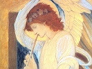

  
[Intangible Textual Heritage](../../index)  [Bible](../index) 
[Index](index)  [Previous](bep03)  [Next](bep05) 

------------------------------------------------------------------------

[Buy this Book at
Amazon.com](https://www.amazon.com/exec/obidos/ASIN/0913510017/internetsacredte)

------------------------------------------------------------------------

  
*The Book of Enoch the Prophet*, tr. by Richard Laurence, \[1883\], at
Intangible Textual Heritage

------------------------------------------------------------------------

XLI

### CHAP. XLI.

1\. After this I beheld the secrets of the heavens and of
paradise, [3](#fn_85) according to its
divisions; and of human action, [4](#fn_86) as
they weigh it there in balances.

p. 46

\[paragraph continues\] I saw the
habitations of the elect, and the habitations of the holy. And there my
eyes beheld all the sinners, who denied the Lord of glory, and whom they
were expelling from thence, and dragging away, as they stood *there*; no
punishment proceeding against them from the Lord of spirits.

2\. There, too, my eyes beheld the secrets of the lightning and the
thunder; and the secrets of the winds, how they are distributed as they
blow over the earth: the secrets of the winds, of the dew, and of the
clouds. There I perceived the place from which they issued forth, and
became saturated with the dust of the earth.

3\. There I saw the wooden [1](#fn_87)
receptacles out of which the winds became separated, the receptacle of
hail, the receptacle of snow, the receptacle of the clouds, and the
cloud itself, *which* continued over the earth before *the creation* of
the world.

4\. I beheld also the receptacles of the moon, whence the moons [2](#fn_88) came, whither they proceeded, their
glorious return, and how one became more splendid than another. I
*marked* their rich progress, their unchangeable progress, their
disunited and undiminished progress; their observance of a mutual
fidelity by a stable oath [3](#fn_89); their
proceeding forth before the sun, and their adherence to the

p. 47

path *allotted* them, [1](#fn_90) in obedience
to the command of the Lord of spirits. Potent is his name for ever and
for ever.

5\. After this *I perceived, that* the path both concealed and manifest
of the moon, as well as the progress of its path, was there completed by
day and by night; while each, one with another, looked towards the Lord
of spirits, magnifying and praising without cessation, since praise to
them is rest; for in the splendid sun there is a frequent conversion to
blessing and to malediction.

6\. The course of the moon's path to the righteous is light, but to
sinners it is darkness; in the name of the Lord of spirits, who created
*a division* between light and darkness, and, separating the spirits of
men, strengthened the spirits of the righteous in the name of his own
righteousness.

7\. Nor does the angel prevent *this*, neither is he endowed with the
power of preventing it; for the Judge beholds them all, and judges them
all in his own presence.

XLII

### CHAP. XLII.

1\. Wisdom found not a place *on earth* where she could inhabit; her
dwelling therefore is in heaven.

2\. Wisdom went forth to dwell among the sons of

p. 48

men, but she obtained not an habitation. Wisdom returned to her place,
and seated herself in the midst of the angels. But iniquity went forth
after her return, who unwillingly found *an habitation*, and resided
among them, as rain in the desert, and as a dew in a thirsty land.

XLIII

### CHAP. XLIII.

1\. I beheld another splendour, and the stars of heaven. I observed that
he called them all by their respective names, and that they heard. In a
righteous balance I saw that he weighed out with their light the
amplitude of their places, and the day of their appearance, [1](#fn_91) and their conversion. Splendour produced
splendour; and their conversion *was* into the number of the angels, and
of the faithful.

2\. Then I inquired of the angel, who proceeded with me, and explained
to me secret things, What *their names* were. He answered, A similitude
of those has the Lord of spirits shown thee. They are names of the
righteous who dwell upon earth, and who believe in the name of the Lord
of spirits for ever and for ever.

p. 49

XLIV

### CHAP. XLIV.

Another thing also I saw respecting splendour; that it rises out of the
stars, and becomes splendour; being incapable of forsaking them.

XLV

### CHAP. XLV. \[SECT. VII. [1](#fn_92)\]

1\. Parable the second, respecting these who deny [2](#fn_93) the name of the habitation of the holy
ones, and of the Lord of spirits.

2\. Heaven they shall not ascend, nor shall they come on the earth. This
shall be the portion of sinners, who deny the name of the Lord of
spirits, and who are thus reserved for the day of punishment and of
affliction.

3\. In that day shall the Elect One sit upon a throne of glory; and
shall choose their conditions and countless habitations (while their
spirits within them shall be strengthened, when they behold my Elect
One), *shall choose them* for those who have fled for protection to my
holy and glorious name.

4\. In that day I will cause my Elect One to dwell in the midst of them;
will change *the face of* heaven; will bless it, and illuminate it for
ever.

p. 50

5\. I will also change *the face of* the earth; will bless it; and cause
those whom I have elected to dwell upon it. But those who have committed
sin and iniquity shall not inhabit it, [1](#fn_94) for I have marked their proceedings. [2](#fn_95) My righteous ones will I satisfy with
peace, placing them before me; but the condemnation of sinners shall
draw near, that I may destroy them from the face of the earth.

XLVI

### CHAP. XLVI.

1\. There I beheld the Ancient of days, [3](#fn_96) whose head was like white wool, and with
him another, whose countenance resembled that of man. His countenance
was full of grace, like *that of* one of the holy angels. Then I
inquired of one of the angels, [4](#fn_97) who
went with me, and who showed me every secret thing, concerning this Son
of man; who he was; whence he was; and why he accompanied the Ancient of
days.

2\. He answered and said to me, This is the Son of man, to whom
righteousness belongs; with whom righteousness has dwelt; and who will
reveal all the treasures of that which is concealed: for the Lord of
spirits has chosen him; and his portion has

p. 51

surpassed [1](#fn_98) all before the Lord of
spirits in everlasting uprightness.

3\. This Son of man, whom thou beholdest, shall raise up kings and the
mighty from their couches, and the powerful from their thrones; shall
loosen the bridles of the powerful, and break in pieces the teeth of
sinners.

4\. He shall hurl kings from their thrones and their dominions; because
they will not exalt and praise him, nor humble themselves *before him*,
by whom [2](#fn_99) their kingdoms were granted
to them. The countenance likewise of the mighty shall He cast down,
filling them with confusion. Darkness shall be their habitation, and
worms shall be their bed; nor from *that* their bed shall they hope to
be again raised, because they exalted not the name of the Lord of
spirits.

5\. They shall condemn the stars of heaven, shall lift up their hands
against the Most High, shall tread upon and inhabit the earth,
exhibiting all their works of iniquity, even their works of iniquity.
Their strength shall be in their riches, and their faith in the gods
whom they have formed with their own hands. They shall deny the name of
the Lord of spirits, and shall expel him from the temples, in which they
assemble;

6\. And *with him* the faithful, who suffer in the name of the Lord of
spirits.

p. 52

XLVII

### CHAP. XLVII.

1\. In that day the prayer of the holy and the righteous, and the blood
of the righteous, shall ascend from the earth into the presence of the
Lord of spirits.

2\. In that day shall the holy ones assemble, who dwell above the
heavens, and with united voice petition, supplicate, praise, laud, and
bless the name of the Lord of spirits, on account of the blood of the
righteous which has been shed; that the prayer of the righteous may not
be intermitted before the Lord of spirits; that for them he would
execute judgment; and that his patience may not endure for ever.

3\. At that time I beheld the Ancient of days, while he sat upon the
throne of his glory, *while* the book of the living was opened in his
presence, and *while* all the powers which were above the heavens stood
around and before him.

4\. Then were the hearts of the saints full of joy, because the
consummation [1](#fn_100) of righteousness was
arrived, the supplication of the saints heard, and the blood of the
righteous appreciated by the Lord of spirits.

p. 53

XLVIII

### CHAP. XLVIII.

1\. In that place I beheld a fountain of righteousness, which never
failed, encircled by many springs of wisdom. Of these all the thirsty
drank, and were filled with wisdom, having their habitation with the
righteous, the elect, and the holy.

2\. In that hour was this Son of man invoked before the Lord of spirits,
and his name in the presence of the Ancient of days.

3\. Before the sun and the signs were created, before the stars of
heaven were formed, his name was invoked in the presence of the Lord of
spirits. A support shall he be for the righteous and the holy to lean
upon, without falling; and he shall be the light of nations.

4\. He shall be the hope of those whose hearts are troubled. All, who
dwell on earth, shall fall down and worship before him; shall bless and
glorify him, and sing praises to the name of the Lord of spirits.

5\. Therefore the Elect and the Concealed One existed in his presence,
before the world was created, and for ever.

6\. In his presence *he existed*, and has revealed to the saints and to
the righteous the wisdom of the Lord of spirits; for he has preserved
the lot of the righteous, because they have hated and rejected

p. 54

this world of iniquity, and have detested all its works and ways, in the
name of the Lord of spirits.

7\. For in his name shall they be preserved; and his will shall be their
life. In those days shall the kings of the earth and the mighty men, who
have gained the world by their achievements, [1](#fn_101) become humble in countenance.

8\. For in the day of their anxiety and trouble their souls shall not be
saved; and they shall be in subjection to [2](#fn_102) those whom I have chosen.

9\. I will cast them like hay into the fire, and like lead into the
water. Thus shall they burn in the presence of the righteous, and sink
in the presence of the holy; nor shall a tenth part of them be found.

10\. But in the day of their trouble, the world shall obtain
tranquillity. [3](#fn_103)

11\. In his presence shall they fall, and not be raised up again; nor
shall there be any one to take them out of his hands, and to lift them
up: for they have denied the Lord of spirits, and his Messiah. The name
of the Lord of spirits shall be blessed.

p. 55

XLVIIIb

### CHAP. XLVIII. [1](#fn_104)

1\. Wisdom is poured forth like water, and glory fails not before him
for ever and ever; for potent is he in all the secrets of righteousness.

2\. But iniquity passes away like a shadow, and possesses not a fixed
station: for the Elect One stands before the Lord of spirits; and his
glory is for ever and ever; and his power from generation to generation.

3\. With him dwells the spirit of intellectual wisdom, the spirit of
instruction and of power, and the spirit of those who sleep in
righteousness; he shall judge secret things.

4\. Nor shall any be able to utter a single word before him; for the
Elect One is in the presence of the Lord of spirits, according to his
own pleasure.

XLIX

### CHAP. XLIX.

1\. In those days the saints and the chosen shall undergo a change. The
light of day shall rest upon them; and the splendour and glory of the
saints shall be changed.

2\. In the day of trouble evil shall be heaped up

p. 56

upon sinners; but the righteous shall triumph in the name of the Lord of
spirits.

3\. Others shall be made to see, that they must repent, and forsake the
works of their hands; and that glory awaits them not in the presence of
the Lord of spirits; yet that by his name they may be saved. The Lord of
spirits will have compassion on them: for great is his mercy; and
righteousness is in his judgment, and in the presence of his glory; nor
in his judgment shall iniquity stand. He who repents not before him
shall perish.

4\. Henceforward I will not have mercy on them, saith the Lord of
spirits.

L

### CHAP. L.

1\. In those days shall the earth deliver up from her womb, and hell
deliver up from hers, that which it has received; and destruction shall
restore that which it owes.

2\. He shall select the righteous and holy from among them; for the day
of their salvation has approached.

3\. And in those days shall the Elect One sit upon his throne, while
every secret of intellectual wisdom shall proceed from his mouth; for
the Lord of spirits has gifted and glorified him.

p. 57

4\. In those days the mountains shall skip like rams, and the hills
shall leap like young sheep [1](#fn_105)
satiated with milk; and all *the righteous* shall become angels in
heaven.

5\. Their countenance shall be bright with joy; for in those days shall
the Elect One be exalted. The earth shall rejoice; the righteous shall
inhabit it, and the elect possess it. [2](#fn_106)

LI

### CHAP. LI.

1\. After that period, in the place where I had seen every secret sight,
I was snatched up in a whirlwind, and carried off westwards.

2\. There my eyes beheld the secrets of heaven, and all which existed on
earth; a mountain of iron, a mountain of copper, [3](#fn_107) a mountain of silver, a mountain of
gold, a mountain of fluid metal, and a mountain of lead.

3\. And I inquired of the angel who went with me, saying, What are these
things, which in secret I behold?

4\. He said, All these things which thou beholdest shall be for the
dominion of the Messiah, that he may command, and be powerful upon
earth.

5\. And that angel of peace answered me, saying,

p. 58

\[paragraph continues\] Wait but a short
time, and thou shalt understand, and every secret thing shall be
revealed to thee, which the Lord of spirits has decreed. Those mountains
which thou hast seen, the mountain of iron, the mountain of copper, the
mountain of silver, the mountain of gold, the mountain of fluid metal,
and the mountain of lead, all these in the presence of the Elect One
shall be like a honeycomb before the fire, and like water descending
from above upon these mountains; and shall become debilitated before his
feet.

6\. In those days men [1](#fn_108) shall not be
saved by gold and by silver.

7\. Nor shall they have it in their power to secure themselves, and to
fly.

8\. There shall be neither iron for war, nor a coat of mail for the
breast.

9\. Copper shall be useless; useless also that which neither rusts nor
consumes away; and lead shall not be coveted.

10\. All these things shall be rejected, and perish from off the earth,
when the Elect One shall appear in the presence of the Lord of spirits.

LII

### CHAP. LII.

1\. There my eyes beheld a deep valley; and wide was its entrance.

p. 59

2\. All who dwell on land, on the sea, and in islands, shall bring to it
gifts, presents, and offerings; yet that deep valley shall not be full.
Their hands shall commit iniquity. Whatsoever they produce by labour,
the sinners shall devour with crime. But they shall perish front the
face of the Lord of spirits, and from the face of his earth. They shall
stand up, and shall not fail for ever and ever.

3\. I beheld the angels of punishment, who were dwelling *there*, and
preparing every instrument of Satan.

4\. Then I inquired of the angel of peace, who proceeded with me, for
whom those instruments were preparing.

5\. He said, These they are preparing for the kings and powerful ones of
the earth, that thus [1](#fn_109) they may
perish.

6\. After which the righteous and chosen house of his congregation shall
appear, thenceforward unchangeable, in the name of the Lord of spirits.

7\. Nor shall those mountains exist in his presence, as the earth and
the hills, as the fountains of water exist. And the righteous shall be
relieved from the vexation of sinners.

p. 60

LIII

### CHAP. LIII.

1\. Then I looked and turned myself to another part of the earth, where
I beheld a deep valley burning with fire.

2\. To this valley they brought monarchs and the mighty.

3\. And there my eyes beheld the instruments which they were making,
fetters of iron without weight. [1](#fn_110)

4\. Then I inquired of the angel of peace, who proceeded with me,
saying, For whom are these fetters and instruments prepared?

5\. He replied, These are prepared for the host of Azazeel, that they
may be delivered over and adjudged to the lowest condemnation; and that
their angels may be overwhelmed with hurled stones, as the Lord of'
spirits has commanded.

6\. Michael and Gabriel, Raphael and Phanuel shall be strengthened in
that day, and shall then cast them into a furnace of blazing fire, that
the Lord of spirits may be avenged of them for their crimes; because
they became ministers of Satan, and seduced those who dwell upon earth.

7\. In those days shall punishment go forth from the Lord of spirits;
and the receptacles of water which are above the heavens shall be
opened, and

p. 61

the fountains likewise, which are under the heavens and under the earth.

8\. All the waters, which are in the heavens and above them, shall be
mixed together.

9\. The water which is above heaven shall be the agent; [1](#fn_111)

10\. And the water which is under the earth shall be the recipient [2](#fn_112): and all shall be destroyed who dwell
upon earth, and who dwell under the extremities of heaven.

11\. By these means shall they understand the iniquity which they have
committed on earth: and by these means shall they perish.

LIV

### CHAP. LIV.

1\. Afterwards the Ancient of days repented, and said, In vain have I
destroyed all the inhabitants of the earth.

2\. And he sware by his great name, *saying*, Henceforwards I will not
act thus towards all those who dwell upon earth.

3\. But I will place a sign in the heavens; [3](#fn_113) and it shall be a faithful witness [4](#fn_114) between me and them

p. 62

for ever, as long as the days of heaven and earth last upon the earth.

4\. Afterwards, according to this my decree, when I shall be disposed to
seize them beforehand, by the instrumentality of angels, in the day of
affliction and trouble, my wrath and my punishment shall remain upon
them, my punishment and my wrath, saith God the Lord of spirits.

5\. O ye kings, O ye mighty, who inhabit the world, you shall behold my
Elect One, sitting upon the throne of my glory. And he shall judge
Azazeel, all his associates, and all his hosts, in the name of the Lord
of spirits.

6\. There likewise I beheld hosts of angels who were moving in
punishment, confined in a net-work of iron and brass. Then I inquired of
the angel of peace, who proceeded with me, To whom those under
confinement were going.

7\. He said, To each of their elect and their beloved, that they may be
cast into the fountains and deep recesses of the valley.

8\. And that valley shall be filled with their elect and beloved; the
days of whose life shall be consumed, but the days of their error shall
be innumerable.

9\. Then shall princes combine together, and conspire. The chiefs of the
east, among the Parthians and Medes, shall remove kings, in whom a

p. 63

spirit of perturbation shall enter. They shall hurl them from their
thrones, springing as lions from their dens, and like famished wolves
into the midst of the flock.

10\. They shall go up, and tread upon the land of their elect. The land
of their elect shall be before them. The threshing-floor, the path, and
the city of my righteous *people* shall impede *the progress of* their
horses. They shall rise up to destroy each other; their right hand shall
be strengthened; nor shall a man acknowledge his friend or his brother;

11\. Nor the son his father and his mother; until the number of the dead
bodies shall be *completed*, by their death and punishment. Neither
shall this take place without cause.

12\. In those days shall the mouth of hell be opened, into which they
shall be immerged; hell shall destroy and swallow up sinners from the
face of the elect.

LV

### CHAP. LV.

1\. After this I beheld another army of chariots, with men riding in
them.

2\. And they came upon the wind from the east, from the west, and from
the south. [1](#fn_115)

p. 64

3\. The sound of the noise of their chariots was heard.

4\. And when that agitation took place, the saints out of heaven
perceived it; the pillar of the earth shook from its foundation; and the
sound was heard from the extremities of the earth unto the extremities
of heaven at the same time.

5\. Then they all fell down, and worshipped the Lord of spirits.

6\. This is the end of the second parable.

LVI

### CHAP. LVI. \[SECT. IX. [1](#fn_116)\]

1\. I now began to utter the third parable, concerning the saints and
the elect.

2\. Blessed are ye, O saints and elect, for glorious is your lot.

3\. The saints shall exist in the light of the sun, and the elect in the
light of everlasting life, the days of whose life shall never terminate;
nor shall the days of the saints be numbered, who seek for light, and
obtain righteousness with the Lord of spirits.

4\. Peace be to the saints with the Lord of the world.

5\. Henceforward shall the saints be told to seek in heaven the secrets
of righteousness, the portion

p. 65

of faith; for like the sun has it arisen upon the earth, while darkness
has passed away. There shall be light interminable: [1](#fn_117) nor shall they enter upon the
enumeration of time; for darkness shall be previously destroyed, and
light shall increase before the Lord of spirits; before the Lord of
spirits shall the light of uprightness increase for ever.

LVII

### CHAP. LVII.

1\. In those days my eyes beheld the secrets of the lightnings and the
splendours, and the judgment belonging to them.

2\. They lighten for a blessing and for a curse, according to the will
of the Lord of spirits.

3\. And there I saw the secrets of the thunder, when it rattles [2](#fn_118) above in heaven, and its sound is heard.

4\. The habitations also of the earth were shown to me. The sound of the
thunder is for peace and for blessing, as well as for a curse, according
to the word of the Lord of spirits.

5\. Afterwards every secret of the splendours and of the lightnings was
seen by me. For blessing and for fertility they lighten.

p. 66

LVIII

### CHAP. LVIII. [1](#fn_119) \[SECT. X. [2](#fn_120)\]

1\. In the five hundredth year, and in the seventh month, on the
fourteenth *day* of the month, of the lifetime of Enoch, in that
parable, I saw that the heaven of heavens shook; that it shook
violently; and that the powers of the Most High, and the angels,
thousands of thousands, and myriads of myriads, were agitated with great
agitation. And when I looked, the Ancient of days was sitting on the
throne of his glory, while the angels and saints were standing around
him. A great trembling came upon me, and terror seized me. My loins were
bowed down and loosened; my reins were dissolved; and I fell upon my
face. The holy Michael, another holy angel, one of the holy ones, was
sent, who raised me up.

2\. And when he raised me, my spirit returned; for I was incapable of
enduring this vision of violence, its agitation, and the concussion of
heaven.

3\. Then holy Michael said to me, Wherefore art thou disturbed at this
vision?

4\. Hitherto has existed the day of mercy; and he has been merciful and
longsuffering towards all who dwell upon the earth.

5\. But when the time shall come, then *shall* the

p. 67

power, the punishment, and the judgment take place, which the Lord of
spirits has prepared for those who prostrate themselves to the judgment
of righteousness, for those who abjure that judgment, and for those who
take *his* name in vain.

6\. That day has been prepared for the elect *as a day of* covenant; and
for sinners *as a day of* inquisition.

7\. In that day shall be distributed *for food* two monsters; a female
monster, whose name is Leviathan, dwelling in the depths of the sea,
above the springs of waters;

S. And a male *monster*, whose name is Behemoth; which possesses,
*moving* on his breast, the invisible wilderness.

9\. His name was Dendayen in the east of the garden, where the elect and
the righteous will dwell; where he received *it* from my ancestor, who
was man, from Adam the first of men, whom the Lord of spirits made.

10\. Then I asked of another angel to show me the power of those
monsters, how they became separated on the same day, one *being* in the
depths of the sea, and one in the dry desert.

11\. And he said, Thou, son of man, art here desirous of understanding
secret things.

12. [1](#fn_121) And the angel of peace, who
was with me,

p. 68

said, These two monsters are by the power of God prepared to become
food, that the punishment of God may not be in vain.

13\. Then shall children be slain with their mothers, and sons with
their fathers.

14\. And when the punishment of the Lord of spirits shall continue, upon
them shall it continue, that the punishment of the Lord of spirits may
not take place in vain. After that, judgment shall exist with mercy and
longsuffering.

LIX

### CHAP. LIX.

1\. Then another angel, who proceeded with me, spoke to me;

2\. And showed me the first and last secrets in heaven above, and in the
depths of the earth:

3\. In the extremities of heaven, and in the foundations of it, and in
the receptacle of the winds.

4\. *He showed me* how their spirits were divided; how they were
balanced; and how both the springs and the winds were numbered according
to the force of their spirit.

5\. *He showed me* the power of the moon's light, that its power is a
just one; as well as the divisions of the stars, according to their
respective names;

p. 69

6\. *That* every division is divided; that the lightning flashes;

7\. That its troops [1](#fn_122) immediately
obey; and that a cessation takes place during thunder in continuance of
its sound. Nor are the thunder and the lightning separated; neither do
both of them move with one spirit; yet are they not separated.

8\. For when the lightning lightens, the thunder sounds, and the spirit
at a proper period pauses, making an equal division between them; for
the receptacle, upon which their periods depend, is *loose* as
sand. [2](#fn_123) Each of them at a proper
season is restrained with a bridle; and turned by the power of the
spirit, which thus propels *them* according to the spacious extent of
the earth.

9\. The spirit likewise of the sea is potent and strong; and as a strong
power causes it to ebb, [3](#fn_124) so is it
driven forwards, and scattered against the mountains of the earth. The
spirit of the frost has its angel; in the spirit of hail there is a good
angel; the spirit of snow ceases in its strength, and a solitary spirit
is in it, which ascends from it like vapour, and is called
refrigeration.

10\. The spirit also of mist dwells with them in their receptacle; but
it has a receptacle to itself; for its progress is in splendour,

p. 70

11\. In light, and in darkness, in winter and in summer. It receptacle
is bright, and an angel is *in it*.

12\. The spirit of dew *has* its abode in the extremities of heaven, in
connection with the receptacle of rain; and its progress is in winter
and in summer. The cloud produced by it, and the cloud of the mist,
become united; one gives to the other*;* and when the spirit of rain is
in motion from its receptacle, angels come, and opening its receptacle,
bring it forth.

13\. When likewise it is sprinkled over all the earth, it forms an union
with every kind of water on the ground; for the waters remain on the
ground, because *they afford* nourishment to the earth from the Most
High, who is in heaven.

14\. Upon this account therefore there is a regulation in the quantity
of rain, [1](#fn_125) which the angels receive.

15\. These things I saw; all of them, even paradise. [2](#fn_126)

LX

### CHAP. LX.

1\. In those days I beheld long ropes given to those angels; who took to
their wings, and fled, advancing towards the north.

2\. And I inquired of the angel, saying, Wherefore

p. 71

have they taken those long ropes, and gone forth? He said, They are gone
forth to measure.

3\. The angel, who proceeded with me, said, These are the measures of
the righteous; and cords shall the righteous bring, that they may trust
in [1](#fn_127) the name of the Lord of spirits
for ever and ever.

4\. The elect shall begin to dwell with the elect.

5\. And these are the measures which shall be given to faith, and
*which* shall strengthen the words of righteousness.

6\. These measures shall reveal all the secrets in the depth of the
earth.

7\. And *it shall be*, that those who have been destroyed in the desert,
and who have been devoured by the fish of the sea, and by wild beasts,
shall return, and trust in [1](#fn_127) the day
of the Elect One; for none shall perish in the presence of the Lord of
spirits, nor shall any be capable of perishing.

8\. Then they received the commandment, all *who were* in the heavens
above; to whom a combined power, voice, and splendour, like fire, were
given.

9\. And first, with *their* voice, they blessed him, they exalted him,
they glorified him with wisdom, and ascribed to him wisdom with the
word, and with the breath of life.

10\. Then the Lord of spirits seated upon the throne of his glory the
Elect One;

p. 72

11\. Who shall judge all the works of the holy, in heaven above, and in
a balance shall he weigh their actions. And when he shall lift up his
countenance to judge their secret ways in the word of the name of the
Lord of spirits, and their progress in the path of the righteous
judgment of God most high;

12\. They shall all speak with united voice; and bless, glorify, exalt,
and praise, in the name of the Lord of spirits.

13\. He shall call to every power of the heavens, to all the holy above,
and to the power of God. The Cherubim, the Seraphim, and the Ophanin,
all the angels of power, and all the angels of the Lords, namely, of the
Elect One, and of the other Power, who was upon earth over the water on
that day,

14\. Shall raise their united voice; shall bless, glorify, praise, and
exalt with the spirit of faith, with the spirit of wisdom and patience,
with the spirit of mercy, with the spirit of judgment and peace, and
with the spirit of benevolence; all shall say with united voice: Blessed
is He; and the name of the Lord of spirits shall be blessed for ever and
for ever; all, who sleep not, shall bless it in heaven above.

15\. All the holy in heaven shall bless it; all the elect who dwell in
the garden of life; and every spirit of light, who is capable of
blessing, glorifying, exalting, and praising thy holy name; and every

p. 73

mortal man, [1](#fn_128) more than the powers
*of heaven*, shall glorify and bless thy name for ever and ever.

16\. For great is the mercy of the Lord of spirits; long-suffering is
he; and all his works, all his power, great as are the things which he
has done, has he revealed to the saints and to the elect, in the name of
the Lord of spirits.

------------------------------------------------------------------------

### Footnotes

[45:3](bep04.htm#fr_86) *the kingdom* or
*paradise*.

[45:4](bep04.htm#fr_87) *the work* or *labour of
man*.

[46:1](bep04.htm#fr_88) *of woods*.

[46:2](bep04.htm#fr_89) *they*.

[46:3](bep04.htm#fr_90) *by an oath to which
they adhered*.

[47:1](bep04.htm#fr_91) *to their path*.

[48:1](bep04.htm#fr_92) *of their existing*.

[49:1](bep04.htm#fr_93) In the Paris MS. it is
section viii. In the Bodleian MS. section vii.

[49:2](bep04.htm#fr_94) In the Bodleian MS.
there seems here an evident omission. This omission is supplied in the
Paris MS. I have followed the latter.

[50:1](bep04.htm#fr_95) *tread upon it*.

[50:2](bep04.htm#fr_96) *for I have seen them*.

[50:3](bep04.htm#fr_97) *The Chief* or *Head of
days*, Dan. vii. 9.

[50:4](bep04.htm#fr_98) The words, *Then I
inquired of one of the angels*, are omitted in the Bodleian MS. They
occur in the Paris MS.

[51:1](bep04.htm#fr_99) *conquered*.

[51:2](bep04.htm#fr_100) *from whence*.

[52:1](bep04.htm#fr_101) *the number*.

[54:1](bep04.htm#fr_102) *by the work of their
own hands*.

[54:2](bep04.htm#fr_103) *in the hand of*.

[54:3](bep04.htm#fr_104) *rest shall be on
earth*.

[55:1](bep04.htm#fr_105) Chap. xlviii. occurs
twice.

[57:1](bep04.htm#fr_106) Psalm cxiv. 4.

[57:2](bep04.htm#fr_107) *go and walk upon it*.

[57:3](bep04.htm#fr_108) *nummus minutissimus.
Obolus.*

[58:1](bep04.htm#fr_109) *they*.

[59:1](bep04.htm#fr_110) *by this*.

[60:1](bep04.htm#fr_111) *in which there was
not weight*.

[61:1](bep04.htm#fr_112) *male*.

[61:2](bep04.htm#fr_113) *female*.

[61:3](bep04.htm#fr_114) Gen. ix. 12. "I do set
my bow in the cloud, and it shall be for a token of a covenant between
me and the earth."

[61:4](bep04.htm#fr_115) *faith*, or
*fidelity*.

[63:1](bep04.htm#fr_116) *from the midst of the
day*. The army alluded to was probably Roman.

[64:1](bep04.htm#fr_117) Paris MS.

[65:1](bep04.htm#fr_118) *which cannot be
numbered*.

[65:2](bep04.htm#fr_119) *it is grinding, as in
a mortar*.

[66:1](bep04.htm#fr_120) There is no chap.
lviii. in the MS. I have therefore divided chap. lix. into two parts,
denominating this first part chap. lviii.

[66:2](bep04.htm#fr_121) Paris MS.

[67:1](bep04.htm#fr_122) These last three
verses, viz. 12, 13, 14, are placed in both MSS. p.
68 at the end of chap. lix.; but they so evidently belong to this
account of the Leviathan and Behemoth, that I have ventured to insert
them here.

[69:1](bep04.htm#fr_123) *Their host*.

[69:2](bep04.htm#fr_124) *the receptacle of
their times is what sand is*.

[69:3](bep04.htm#fr_125) *turns it back with a
bridle*.

[70:1](bep04.htm#fr_126) *a measure in the
rain*.

[70:2](bep04.htm#fr_127) *even to the garden of
the righteous*.

[71:1](bep04.htm#fr_129) *lean upon*.

[73:1](bep04.htm#fr_130) *all of flesh*.

------------------------------------------------------------------------

[Next: Chapters LXI-LXXX](bep05)
