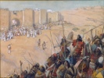

  
[Intangible Textual Heritage](../../index)  [Bible](../index) 
[Index](index)  [Previous](biob00)  [Next](biob02) 

------------------------------------------------------------------------

[Buy this Book at
Amazon.com](https://www.amazon.com/exec/obidos/ASIN/B002ECE954/internetsacredte)

------------------------------------------------------------------------

  
*The Biography of the Bible*, by Ernest Sutherland Bates, \[1937\], at
Intangible Textual Heritage

------------------------------------------------------------------------

p. v

### Table of Contents

<table data-border="0">
<colgroup>
<col style="width: 33%" />
<col style="width: 33%" />
<col style="width: 33%" />
</colgroup>
<tbody>
<tr class="odd">
<td data-valign="top">
I.
</td>
<td data-valign="top">
GENERAL CHARACTER
</td>
<td data-valign="top">
<a href="biob02.htm#page_3">3</a>
</td>
</tr>
<tr class="even">
<td data-valign="top">
 
</td>
<td data-valign="top">
<em>"The content of the Bible is Man." 
Emphasis upon the average man and the social whole, realism in treatment, freedom in form</em>.
</td>
<td data-valign="top">
 
</td>
</tr>
<tr class="odd">
<td data-valign="top">
 
</td>
<td data-valign="top">
 
</td>
<td data-valign="top">
 
</td>
</tr>
<tr class="even">
<td data-valign="top">
II.
</td>
<td data-valign="top">
THE AUTHORS
</td>
<td data-valign="top">
<a href="biob03.htm#page_11">11</a>
</td>
</tr>
<tr class="odd">
<td data-valign="top">
 
</td>
<td data-valign="top">
<em>"Anonymity, not personality, affords the clew to Biblical authorship." 
Early folk literature; the traditional authors—Moses, David, Solomon; the Prophets; Postexilic literature—the legalists, the humanists, the nationalists; the Apocrypha; the Christian authors</em>.
</td>
<td data-valign="top">
 
</td>
</tr>
<tr class="even">
<td data-valign="top">
 
</td>
<td data-valign="top">
 
</td>
<td data-valign="top">
 
</td>
</tr>
<tr class="odd">
<td data-valign="top">
III.
</td>
<td data-valign="top">
CONFLICT OVER CREED AND CANON
</td>
<td data-valign="top">
<a href="biob04.htm#page_59">59</a>
</td>
</tr>
<tr class="even">
<td data-valign="top">
 
</td>
<td data-valign="top">
<em>"Blood as well as learning went into the establishment of creed and canon." 
The Gnostics; the Manicheans; Arians and Athanasians; Homoousians and Homoiousians; The final victory</em>.
</td>
<td data-valign="top">
 
</td>
</tr>
<tr class="odd">
<td data-valign="top">
 
</td>
<td data-valign="top">
 
</td>
<td data-valign="top">
 
</td>
</tr>
<tr class="even">
<td data-valign="top">
IV.
</td>
<td data-valign="top">
THE BIBLE UNDER MEDIEVALISM
</td>
<td data-valign="top">
<a href="biob05.htm#page_75">75</a>
</td>
</tr>
<tr class="odd">
<td data-valign="top">
 
</td>
<td data-valign="top">
<em>"For a thousand years the Bible held its place in a confused world wherein learning mingled with superstition, piety with persecution, love of beauty with hate and cruelty; and it was interpreted in accordance with all these attitudes." 
The consecration to texts; scholastic methods of interpretation;</em>
</td>
<td data-valign="top">
 
</td>
</tr>
<tr class="even">
<td data-valign="top">
 
</td>
<td data-valign="top">
p. vi
</td>
<td data-valign="top">
 
</td>
</tr>
<tr class="odd">
<td data-valign="top">
 
</td>
<td data-valign="top">
<em>the miracle plays; the war on infidels and heretics; the Biblical themes of art</em>.
</td>
<td data-valign="top">
 
</td>
</tr>
<tr class="even">
<td data-valign="top">
 
</td>
<td data-valign="top">
 
</td>
<td data-valign="top">
 
</td>
</tr>
<tr class="odd">
<td data-valign="top">
V.
</td>
<td data-valign="top">
THE GREAT TRANSLATIONS
</td>
<td data-valign="top">
<a href="biob06.htm#page_99">99</a>
</td>
</tr>
<tr class="even">
<td data-valign="top">
 
</td>
<td data-valign="top">
<em>"The great translations were part of a social revolution." 
Early translations; Martin Luther; Tyndale and his successors; the King James version; typographical errors—''the Hee and She Bibles," "the Wicked Bible"; the Revised Version; eccentric and literal translations</em>.
</td>
<td data-valign="top">
 
</td>
</tr>
<tr class="odd">
<td data-valign="top">
 
</td>
<td data-valign="top">
 
</td>
<td data-valign="top">
 
</td>
</tr>
<tr class="even">
<td data-valign="top">
VI.
</td>
<td data-valign="top">
THE HIGHER CRITICISM
</td>
<td data-valign="top">
<a href="biob07.htm#page_132">132</a>
</td>
</tr>
<tr class="odd">
<td data-valign="top">
 
</td>
<td data-valign="top">
<em>"There is no mystery about the so-called 'Higher Criticism'; it is simply the scientific combination of textual and historical criticism which is used today in the study of all early literature." 
Hobbes and Spinoza; Jean Astruc; Eichhorn; De Wette; Strauss and Renan; the Tübingen School; more recent criticism</em>.
</td>
<td data-valign="top">
 
</td>
</tr>
<tr class="even">
<td data-valign="top">
 
</td>
<td data-valign="top">
 
</td>
<td data-valign="top">
 
</td>
</tr>
<tr class="odd">
<td data-valign="top">
VII.
</td>
<td data-valign="top">
THE BIBLE AND THE STREAM OF LIFE
</td>
<td data-valign="top">
<a href="biob08.htm#page_150">150</a>
</td>
</tr>
<tr class="even">
<td data-valign="top">
 
</td>
<td data-valign="top">
<em>"What was once a tributary, small, then mighty, which preserved its own hue amidst the larger stream, has now at last merged into the river, losing the isolation of its identity but giving something of its color to the whole." 
The Bible and the Jews; the Bible and the world; the Bible in America; the present and the future</em>.
</td>
<td data-valign="top">
 
</td>
</tr>
</tbody>
</table>

p. vii

### List of Illustrations

|                                                                                                                           |                             |
|---------------------------------------------------------------------------------------------------------------------------|-----------------------------|
| facing page Codex Vaticanus—The oldest complete manuscript of the New Testament (fourth century)                          | [24](biob03.htm#img_02400)  |
| Codex Sinaiticus (fourth-century manuscript)                                                                              | [25](biob03.htm#img_02500)  |
| Codex Alexandrinus (fifth-century manuscript), sent by Cyril Lucar, Patriarch of Alexandria, to King Charles I of England | [40](biob03.htm#img_04000)  |
| Fourteenth-century manuscript of the Wyclif Bible                                                                         | [41](biob03.htm#img_04100)  |
| Characteristic page from the Gutenberg Bible (1450–55)                                                                    | [76](biob05.htm#img_07600)  |
| Title page of the Coverdale Bible (1535)                                                                                  | [77](biob05.htm#img_07700)  |
| Title page of Tyndale's New Testament (1535)                                                                              | [84](biob05.htm#img_08400)  |
| Title page of the Matthew Bible (1537)                                                                                    | [85](biob05.htm#img_08500)  |
| Title page of the Great Bible (1539)                                                                                      | [104](biob06.htm#img_10400) |
| Title page of the Douai Bible (1609)                                                                                      | [105](biob06.htm#img_10500) |
| Original woodcut title page of the King James version (1611)                                                              | [120](biob06.htm#img_12000) |
| Original engraved title page used at the beginning of the New Testament in the King James version                         | [121](biob06.htm#img_12100) |
| Perpetual Easter Calendar from the King James version                                                                     | [152](biob08.htm#img_15200) |
| The generations of Adam in the King James version                                                                         | [153](biob08.htm#img_15300) |
| The generations of Noah in the King James version                                                                         | [168](biob08.htm#img_16800) |
| Title page of John Eliot's Indian Bible (1663)                                                                            | [169](biob08.htm#img_16900) |

------------------------------------------------------------------------

[Next: One. General Character](biob02)
